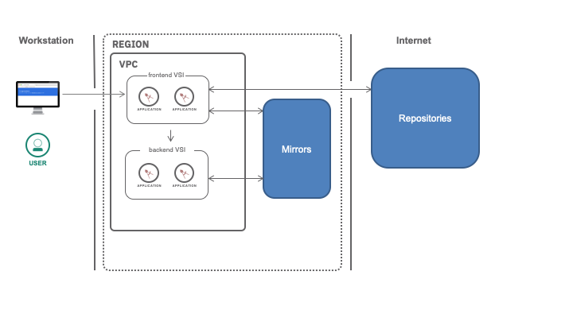

{:step: data-tutorial-type='step'}
{:java: #java .ph data-hd-programlang='java'}
{:swift: #swift .ph data-hd-programlang='swift'}
{:ios: #ios data-hd-operatingsystem="ios"}
{:android: #android data-hd-operatingsystem="android"}
{:shortdesc: .shortdesc}
{:new_window: target="_blank"}
{:codeblock: .codeblock}
{:screen: .screen}
{:tip: .tip}
{:pre: .pre}
{:important: .important}
{:note: .note}

# Install software on virtual server instances in VPC
{: #vpc-app-deploy}
{: toc-content-type="tutorial"}
{: toc-services="vpc"}
{: toc-completion-time="2h"}

<!--##istutorial#-->
This tutorial may incur costs. Use the [Cost Estimator](/estimator/review) to generate a cost estimate based on your projected usage.
{: tip}

<!--#/istutorial#-->

This tutorial walks you through provisioning {{site.data.keyword.vpc_full}} (VPC) infrastructure and installing software on virtual server instances (VSI) using Infrastructure as Code (IaC) tools like Terraform and Ansible.
{: shortdesc}

After an [introduction to the tutorial architecture](#vpc-app-deploy-objectives), you will [prepare your environment](#vpc-app-deploy-before-you-begin) for the tutorial and review the [basics of software installation](#vpc-app-deploy-basics) in {{site.data.keyword.cloud_notm}}. At that point you can decide to evaluate all the technologies or to jump to one of the specific standalone sections like [Terraform](#vpc-app-deploy-terraform) or [Ansible](#vpc-app-deploy-ansible).

## Objectives
{: #vpc-app-deploy-objectives}

* Understand operating system software provided by {{site.data.keyword.IBM_notm}}.
* Utilize manual steps for updating the operating system software and installing new software.
* Understand how to use the {{site.data.keyword.Bluemix_notm}} CLI, Terraform and Ansible to automate the provisioning of resources and software installation.


In this tutorial, you will deploy the configuration introduced in another tutorial, [Public frontend and private backend in a Virtual Private Cloud](/docs/solution-tutorials?topic=solution-tutorials-vpc-public-app-private-backend). You will provision a frontend server accessible from the public Internet talking to a backend server with no Internet connectivity.

{: caption="Figure 1. Architecture diagram of the tutorial" caption-side="bottom"}
{: style="text-align: center;"}


The configuration also includes [a bastion host](/docs/solution-tutorials?topic=solution-tutorials-vpc-secure-management-bastion-server) acting as a jump server allowing secure connection to instances provisioned without a public IP address:

{: caption="Architecture of Bastion Host" caption-side="bottom"}
{: style="text-align: center;"}

While provisioning the resources, you will also deploy applications on the virtual server instances. When deploying applications in the cloud, software can originate from different sources:
1. The file system of a local workstation - using tools like Terraform to create the required infrastructure or Ansible, `ssh` and `scp` to install and configure software on the virtual server instances;
2. {{site.data.keyword.IBM_notm}} mirrors to update the operating systems or to install supported packages;
3. Internet or intranet software repositories.

{: caption="Architecture diagram showing the different sources to install software from" caption-side="bottom"}
{: style="text-align: center;"}

You will explore how to consume these different sources.

## Before you begin
{: #vpc-app-deploy-before-you-begin}

### Create a VPC SSH key
{: #vpc-app-deploy-create-ssh-key}

When provisioning virtual server instances, an SSH key will be injected into the instances so that you can later connect to the servers.

1. If you don't have an SSH key on your local machine, refer to [these instructions](/docs/vpc?topic=vpc-ssh-keys) for creating a key for VPC. By default, the private key is found at `$HOME/.ssh/id_rsa`.
1. Add the SSH key in the **VPC console** under **Compute / SSH keys**. Make sure to create the key in the same resource group where you are going to create the other resources in this tutorial.

### Set environment variables
{: #vpc-app-deploy-set-env}

This tutorial comes with sample code to illustrate the different options to provision resources and install or update software in a VPC environment.

It will walk you through example steps on a terminal using the shell, `terraform` and `ansible`. You will install these tools in later steps. For the scripts to work, you need to define a set of environment variables.

1. Clone the tutorial [source code repository](https://github.com/IBM-Cloud/vpc-tutorials):
   ```sh
   git clone https://github.com/IBM-Cloud/vpc-tutorials.git
   ```
   {: pre}

2. Define a variable named `CHECKOUT_DIR` pointing to the source code directory:
   ```sh
   cd vpc-tutorials
   export CHECKOUT_DIR=$PWD
   ```
   {: pre}

3. Change to the tutorial directory:
   ```sh
   cd $CHECKOUT_DIR/vpc-app-deploy
   ```
   {: pre}

4. Copy the configuration file:
   ```sh
   cp export.template export
   ```
   {: pre}

5. Edit the `export` file and set the environment variable values:
   * `TF_VAR_ibmcloud_api_key` is an {{site.data.keyword.Bluemix_notm}} API key. You can create one [from the console](/iam/apikeys).
   * `TF_VAR_ssh_key_name` is the name of the VPC SSH public key identified in the previous section. This is the public key that will be loaded into the virtual service instances to provide secure SSH access via the private key on your workstation. Use the CLI to verify it exists:
      ```sh
      ibmcloud is keys
      ```
      {: pre}

   * `TF_VAR_resource_group_name` is a resource group where resources will be created. See [Creating and managing resource groups](/docs/account?topic=account-rgs).

   * `TF_VAR_region` is a region where resources will be created. This command will display the regions:
      ```sh
      ibmcloud is regions
      ```
      {: pre}

   * `TF_VAR_zone` is a zone where resources will be created. This command will display the zones:
      ```sh
      ibmcloud is zones
      ```
      {: pre}

6. Load the variables into the environment:
   ```sh
   source export
   ```
   {: pre}

   **Make sure to always use the same terminal window in the next sections or to set the environment variables if you use a new window**. The environment variables in `export` are in [Terraform format](https://developer.hashicorp.com/terraform/cli/config/environment-variables){: external} (notice the `TF_VAR_` prefix) for convenience. They are used in subsequent sections.
   {: tip}

## Basics of software installation
{: #vpc-app-deploy-basics}
{: step}

### Provision virtual server instances from base images
{: #vpc-app-deploy-base-vsi-images}

When provisioning a virtual server instance, you select the base image from a predefined set of operating system images supplied by {{site.data.keyword.IBM_notm}}. Use `ibmcloud is images` to find the list of available images. The output will look like:

```sh
Listing images...
ID                                     Name                    OS                                                        Created                         Status      Visibility
cc8debe0-1b30-6e37-2e13-744bfb2a0c11   centos-7.x-amd64        CentOS (7.x - Minimal Install)                            2018-10-30T06:12:06.651+00:00   available   public
660198a6-52c6-21cd-7b57-e37917cef586   debian-8.x-amd64        Debian GNU/Linux (8.x jessie/Stable - Minimal Install)    2018-10-30T06:12:06.624+00:00   available   public
e15b69f1-c701-f621-e752-70eda3df5695   debian-9.x-amd64        Debian GNU/Linux (9.x Stretch/Stable - Minimal Install)   2018-10-30T06:12:06.705+00:00   available   public
2d7acb16-3d4b-d0e5-d623-e43783a9b126   red-7.x-amd64           Red Hat Enterprise Linux (7.x - Minimal Install)          2019-03-11T02:30:57.249+00:00   available   public
7eb4e35b-4257-56f8-d7da-326d85452591   ubuntu-16.04-amd64      Ubuntu Linux (16.04 LTS Xenial Xerus Minimal Install)     2018-10-30T06:12:06.537+00:00   available   public
cfdaf1a0-5350-4350-fcbc-97173b510843   ubuntu-18.04-amd64      Ubuntu Linux (18.04 LTS Bionic Beaver Minimal Install)    2018-10-30T06:12:06.51+00:00    available   public
b45450d3-1a17-2226-c518-a8ad0a75f5f8   windows-2012-amd64      Windows Server (2012 Standard Edition)                    2018-10-30T06:12:06.678+00:00   available   public
81485856-df27-93b8-a838-fa28a29b3b04   windows-2012-r2-amd64   Windows Server (2012 R2 Standard Edition)                 2018-10-30T06:12:06.564+00:00   available   public
5ccbc579-dc22-0def-46a8-9c2e9b502d37   windows-2016-amd64      Windows Server (2016 Standard Edition)                    2018-10-30T06:12:06.59+00:00    available   public
```
{: screen}

{{site.data.keyword.IBM_notm}} has **internal mirrors** to support the {{site.data.keyword.IBM_notm}} images. The mirrors will contain new versions for the software in the {{site.data.keyword.IBM_notm}} provided images as well as the optional packages associated with the distribution. The mirrors are part of the [service endpoints](/docs/vpc?topic=vpc-service-endpoints-for-vpc) available for {{site.data.keyword.vpc_short}}. There is no ingress cost for reading the mirrors.

Consider both *updating* the version lists available to the provisioned instances and *upgrading* the installed software from these mirrors.

### Initialize and customize cloud instances with cloud-init
{: #vpc-app-deploy-cloud_init}

When provisioning a virtual server instance, you can specify a [cloud-init](https://cloudinit.readthedocs.io/en/latest/index.html){: external} script to be executed during the server initialization. Cloud-init is a multi-distribution package that handles early initialization of a cloud instance. It defines a collection of file formats to encode the initialization of cloud instances.

In {{site.data.keyword.cloud_notm}}, the cloud-init file contents are provided in the `user-data` parameter at the time the server is provisioned. See [User-Data Formats](https://cloudinit.readthedocs.io/en/latest/topics/format.html#user-data-formats){: external} for acceptable user-data content. If you need to debug script execution, cloud-init logs the output of the initialization script in `/var/log/cloud-init-output.log` on virtual server instances.

This tutorial uses a shell script named [install.sh](https://github.com/IBM-Cloud/vpc-tutorials/blob/master/vpc-app-deploy/shared/install.sh){: external} as initialization script:

   ```sh
   #!/bin/bash
   set -x
   apt-get update
   apt-get install -y nginx
   indexhtml=/var/www/html/index.html

   # Demonstrate the availability of internet repositories.  If www.python.org is availble then other software internet software like
   # npm, pip, docker, ...  if isolated only the software from the ibm mirrors can be accessed
   if curl -o /tmp/x -m 3 https://www.python.org/downloads/release/python-373/; then
       echo INTERNET > $indexhtml
   else
       echo ISOLATED > $indexhtml
   fi
   ```

In this script, upgrading the installed software and installing `nginx` and other packages using the operating system provided software installation tools demonstrates that even the isolated instances have access to the {{site.data.keyword.IBM_notm}} provided mirrors. For Ubuntu, the `apt-get` commands will access mirrors.

The `curl` command accessing www.python.org demonstrates the attempt to access and potentially install software from the internet.

Based on whether the host has internet connectivity, the script modifies the `index.html` page served by `nginx`. 

### Upload from the filesystem and execute on the instance
{: #vpc-app-deploy-scp-ssh}

There may be data and software that is available on the filesystem of your on-premise system or CI/CD pipeline that needs to be uploaded to the virtual server instance and then executed.

In such cases, you can use the SSH connection to the server to upload files with `scp` and then execute scripts on the server with `ssh`. The scripts could also retrieve software installers from the Internet, or from your on-premise systems assuming you have established a connection [such as a VPN](/docs/solution-tutorials?topic=solution-tutorials-vpc-site2site-vpn) between your on-premise systems and the cloud.

The tutorial code contains a script named [`uploaded.sh`](https://github.com/IBM-Cloud/vpc-tutorials/blob/master/vpc-app-deploy/shared/uploaded.sh){: external} which will be uploaded from your workstation to the virtual server instances (manually or through automation like Terraform and Ansible).

In the next sections, you will use the script [test_provision.bash](https://github.com/IBM-Cloud/vpc-tutorials/blob/master/vpc-app-deploy/test_provision.bash){: external} to confirm that the servers have been provisioned successfully, are able (or not) to access the Internet and that the `uploaded.sh` script was correctly executed.

## Using the {{site.data.keyword.Bluemix_notm}} CLI and shell scripts
{: #vpc-app-deploy-cli}
{: step}

The {{site.data.keyword.Bluemix_notm}} CLI provides commands to interact with all the resources you can create in the {{site.data.keyword.Bluemix_notm}}. This section explains how to use these commands, but you are not going to create any resources. It is recommended to use Terraform to deploy full solutions.

### Before you begin
{: #vpc-app-deploy-cli-before-you-begin}

Install the command line (CLI) tools by [following these steps](/docs/cli?topic=cli-install-ibmcloud-cli)

### Provision virtual server instances and install software
{: #vpc-app-deploy-cli-provision}

The CLI has a [plugin for all VPC-related functionality](/docs/cli?topic=cli-vpc-reference), including compute and network resources.

1. Before working with VPC resources, set the current resource group and region:
   ```sh
   ibmcloud target -g $TF_VAR_resource_group_name -r $TF_VAR_region
   ```
   {: pre}

1. To provision a virtual server instance, run the `ibmcloud is create-instance` CLI command. In [`shared/install.sh`](https://github.com/IBM-Cloud/vpc-tutorials/blob/master/vpc-app-deploy/shared/install.sh){: external} is the cloud-init file used to initialize the frontend and the backend servers. You can pass the script with the `--user-data` parameter like this:

   ```sh
   ibmcloud is instance-create ... --user-data @shared/install.sh
   ```
   {: pre}


1. With the frontend and backend VSIs deployed and in maintenance mode, you could send a script to, e.g., the frontend server, then run the script to install software from the Internet. Send a script to the frontend server:
   ```sh
   scp -F ../scripts/ssh.notstrict.config -o ProxyJump=root@$BASTION_IP_ADDRESS shared/uploaded.sh root@$FRONT_NIC_IP:/uploaded.sh
   ```
   {: pre}

   Then execute this script:
   ```sh
   ssh -F ../scripts/ssh.notstrict.config -o ProxyJump=root@$BASTION_IP_ADDRESS root@$FRONT_NIC_IP sh /uploaded.sh
   ```
   {: pre}

   It can take a few minutes for the ssh service on the server to be initialized, and it will take a few more minutes for the `cloud-init` script to complete. The `uploaded.sh` script will wait for the initialization to complete before exiting.
   {: tip}


## Provisioning infrastructure with Terraform
{: #vpc-app-deploy-terraform}
{: step}

[Terraform](https://www.terraform.io/){: external} enables you to safely and predictably create, change, and improve infrastructure. It is an open source tool that codifies APIs into declarative configuration files that can be shared amongst team members, treated as code, edited, reviewed, and versioned.

### Before you begin
{: #vpc-app-deploy-terraform-before-you-begin}

Follow the instructions to [install Terraform and the {{site.data.keyword.Bluemix_notm}} Provider plug-in for Terraform](/docs/ibm-cloud-provider-for-terraform) on your workstation.

### Provision a single virtual server instance
{: #vpc-app-deploy-15}

Before deploying a more complex architecture and in order to validate the Terraform provider installation, let's deploy a single virtual server instance with a floating IP and then access this server through SSH.

Check the [main.tf](https://github.com/IBM-Cloud/vpc-tutorials/blob/master/vpc-app-deploy/tfinstance/main.tf){: external} file for a terraform script. It utilizes the environment variables defined earlier.

1. Change to the terraform script folder for this example:
   ```sh
   cd $CHECKOUT_DIR/vpc-app-deploy/tfinstance
   ```
   {: pre}

1. Initialize Terraform:
   ```sh
   terraform init
   ```
   {: pre}

1. Apply the Terraform plan:
   ```sh
   terraform apply
   ```
   {: pre}

   The script creates a VPC, a VSI and enable SSH access.
1. View the output generated by the plan:
   ```sh
   terraform output
   ```
   {: pre}

1. You could copy paste the output of the previous command or you can use `terraform output` as follow to SSH into the VSI
   ```sh
   $(terraform output -raw sshcommand)
   ```
   {: pre}

   Using outputs in Terraform can become quite handy when you want to reuse resource properties in other scripts after you have applied a Terraform plan.
   {: tip}

1. Remove the resources created by Terraform:
   ```sh
   terraform destroy
   ```
   {: pre}

### Provision subnets and virtual server instances
{: #vpc-app-deploy-terraform-provision}

The set of Terraform files under the `vpc-app-deploy/tf` folder of the `vpc-tutorials` repository implements the architecture of the *Public frontend and private backend in a Virtual Private Cloud* tutorial.

The script [vpc-app-deploy/tf/main.tf](https://github.com/IBM-Cloud/vpc-tutorials/blob/master/vpc-app-deploy/tf/main.tf){: external} contains the definition of the resources. It imports a Terraform *module* shared with this other tutorial:

```terraform
   module vpc_pub_priv {
     source = "../../vpc-public-app-private-backend/tfmodule"
     basename = "${local.BASENAME}"
     ssh_key_name = "${var.ssh_key_name}"
     zone = "${var.zone}"
     backend_pgw = false
     profile = "${var.profile}"
     image_name = "${var.image_name}"
     resource_group_name = "${var.resource_group_name}"
     maintenance = "${var.maintenance}"
     frontend_user_data = "${file("../shared/install.sh")}"
     backend_user_data = "${file("../shared/install.sh")}"
   }
```

In this definition:
- **backend_pgw** controls whether the backend server has access to the public Internet. A public gateway can be connected to the backend subnet. The frontend has a floating IP assigned which provides both a public IP and gateway to the internet. This is going to allow open Internet access for software installation.  The backend will not have access to the Internet.
- **frontend_user_data**, **backend_user_data** point to the cloud-init initialization scripts.

With Terraform, all resources can have associated provisioners. The `null_resource` provisioner does not provision a cloud resource but can be used to copy files to server instances. This construct is used in the script to copy the [uploaded.sh](https://github.com/IBM-Cloud/vpc-tutorials/blob/master/vpc-app-deploy/shared/uploaded.sh){: external} file and then execute it as shown below. To connect to the servers, Terraform supports [using the bastion host](https://www.terraform.io/docs/provisioners/connection.html#connecting-through-a-bastion-host-with-ssh){: external} as provisioned in the tutorial:

```terraform
   resource "null_resource" "copy_from_on_prem" {
     connection {
       type        = "ssh"
       user        = "root"
       host        = "${module.vpc_pub_priv.frontend_network_interface_address}"
       private_key = "${file("~/.ssh/id_rsa")}"
       bastion_user        = "root"
       bastion_host        = "${local.bastion_ip}"
       bastion_private_key = "${file("~/.ssh/id_rsa")}"
     }
     provisioner "file" {
       source      = "../shared/${local.uploaded}"
       destination = "/${local.uploaded}"
      }
     provisioner "remote-exec" {
       inline      = [
         "bash -x /${local.uploaded}",
        ]
     }
   }
```

To provision the resources:

1. Change to the terraform script folder:
   ```sh
   cd $CHECKOUT_DIR/vpc-app-deploy/tf
   ```
   {: pre}

1. Initialize Terraform:
   ```sh
   terraform init
   ```
   {: pre}

1. Apply the Terraform plan:
   ```sh
   terraform apply
   ```
   {: pre}

1. View the output generated by the plan:
   ```sh
   terraform output
   ```
   {: pre}

### Test the configuration of the virtual servers
{: #vpc-app-deploy-terraform-test}

Now that Terraform has deployed resources, you can validate they were correctly provisioned.

1. Validate that the frontend virtual server instance is reachable and has outbound access to the Internet:
   ```sh
   ../test_provision.bash $(terraform output -raw FRONT_IP_ADDRESS) INTERNET hi
   ```
   {: pre}

   The command output should be:
   ```sh
   success: httpd default file was correctly replaced with the following contents:
   INTERNET
   success: provision of file from on premises worked and was replaced with the following contents:
   hi
   ```
   {: screen}

1. Validate that the backend can be reached through the bastion host and does not have access to the internet:
   ```sh
   ../test_provision.bash $(terraform output -raw BACK_NIC_IP) ISOLATED hi "ssh -F ../../scripts/ssh.notstrict.config root@$(terraform output -raw FRONT_NIC_IP) -o ProxyJump=root@$(terraform output -raw BASTION_IP_ADDRESS)"
   ```
   {: pre}

   The command output should be:
   ```sh
   success: httpd default file was correctly replaced with the following contents:
   ISOLATED
   success: provision of file from on premises worked and was replaced with the following contents:
   hi
   ```
   {: screen}

### Remove resources
{: #vpc-app-deploy-terraform-cleanup}

1. Remove the resources created by Terraform:
   ```sh
   terraform destroy
   ```
   {: pre}

## Installing software with Ansible
{: #vpc-app-deploy-ansible}
{: step}

[Ansible](https://www.ansible.com/){: external} is a configuration management and provisioning tool, similar to [Chef](https://www.chef.io/products/chef-infra/){: external} and [Puppet](https://puppet.com/), and is designed to automate multitier app deployments and provisioning in the cloud. Written in Python, Ansible uses YAML syntax to describe automation tasks, which makes Ansible easy to learn and use.

Although Ansible could be used to provision the VPC resources and install software, this section uses Terraform to provision the VPC resources and Ansible to deploy the software.

### Before you begin
{: #vpc-app-deploy-ansible-before-you-begin}

This section uses both Terraform and Ansible.

1. Follow the instructions to [install Terraform and the {{site.data.keyword.Bluemix_notm}} Provider plug-in for Terraform](/docs/ibm-cloud-provider-for-terraform) on your workstation.
1. Follow [these instructions](https://docs.ansible.com/ansible/latest/installation_guide/intro_installation.html){: external} to install Ansible.

### Ansible Playbook
{: #vpc-app-deploy-21}

An Ansible playbook provides the tasks to be run. The example below has a set of tasks required to install nginx and upload a script. You will notice the similarities to the `cloud-init` script discussed earlier. The `uploaded.sh` script is identical.

   ```yaml
   - hosts: FRONT_NIC_IP BACK_NIC_IP
     remote_user: root
     tasks:
     - name: update apt cache manual
       # this should not be required but without it the error: Failed to lock apt for exclusive operation is generated
       shell: apt update
       args:
         executable: /bin/bash
     - name: update apt cache
       apt:
         update_cache: yes
     - name: ensure nginx is at the latest version
       apt:
         name: nginx
         state: latest
       notify:
       - restart nginx
     - name: execute init.bash
       script: ./init.bash
     - name: upload execute uploaded.sh
       script: ../shared/uploaded.sh
     handlers:
       - name: restart nginx
         service:
           name: nginx
           state: restarted
   ```

### Ansible Inventory
{: #vpc-app-deploy-22}

Ansible works against multiple systems in your infrastructure at the same time. The Ansible inventory contains the list of these systems. The tutorial provides a script [`inventory.bash`](https://github.com/IBM-Cloud/vpc-tutorials/blob/master/vpc-app-deploy/ansible/inventory.bash){: external} to generate the Ansible inventory from the Terraform output.

   ```sh
   #!/bin/bash
   TF=tf
   printf 'all:
     children:
       FRONT_NIC_IP:
         hosts:
           %s
       BACK_NIC_IP:
         hosts:
           %s
   ' $(cd $TF; terraform output -raw FRONT_NIC_IP) $(cd $TF; terraform output -raw BACK_NIC_IP)
   ```

### Provision subnets and virtual server instances
{: #vpc-app-deploy-ansible-provision}

The directory `vpc-app-deploy/ansible/tf` contains a [Terraform configuration](https://github.com/IBM-Cloud/vpc-tutorials/blob/master/vpc-app-deploy/ansible/tf/main.tf){: external} similar to the one described in the previous section except the software installation has been stripped out. The Ansible script will install software from the mirrors and then upload software from your workstation.

1. Change to the Ansible script folder for this example:
   ```sh
   cd $CHECKOUT_DIR/vpc-app-deploy/ansible/tf
   ```
   {: pre}

1. Initialize Terraform:
   ```sh
   terraform init
   ```
   {: pre}

1. Apply the Terraform plan:
   ```sh
   terraform apply
   ```
   {: pre}

1. View the output generated by the plan:
   ```sh
   terraform output
   ```
   {: pre}

1. Generate the Ansible inventory:
   ```sh
   cd .. && ./inventory.bash > inventory
   ```
   {: pre}

1. Provision software on the frontend server:
   ```sh
   ansible-playbook -T 40 -l FRONT_NIC_IP -u root \
     --ssh-common-args "-F ../../scripts/ssh.notstrict.config -o ProxyJump=root@$(cd tf; terraform output -raw BASTION_IP_ADDRESS)" \
     -i inventory lamp.yaml
   ```
   {: pre}
   
1. Provision software on the backend server:
   ```sh
   ansible-playbook -T 40 -l BACK_NIC_IP -u root \
     --ssh-common-args "-F ../../scripts/ssh.notstrict.config -o ProxyJump=root@$(cd tf; terraform output -raw BASTION_IP_ADDRESS)" \
     -i inventory lamp.yaml
   ```
   {: pre}

### Test the configuration of the virtual servers
{: #vpc-app-deploy-ansible-test}

Now that Terraform has deployed resources and Ansible installed the software, you can validate they were correctly provisioned.

1. Validate that the frontend virtual server instance is reachable and has outbound access to the Internet:
   ```sh
   ../test_provision.bash $(cd tf && terraform output -raw FRONT_IP_ADDRESS) INTERNET hi
   ```
   {: pre}

   The command output should be:
   ```sh
   success: httpd default file was correctly replaced with the following contents:
   INTERNET
   success: provision of file from on premises worked and was replaced with the following contents:
   hi
   ```
   {: screen}

1. Validate that the backend can be reached through the bastion host and does not have access to the internet:
   ```sh
   ../test_provision.bash $(cd tf && terraform output -raw BACK_NIC_IP) ISOLATED hi "ssh -F ../../scripts/ssh.notstrict.config root@$(cd tf && terraform output -raw FRONT_NIC_IP) -o ProxyJump=root@$(cd tf && terraform output -raw BASTION_IP_ADDRESS)"
   ```
   {: pre}

   The command output should be:
   ```sh
   success: httpd default file was correctly replaced with the following contents:
   ISOLATED
   success: provision of file from on premises worked and was replaced with the following contents:
   hi
   ```
   {: screen}

### Remove resources
{: #vpc-app-deploy-ansible-cleanup}

1. Remove the resources created by Terraform:
   ```sh
   cd $CHECKOUT_DIR/vpc-app-deploy/ansible/tf
   ```
   {: pre}

   and

   ```sh
   terraform destroy
   ```
   {: pre}

Depending on the resource it might not be deleted immediately, but retained (by default for 7 days). You can reclaim the resource by deleting it permanently or restore it within the retention period. See this document on how to [use resource reclamation](/docs/account?topic=account-resource-reclamation).
{: tip}

## Related content
{: #vpc-app-deploy-related}

- [Public frontend and private backend in a Virtual Private Cloud](/docs/solution-tutorials?topic=solution-tutorials-vpc-public-app-private-backend),
- [Deploy a LAMP stack using Terraform](/docs/solution-tutorials?topic=solution-tutorials-lamp-stack-on-vpc)
- [Learn about repeatable and reliable end-to-end app provisioning and configuration](https://developer.ibm.com/articles/application-deployment-with-redhat-ansible-and-ibm-cloud-schematics/){: external} 
- [Discover best-practice VPC configuration for application deployment](https://developer.ibm.com/articles/secure-vpc-access-with-a-bastion-host-and-terraform/)

