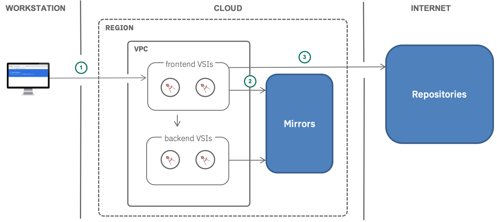

{:java: #java .ph data-hd-programlang='java'}
{:swift: #swift .ph data-hd-programlang='swift'}
{:ios: #ios data-hd-operatingsystem="ios"}
{:android: #android data-hd-operatingsystem="android"}
{:shortdesc: .shortdesc}
{:new_window: target="_blank"}
{:codeblock: .codeblock}
{:screen: .screen}
{:tip: .tip}
{:pre: .pre}
{:important: .important}

# Deploy applications on VSI in VPC
{: #vpc-app-deploy}

{:shortdesc}
This tutorial will walk you through the following mechanisms for installing software onto a Virtual Server Instance, VSI on the Virtual Private Cloud for Classic.

## Objectives
{: #objectives}

* Understand operating system software provided by IBM
* Utilize manual steps for updating the operating system software and installing new software
* Identify automated processes that can be used for installing software

## Services used
{: #services}

This tutorial uses the following runtimes and services:
- [{{site.data.keyword.vpc_full}}](https://{DomainName}/vpc/provision/vpc)
- [{{site.data.keyword.vsi_is_full}}](https://{DomainName}/vpc/provision/vs)

This tutorial may incur costs. Use the [Pricing Calculator](https://{DomainName}/estimator/review) to generate a cost estimate based on your projected usage.

## Architecture
{: #architecture}

```
 ---
|   |
|vsi| <--ibm cloud----> ibm cloud mirrors
|   | <--internet-----> open source software packages: npm, pyPI, github, ...
|   | <--on premises--> my own software package and data
 ---
  ^
  |
  +-- manual or automation drivers
```

<p style="text-align: center;">
  
</p>

1. The user identifies the software that is required
1. Manually practices the installation of the software
1. Optionally automates the procedures using API, CLI, Terraform or Ansible

## Before you begin
{: #prereqs}

1. Install all the necessary command line (CLI) tools by [following these steps](https://{DomainName}/docs/cli?topic=cloud-cli-ibmcloud-cli#overview).
1. Clone the git repository used in this example (todo) https://github.com/powellquiring/vpc-app-deploy

## General software installation principles
{: #section_one}
Software is located in the following places (align wording here with diagram above):
- Initial images
- IBM cloud mirrors
- Internet available repositories
- On the file system of the provisioning system

Initial IBM images are populated with popular off the shelf operating systems:

```
$ ibmcloud is images
Listing images under account Powell Quiring's Account as user pquiring@us.ibm.com...
ID                                     Name                    OS                                                        Created        Status   Visibility   
cc8debe0-1b30-6e37-2e13-744bfb2a0c11   centos-7.x-amd64        CentOS (7.x - Minimal Install)                            6 months ago   READY    public   
660198a6-52c6-21cd-7b57-e37917cef586   debian-8.x-amd64        Debian GNU/Linux (8.x jessie/Stable - Minimal Install)    6 months ago   READY    public   
e15b69f1-c701-f621-e752-70eda3df5695   debian-9.x-amd64        Debian GNU/Linux (9.x Stretch/Stable - Minimal Install)   6 months ago   READY    public   
2d7acb16-3d4b-d0e5-d623-e43783a9b126   red-7.x-amd64           Red Hat Enterprise Linux (7.x - Minimal Install)          2 months ago   READY    public   
7eb4e35b-4257-56f8-d7da-326d85452591   ubuntu-16.04-amd64      Ubuntu Linux (16.04 LTS Xenial Xerus Minimal Install)     6 months ago   READY    public   
cfdaf1a0-5350-4350-fcbc-97173b510843   ubuntu-18.04-amd64      Ubuntu Linux (18.04 LTS Bionic Beaver Minimal Install)    6 months ago   READY    public   
b45450d3-1a17-2226-c518-a8ad0a75f5f8   windows-2012-amd64      Windows Server (2012 Standard Edition)                    6 months ago   READY    public   
81485856-df27-93b8-a838-fa28a29b3b04   windows-2012-r2-amd64   Windows Server (2012 R2 Standard Edition)                 6 months ago   READY    public   
5ccbc579-dc22-0def-46a8-9c2e9b502d37   windows-2016-amd64      Windows Server (2016 Standard Edition)                    6 months ago   READY    public   
```

For illustrative purposes the software initially described in the following tutorial,
[Deploy a LAMP stack using Terraform](https://{DomainName}/docs/tutorials?topic=solution-tutorials-infrastructure-as-code-terraform),
will be used.

At a high level:
- A public and private VSI are provisioned with centos-7 as the base image
- Httpd and other software is installed - demonstrating the use of IBM mirrors
- Internet software is accessed - demonstrating the use of internet repositories on the public VSI and failure on the private VSI
- A file is copied from the file system of the provisioning computer to the public VSI and executed
- Tests are run to verify the above

### IBM Mirrors
IBM has internal mirrors for the images that we provide.
The mirrors are part of the
[Service endpoints available for IBM Cloud VPC](https://{DomainName}/docs/vpc-on-classic?topic=vpc-on-classic-service-endpoints-available-for-ibm-cloud-vpc)
There are no ingress charges for reading the mirrors.
The mirrors will contain new versions for the software in the IBM provided images as well as optional software packages.

Consider both `updating` the version lists available to the provisioned instances and `upgrading` the installed software from these mirrors.


### Linux cloud-init
The [cloud-init](https://cloudinit.readthedocs.io/en/latest/index.html) syntax is readable even by a novice.
A portion of the cloud-init.yaml file is shown below and does what you would expect:
- bootcmd works around an initial problem with the centos image that should be resolved by GA (todo)
- package\_update - update the list of software packages available for either upgrade or installation
- package\_upgrade - upgrade the software in the base with the latest versions
- packages - software packages to install
- write\_files - paths to text files with contents
- runcmd - commands to be executed

These packages will all be available from the IBM mirrors

```
#cloud-config
bootcmd:
- sed -i -e "s/mirrors.service.networklayer.com\|mirrors.service.softlayer.com/mirrors.adn.networklayer.com/g" /etc/yum.repos.d/*.repo*
package_update: true
package_upgrade: true
packages:
  - httpd
...
write_files:
  - path: /var/www/html/info.php
    content: |
...
runcmd:
  - systemctl start httpd.service
  - systemctl enable httpd.service
...
```

## stuff below not edited yet

## Prerequisites
You should have a VPC ssh key in the cloud.  Create or verify one exists.
In the example below the ssh key name `pfq` is used.  Substitute your preferred name.

Using the cli, verify it exists:
```
ibmcloud is keys
```
Or create the cloud ssh key if it does not exist, my public key is in the file /Users/pquiring/.ssh/id_rsa.pub
```
ibmcloud is key-create pfq @/Users/pquiring/.ssh/id_rsa.pub
```

Using the console ui
- open https://{DomainName}/
- upper left hamburger menu choose `VPC Infrastructure
- on left side choose `SSH Keys` to create a key

## Create a VPC VSI with a floating ip
{: #setup}
This is an optional step required for some of the installation mechanisms below.
After this step is completed a VPC VSI should be provisioned and it should be possible to ssh
Before continuing with the ssh and cli examples a VPC VSI will need to be created.
Each of the mechanisms below are independent.
Feel free to skip the skip the ssh and cli and the manual steps described here:
these you can go straight to the terraform and ansible examples which will create a VPC, subnet, security groups and VSI.
Creating a VPC VSI can be done

- Run the provided script or follow the steps mentioned in [Private and public subnets in a Virtual Private Cloud](https://{DomainName}/docs/tutorials?topic=solution-tutorials-vpc-public-app-private-backend) only the public subnet and web server is required for this tutorial.
- Optionally follow the steps mentioned in [securely access remote instances with a bastion host](https://{DomainName}/docs/tutorials?topic=solution-tutorials-vpc-secure-management-bastion-server) for secured maintenance of the servers using a bastion host which acts as a `jump` server and a maintenance security group.


## Software installation using ssh
{: #section_two}

replace /usr/share/httpd/noindex/index.html with the new contents

Create a VPC VSI with a floating ip

Using Centos as an example:

Identify the VSI created above.  Modify the steps to use the bastion host as required:
1. scp data.zip root@ip:<IP>
1. ssh root@ip
1. update repositories
1. upgrade software installed
1. install nginx
1. install git
1. git clone static website repository
1. unzip data.zip into the website
1. systemctl ...nginx
1. test

## Repeat the same steps with cli
Create a VPC VSI with a floating ip
{: #section_two}

## Repeat the same steps with terraform
{: #section_two}
Install terraform and the terraform IBM provider on your laptop.
See, Automating cloud resource provisioning with Terraform [Getting started tutorial](https://{DomainName}/docs/terraform).

The main.tf file creates the vpc, subnet, security group and instance.
In the
 install example software.
N

## Repeat the same steps with ansible
{: #section_two}

## Remove resources
{: #removeresources}

Steps to take to remove the resources created in this tutorial

## Expand the tutorial (this section is optional, remove it if you don't have content for it)

Want to add to or change this tutorial? Here are some ideas:
- add a load balancer for high availability and zero down time software upgrades
- install operating system patches
- install new software/data from internet repositories
- install new software/data from on premises

## Related content
{: #related}
