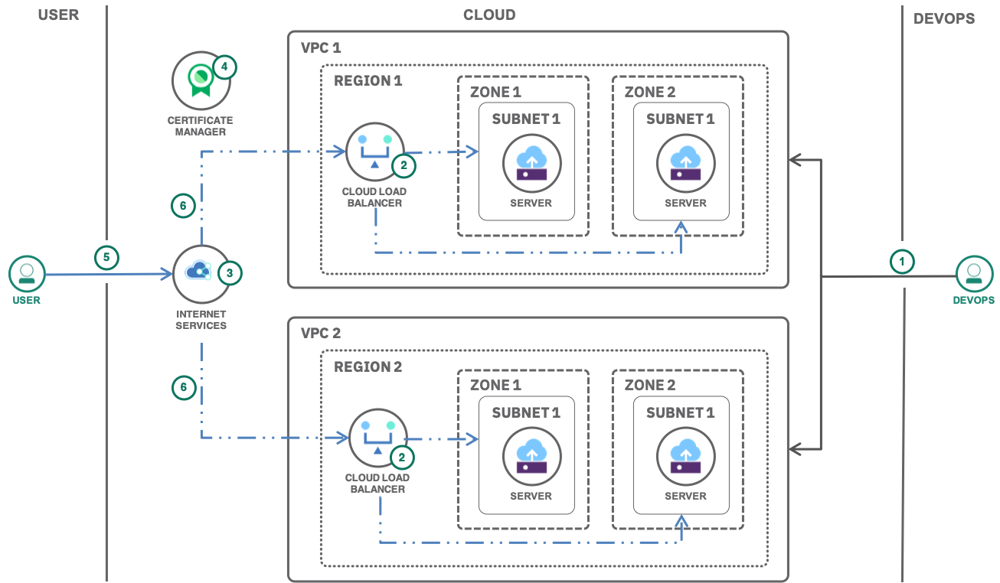

---
copyright:
  years: 2018
lastupdated: "2018-11-14"

---

{:java: #java .ph data-hd-programlang='java'}
{:swift: #swift .ph data-hd-programlang='swift'}
{:ios: #ios data-hd-operatingsystem="ios"}
{:android: #android data-hd-operatingsystem="android"}
{:shortdesc: .shortdesc}
{:new_window: target="_blank"}
{:codeblock: .codeblock}
{:screen: .screen}
{:tip: .tip}
{:pre: .pre}

# VPC with globally available deployment

VPC to isolate workloads
Load balancer to increase resiliency within a location and globally

{:shortdesc}

## Objectives
{: #objectives}

* Deploy a 3-tier application to multiple locations and zones
* Use a load balancer between zones
* Use a global load balancer between locations

## Services used
{: #services}

This tutorial uses the following runtimes and services:
* [IaaS or PaaS service name](https://console.bluemix.net/catalog/services/ServiceName)
* [IaaS or PaaS service name](https://console.bluemix.net/catalog/services/ServiceName)
* [IaaS or PaaS service name](https://console.bluemix.net/catalog/services/ServiceName)

This tutorial may incur costs. Use the [Pricing Calculator](https://console.bluemix.net/pricing/) to generate a cost estimate based on your projected usage.

## Architecture
{: #architecture}

intro sentence

  

1. The user does this
2. Then that

## Before you begin
{: #prereqs}

* [Install Git](https://git-scm.com/)
* [IBM Cloud Developer Tools](https://console.bluemix.net/docs/cli/index.html#overview) - Script to install docker, kubectl, helm, ibmcloud cli and required plug-ins

## Create VPC

??? If the terraform provider is available, it might be good to use it given the number of elements we need to create. The other option it to use scripting. This tutorial basically deploys the other vpc tutorial in multiple zones/locations.

## Remove resources
{: #removeresources}

Steps to take to remove the resources created in this tutorial

## Expand the tutorial (this section is optional, remove it if you don't have content for it)

Want to add to or change this tutorial? Here are some ideas:
- idea with [link]() to resources to help implement the idea
- idea with high level steps the user should follow
- avoid generic ideas you did not test on your own
- don't throw up ideas that would take days to implement
- this section is optional

## Related content
{: #related}

* [Relevant links](https://blah)
