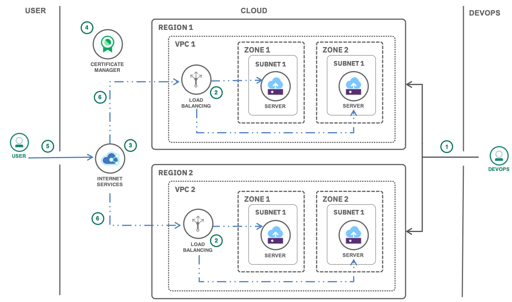

{:java: #java .ph data-hd-programlang='java'}
{:swift: #swift .ph data-hd-programlang='swift'}
{:ios: #ios data-hd-operatingsystem="ios"}
{:android: #android data-hd-operatingsystem="android"}
{:shortdesc: .shortdesc}
{:new_window: target="_blank"}
{:codeblock: .codeblock}
{:screen: .screen}
{:tip: .tip}
{:pre: .pre}
{:important: .important}
{:note: .note}

# Deploy isolated workloads across multiple locations and zones
{: #vpc-multi-region}

This tutorial walks you through the steps of setting up isolated workloads by provisioning {{site.data.keyword.vpc_full}}s (VPCs) in different regions with subnets and virtual server instances (VSIs). These VSIs are created in multiple zones within a region to ensure high availability of the application, to increase resiliency within a region and globally by configuring load balancers with back-end pools, front-end listeners and proper health checks.

For the global load balancer, you will provision an {{site.data.keyword.cis_full_notm}} ({{site.data.keyword.cis_short_notm}}) service from the catalog. For managing the SSL certificate for all incoming HTTPS requests, {{site.data.keyword.cloudcerts_long_notm}} catalog service will be created and the certificate along with the private key will be imported.

{:shortdesc}

## Objectives
{: #objectives}

* Understand the isolation of workloads through infrastructure objects available for virtual private clouds.
* Use a load balancer between zones within a region to distribute traffic among virtual servers.
* Use a global load balancer between regions to implement high availability, increase resiliency and reduce latency.

## Services used
{: #services}

This tutorial uses the following runtimes and services:

- [{{site.data.keyword.vpc_full}}](https://{DomainName}/vpc/provision/vpc)
- [{{site.data.keyword.vsi_is_full}}](https://{DomainName}/vpc/provision/vs)
- [{{site.data.keyword.loadbalancer_full}}](https://{DomainName}/vpc/provision/loadBalancer)
- [{{site.data.keyword.cis_full_notm}}](https://{DomainName}/catalog/services/internet-services)
- [{{site.data.keyword.cloudcerts_long_notm}}](https://{DomainName}/catalog/services/cloudcerts)

This tutorial may incur costs. Use the [Pricing Calculator](https://{DomainName}/estimator/review) to generate a cost estimate based on your projected usage.

## Architecture
{: #architecture}

  

1. The admin (DevOps) provisions VSIs in subnets under two different zones in a VPC in region 1 and repeats the same in a VPC created in region 2.
2. The admin creates a load balancer with a backend pool of servers of subnets in different zones of region 1 and a frontend listener. Repeats the same in region 2.
3. The admin provisions a {{site.data.keyword.cis_full_notm}} instance with an associated custom domain and creates a global load balancer pointing to the load balancers created in two different VPCs.
4. The admin enables HTTPS encryption by adding the domain SSL certificate to the {{site.data.keyword.cloudcerts_short}} service.
5. The internet user makes an HTTP/HTTPS request and the global load balancer handles the request.
6. The request is routed to the load balancers both on the global and local level. The request is then fulfilled by the available server instance.

## Before you begin
{: #prereqs}

- Check for user permissions. Be sure that your user account has sufficient permissions to create and manage VPC resources. See the list of required permissions for [VPC for Gen 1](/docs/vpc-on-classic?topic=vpc-on-classic-managing-user-permissions-for-vpc-resources) or for [VPC for Gen 2](https://{DomainName}/docs/vpc?topic=vpc-managing-user-permissions-for-vpc-resources).
- You need an SSH key to connect to the virtual servers. If you don't have an SSH key, see the instructions for creating a key for [VPC for Gen 1](/docs/vpc-on-classic?topic=vpc-on-classic-getting-started#prerequisites) or for [VPC for Gen 2](/docs/vpc?topic=vpc-ssh-keys). 

## Create VPCs, subnets and VSIs
{: #create-infrastructure}

In this section, you will create your own VPC in region 1 with subnets created in two different zones of region 1 followed by provisioning of VSIs.

To create your own {{site.data.keyword.vpc_short}} in region 1,

1. Navigate to [VPC overview](https://{DomainName}/vpc/overview) page and click on **Create a VPC for Gen 1 or 2**
2. Under **New virtual private cloud** section:
   * Enter **vpc-region1** as name for your VPC.
   * Select a **Resource group**.
   * Optionally, add **Tags** to organize your resources.
3. The default access control list (ACL) **(Allow all)** is appropriate for your VPC
4. Uncheck SSH and ping from the **Default security group** and leave **classic access** unchecked. SSH access will later be added to the maintenance security group.  The maintenance security group must be added to an instance to allow SSH access from the bastion server.  Ping access is not required for this tutorial.
4. Leave **Create a default prefix for each zone** checked.
5. Under **New subnet for VPC**:
   * Enter **vpc-region1-zone1-subnet** as your subnet's unique name.
   * Select a **Resource group**.
   * Select a location and zone 1 for example: **Dallas** and **Dallas 1**.
   * Leave the defaults for the IP range selection
8. Click **Create virtual private cloud** to provision the instance.

To confirm the creation of subnet, click **Subnets** on the left pane and wait until the status changes to **Available**. You can create a new subnet under **Subnets**.

### Create subnet in a different zone

1. Click on **New Subnet**, enter **vpc-region1-zone2-subnet** as a unique name for your subnet, select **vpc-region1** as the VPC, and select a **Resource group**.
1. Select a location zone 2 for example: **Dallas 2**
1. Leave the defaults for the IP range selection
1. Leave the public gateway to **Detached** and click **Create subnet**.

### Create a security group to allow inbound traffic to your application

To allow traffic to the application you will deploy on virtual server instances, you need to enable inbound rules for HTTP (80) and HTTPS (443) ports. In later steps, when creating virtual server instances, you will add these instances to the security group defining those rules.

1. Navigate to **Security groups**.
2. Create a new security group called **vpc-region1-sg** in **vpc-region1** with a selected **Resource group** and with the below inbound rules:
   <table>
     <thead>
       <tr>
         <td><strong>Protocol</strong></td>
         <td><strong>Source type</strong></td>
         <td><strong>Source</strong></td>
         <td><strong>Value</strong></td>
       </tr>
     </thead>
     <tbody>
       <tr>
         <td>TCP</td>
         <td>Any</td>
         <td>0.0.0.0/0</td>
         <td>Ports 80-80</td>
       </tr>
       <tr>
         <td>TCP</td>
         <td>Any</td>
         <td>0.0.0.0/0</td>
         <td>Ports 443-443</td>
       </tr>
     </tbody>
   </table>

### Provision VSIs
1. Navigate to **Subnets**.
1. Verify status is available and click on **vpc-region1-zone1-subnet** and click **Attached resources**, then **New instance**.
   1. Enter **vpc-region1-zone1-vsi** as your virtual server's unique name.
   2. Verify the VPC your created earlier, resource group and the **Location** along with the **zone** as before.
1. Set the **image** to **Ubuntu Linux** and pick any version of the image.
1. Select **Compute** with 2vCPUs and 4 GB RAM as your profile.To check other available profiles, click **All profiles**
1. Set **SSH keys** to the the SSH key you created earlier.
1. Under **Network interfaces**, click on the **Edit** icon next to the Security Groups
   * Select **vpc-region1-zone1-subnet** as the subnet.
   * Uncheck the default security group and check **vpc-region1-sg**.
   * Click **Save**.
1. Click **Create virtual server instance**.
1. **REPEAT** the above steps to provision a **vpc-region1-zone2-vsi** VSI in **zone 2** of **region 1**.

Navigate to **VPC** and **Subnets** under **Network** on the left pane and **REPEAT** the above steps for provisioning a new VPC with subnets and VSIs in **region2** by following the same naming conventions as above.

## Install and configure web server on the VSIs
{: #install-configure-web-server-vsis}


Follow the steps mentioned in [securely access remote instances with a bastion host](/docs/tutorials?topic=solution-tutorials-vpc-secure-management-bastion-server) for secured maintenance of the servers using a bastion host which acts as a `jump` server and a maintenance security group.  One bastion host in each VPC will be required.
{:tip}

Once you successfully SSH into the server provisioned in subnet of **zone 1** of **region 1**,

1. At the prompt, run the below commands to install Nginx as your web server
   ```
   sudo apt-get update
   sudo apt-get install nginx
   ```
   {:codeblock}
2. Check the status of the Nginx service with the following command:
   ```
   sudo systemctl status nginx
   ```
   {:codeblock}
   The output should show you that the Nginx service is **active** and running.
4. Optionally verify that Nginx works as expected.  `curl localhost`.  You should see the default Nginx welcome page.
5. To update the html page with the region and zone details, run the below command
   ```
   nano /var/www/html/index.nginx-debian.html
   ```
   {:codeblock}
   Append the region and zone say _server running in **zone 1 of region 1**_ to the `h1` tag quoting `Welcome to nginx!` and save the changes.
6. `curl localhost` again to notice the changes

**REPEAT** the above steps to install and configure the webserver on the VSIs in subnets of all the zones and don't forget to update the html with respective zone information.

## Distribute traffic between zones with load balancers
{: #distribute-traffic-with-load-balancers}

In this section, you will create two load balancers. One in each region to distribute traffic among multiple server instances under respective subnets within different zones.

### Configure load balancers

1. Navigate to **Load balancers** and click **New load balancer**.
2. Enter **vpc-lb-region1** as the unique name, select **vpc-region1** as your Virtual private cloud, select the resource group, **region1** as the region and Load balancer Type: **Public**.
3. Select the **Subnets** of both **zone 1** and **zone 2** of **region 1**.
4. Click **New pool** to create a new back-end pool of VSIs that acts as equal peers to share the traffic routed to the pool. Set the paramaters with the values below and click **create**.
	- **Name**:  region1-pool
	- **Protocol**: HTTP
	- **Method**: Round robin
	- **Session stickiness**: None
	- **Health check path**: /
	- **Health protocol**: HTTP
	- **Health port**: Leave blank
	- **Interval(sec)**: 15
	- **Timeout(sec)**: 5
	- **Max retries**: 2
5. Click **Attach** to add server instances to the region1-pool
   - Add the CIDR range associated with **vpc-region1-zone1-subnet**, select the instance your created and set 80 as the port.
   - Add the CIDR range associated with **vpc-region1-zone2-subnet**, select the instance your created and set 80 as the port.
   - Click **Attach** to complete the creation of a back-end pool.
6. Click **New listener** to create a new front-end listener; A listener is a process that checks for connection requests.
   - **Protocol**: HTTP
   - **Port**: 80
   - **Back-end pool**: region1-pool
   - **Maxconnections**: Leave it empty and click **Create**.
7. Click **Create load balancer** to provision a load balancer.

### Test the load balancers

1. Wait until the status of the load balancer changes to **Active**.
2. Open the **Hostname** in a web browser.
3. Refresh the page several times and notice the load balancer hitting different servers with each refresh.
4. **Save** the address for future reference.

If you observe, the requests are not encrypted and supports only HTTP. You will configure an SSL certificate and enable HTTPS in the next section.

**REPEAT** the steps 1-7 above in **region 2**.

### Provision a {{site.data.keyword.cis_short_notm}} instance and configure custom domain

In this section, you will create a {{site.data.keyword.cis_full_notm}} ({{site.data.keyword.cis_short_notm}}) instance, configure a custom domain by pointing it to {{site.data.keyword.cis_short_notm}} name servers and later configure a global load balancer.

1. Navigate to the [{{site.data.keyword.cis_full_notm}}](https://{DomainName}/catalog/services/internet-services) in the {{site.data.keyword.Bluemix_notm}} catalog.
2. Enter a service name, select a resource group and click **Create** to provision an instance of the service. You can use any pricing plans for this tutorial.
3. When the service instance is provisioned, set your domain name by clicking **Let's get started**, enter your domain name and click **Connect and continue**.
4. Click **Next step**. When the name servers are assigned, configure your registrar or domain name provider to use the name servers listed. If you are using the IBM Classic Domain Name Server you can find instructions [here](https://{DomainName}/docs/dns?topic=dns-add-edit-or-delete-custom-name-servers-for-a-domain).
5. After you've configured your registrar or the DNS provider, it may require up to 24 hours for the changes to take effect.

   When the domain's status on the overview page changes from *Pending* to *Active*, you can use the `dig <mydomain.com> ns` command to verify that the new name servers have taken effect.
   {:tip}

## Configure a global load balancer
{: #global-load-balancer}

In this section, you will configure a global load balancer (GLB) distributing the incoming traffic to the VPC load balancers configured in different {{site.data.keyword.Bluemix_notm}} regions.

### Distribute traffic across regions with a global load balancer
Open the {{site.data.keyword.cis_short_notm}} service you created by navigating to the [Resource list](https://{DomainName}/resources) under services.

1. Navigate to **Global Load Balancers** under **Reliability** and click **create load balancer**.
2. Enter the prefix **lb** to provide a balancer hostname (the resulting fully qualified name would be **lb.mydomain.com**), leave Proxy off, leave TTL as 60 seconds.
3. Click **Add pool** to define a default origin pool
   - **Name**: lb-region1
   - **Health check**: Create new
     - **Monitor Type**: HTTP
     - **Path**: /
     - **Port**: 80
   - **Health check region**: Eastern North America
   - **origins**
     - **name**: region1
     - **address**: Hostname of **region1** VPC Load balancer, see the overview page of the VPC load balancer
     - **weight**: 1
     - Click **Add**

4. **ADD** one more **origin pool** pointing to **region2** load balancer in the **Eastern North America** region and click **Create** to provision your global load balancer.

Wait until the **Health** check status changes to **Healthy**. Open the link **lb.mydomain.com** in a browser of your choice to see the global load balancer in action. The global load balancer is a DNS resolver. Most clients, like browsers, only resolve the DNS address one time or infrequently.  The load is balanced across multiple clients, not for a single client.  You will likely see the response from a single VPC load balancer.

## Secure with HTTPS

HTTPS encryption requires signed certificates to be stored and accessed. Below the {{site.data.keyword.cloudcerts_long}} will be provisioned to order or import, then manage the certificate. Then the Identity and Access Management (IAM) service authorization is configured to allow read access.

### Create and authorize a {{site.data.keyword.cloudcerts_short}} instance

Manage the SSL certificates through the {{site.data.keyword.cloudcerts_full_notm}}.

1. Create a [{{site.data.keyword.cloudcerts_short}}](https://{DomainName}/catalog/services/cloudcerts) instance in a supported location and in a resource group.
2. Create an authorization that gives the VPC load balancer service instance access to the {{site.data.keyword.cloudcerts_short}} instance that contains the SSL certificate. You may manage such an authorization through [Identity and Access Authorizations](https://{DomainName}/iam#/authorizations).
   - Click **Create** and choose **Infrastructure Service** as the source service
   - **Load Balancer for VPC** as the resource type
   - **Certificate Manager** as the target service
   - Assign the **Writer** service access role.
   - To create a load balancer, you must grant All resource instances authorization for the source resource instance. The target service instance may be **All instances**, or it may be your specific {{site.data.keyword.cloudcerts_short}} instance.

### Alternative 1: Proxy in {{site.data.keyword.cis_short_notm}} with wildcard certificate from Let's Encrypt
This first alternative creates a wildcard certificate for **mydomain.com** and then proxies it in the {{site.data.keyword.cis_full_notm}} ({{site.data.keyword.cis_short_notm}}) allowing you to take advantage of industry leading security, protection and performance capabilities.

1. Continuing in the Authorizations panel, create an authorization that gives the {{site.data.keyword.cloudcerts_short}} access to {{site.data.keyword.cis_short_notm}}:
   - Click **Create** and choose **Certificate Manager** as the source service
   - Choose **All instances** or just the {{site.data.keyword.cloudcerts_short}} created earlier
   - **Internet Services** as the target service
   - Choose **All instances** or just the {{site.data.keyword.cis_short_notm}} created earlier
   - Assign the **Manager** service access role.
1. Order a certficate in {{site.data.keyword.cloudcerts_short}}
   - Open the {{site.data.keyword.cloudcerts_short}} service and order a certificate. Choose **I'm using Cloud Internet Services**.
   - On the **Order certificated** the **Certificate details** panel is displayed
     - **Name** - choose a name you can remember to reference this certificate in a later step
     - **Description** - more text
     - **Certificate authority** choose  **Let's Encrypt**
     - Leave the defaults for **Signature algorithm**, **Key algorithm**
     - **Automatic certificate renewel** - leave off
   - On the **Order certificateProvide** select the **details** panel
     - **IBM Cloud Internet Services (CIS) instance** choose your instance
     - **Certificate domains** check the **Add Wildccard** and leave **Add Domain** unchecked
   - Click Order
1. Configure https from client web browsers to the {{site.data.keyword.cis_short_notm}} endpoint. In {{site.data.keyword.cis_short_notm}} configure TLS Security:
   - Open the **Security** panel and choose **TLS**.
   - For the **Mode** choose **Client-to-edge**.  This will terminate https connections at the Global Load Balancer and will switch to http connections to the VPC load balancer.
1. In the {{site.data.keyword.cis_short_notm}} configure the Global Load Balancer to use TLS:
   - Open **Reliability** panel and choose **Global Load Balancer**
   - Locate the Global Load Balancer created earlier and turn on Proxy
1. In a browser open https://**lb.mydomain.com** to verify success

Next configure https from {{site.data.keyword.cis_short_notm}} to the VPC load balancer.

Add an HTTPS listener to the VPC load balancers:
1. Navigate to **VPC** then **Load balancers** and click **vpc-lb-region1**
1. Choose **Front-end listeners**
1. Click **New listener**
1. Select HTTPS, Port: 443, SSL Certificate drop down should show the certificate **name** that you ordered using your {{site.data.keyword.cloudcerts_short}} instance earlier from Let's Encrypt.


If the SSL Certificate drop down does not have **mydomain.com** you may have missed the authorization step above that gives the VPC load balancer access to the {{site.data.keyword.cloudcerts_short}} service. Verify that the {{site.data.keyword.cloudcerts_short}} service has a certificate for **mydomain.com**
{:tip}.

The wildcard certificate created will allow access to domain name like vpc-lb-region1.**mydomain.com**.  Open the the **Overview** tab of the VPC load balancer **vpc-lb-region1** and notice that the **Hostname** is xxxxxxx-us-south.lb.appdomain.cloud. The wildcard certificate is not going to work. Fix that problem by creating an alias and then update the configuration.

1. A DNS CNAME record can be created to allow clients to lookup vpc-lb-region1.**mydomain.com** and resolve xxxxxxx-us-south.lb.appdomain.cloud.
   - In the {{site.data.keyword.cis_short_notm}}, open **Reliability** panel and choose **DNS**
   - Scroll down to DNS Records and create a record of Type: **CNAME**, Name: **vpc-lb-region1**, TTL: **Automatic** and Alias Domain Name: **VPC load balancer Hostname**
   - Add a DNS CNAME record for **vpc-lb-region2**

1. Now adjust the Global load balancer to use the new CNAME records:
   - Open **Reliability** panel and choose **Global Load Balancers**
   - Find and edit the **Origin Pools** to change the **Origins** **Origin Address** to **vpc-lb-region1.mydomain.com**.
   - Repeat for **vpc-lb-region2.mydomain.com**.

1. Turn on end to end security
   - Open the **Security** panel and choose **TLS**.
   - For the **Mode** choose **End-to-end CA signed**.  This will terminate https connections at the Global Load Balancer and use https connections to the VPC load balancer.

In a browser open https://**lb.mydomain.com** to verify success

### Alternative 2: Have the Global Load Balancer pass through directly to VPC load balancers
In this alternative you should obtain an SSL certificate for the subdomain you plan to use with the global load balancer. Assuming a domain like mydomain.com, the global load balancer could be hosted at `lb.mydomain.com`. The certificate will need to be issued for lb.mydomain.com.

You can get free SSL certificates from [Let's Encrypt](https://letsencrypt.org/) or through [{{site.data.keyword.cloudcerts_long}}](https://{DomainName}/docs/services/certificate-manager?topic=certificate-manager-ordering-certificates). Use these steps:

```
mkdir letsencrypt
docker run -it -v $(pwd)/letsencrypt:/etc/letsencrypt certbot/certbot certonly --manual --preferred-challenges dns -d lb.mydomain.com
``` 

During the process you may need to configure a DNS record of type TXT in the DNS interface of {{site.data.keyword.cis_full_notm}} to prove you are the owner of the domain.

Once you have obtained the SSL certificate and private key for your domain you may need to convert them to the [PEM](https://en.wikipedia.org/wiki/Privacy-Enhanced_Mail) format (not required if you follow the letsencrypt instructions above).

1. To convert a Certificate to PEM format:
   ```
   openssl x509 -in domain-crt.txt -out domain-crt.pem -outform PEM
   ```
   {: pre}
2. To convert a Private Key to PEM format:
   ```
   openssl rsa -in domain-key.txt -out domain-key.pem -outform PEM
   ```
   {: pre}

3. In the service dashboard, use **Import Certificate**:
   * Set **Name** to the custom subdomain and domain, such as **lb.mydomain.com**.
   * Browse for the **Certificate file** in PEM format.
   * Browse for the **Private key file** in PEM format.
   * **Import**.

Create a HTTPS listener:

1. Navigate to the **Load balancers** page.
1. Select **vpc-lb-region1**
2. Under **Front-end listeners**, Click **New listener**

   -  **Protocol**: HTTPS
   -  **Port**: 443
   -  **Back-end pool**: POOL in the same region
   - Choose the current region as your SSL region
   - Choose the SSL certificate for **lb.mydomain.com**

3. Click **Create** to configure an HTTPS listener

**REPEAT** the above steps in the load balancer of **region 2**.

In a browser open https://**lb.mydomain.com** to verify success


### Failover test
By now, you should have seen that most of the time you are hitting the servers in **region 1** as it's assigned higher weight compared to the servers in **region 2**. Let's introduce a health check failure in the **region 1** origin pool,

1. Navigate to the list of **virtual server instances**.
2. Click **three dots(...)** next to the server(s) running in **zone 1** of **region 1** and click **Stop**.
3. **REPEAT** the same for server(s) running in **zone 2** of **region 1**.
4. Return to GLB under {{site.data.keyword.cis_short_notm}} service and wait until the health status changes to **Critical**.
5. Now, when you refresh your domain url, you should always be hitting the servers in **region 2**.

Don't forget to **start** the servers in zone 1 and zone 2 of region 1
{:tip}

## Remove resources
{: #removeresources}

- Remove the Global load balancer, origin pools and health checks under the {{site.data.keyword.cis_short_notm}} service
- Remove the certificates in the {{site.data.keyword.cloudcerts_short}} service.
- Remove the load balancers, VSIs, subnets and VPCs.
- Under [Resource list](https://{DomainName}/resources), delete the services used in this tutorial.


## Related content
{: #related}

* [Using Load Balancers in IBM Cloud VPC](/docs/vpc-on-classic-network?topic=vpc-on-classic-network---using-load-balancers-in-ibm-cloud-vpc)
