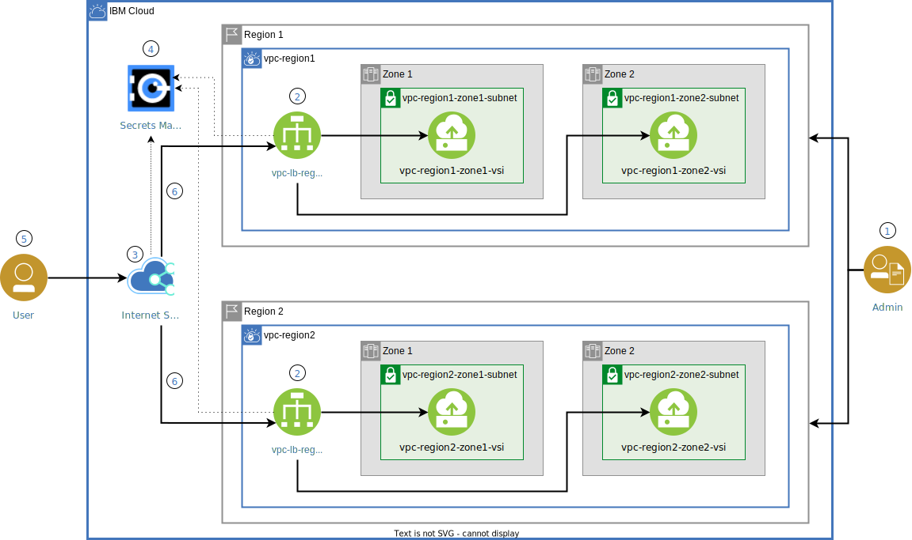

{:step: data-tutorial-type='step'}
{:java: #java .ph data-hd-programlang='java'}
{:swift: #swift .ph data-hd-programlang='swift'}
{:ios: #ios data-hd-operatingsystem="ios"}
{:android: #android data-hd-operatingsystem="android"}
{:shortdesc: .shortdesc}
{:new_window: target="_blank"}
{:codeblock: .codeblock}
{:screen: .screen}
{:tip: .tip}
{:pre: .pre}
{:important: .important}
{:note: .note}

# Deploy isolated workloads across multiple locations and zones
{: #vpc-multi-region}
{: toc-content-type="tutorial"}
{: toc-services="vpc, cis, secrets-manager"}
{: toc-completion-time="2h"}

<!--##istutorial#-->
This tutorial may incur costs. Use the [Cost Estimator](https://{DomainName}/estimator/review) to generate a cost estimate based on your projected usage.
{: tip}

<!--#/istutorial#-->

This tutorial walks you through steps for setting up highly available and isolated workloads by provisioning {{site.data.keyword.vpc_full}}s (VPCs). You will create virtual server instances (VSIs) in multiple zones within one region to ensure the high availability of the application.  You will create additional VSIs in a second region and configure a global load balancer (GLB) to provide high availability between regions and reduce network latency for users in different geographies.
{: shortdesc}

You will provision an {{site.data.keyword.cis_full_notm}} ({{site.data.keyword.cis_short_notm}}) service as the GLB from the catalog, and an {{site.data.keyword.secrets-manager_full_notm}} service from the catalog to manage the Transport Layer Security (TLS) certificate for all incoming HTTPS requests.

## Objectives
{: #vpc-multi-region-objectives}

* Understand the isolation of workloads through infrastructure objects available for virtual private clouds.
* Use a load balancer between zones within a region to distribute traffic among virtual servers.
* Use a global load balancer between regions to implement high availability, increase resiliency and reduce latency.


{: caption="Figure 1. Architecture diagram of the tutorial" caption-side="bottom"}
{: style="text-align: center;"}

1. The admin (DevOps) provisions VSIs in subnets under two different zones in a VPC in region 1 and repeats the same in a VPC created in region 2.
2. The admin creates a load balancer with a backend pool of servers in different zones of region 1 and a frontend listener. Repeats the same in region 2.
3. The admin provisions a {{site.data.keyword.cis_full_notm}} instance with an associated custom domain and creates a global load balancer pointing to the load balancers created in two different VPCs.
4. The admin enables HTTPS encryption by adding the domain SSL certificate to the {{site.data.keyword.secrets-manager_short}} service.
5. The user makes an HTTP/HTTPS request and the global load balancer handles the request.
6. The request is routed to the load balancers both on the global and local level. The request is then fulfilled by the available server instance.

## Before you begin
{: #vpc-multi-region-prereqs}

- Check for user permissions. Be sure that your user account has sufficient permissions to create and manage VPC resources. See the list of [required permissions](https://{DomainName}/docs/vpc?topic=vpc-managing-user-permissions-for-vpc-resources) for VPC.
- You need an SSH key to connect to the virtual servers. If you don't have an SSH key, see [the instructions](/docs/vpc?topic=vpc-ssh-keys) for creating a key for VPC.

## Create virtual private clouds, subnets and virtual server instances
{: #vpc-multi-region-create-infrastructure}
{: step}

In this section, you will create your own VPC in region 1 with subnets created in two different zones of region 1 followed by the provisioning of VSIs.

### Create a virtual private cloud
{: #vpc-multi-region-21}

1. Navigate to [Virtual private clouds](https://{DomainName}/vpc-ext/network/vpcs) page and click on **Create**.
2. Enter **vpc-region1** for the name of your VPC, select a **Resource group** and optionally, add **Tags** to organize your resources.
3. Uncheck **Allow SSH** and **Allow ping** from the **Default security group**. SSH access will later be added to a maintenance security group. The maintenance security group is added to an instance to allow SSH access from a bastion server. Ping access is not required for this tutorial.
4. Leave **Enable access to classic resources** unchecked and **Create a default prefix for each zone** checked.
5. Under **Subnets** change the name of the Zone 1 subnet. Click the pencil icon:
   * Enter `vpc-region1-zone1-subnet` as your subnet's unique name.
   * Select the same **Resource group** as the VPC resource group.
   * Leave the defaults in the other values.
   * Click **Save**
6. Under **Subnets** change the name of the Zone 2 subnet. Click the pencil icon:
   * Enter `vpc-region1-zone2-subnet` as your subnet's unique name.
   * Select the same **Resource group** as the VPC resource group.
   * Leave the defaults in the other values.
   * Click **Save**
7. Under **Subnets** delete the subnet in Zone 3.  Click the minus icon.
8. Click **Create virtual private cloud** to provision the instance.

### Create a security group to allow inbound traffic to your application
{: #vpc-multi-region-4}

Enable inbound rules for HTTP (80) and HTTPS (443) ports to the application by defining rules in a security group. In later steps, you will add VSIs to the security group.

1. Navigate to **Security groups**.
2. Create a new security group called **vpc-region1-sg** in **vpc-region1** with a selected **Resource group** and with the below inbound rules:
   

   | Protocol | Source type | Source | Value    |
   |------------|---------------|----------|-----------  |
   | TCP         | Any            | 0.0.0.0/0 | Ports 80-80  |
   | TCP         | Any            | 0.0.0.0/0 | Ports 443-443 |
   
   {: caption="Inbound rules" caption-side="bottom"}

### Provision virtual server instances
{: #vpc-multi-region-5}

1. Navigate to **Subnets**.
1. Verify status is available. Then click on **vpc-region1-zone1-subnet** followed by **Attached resources**, then under **Attached instances** click on **Create**.
   1. Enter `vpc-region1-zone1-vsi` as your virtual server's unique name.
   2. Verify the VPC you created earlier, resource group and the **Location** along with the **zone** as before.
1. Set the **image** to `Ubuntu Linux` and pick any version of the image.
1. Click on **View all profiles** and select **Compute** with `2 vCPUs` and `4 GB RAM` as your profile.
1. Set **SSH keys** to the SSH key you created earlier.
1. Under **Network interfaces**, click on the **Edit** icon next to the **Security Groups**.
   * Select `vpc-region1-zone1-subnet` as the subnet.
   * Uncheck the default security group and check `vpc-region1-sg`.
   * Click **Save**.
1. Click **Create virtual server instance**.
1. Repeat the above steps to provision a **vpc-region1-zone2-vsi** VSI in **zone 2** of **region 1**.

##  Create resources in another location
{: #vpc-multi-region-20}
{: step}

Navigate to **VPC** and **Subnets** under **Network** on the left pane and repeat the above steps from Step 1 for provisioning a new VPC with subnets and VSIs in another region, for example, **Frankfurt**.  Follow the same naming conventions as above while substituting region2 for region1.

## Install and configure web server on the virtual server instances
{: #vpc-multi-region-install-configure-web-server-vsis}
{: step}

Follow the steps mentioned in [securely access remote instances with a bastion host](https://{DomainName}/docs/solution-tutorials?topic=solution-tutorials-vpc-secure-management-bastion-server) for secured maintenance of the servers. Use a bastion host which acts as a `jump` server and a maintenance security group to the VSIs previously provisioned. One bastion host in each VPC is required.
{: tip}

Once you successfully SSHed into the server provisioned in subnet of **zone 1** of **region 1**,

1. At the prompt, run the following commands to install Nginx as your web server
   ```sh
   sudo apt-get update
   sudo apt-get install nginx
   ```
   {: codeblock}

2. Check the status of the Nginx service with the following command:
   ```sh
   sudo systemctl status nginx
   ```
   {: codeblock}

   The output should show you that the Nginx service is **active** and running.
3. Optionally verify that Nginx works as expected.  `curl localhost`.  You should see the default Nginx welcome page.
4. To update the html page with the region and zone details, run the below command
   ```sh
   nano /var/www/html/index.nginx-debian.html
   ```
   {: codeblock}

   Append the region and zone say _server running in **zone 1 of region 1**_ to the `h1` tag quoting `Welcome to nginx!` and save the changes.
5. `curl localhost` again to notice the changes
6. Repeat the above steps to install and configure the web server on the VSIs in subnets of all the zones and don't forget to update the html to include the zone information.

## Distribute traffic between zones with load balancers
{: #vpc-multi-region-distribute-traffic-with-load-balancers}
{: step}

In this section, you will create two load balancers. One in each region to distribute traffic among multiple server instances under respective subnets within different zones.

### Create a security group to allow inbound and outbound traffic through the load balancers
{: #vpc-multi-region-lb-security-group}

To allow traffic to the application, you need to enable inbound and outbound rules for HTTP (80) and HTTPS (443) ports. In later steps, when creating load balancers, you will add them to the security group defining those rules.

1. Navigate to **Security groups**.
2. Create a new security group called **vpc-lb-sg** in **vpc-region1** with a selected **Resource group**.
3. Add the inbound rules below:

   | Protocol | Source type | Source | Value    |
   |------------|---------------|----------|-----------  |
   | TCP         | Any            | 0.0.0.0/0 | Ports 80-80  |
   | TCP         | Any            | 0.0.0.0/0 | Ports 443-443  |
   
   {: caption="Inbound rules" caption-side="bottom"}

4. Add the outbound rules below:

   | Protocol | Source type | Source | Value    |
   |------------|---------------|----------|-----------  |
   | TCP         | Any            | 0.0.0.0/0 | Ports 80-80  |
   | TCP         | Any            | 0.0.0.0/0 | Ports 443-443  |
   
   {: caption="Outbound rules" caption-side="bottom"}

5. Repeat the steps above in **region 2**.

### Configure load balancers
{: #vpc-multi-region-8}

1. Navigate to **Load balancers** and click **Create**.
2. Enter **vpc-lb-region1** as the Name, select **vpc-region1** as the Virtual Private Cloud, select the resource group, **Application load balancer** as the Load balancer and Load balancer Type: **Public**.
3. Select the **Subnets** of **vpc-region1-zone1-subnet** and **vpc-region1-zone2-subnet**..
4. Click **Create pool** to create a new back-end pool of VSIs that acts as equal peers to share the traffic routed to the pool. Set the parameters with the values below and click **Create**.
   - **Name**:  `region1-pool`
   - **Protocol**: `HTTP`
   - **Session stickiness**: `None`
   - **Proxy protocol**: `Disabled`
   - **Method**: `Round robin`
   - **Health check path**: `/`
   - **Health protocol**: `HTTP`
   - **Health port**: Leave blank
   - **Interval(sec)**: `15`
   - **Timeout(sec)**: `5`
   - **Max retries**: `2`
5. Click **Attach server** to add server instances to the pool.
   - From the **Subnet** dropdown, select **vpc-region1-zone1-subnet**, select the instance your created and set `80` as the **port**.
   - Click on **Attach**.
   - From the **Subnet** dropdown, select **vpc-region1-zone2-subnet**, select the instance your created and set `80` as the **port**.
   - Click **Save** to complete the creation of a back-end pool.
6. Click **Create listener** to create a new front-end listener; A listener is a process that checks for connection requests.
   - **Protocol**: `HTTP`
   - **Proxy protocol**: not checked
   - **Port**: `80`
   - **Back-end pool**: `region1-pool`
   - **Maximum connections**: Leave it empty and click **Create**.
7. Under **Security Groups** uncheck the default security group and check `vpc-lb-sg`.
8. Click **Create load balancer** to provision a load balancer.
9. Repeat the steps above in **region 2**.

### Test the load balancers
{: #vpc-multi-region-9}

1. Wait until the status of the load balancer changes to **Active**.
2. Open the **Hostname** in a web browser.
3. Refresh the page several times and notice the load balancer returning results from different servers with each refresh.
4. **Save** the address for future reference.

You may have noticed that the requests are not encrypted and supports only HTTP. You will configure an SSL certificate and enable HTTPS in the next section.

## Configure multi-location load-balancing
{: #vpc-multi-region-global-load-balancer}
{: step}

Your application is now running in two regions, but it is missing one component for the users to access it transparently from a single entry point.

In this section, you will configure {{site.data.keyword.cis_full_notm}} ({{site.data.keyword.cis_short_notm}}) to distribute the load between the two regions. {{site.data.keyword.cis_short_notm}} provides _Global Load Balancer (GLB)_, _Caching_, _Web Application Firewall (WAF)_ and _Page rule_ to secure your applications while ensuring the reliability and performance for your cloud applications.

To configure a global load balancer, you will need:
* to point a custom domain to {{site.data.keyword.cis_short_notm}} name servers,
* to retrieve the IP addresses or hostnames of the VPC load balancers,
* to configure health checks to validate the availability of your application,
* and to define origin pools pointing to the VPC load balancers.

### Add a custom domain to {{site.data.keyword.cis_full_notm}}
{: #vpc-multi-region-10}

The first step is to create an instance of {{site.data.keyword.cis_short_notm}} and to point your custom domain to {{site.data.keyword.cis_short_notm}} name servers.

1. If you do not own a domain, you can buy one from a registrar.
2. Navigate to [{{site.data.keyword.cis_full_notm}}](https://{DomainName}/catalog/services/internet-services) in the {{site.data.keyword.Bluemix_notm}} catalog.
3. Set the service name, and click **Create** to create an instance of the service.
4. When the service instance is provisioned, click on **Add domain**.
5. Enter your domain name and click **Next**.
6. Setup your DNS records is an optional step and can be skipped for this tutorial. click on **Next**.
7. When the name servers are assigned, configure your registrar or domain name provider to use the name servers listed.
8. At this point you can click on **Cancel** to get back to the main page, after you've configured your registrar or the DNS provider, it may require up to 24 hours for the changes to take effect.

   When the domain's status on the Overview page changes from *Pending* to *Active*, you can use the `dig <your_domain_name> ns` command to verify that the new name servers have taken effect.
   {: tip}

### Configure Health Check for the Global Load Balancer
{: #vpc-multi-region-11}

A health check helps gain insight into the availability of pools so that traffic can be routed to the healthy ones. These checks periodically send HTTP/HTTPS requests and monitor the responses.

1. In the {{site.data.keyword.cis_full_notm}} dashboard, navigate to **Reliability** > **Global Load Balancers**.
1. Select **Health checks** and click **Create**.
1. Set **Name** to **nginx**.
1. Set **Monitor Type** to **HTTP**.
1. Set **Port** to **80**.
1. Set **Path** to **/**.
1. Click **Create**.

   When building your own applications, you could define a dedicated health endpoint such as */health* where you would report the application state.
   {: tip}

### Define Origin Pools
{: #vpc-multi-region-12}

A pool is a group of origin VSIs or load balancers that traffic is intelligently routed to when attached to a GLB. With VPC load balancers in two regions, you can define location-based pools and configure {{site.data.keyword.cis_short_notm}} to redirect users to the closest VPC load balancer based on the geographical location of the user requests.

#### Origin pool for the VPC load balancer
{: #vpc-multi-region-13}

1. Select **Origin pools** and click **Create**.
2. Enter a name for the pool: `region-1-pool`.
3. Set **Origin Name** to `region-1`.
4. Set **Origin Address** to the hostname of region1 VPC load balancer, see the **overview page** of the VPC load balancer.
5. Select a **Existing health check** and select the health check created earlier.
6. Select a **Health check region** close to the location region 1.
7. Click **Save**.
8. Repeat the above steps for region 2.

### Create the global load balancer
{: #vpc-multi-region-19}

With the origin pools defined, you can complete the configuration of the load balancer.

1. Select **Load balancers** and click **Create**.
1. Keep the defaults of **Enable**: `On` and **Proxy**: `Off`.
1. Enter the name for the global load balancer, **lb**, (`<glb_name>`) this name will be the initial characters in the subdomain to access the application. (http://`<gbl_name>`.`<your_domain_name>`).
1. Click **Add route**.
1. Select the **Region**: `Default`.
1. Select the origin pools that you just created, i.e. **region-1-pool** and **region-2-pool**.
1. Click **Add**.
1. Expand the section of **Geo routes**, you can distribute traffic based on the origin region, pick a GLB region that is close to the VPC region 1. 
   > You can add more routes if desired based on geographies and direct traffic to the closest pool. Click **Add route**, select a GLB region for example, **Western Europe**  and select the pool desired for example **region-2-pool** and click **Add**.
   > With this configuration, a request does not match any of the defined route, it will be redirected to the **Default origin pools**, users in the GLB region you have define will be directed to the closest Load Balancers/VSIs.
   {: note}
1. Click **Create**.

## Secure with HTTPS
{: #vpc-multi-region-6}
{: step}

HTTPS encryption requires signed certificates to be accessible from both the {{site.data.keyword.cis_short_notm}} GLB and the VPC load balancers. Below the {{site.data.keyword.secrets-manager_full_notm}} will be used to order or import and then manage the certificate for your domain.  Identity and Access Management (IAM) service authorization is then configured to allow read access to the certificate from the desired service.

### Create and authorize a {{site.data.keyword.secrets-manager_short}} instance
{: #vpc-multi-region-14}

1. If you have an existing [{{site.data.keyword.secrets-manager_short}}](https://{DomainName}/catalog/services/secrets-manager) instance, you can use it for this tutorial or create a new one if needed by following the steps outlined in [Creating a Secrets Manager service instance](https://{DomainName}/docs/secrets-manager?topic=secrets-manager-create-instance&interface=ui).
2. Create an authorization that gives the VPC load balancer service access to the {{site.data.keyword.secrets-manager_short}} instance that contains the SSL certificate.
   - Navigate to [Identity and Access Authorizations](https://{DomainName}/iam/authorizations).
   - Click **Create** and select **VPC Infrastructure Services** as the source service.
   - **Load Balancer for VPC** as the resource type.
   - **{{site.data.keyword.secrets-manager_short}}** as the target service.
   - Assign the **Writer** service access role.
   - To create a load balancer, you must grant **All resource instances** authorization for the source resource instance. The target service instance may be **All instances**, or it may be your specific {{site.data.keyword.secrets-manager_short}} instance.
   - Click on **Authorize**.
3. Continuing in the Authorizations panel, create an authorization that gives the {{site.data.keyword.secrets-manager_short}} access to {{site.data.keyword.cis_short_notm}}:
   - Click **Create** and choose **{{site.data.keyword.secrets-manager_short}}** as the source service.
   - Choose **All instances** or just the {{site.data.keyword.secrets-manager_short}} created earlier.
   - **Internet Services** as the target service.
   - Choose **All instances** or just the {{site.data.keyword.cis_short_notm}} created earlier.
   - Assign the **Manager** service access role.
   - Click on **Authorize**.

   If your {{site.data.keyword.cis_short_notm}} instance supports multiple domains, you can also assign **Reader** role to the {{site.data.keyword.cis_short_notm}} instance and **Manager** to the specific domain that is you are using for your solution. See [granting service access to specific domains](https://{DomainName}/docs/secrets-manager?topic=secrets-manager-prepare-order-certificates#authorize-specific-domains) topic.
   {: tip}

IBM {{site.data.keyword.cis_short_notm}} supports proxying for global load balancers. When a load balancer is proxied, it means that its traffic runs directly through {{site.data.keyword.cis_short_notm}}. Load balancers support both DNS-only and HTTP proxy modes, consider which of the two alternatives below best match your use case before proceeding as the traffic routing behavior differs as follows:
   - Alternative 1: Traffic that is proxied flows through CIS. 
   - Alternative 2: Traffic that is non-proxied (DNS-only mode) flows directly from the client to the origin. In DNS-only mode, none of the CIS security, performance, and reliability features are applied.

{: caption="Traffic flow" caption-side="bottom"}
{: style="text-align: center;"}

For more information read through the [Proxying DNS records and global load balancers](https://{DomainName}/docs/cis?topic=cis-dns-concepts#dns-concepts-proxying-dns-records) topic.

### Alternative 1: Proxy, traffic flows through {{site.data.keyword.cis_short_notm}}
{: #vpc-multi-region-15}

This first alternative creates a wildcard certificate for `example.com` and then proxies it in the {{site.data.keyword.cis_full_notm}} ({{site.data.keyword.cis_short_notm}}) allowing you to take advantage of industry leading security, protection and performance capabilities.

   Currently ordering certificates is by using **Let's Encrypt**, you may follow the topic [Supported certificate authorities](https://{DomainName}/docs/secrets-manager?topic=secrets-manager-prepare-order-certificates#connect-certificate-authority) for updates. Using **Let's Encrypt** requires an ACME account. Follow the steps outlined in the [Connecting third-party certificate authorities](https://{DomainName}/docs/secrets-manager?topic=secrets-manager-add-certificate-authority&interface=ui) topic to create or register your account. In addition, you are required to add a DNS provider following the steps in the [Connecting DNS providers](https://{DomainName}/docs/secrets-manager?topic=secrets-manager-add-dns-provider&interface=ui#add-dns-provider-ui) topic. For this tutorial, you must add {{site.data.keyword.cis_short_notm}} as your DNS provider.
   {: tip}

Initially HTTPS is configured from the user to {{site.data.keyword.secrets-manager_short}} only. 
1. Order a certificate in {{site.data.keyword.secrets-manager_short}}
   - Open the {{site.data.keyword.secrets-manager_short}} service and select **Secrets** on the left.
   - Click **Add** and then **TLS certificates**.
   - Click on the **Order a public certificate** tile.
   - Complete the form:
     - **Name** - type a name you can remember.
     - **Description** - enter a description of your choice.
     - Under **Certificate authority** select your configured **Let's Encrypt** certificate authority engine.
     - Under **Key algorithm**, pick your preferred algorithm,
     - **Bundle certificates** - leave off
     - **Automatic certificate rotation** - leave off
     - Under **DNS provider** select your configured DNS provider instance
     - Click on **Select domains** check the **Select with wildcard** and leave the domain itself unchecked and click on **Done**.
   - Click **Order**.
1. Configure HTTPS from client web browsers to the {{site.data.keyword.cis_short_notm}} endpoint. In {{site.data.keyword.cis_short_notm}} configure TLS Security:
   - Open the **Security** panel and choose **TLS**.
   - For the **Mode** choose **Client-to-edge**.  This will terminate HTTPS connections at the global load balancer and will switch to HTTP connections to the VPC load balancer.
1. In the {{site.data.keyword.cis_short_notm}} configure the global load balancer to use TLS:
   - Open **Reliability** panel and choose **Global Load Balancer**.
   - Locate the global load balancer created earlier and turn on Proxy.
1. In a browser open **https://lb.example.com** to verify success.

Next configure HTTPS from {{site.data.keyword.cis_short_notm}} to the VPC load balancer.

Add an HTTPS listener to the VPC load balancers:
1. Navigate to **VPC** then **Load balancers** and click **vpc-lb-region1**.
1. Choose **Front-end listeners**.
1. Click **Create listener**.
1. Select HTTPS and enter for **Port** a value of `443`. 
1. Select the **Default back-end pool**: `region1-pool` or `region2-pool`.
1. Select the **{{site.data.keyword.secrets-manager_short}}** instance you created earlier, the SSL Certificate drop down should show the certificate **name** that you ordered using your {{site.data.keyword.secrets-manager_short}} instance earlier from Let's Encrypt. Click on **Create**.

   If the SSL Certificate drop down does not have **example.com** you may have missed the authorization step above that gives the VPC load balancer access to the {{site.data.keyword.secrets-manager_short}} service. Verify that the {{site.data.keyword.secrets-manager_short}} service has a certificate for **example.com**.
   {: tip}

1. Repeat the above steps for the **vpc-lb-region2** load balancer.

The wildcard certificate created will allow access to domain name like vpc-lb-region1.**example.com**. Open the the **Overview** tab of the VPC load balancer **vpc-lb-region1** and notice that the **Hostname** is xxxxxxx-REGION.lb.appdomain.cloud. The wildcard certificate is not going to work. Fix that problem by creating an alias and then update the configuration.

1. A DNS CNAME record can be created to allow clients to look up vpc-lb-region1.**example.com** and resolve xxxxxxx-REGION.lb.appdomain.cloud.
   - In the {{site.data.keyword.cis_short_notm}}, open **Reliability** panel and choose **DNS**.
   - Scroll down to DNS Records and create a record of Type: **CNAME**, Name: **vpc-lb-region1**, TTL: **Automatic** and Alias Domain Name: **VPC load balancer Hostname**.
   - Add a DNS CNAME record for **vpc-lb-region2**.

1. Now adjust the global load balancer to use the new CNAME records.
   - Open **Reliability** panel and choose **Global Load Balancers**.
   - Find and edit the **Origin Pools** to change the **Origins** **Origin Address** to **vpc-lb-region1.example.com**.
   - Repeat the above steps for **vpc-lb-region2.example.com**.

1. Turn on end-to-end security.
   - Open the **Security** panel and choose **TLS**.
   - For the **Mode** choose **End-to-end CA signed**.  This will terminate HTTPS connections at the global load balancer and use HTTPS connections to the VPC load balancer.

In a browser open **https://lb.example.com** to verify success

### Alternative 2: DNS-only mode, traffic flows directly from the client to the VPC Load Balancers
{: #vpc-multi-region-16}

In this alternative you will order an SSL certificate for `lb.example.com` from [Let's Encrypt](https://letsencrypt.org/) through {{site.data.keyword.secrets-manager_short}} and configure the global load balancer.

It is not currently possible to order a certificate directly for a {{site.data.keyword.cis_short_notm}} global load balancer, but it is possible to order one for a CNAME record.  So we will create a CNAME to order the certificate.

1. Open the {{site.data.keyword.cis_short_notm}} service you created by earlier, you can find it in the [Resource list](https://{DomainName}/resources)

1. Navigate to **Global Load Balancers** under **Reliability** and click **DNS**.

1.  Scroll down to DNS Records section and create a new record:
    - Type: `CNAME`
    - Name: `lb`
    - TTL: `default (Automatic)`
    - Alias Domain Name: `zzz.example.com`
    - Click **Add Record**

1. Order a certificate in {{site.data.keyword.secrets-manager_short}}
   - Open the {{site.data.keyword.secrets-manager_short}} service and select **Secrets** on the left.
   - Click **Add** and then **TLS certificates**.
   - Click on the **Order a public certificate** tile.
   - Complete the form:
     - **Name** - `zzz alias`.
     - Under **Certificate authority** select your configured **Let's Encrypt** certificate authority engine.
     - Under **Key algorithm** select `RSA4096`
     - **Bundle certificates** - leave off
     - **Automatic certificate rotation** - leave off
     - Under **DNS provider** select your configured DNS provider instance
     - Click on **Select domains**
     - Expand the domain listed to view the list of subdomains and select the check box next to the lb.example.com and click on **Done**.
   - Click **Order**.

Create a HTTPS listener:

1. Navigate to the VPC **Load balancers** page.
1. Select **vpc-lb-region1**
1. Under **Front-end listeners**, Click **Create**

   -  **Protocol**: HTTPS
   -  **Port**: 443
   -  **Back-end pool**: POOL in the same region
   - Choose the current region as your SSL region
   - Choose the SSL certificate order name you just created for **lb.example.com**

1. Click **Save** to configure an HTTPS listener

Repeat the above steps in the load balancer of **region 2**.

In a browser open https://**lb.example.com** to verify success


### Failover test
{: #vpc-multi-region-17}

By now, you should have seen that most of the time you are accessing the servers in **region 1** as it's assigned higher weight compared to the servers in **region 2**. Let's introduce a health check failure in the **region 1** origin pool,

1. Navigate to the list of **virtual server instances**.
2. Click **three dots(...)** next to the server(s) running in **zone 1** of **region 1** and click **Stop**.
3. Repeat the same for server(s) running in **zone 2** of **region 1**.
4. Return to GLB under {{site.data.keyword.cis_short_notm}} service and wait until the health status changes to **Critical**.
5. Now, when you refresh your domain url, you should always be hitting the servers in **region 2**.

   Don't forget to **start** the servers in zone 1 and zone 2 of region 1.
   {: tip}

## Remove resources
{: #vpc-multi-region-removeresources}
{: step}

- Remove the global load balancer, origin pools and health checks under the {{site.data.keyword.cis_short_notm}} service
- Remove the certificates in the {{site.data.keyword.secrets-manager_short}} service.
- Remove the load balancers, VSIs, subnets and VPCs.
- Under [Resource list](https://{DomainName}/resources), delete the services used in this tutorial.


## Related content
{: #vpc-multi-region-related}

* [Getting started with Virtual Private Cloud (VPC)](https://{DomainName}/docs/vpc?topic=vpc-getting-started)
* [Using Load Balancers in IBM Cloud VPC](https://{DomainName}/docs/vpc?topic=vpc-nlb-vs-elb)
* [Getting started with IBM Cloud Internet Services](https://{DomainName}/docs/cis?topic=cis-getting-started)
* [Getting started with Secrets Manager](https://{DomainName}/docs/secrets-manager?topic=secrets-manager-getting-started)