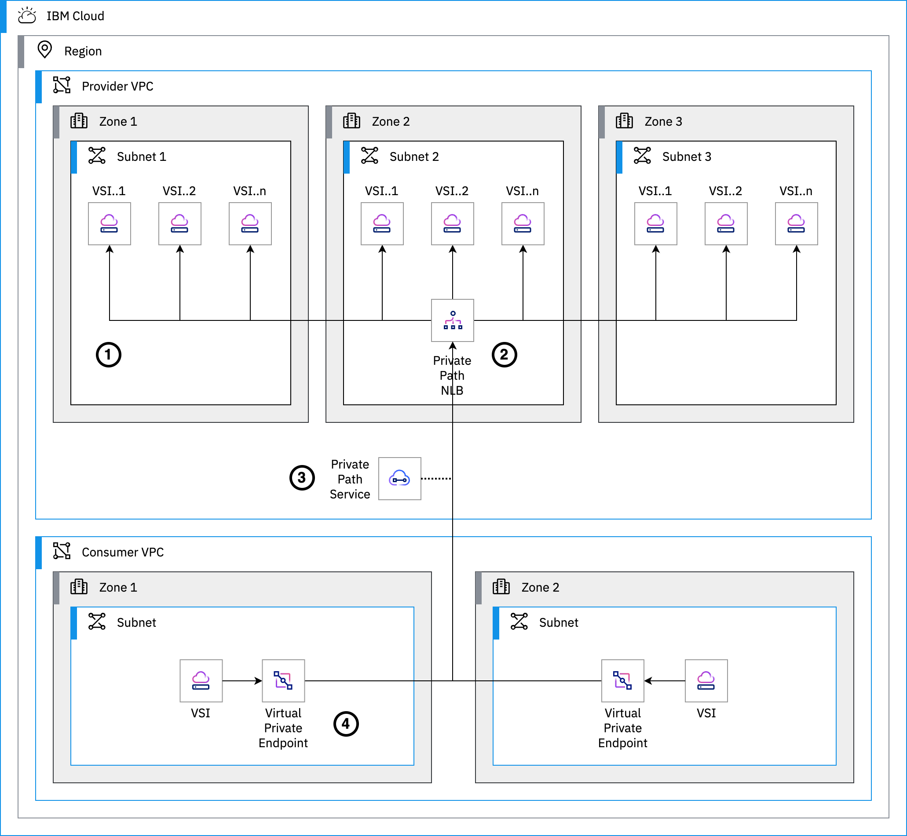

{{site.data.keyword.attribute-definition-list}}

# Expose services to consumers through private connectivity
{: #vpc-pps-basics}
{: toc-content-type="tutorial"}
{: toc-services="vpc"}
{: toc-completion-time="2h"}

<!--##istutorial#-->
This tutorial may incur costs. Use the [Cost Estimator](/estimator/review) to generate a cost estimate based on your projected usage.
{: tip}

<!--#/istutorial#-->

This tutorial is an introduction to Private Path Service.
{: shortdesc}

## Objectives
{: #vpc-pps-basics-objectives}

* Understand the basics of Private Path Service.
* Deploy an application in one account without exposing any private endpoints.
* Expose the application with Private Path service.
* Access the application from another account through private connectivity only.

{: caption="Figure 1. Architecture showing Private Path service" caption-side="bottom"}
{: style="text-align: center;"}

1. A provider implements a resilient application supported by multiple virtual servers spread in multiple zones.
1. The provider creates a Private Path Network Load Balancer (NLB) configured with backend pools pointing to the virtual servers.
1. A Private Path service references the Private Path NLB and is published so that it can be accessed by consumers.
1. Consumers access the provider application by going through virtual private endpoint gateways. All traffic remains private to {{site.data.keyword.cloud_notm}}.

## Before you begin
{: #vpc-pps-basics-prereqs}

This tutorial requires:
* An {{site.data.keyword.cloud_notm}} [billable account](/docs/account?topic=account-accounts),
* {{site.data.keyword.cloud_notm}} CLI,
   * {{site.data.keyword.vpc_short}} plugin (`vpc-infrastructure`),
   * {{site.data.keyword.containerfull_notm}} plugin (`container-service`),
   * {{site.data.keyword.registryshort_notm}} plugin (`container-registry`),
   * {{site.data.keyword.cos_full_notm}} plugin (`cloud-object-storage`),
   * `dev` plugin,
* a Docker engine,
* `kubectl` to interact with Kubernetes clusters,
* `oc` to interact with OpenShift,
* `helm` to deploy charts,
* `terraform` to use Infrastructure as Code to provision resources,
* `jq` to query JSON files,
* `git` to clone source code repository,
* a GitHub account,
* {{site.data.keyword.cloud_notm}} GitLab configured with your SSH key.

You will find instructions to download and install these tools for your operating environment in the [Getting started with solution tutorials](/docs/solution-tutorials?topic=solution-tutorials-tutorials) guide.

To avoid the installation of these tools you can use the [{{site.data.keyword.cloud-shell_short}}](/shell) from the {{site.data.keyword.cloud_notm}} console.
{: tip}

## Create the Provider resources and application
{: #vpc-pps-basics-provider-deploy}
{: step}

In this tutorial, you will first act as a Provider and implement an application. In a second phase, you will be in the role of the Consumer and call the application. For simplicity, the application is a simple `nginx` web server.

* In the Provider account
* Go to Schematics
* Point to the `provider` directory in the example repo
* Set variables, prefix for resources
* Deploy
* Set API key (optional)
the application you are going to share with 

## Review the Provider resources and application
{: #vpc-pps-basics-provider-review}
{: step}

* Check the resource group that was created
* See the nginx through floating IP (maybe make it an optional)
* Get the PPS CRN

## Create the Consumer resources
{: #vpc-pps-basics-consumer-deploy}
{: step}

Prereq: an SSH key to connect to the VSI we deploy

* In the Consumer account -- note that for testing purposes, it can be the same account
* Go to Schematics
* Point to the `consumer` directory in the example repo
* Set variables, prefix for resources, PPS CRN
* Deploy
* Set API key (optional)
the application you are going to share with 

## Review the Consumer resources and application
{: #vpc-pps-basics-consumer-review}
{: step}

- Show a diagram of the consumer resources
- Notice the VPE is waiting for approval

## Approve the Consumer request
{: #vpc-pps-basics-provider-approve}
{: step}

- In the Provider account, review the PPS request.
- Approve the Consumer
- In Consumer, the VPE turns active

## Test connectivity from consumer to provider
{: #vpc-pps-basics-test-connectivity}
{: step}

- In Consumer account, ssh to consumer vsi
- From VSI, `curl` the VPE address, it goes to the provider VSI

## Remove resources
{: #vpc-pps-basics-removeresources}
{: step}

- Go to Consumer account, use Schematics to delete resources and workspace.
- Go to Provider account, use Schematics to delete resources and workspace.

Depending on the resource it might not be deleted immediately, but retained (by default for 7 days). You can reclaim the resource by deleting it permanently or restore it within the retention period. See this document on how to [use resource reclamation](/docs/account?topic=account-resource-reclamation).
{: tip}

