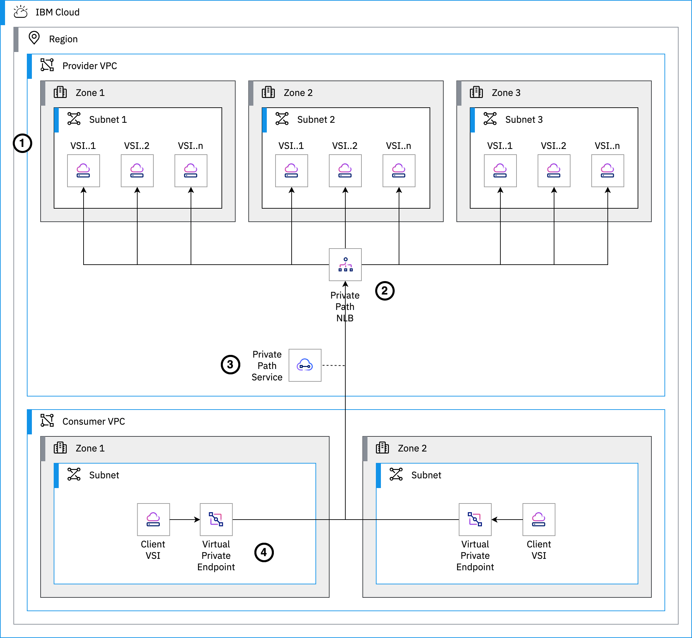
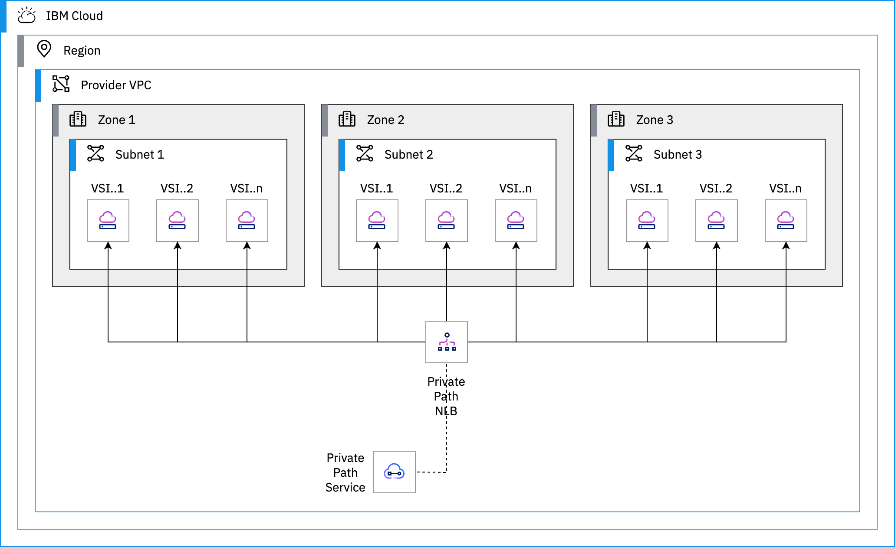
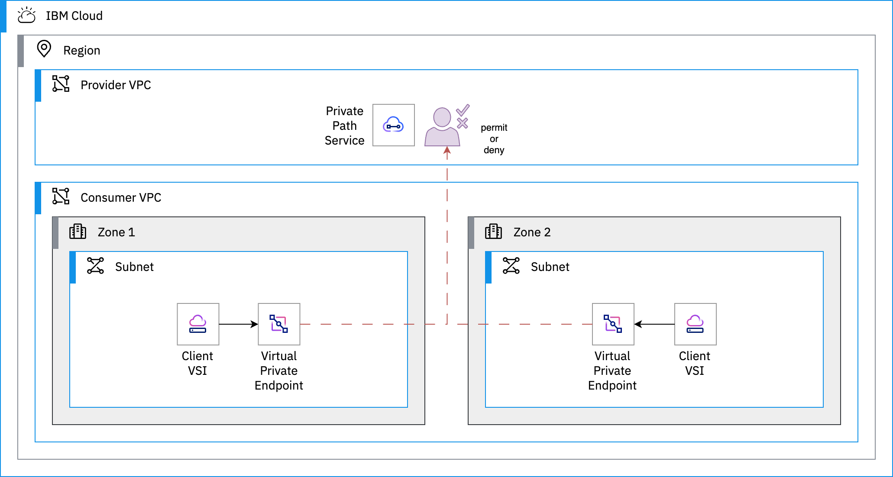

{{site.data.keyword.attribute-definition-list}}

# Expose services to consumers through private connectivity
{: #vpc-pps-basics}
{: toc-content-type="tutorial"}
{: toc-services="vpc"}
{: toc-completion-time="1h"}
{: toc-use-case="VirtualPrivateCloud, CloudNetworkSecurity, NetworkSecurity"}

The beta release of IBM Cloud Private Path services is only available to allowlisted users. Contact your IBM Support representative if you are interested in getting early access to this beta offering.
{: beta}

This tutorial may incur costs. Use the [Cost Estimator](/estimator) to generate a cost estimate based on your projected usage.
{: tip}


This tutorial walks you through the steps to set up a [{{site.data.keyword.pp_short}}](/docs/vpc?topic=vpc-private-path-service-intro) between a provider and a set of consumers. With {{site.data.keyword.pp_short}}, consumers access the application or service implemented by the provider through the IBM backbone without traversing the internet.
{: shortdesc}

## Objectives
{: #vpc-pps-basics-objectives}

* Understand the basics of {{site.data.keyword.pp_short}}.
* Deploy an application in one account without exposing any public endpoints.
* Expose the application with {{site.data.keyword.pp_short}}.
* Access the application from a consumer client through private connectivity only.

{: caption="Architecture showing {{site.data.keyword.pp_short}}" caption-side="bottom"}
{: style="text-align: center;"}

1. A provider implements a resilient application supported by multiple virtual servers spread across multiple zones.
1. The provider creates a {{site.data.keyword.ppnlb_full}} (NLB) configured with backend pools pointing to the virtual servers, distributing the load among the servers with the round-robin algorithm.
1. A {{site.data.keyword.pp_short}} references the {{site.data.keyword.ppnlb_short}} and specifies the service endpoint used by consumers.
1. Consumers access the provider application by going through virtual private endpoint gateways. All traffic remains private to {{site.data.keyword.cloud_notm}}.

## Before you begin
{: #vpc-pps-basics-prereqs}

This tutorial requires:
* One {{site.data.keyword.cloud_notm}} [billable account](/docs/account?topic=account-accounts) to host both the provider and the consumer resources.
* A VPC SSH key to connect to the virtual server instances provisioned in the tutorial.

### Create a VPC SSH key
{: #vpc-pps-basics-create-ssh-key}

When provisioning virtual server instances, an SSH key is injected into the instances so that you can later connect to the servers. This SSH key **must be in the same region** where you are going to deploy the tutorial resources.

1. If you don't have an SSH key configured in {{site.data.keyword.cloud_notm}}, refer to [these instructions](/docs/vpc?topic=vpc-ssh-keys) for creating a key for VPC.
1. Make note of the name you used for the SSH key.

## Create the provider resources and application
{: #vpc-pps-basics-provider-deploy}
{: step}

In this tutorial, you first act as a provider and implement an application. In a second phase, you take the role of the consumer and call the application. The application is a simple `nginx` web server.

1. Go to [{{site.data.keyword.bpshort}}](/schematics/workspaces/create?repository=https://github.com/IBM-Cloud/vpc-tutorials/tree/master/vpc-pps-basics/provider&terraform_version=terraform_v1.5) to create a new workspace.
1. In the **Specify template** step:
   1. Set the **repository URL** to `https://github.com/IBM-Cloud/vpc-tutorials/tree/master/vpc-pps-basics/provider`.
   1. Make sure to check **Use full repository**.
   1. Set the **Terraform version** to `terraform_v1.5`.
   1. Click **Next**.
1. In the **Workspace details** step:
   1. Set the **workspace name** to `pps-provider`.
   1. Select a **Resource group** and **Location** where to create the workspace. This won't affect the resources created for the tutorial.
   1. Click **Next**
1. Click **Create**.

In the workspace **Settings**, under **Variables**:
1. Locate the `existing_ssh_key_name` variable.
   1. Use the menu (︙) to **Edit** its value.
   1. Set the value to the name of the SSH key you created in the previous section or to an existing SSH key.
   1. **Save**.
1. Optionally, you can also adjust the values of other variables like `region`, `basename`.

Finally create the resources:
1. Click **Apply plan**.
1. Wait for {{site.data.keyword.bpshort}} to complete the provisioning of the resources.

## Review the provider resources and application
{: #vpc-pps-basics-provider-review}
{: step}

Running {{site.data.keyword.bpshort}} for the provider creates the following resources:
* one virtual private cloud (VPC),
* three subnets, one for each zone,
* a minimum of one virtual server instance in each subnet,
* a {{site.data.keyword.ppnlb_short}} configured with a backend pool including all the virtual server instances,
* and a {{site.data.keyword.pp_short}}.

{: caption="Architecture of the provider resources" caption-side="bottom"}
{: style="text-align: center;"}

1. Navigate to [Virtual Private Clouds](/vpc-ext/network/vpcs), [Subnets](/vpc-ext/network/subnets) and [Virtual server instances](/vpc-ext/compute/vs) to review the provisioned resources.
1. Find the {{site.data.keyword.ppnlb_short}} under [Load balancers](/vpc-ext/network/loadBalancers).
1. In [{{site.data.keyword.pp}} services](/vpc-ext/network/privatePathServices), select the created {{site.data.keyword.pp_short}}.
1. In the {{site.data.keyword.pp_short}} details, notice the **Service endpoint** set to `vpc-pps.example.com`. Note that it might be different if you specified a custom `basename` during the workspace configuration. This is the endpoint used by consumers to interact with your application.
1. Make note of the **CRN** as you need to pass this information to consumers. Consumers use the CRN to identify your application when creating virtual private endpoint gateways.

Your {{site.data.keyword.pp_short}} is almost ready to be shared with consumers. But before [publishing the {{site.data.keyword.pp_short}}](/docs/vpc?topic=vpc-pps-activating&interface=ui), it is recommended to test that it is working as expected.

## Create the consumer resources
{: #vpc-pps-basics-consumer-deploy}
{: step}

To verify that the {{site.data.keyword.pp_short}} is correctly set up, you are going to deploy virtual servers to access the application, just like any consumer of a {{site.data.keyword.pp_short}} would do.

Until a {{site.data.keyword.pp_short}} [gets published](/docs/vpc?topic=vpc-pps-activating), it can only be accessed within the same account where it is created. It offers a good opportunity to test the service before sharing it with others. This is the reason why, at this stage, the consumer side of this tutorial is provisioned in the same account as the provider application.

1. Go to [{{site.data.keyword.bpshort}}](/schematics/workspaces/create?repository=https://github.com/IBM-Cloud/vpc-tutorials/tree/master/vpc-pps-basics/consumer&terraform_version=terraform_v1.5) to create a new workspace.
1. In the **Specify template** step:
   1. Set the **repository URL** to `https://github.com/IBM-Cloud/vpc-tutorials/tree/master/vpc-pps-basics/consumer`.
   1. Make sure to check **Use full repository**.
   1. Set the **Terraform version** to `terraform_v1.5`.
   1. Click **Next**.
1. In the **Workspace details** step:
   1. Set the **workspace name** to `pps-consumer`.
   1. Select a **Resource group** and **Location** where to create the workspace. This won't affect the resources created for the tutorial.
   1. Click **Next**
1. Click **Create**.

In the workspace **Settings**, in the **Variables** section:
1. Locate the `existing_ssh_key_name` variable.
   1. Use the menu (︙) to **Edit** its value.
   1. Set the value to the name of the SSH key used for this tutorial.
   1. **Save**.
1. Locate the `provider_crn` variable
   1. **Edit** its value.
   1. Set the value to the {{site.data.keyword.pp_short}} CRN obtained earlier.
   1. **Save**.
1. Optionally, you can also adjust the values of other variables like `region`, `basename`. `region` should match the value set in the `pps-provider` workspace.

Finally create the resources:
1. Click **Apply plan**.
1. Wait for {{site.data.keyword.bpshort}} to complete the provisioning of the resources.

## Review the consumer resources and application
{: #vpc-pps-basics-consumer-review}
{: step}

Running {{site.data.keyword.bpshort}} for the consumer creates the following resources:
* one virtual private cloud (VPC),
* two subnets,
* one virtual server instance in each subnet,
* one virtual private endpoint gateway configured with the {{site.data.keyword.pp_short}} CRN and with one IP address in each subnet.

{: caption="Architecture of the consumer resources" caption-side="bottom"}
{: style="text-align: center;"}

1. Navigate to [Virtual server instances](/vpc-ext/compute/vs) to review the provisioned instances.
1. Go to [Virtual private endpoint gateways](/vpc-ext/network/endpointGateways) and notice that the endpoint gateway is marked as **Pending**.

At this stage, the consumer is not yet able to access the provider application. It's waiting on the connection request to the {{site.data.keyword.pp_short}} to be reviewed and permitted.

## Approve the consumer request
{: #vpc-pps-basics-provider-approve}
{: step}

Acting as the provider of the application,
1. Go to the [{{site.data.keyword.pp}} services list](/vpc-ext/network/privatePathServices).
1. Notice the {{site.data.keyword.pp_short}} you created has pending connection requests to be reviewed.
1. Select the {{site.data.keyword.pp_short}}.
1. In the **Connection requests** table, locate the request from the consumer.
1. Use the menu (︙) to **Permit** the connection.

   The *Permit connection request* dialog gives you an option to create [a policy to automatically permit all requests from the same account ID](/docs/vpc?topic=vpc-pps-about-account-policies). **Leave it unchecked for now**. In the future this can speed up the process of consumers requesting connections from this account.
   {: tip}

1. Click **Permit**.

## Test connectivity from consumer to provider
{: #vpc-pps-basics-test-connectivity}
{: step}

Acting as the consumer again,
1. Go to [Virtual private endpoint gateways](/vpc-ext/network/endpointGateways) and notice that the endpoint gateway has moved to **Stable**.
1. Make note of the **Service endpoint**. It should be `vpc-pps.example.com` unless you specified a custom `basename` during the workspace configuration.
1. Navigate to [Virtual server instances](/vpc-ext/compute/vs) and find the floating IP assigned to one of the consumer instances. The instances are named like `vpc-pps-consumer-vsi-us-south-1` or `vpc-pps-consumer-vsi-us-south-2`.
1. Open an SSH connection to one of the instance.
   ```sh
   ssh root@<floating-ip>
   ```
   {: pre}

1. Access the provider application by calling the service endpoint.
   ```sh
   curl http://vpc-pps.example.com
   ```
   {: pre}

   The output should look like:
   ```text
   Hello world from vpc-pps-provider-vsi-us-south-2
   ```
   {: screen}

   It may takes a few minutes for the domain name to resolve correctly to the virtual server instances.
   {: tip}

1. Repeat the `curl` command several times. Notice how it shows a different output as it goes through all the virtual server instances attached to the backend pool of the {{site.data.keyword.ppnlb_short}}.

Congratulations, your {{site.data.keyword.pp_short}} is working as expected and is ready to be published for others to consume.

## Expand the tutorial
{: #vpc-pps-basics-next}
{: step}

This tutorial focuses on the basics of {{site.data.keyword.pp_short}} with a provider application in one VPC and a consumer in another VPC, all within the same account:

- The next step is to [publish](/docs/vpc?topic=vpc-pps-activating&interface=ui) the {{site.data.keyword.pp_short}}. Once published, clients in other {{site.data.keyword.cloud_notm}} accounts can make a connection request to access the application.
-  [Communicating connection information to consumers](/docs/vpc?topic=vpc-pps-ui-communicate&interface=ui), [reviewing connection requests](/docs/vpc?topic=vpc-pps-ui-reviewing&interface=ui) and streamlining the process with [account policies](/docs/vpc?topic=vpc-pps-about-account-policies&interface=ui) are also part of the successful onboarding of consumers.

## Remove resources
{: #vpc-pps-basics-removeresources}
{: step}

To remove the resources created for this tutorial:
1. Go to {{site.data.keyword.bpshort}}
   1. Select the `pps-consumer` workspace.
   1. From the **Actions...**, select **Destroy resources**.
   1. Type `pps-consumer` and click **Destroy**.
   1. Wait for {{site.data.keyword.bpshort}} to complete the job.
   1. Once completed, select **Delete workspace** from the **Actions...** menu.
   1. Type `pps-consumer` and click **Delete**.
1. Repeat the same steps with the `pps-provider` workspace.

   You may need to retry the **Destroy resources** after a few minutes if the workspace deletion failed because the resource group could not be deleted.
   {: tip}

Depending on the resource it might not be deleted immediately, but retained (by default for 7 days). You can reclaim the resource by deleting it permanently or restore it within the retention period. See this document on how to [use resource reclamation](/docs/account?topic=account-resource-reclamation).
{: tip}
