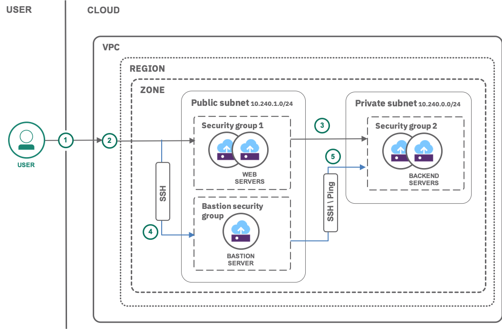

{:java: #java .ph data-hd-programlang='java'}
{:swift: #swift .ph data-hd-programlang='swift'}
{:ios: #ios data-hd-operatingsystem="ios"}
{:android: #android data-hd-operatingsystem="android"}
{:shortdesc: .shortdesc}
{:new_window: target="_blank"}
{:codeblock: .codeblock}
{:screen: .screen}
{:tip: .tip}
{:pre: .pre}
{:important: .important}
{:note: .note}

# Public frontend and private backend in a Virtual Private Cloud
{: #vpc-public-app-private-backend}

This tutorial walks you through creating your own {{site.data.keyword.vpc_full}} (VPC) with multiple subnets and a virtual server instance (VSI) in each subnet. A VPC is your own, private cloud on shared cloud infrastructure with logical isolation from other virtual networks.

A subnet is an IP address range. It is bound to a single zone and cannot span multiple zones or regions. For the purposes of VPC, the important characteristic of a subnet is the fact that subnets can be isolated from one another, as well as being interconnected in the usual way. Subnet isolation can be accomplished by Security Groups that act as firewalls to control inbound and outbound traffic for one or more virtual server instances.

A good practice is to have a subnet used for resources that must be exposed to the outside world. Resources with restricted access that should never be directly accessed from the outside world are placed within a different subnet. Instances on such a subnet could be your backend database or some secret store that you do not want to be publicly accessible. You will define Security Groups to allow or deny traffic to the VSIs.
{:shortdesc}

In short, using VPC you can:
- create a software-defined network (SDN),
- isolate workloads,
- have fine control of inbound and outbound traffic.

## Objectives
{: #objectives}

- Understand the infrastructure objects available for virtual private clouds
- Learn how to create a virtual private cloud, subnets and server instances
- Know how to apply security groups to secure access to the servers

## Services used
{: #services}

This tutorial uses the following runtimes and services:
- [{{site.data.keyword.vpc_full}}](https://{DomainName}/vpc/provision/vpc)
- [{{site.data.keyword.vsi_is_full}}](https://{DomainName}/vpc/provision/vs)

This tutorial may incur costs. Use the [Pricing Calculator](https://{DomainName}/estimator/review) to generate a cost estimate based on your projected usage.

## Architecture
{: #architecture}



1. The admin (DevOps) sets up the required infrastructure (VPC, subnets, security groups with rules, VSIs) on the cloud.
2. The internet user makes an HTTP/HTTPS request to the web server on the frontend.
3. The frontend requests private resources from the secured backend and serves results to the user.

## Before you begin
{: #prereqs}

- Check for user permissions. Be sure that your user account has sufficient permissions to create and manage VPC resources. See the list of required permissions for [VPC for Gen 1](/docs/vpc-on-classic?topic=vpc-on-classic-managing-user-permissions-for-vpc-resources) or for [VPC for Gen 2](https://{DomainName}/docs/vpc?topic=vpc-managing-user-permissions-for-vpc-resources).
- You need an SSH key to connect to the virtual servers. If you don't have an SSH key, see the instructions for creating a key for [VPC for Gen 1](/docs/vpc-on-classic?topic=vpc-on-classic-getting-started#prerequisites) or for [VPC for Gen 2](/docs/vpc?topic=vpc-ssh-keys). 

## Create a Virtual Private Cloud
{: #create-vpc}

To tighten the security of your servers, it is recommended to only allow connections to the ports required by the applications deployed on the servers. In this tutorial, the application will be a web server, thus it will only need to allow inbound connections on port 80.

To perform maintenance tasks on these servers such as installing software, performing operating system upgrades, you will go through a bastion host. A bastion host is an instance that is provisioned with a public IP address and can be accessed via SSH. Once set up, the bastion host acts as a jump server allowing a secure connection to instances provisioned in the VPC.

In this section, you will create the VPC and the bastion host.

This tutorial also comes with companion shell scripts and a Terraform template, that can be used to generate the resources that you will create using the UI below. They are available [in this Github repository](https://github.com/IBM-Cloud/vpc-tutorials/tree/master/vpc-public-app-private-backend).
{:note}

1. Navigate to the **VPC overview** ([Gen 1](https://{DomainName}/vpc/overview) / [Gen 2](https://{DomainName}/vpc-ext/overview)) page and click on **Create a VPC**.
1. Under **New virtual private cloud** section:
   * Enter **vpc-pubpriv** as name for your VPC.
   * Select a **Resource group**.
   * Optionally, add **Tags** to organize your resources.
1. Uncheck SSH and ping from the **Default security group**.  SSH access will later be added to the maintenance security group.  The maintenance security group must be added to an instance to allow SSH access from the bastion server.  Ping access is not required for this tutorial.
1. You will create your first subnet, under **New subnet for VPC**:
   * As a unique name enter **vpc-secure-bastion-subnet**.
   * Select a location.
   * Enter the IP range for the subnet in CIDR notation, i.e., **10.xxx.0.0/24**. Leave the **Address prefix** as it is and select the **Number of addresses** as 256.

   If you are using VPC with Gen 1 compute, select **Use VPC default** for your subnet access control list (ACL).
   {:note}
1. Leave the **Public gateway** to **Detached**. Enabling the public gateway would enable public Internet access from all virtual server instances in that subnet. In this tutorial, the servers do not require such connectivity.
1. Click **Create virtual private cloud**.

To confirm the creation of the subnet, go to the **Subnets** ([Gen 1](https://{DomainName}/vpc/network/subnets) / [Gen 2](https://{DomainName}/vpc-ext/network/subnets)) page and wait until the status changes to **Available**.

### Create and configure bastion security group

Follow the steps described in [this section of the bastion tutorial](/docs/tutorials?topic=solution-tutorials-vpc-secure-management-bastion-server#create-configure-security-group) to create a security group and configure inbound rules for the bastion virtual server instance.

### Create a bastion instance

Follow the steps described in [this section of the bastion tutorial](/docs/tutorials?topic=solution-tutorials-vpc-secure-management-bastion-server#create-bastion-instance) to create the bastion virtual server instance.

### Configure a security group with maintenance access rules

Follow the steps described in [this section of the bastion tutorial](/docs/tutorials?topic=solution-tutorials-vpc-secure-management-bastion-server#maintenance-security-group) to create the security group **vpc-secure-maintenance-sg**. This security group will be used when performing maintenance tasks on virtual server instances, such as installing software or updating the operating system.

## Create a backend subnet, security group and VSI
{: #backend-subnet-vsi}

In this section, you will create a subnet, a security group and a virtual server instance for the backend.

### Create a subnet for the backend

To create a new subnet for the backend,

1. Select [**Subnets**](https://{DomainName}/vpc/network/subnets) under **Network** and click **New subnet**.
   * Enter **vpc-pubpriv-backend-subnet** as name, then select the VPC you created.
   * Select a location.
   * Enter the IP range for the subnet in CIDR notation, i.e., **10.xxx.1.0/24**. Leave the **Address prefix** as it is and select the **Number of addresses** as 256.
   
   If you are using VPC with Gen 1 compute, select **VPC default** for your subnet access control list (ACL).
   {:note}

1. Click **Create subnet** to provision it.

### Create a backend security group

The backend security group controls the inbound and outbound connections for the backend servers.

To create a new security group for the backend:
1. Select [**Security groups**](https://{DomainName}/vpc/network/securityGroups) under **Network**, then click **New security group**.
2. Enter **vpc-pubpriv-backend-sg** as name and select the VPC you created earlier.
3. Click **Create security group**.

You will later edit the security group to add the inbound and outbound rules.

### Create a backend virtual server instance

To create a virtual server instance in the newly created subnet:

1. Click on the backend subnet under [**Subnets**](https://{DomainName}/vpc/network/subnets).
2. Click **Attached resources**, then **New instance**.
1. To configure the instance:
   1. Set the **name** to **vpc-pubpriv-backend-vsi**.
   1. Select the VPC you created and resource group as earlier.
   1. Select the same **Location** as before.
   1. Select **Compute** with 2vCPUs and 4 GB RAM as your profile. To check available profiles, click **All profiles**.
   1. Set **SSH keys** to the the SSH key you created earlier.
   1. Set **User data** to
      ```sh
      #!/bin/bash
      apt-get update
      apt-get install -y nginx
      echo "I'm the backend server" > /var/www/html/index.html
      service nginx start
      ```
      {:pre}
      This will install a simple web server into the instance.
   1. Set the **image** to **Ubuntu Linux**.  You can pick any version of the image.
6. Under **Network interfaces**, click on the **Edit** icon next to the Security Groups
   * Select **vpc-pubpriv-backend-subnet** as the subnet.
   * Uncheck the default security group and check **vpc-pubpriv-backend-sg** and **vpc-secure-maintenance-sg**.
   * Click **Save**.
7. Click **Create virtual server instance**.

## Create a frontend subnet, security group and VSI
{: #frontend-subnet-vsi}

Similar to the backend, you will create a frontend subnet with virtual server instance and a security group.

### Create a subnet for the frontend

To create a new subnet for the frontend,

1. Select [**Subnets**](https://{DomainName}/vpc/network/subnets) under **Network** and click **New subnet**.
   * Enter **vpc-pubpriv-frontend-subnet** as name, then select the VPC you created.
   * Select a location.
   * Enter the IP range for the subnet in CIDR notation, i.e., **10.xxx.2.0/24**. Leave the **Address prefix** as it is and select the **Number of addresses** as 256.

   If you are using VPC with Gen 1 compute, select **VPC default** for your subnet access control list (ACL). You can configure the inbound and outbound rules later.
   {:note}

1. Given all virtual server instances in the frontend subnet will have a floating IP attached, it is not required to enable a public gateway for the subnet. The virtual server instances will have Internet connectivity through their floating IP.
1. Click **Create subnet** to provision it.

### Create a frontend security group

To create a new security group for the frontend:
1. Click **Security groups** under Network, then **New security group**.
2. Enter **vpc-pubpriv-frontend-sg** as name and select the VPC you created earlier.
3. Click **Create security group**.

### Create a frontend virtual server instance

To create a virtual server instance in the newly created subnet:

1. Click on the frontend subnet under [**Subnets**](https://{DomainName}/vpc/network/subnets).
2. Click **Attached resources**, then **New instance**.
1. To configure the instance:
   1. Set the **name** to **vpc-pubpriv-frontend-vsi**.
   1. Select the VPC you created and resource group as earlier.
   1. Select the same **Location** as before.
   1. Select **Compute** with 2vCPUs and 4 GB RAM as your profile. To check other available profiles, click **All profiles**
   1. Set **SSH keys** to the the SSH key you created earlier.
   1. Set **User data** to
      ```sh
      #!/bin/bash
      apt-get update
      apt-get install -y nginx
      echo "I'm the frontend server" > /var/www/html/index.html
      service nginx start
      ```
      {:pre}
      This will install a simple web server into the instance.
   1. Set the **image** to **Ubuntu Linux**.  You can pick any version of the image.
6. Under **Network interfaces**, click on the **Edit** icon next to the Security Groups
   * Select **vpc-pubpriv-frontend-subnet** as the subnet.
   * Uncheck the default security and group and activate **vpc-pubpriv-frontend-sg** and **vpc-secure-maintenance-sg**.
   * Click **Save**.
   * Click **Create virtual server instance**.
7. Select the frontend VSI **vpc-pubpriv-frontend-vsi**, scroll to **Network Interfaces** and click **Reserve** under **Floating IP** to associate a public IP address to your frontend VSI. Save the associated IP Address to a clipboard for future reference.

## Set up connectivity between frontend and backend
{: #setup-connectivity-frontend-backend}

With all servers running, in this section you will set up the connectivity to allow regular operations between the frontend and backend servers.

### Configure the frontend security group

The frontend instance has its software installed but it can not yet be reached.

1. To confirm the web server can not yet be accessed, open a web browser pointing to `http://<floating-ip-address-of-the-frontend-vsi>` or use:
   ```sh
   curl -v -m 30 http://<floating-ip-address-of-the-frontend-vsi>
   ```
   {:pre}
   The connection should time out eventually.
1. To enable inbound connection to the web server installed on the frontend instance, you need to open the port where the web server is listening on.
1. Navigate to **Security groups** in the **Network** section, then click on **vpc-pubpriv-frontend-sg**.
2. First, add the following **inbound** rules using **Add rule**. They allow incoming HTTP requests and Ping (ICMP).

	<table>
   <thead>
      <tr>
         <td><strong>Protocol</strong></td>
         <td><strong>Source type</strong></td>
         <td><strong>Source</strong></td>
         <td><strong>Value</strong></td>
         <td><strong>Description</strong></td>
      </tr>
   </thead>
   <tbody>
      <tr>
         <td>TCP</td>
         <td>Any</td>
         <td>0.0.0.0/0</td>
         <td>Ports 80-80</td>
         <td>This rule allows connections from any IP address to the frontend web server.</td>
      </tr>
      <tr>
         <td>ICMP</td>
         <td>Any</td>
         <td>0.0.0.0/0</td>
         <td>Type: <strong>8</strong>,Code: <strong>Leave empty</strong></td>
         <td>This rule allows the frontend server to be pinged by any host.</td>
      </tr>
   </tbody>
   </table>

3. Next, add this **outbound** rule.

   <table>
   <thead>
      <tr>
         <td><strong>Protocol</strong></td>
         <td><strong>Destination type</strong></td>
         <td><strong>Destination</strong></td>
         <td><strong>Value</strong></td>
         <td><strong>Description</strong></td>
      </tr>
   </thead>
   <tbody>
      <tr>
         <td>TCP</td>
         <td>Security Group</td>
         <td>vpc-pubpriv-backend-sg</td>
         <td>Ports 80-80</td>
         <td>This rule allows the frontend server to communicate with the backend server.</td>
      </tr>
   </tbody>
   </table>

   The port of the backend depends on the software you are installing on the virtual server. This tutorial uses a web server listening on port 80.
1. Access the frontend instance again at `http://<floating-ip-address-of-the-frontend-vsi>` to view the welcome page of the web server.

### Test the connectivity between the frontend and the backend

The backend server is running the same web server software as the frontend server. It could be considered as a microservice exposing an HTTP interface that the frontend would be calling. In this section, you will attempt to connect to the backend from the frontend server instance.

1. In the **Virtual Server Instances** list ([Gen 1](https://{DomainName}/vpc/compute/vs) / [Gen 2](https://{DomainName}/vpc-ext/compute/vs)), retrieve the floating IP address of the bastion server host (**vpc-secure-bastion**) and the private IP addresses of the frontend (**vpc-pubpriv-frontend-vsi**) and backend (**vpc-pubpriv-backend-vsi**) server instances.
1. Use `ssh` to connect to the frontend virtual server:
   ```sh
   ssh -J root@<floating-ip-address-of-the-bastion-vsi> root@<private-ip-address-of-the-frontend-vsi>
   ```
   {:pre}

   SSH to the frontend is only be possible through the bastion and only when the **vpc-secure-maintenance-sg** has been attached to the frontend instance.
   {:note}

1. Call the backend web server:
   ```sh
   curl -v -m 30 http://<private-ip-address-of-the-backend-vsi>
   ```
   After 30 seconds, the call should timeout. Indeed, the security group for the backend server has not yet been configured and is not allowing any inbound connection.

### Configure the backend security group

To allow inbound connections to the backend server, you need to configure the associated security group.

1. Navigate to **Security groups** in the **Network** section, then click on **vpc-pubpriv-backend-sg**.
2. Add the following **inbound** rule using **Add rule**.

   <table>
   <thead>
      <tr>
         <td><strong>Protocol</strong></td>
         <td><strong>Source type</strong></td>
         <td><strong>Source</strong></td>
         <td><strong>Value</strong></td>
         <td><strong>Description</strong></td>
      </tr>
   </thead>
   <tbody>
      <tr>
         <td>TCP</td>
         <td>Security group</td>
         <td>vpc-pubpriv-frontend-sg</td>
         <td>Ports 80-80</td>
         <td>This rule allows incoming connections on port 80 from the frontend server to the backend server.</td>
      </tr>
   </tbody>
   </table>

### Confirm the connectivity

1. Call the backend web server from the frontend server again:
   ```sh
   curl -v -m 30 http://<private-ip-address-of-the-backend-vsi>
   ```
1. The request returns quickly and outputs the message `I'm the backend server` from the backend web server. This completes the configuration of the connectivity between the servers.

### Complete the maintenance

With the frontend and backend server software properly installed and working, the servers can be removed from the maintenance security group.

1. Navigate to **Security groups** in the **Network** section, then click on **vpc-secure-maintenance-sg**.
1. Select **Attached interfaces**.
1. **Edit interfaces** and uncheck the **vpc-pubpriv-frontend-vsi** and **vpc-pubpriv-backend-vsi** interfaces.
1. **Save** the configuration.
1. Access the frontend instance again at `http://<floating-ip-address-of-the-frontend-vsi>` to confirm it is still working as expected.

Once the servers are removed from the maintenance group, they can no longer be accessed with `ssh`. They will only allow  traffic to their web servers.

In this tutorial, you deployed two tiers of an application, one frontend server visible from the public Internet and one backend server only accessible within the VPC by the frontend server. You configured security group rules to ensure traffic would be allowed only the specific ports required by the application.

## Remove resources
{: #remove-resources}

1. In the VPC management console, click on **Floating IPs**, then on the IP address for your VSIs, then in the action menu select **Release**. Confirm that you want to release the IP address.
2. Next, switch to **Virtual server instances**, **Stop** and **Delete** your instances.
3. Once the VSIs are gone, switch to **Subnets**. If the subnet has an attached public gateway, then click on the subnet name. In the subnet details, detach the public gateway. Subnets without public gateway can be deleted from the overview page. Delete your subnets.
4. After the subnets have been deleted, switch to **VPC** tab and delete your VPC.

When using the console, you may need to refresh your browser to see updated status information after deleting a resource.
{:tip}
