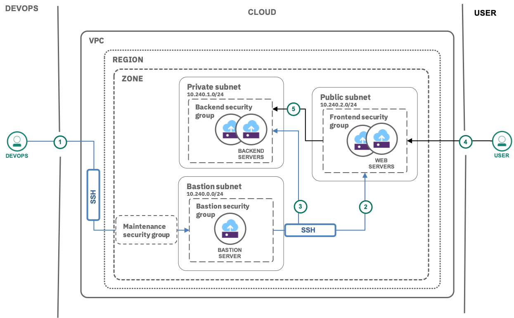

---
copyright:
  years: 2019
lastupdated: "2019-01-21"


---

{:java: #java .ph data-hd-programlang='java'}
{:swift: #swift .ph data-hd-programlang='swift'}
{:ios: #ios data-hd-operatingsystem="ios"}
{:android: #android data-hd-operatingsystem="android"}
{:shortdesc: .shortdesc}
{:new_window: target="_blank"}
{:codeblock: .codeblock}
{:screen: .screen}
{:tip: .tip}
{:pre: .pre}

# Private and public subnets in a Virtual Private Cloud

This tutorial walks you through creating your own {{site.data.keyword.vpc_full}} (VPC) with a public and a private subnet and a virtual server instance (VSI) in each subnet. The public subnet is used for resources that must be exposed to the outside world. Resources with restricted access that should never be directly accessed from the outside world are placed within the private subnet. Instances on such a subnet could be your backend database or some secret store that you do not want to be publicly accessible. You will also define Access Control Lists (ACLs) with inbound and outbound rules for subnet isolation. Moreover, you create Security Groups (SGs) to allow or deny traffic to the VSIs.

A VPC is your own, private cloud on shared cloud infrastructure with a logical isolation from other virtual networks.

A [subnet](https://{DomainName}/docs/infrastructure/vpc/vpc-glossary.html#subnet) is an IP address range. It is bound to a single zone and cannot span multiple zones or regions. For the purposes of VPC, the important characteristic for a subnet is the fact that subnets can be isolated from one another, as well as being interconnected in the usual way. Subnet isolation can be accomplished by Network [Access Control Lists](https://{DomainName}/docs/infrastructure/vpc/vpc-glossary.html#access-control-list) (ACLs) that act as firewalls to control the flow of data packets among subnets. Similarly, security groups act as virtual firewalls to control the flow of data packets to and from individual VSIs.
{:shortdesc}

In short, using VPC you can define a
- software defined network
- isolate workloads
- fine control of inbound/outbound traffic

## Objectives

{: #objectives}

- Create a public subnet for frontend servers
- Create a private subnet for backend servers
- Create a virtual server instance in each subnet
- Configure network rules through security groups
- Reserve a floating IP to allow inbound and outbound internet traffic

## Services used

{: #services}

This tutorial uses the following runtimes and services:

- [{{site.data.keyword.vpc_full}}](https://{DomainName}/vpc/provision/vpc)
- [{{site.data.keyword.vsi_is_full}}](https://{DomainName}/vpc/provision/vs)

This tutorial may incur costs. Use the [Pricing Calculator](https://{DomainName}/pricing/) to generate a cost estimate based on your projected usage.

## Architecture
{: #architecture}



1. The user accesses the frontend within a VPC.  
2. Creates a frontend (public) subnet and a backend (private) subnet.  
3. Creates respective virtual server instances (VSIs).    
4. Creates individual security groups(SGs)to limit the VSIs inbound and outbound traffic.  
5. Configures a security group to define the inbound and outbound traffic that's allowed for the instance.  
6. Reserves and associates a floating IP address to enable your instance to communicate with the internet. 

## Before you begin

{: #prereqs}

Check for user permissions. Be sure that your user has sufficient permissions to create and manage resources in your VPC. For a list of required permissions, see [Granting permissions needed for VPC users](https://{DomainName}/docs/infrastructure/vpc/vpc-user-permissions.html).

## Create SSH key
{: #create-ssh-key}

Check for an existing SSH key if there's none, create a new SSH key.

1. Open a Terminal and run this command to check if there are any existing SSH key

   ```sh
   ls -al ~/.ssh
   ```
   {:pre: .pre}
   
   Look for a file called `id_rsa.pub`.
2. Alternatively, You can check under an `.ssh` directory under your home directory, for example, `/Users/<USERNAME>/.ssh/id_rsa.pub`. The file starts with `ssh-rsa` and ends with your email address
3. If you do not have a public SSH key or if you forgot the password of an existing one, generate a new one by running the `ssh-keygen` command and following the prompts. For example, you can generate an SSH key on your Linux server by running the command

     ```sh
       ssh-keygen -t rsa -C "user_ID"
     ```
     {:pre: .pre}

     You can find your `user_ID` under your [user preferences](https://{DomainName}/user). This command generates two files ie., a public key and a private key. The generated public key is in the `<YOUR_KEY>.pub` file.


## Create a Virtual Private Cloud
{: #create-vpc}

To create your own {{site.data.keyword.vpc_short}},

1. Navigate to [VPC overview](https://{DomainName}/vpc/overview) page and click on **Create a VPC**.
2. Under **New virtual private cloud** section,  
   a. Enter **vpc-pubpriv** as name for your VPC.  
   b. Select a **Resource group**.  
   c. Optionally, add **Tags** to organize your resources.  
3. Select **Create new default (Allow all)** as your VPC default access control list (ACL). Leave the settings for **Default security group** as is.
4. Under **New subnet for VPC**,  
   a. As a unique name enter **vpc-pubpriv-backend-subnet**.  
   b. Select a Location.  
   c. Enter an IP range for the subnet in CIDR notation, i.e., **10.240.0.0/24**. Leave the **Address prefix** as it is and select the **Number of addresses** as 256.
5. Select **Use VPC default** for your subnet access control list(ACL). You can configure the Inbound and outbound rules later.
6. Switch the Public gateway to **Attached** as attaching a public gateway will allow all attached resources to communicate with the public Internet. You can also attach the public gateway after you create the subnet.
7. Click **Create virtual private cloud** to provision the instance.

To confirm creation of subnet, click on **Subnets** and wait until the Status changes to **Available**. You can create a new subnet under the **Subnets** tab.

## Create a backend subnet and VSI
{: #backend-subnet-vsi}

In this section, you will create a backend subnet with virtual server instance and define the rules for network access.

### Create a subnet for the backend

You will use the Subnet created with the VPC as the subnet for the backend.

### Create a backend virtual server instance

To create a virtual server instance in the newly created subnet:

1. Click on the backend subnet under **Subnets**.
2. Click **Attached instances** > New instance
3. Enter a unique name and pick **vpc-pubpriv-backend-vsi**. Then, select the VPC your created earlier and **Dallas** as your location.
4. Choose the **Ubuntu Linux** image, click **All profiles** and under **Balanced**, choose **b-2x8** with 2vCPUs and 8 GM RAM.
5. To create a new SSH key, click **New key**  
   a. Enter **vpc-ssh-key** as key name.  
   b. Select **Dallas** region.  
   c. Copy the contents of  `<your key>.pub` and paste under Public key.  
   d. Click **Add SSH key**.
6. Leave the other options as it is and click **Create virtual server instance**.

Wait for the status to change to **Powered On**.

## Create a frontend subnet and VSI
{: #frontend-subnet-vsi}

In this section, you will create a frontend subnet with virtual server instance and define the rules for network access.

### Create a subnet for the frontend

To create a new subnet for the frontend,

1. Click **VPC and subnets** under Network on the left pane
2. Click **Subnets** > New subnet  
   a. Enter **vpc-pubpriv-frontend-subnet** as name, then select the VPC you created.  
   b. Select a location.  
   c. Enter an IP range for the subnet in CIDR notation, say  `10.240.1.0/24`. Leave the **Address prefix** as it is and select the **Number of addresses** as 256.
3. Select **VPC default** for your subnet access control list(ACL). You can configure the Inbound and outbound rules later.
4. Similar as for the backend, switch the Public gateway to **Attached**. 
5. Click **Create subnet** to provision.

### Create a frontend virtual server instance

To create a virtual server instance in the newly created subnet:

1. Click on the frontend subnet under **Subnets**.
2. Click **Attached instances** > New instance
3. Enter a unique name, **vpc-pubpriv-frontend-vsi**, select the VPC your created earlier, pick **Dallas** as your location.
4. Select **Ubuntu Linux** image > Click **All profiles** and under Balanced, choose b-2x8 with 2vCPUs and 8 GM RAM
5. Select the SSH key you created earlier.
6. Leave the other options as it is and click **Create virtual server instance**.

Wait for the status to change to **Powered On**. Configure network rules for the backend VSI.

## Create and configure Security Groups
{: #create-configure-sgs}

ACLs provides security at the subnet level and Security Groups provides security at the instance level. Let's create and configure inbound and outbound traffic to your instances.

By default, a security group is created along with your VPC allowing all SSH (TCP port 22) and Ping (ICMP type 8) traffic to the attached instances. 


### Create backend and frontend security groups

To create a new security group,  
1. Click **Security groups** under Network, then **New security group**.  
2. Enter **vpc-pubpriv-backend-sg** as name and select the VPC you created earlier.  
3. Under Edit interfaces for VPC, expand **vpc-pubpriv-backend-vsi** and check the `eth0` checkbox of backend subnet.  
4. Click **Create security group**.  
5. Repeat the above steps by clicking **New security group** to create **vpc-pubpriv-frontend-sg**, edit the interface to attach **vpc-pubpriv-frontend-vsi** and check `eth1` checkbox.

### Configure network rules for the backend VSI

To configure network rules for the backend virtual server instance,
  
1. Select **vpc-pubpriv-backend-sg** from the list of security groups.
2. Define the **Inbound** rule by clicking **Add rule**.

   <table>
   <thead>
      <tr>
         <td><strong>Source</strong></td>
         <td><strong>Protocol</strong></td>
         <td><strong>Value</strong></td>
      </tr>
   <tbody>
      <tr>
         <td>Type: <strong>Security Group</strong> - Name: <strong>vpc-pubpriv-frontend-sg</strong></td>
         <td>TCP</td>
         <td>Port of the backend server<br> e.g., 3306 for MySQL server</td>
      </tr>
   </tbody>
</table>

3. Now, define these **Outbound rules** by clicking **Add rule** for each row.
   <table>
   <thead>
      <tr>
         <td><strong>Destination</strong></td>
         <td><strong>Protocol</strong></td>
         <td><strong>Value</strong> </td>
      </tr>
   </thead>
   <tbody>
      <tr>
         <td>Any - 0.0.0.0/0 </td>
         <td>TCP</td>
         <td>From: <strong>80</strong> To <strong>80</strong></td>
      </tr>
      <tr>
         <td>Any - 0.0.0.0/0</td>
         <td>TCP</td>
         <td>From: <strong>443</strong> To <strong>443</strong></td>
      </tr>
   </tbody>
</table>

This will apply the network rules to the backend virtual server instance. Click **All Security groups for VPC** breadcrumb on the top to navigate to the list of security groups.

### Configure network rules for the frontend VSI

To configure network rules for the frontend virtual server instance, follow similar steps as for the backend rules:

1. Select **vpc-pubpriv-frontend-sg** from the list of security groups.
2. Define these **Inbound** rules by clicking **Add rule** for each row.

   <table>
   <thead>
      <tr>
         <td><strong>Source</strong></td>
         <td><strong>Protocol</strong></td>
         <td><strong>Value</strong></td>
      </tr>
   <tbody>
      <tr>
         <td>Any - 0.0.0.0/0</td>
         <td>TCP</td>
         <td>From: <strong>80</strong> To <strong>80</strong></td>
      </tr>
      <tr>
         <td>Any - 0.0.0.0/0</td>
         <td>TCP</td>
         <td>From: <strong>443</strong> To <strong>443</strong></td>
      </tr>
      <tr>
         <td>IP address range of home network.<br>Run <strong>curl ipecho.net/plain ; echo</strong></td>
         <td>TCP</td>
         <td>From: <strong>22</strong> To <strong>22</strong></td>
      </tr>
      <tr>
         <td>IP address range of home network</td>
         <td>TCP</td>
         <td>Type: <strong>8</strong>,Code <strong>Any</strong></td>
      </tr>
   </tbody>
</table>

3. In the **Outbound rules** section, define these rules by clicking **Add rule** for each row.
   
   <table>
   <thead>
      <tr>
         <td><strong>Destination</strong></td>
         <td><strong>Protocol</strong></td>
         <td><strong>Value</strong> </td>
      </tr>
   </thead>
   <tbody>
     <tr>
         <td>Type: <strong>Security Group</strong> - Name: <strong>vpc-pubpriv-backend-sg</strong></td>
         <td>TCP</td>
         <td>Port of the backend server <br>e.g., 3306 for MySQL server</td>
      </tr>
      <tr>
         <td>Any - 0.0.0.0/0 </td>
         <td>TCP</td>
         <td>From: <strong>80</strong> To <strong>80</strong></td>
      </tr>
      <tr>
         <td>Any - 0.0.0.0/0</td>
         <td>TCP</td>
         <td>From: <strong>443</strong> To <strong>443</strong></td>
      </tr>
   </tbody>
</table>

This will apply the network rules to the frontend virtual server instance. 

## Assign a floating IP and connect to your frontend instance
{: #floatingip-connect-to-instance}

In this section, you will reserve a floating IP address to your frontend (public) VSI, ping to confirm the assignment and SSH into the instance. 

Floating IP is a method to provide inbound and outbound access to the internet for VPC resources such as instances, a load balancer, or a VPN tunnel, using assigned Floating IP addresses from a pool.

1. Under **Virtual server instances**, select the frontend VSI (vpc-pubpriv-frontend-vsi).
2. Scroll to **Network Interfaces** section and click **Reserve** under Floating IP to associate an public IP address to your frontend VSI. Save the associated IP Address to clipboard for future reference.
3. Ping the server by opening the terminal and running the below command by replacing `<FLOATING_IP_ADDRESS>` with your IP address

 ```sh
  ping <FLOATING_IP_ADDRESS>
 ```
 {:pre: .pre}
 
 If your ping is successful, you should see a response similar to the following,
 
	```
	PING 169.61.xxx.xx (169.61.xxx.xxxxx.xx): 56 data bytes
	64 bytes from 169.61.xxx.xx: icmp_seq=0 ttl=43 time=245.754 ms
	64 bytes from 169.61.xxx.xx: icmp_seq=1 ttl=43 time=245.567 ms
	64 bytes from 169.61.xxx.xx: icmp_seq=2 ttl=43 time=245.560 ms
	64 bytes from 169.61.xxx.xx: icmp_seq=3 ttl=43 time=245.502 ms
	64 bytes from 169.61.xxx.xx: icmp_seq=4 ttl=43 time=245.436 ms
	64 bytes from 169.61.xxx.xx: icmp_seq=5 ttl=43 time=245.533 ms
	64 bytes from 169.61.xxx.xx: icmp_seq=6 ttl=43 time=245.469 ms
	64 bytes from 169.61.xxx.xx: icmp_seq=7 ttl=43 time=245.460 ms
	```
 
4. To SSH into your Linux instance, use your private key and IP address and run the following command:

	```sh
	ssh -i ~/.ssh/<YOUR_PRIVATE_KEY_NAME> root@<FLOATING_IP_ADDRESS>
	```
	{:pre: .pre}
	
	You should see a response similar to the following example. When prompted to continue connecting, type `yes`.
		
		The authenticity of host 'xxx.xxx.xxx.xxx (xxx.xxx.xxx.xxx)' can't be established.
		ECDSA key fingerprint is SHA256:abcdef1Gh/aBCd1EFG1H8iJkLMnOP21qr1s/8a3a8aa.
		Are you sure you want to continue connecting (yes/no)? yes
		Warning: Permanently added 'xxx.xxx.xxx.xxx' (ECDSA) to the list of known hosts.
		You are now accessing your server.

5. When you are ready to end your connection, run the following command:

   ```sh
   # exit
   ```
   {:pre: .pre}
6. To monitor your instance, click **Activity** under an instance for an activity log that shows when the instance was started, stopped, or rebooted.

## Connect to your backend instance
{: #connect-to-backend-instance}

As there's no floating IP assigned to your backend instance, you will need to create and configure a **bastion instance** to ping or SSH into your backend instance. A bastion server's sole purpose is to provide access to a private network from an external network, such as the Internet. It's a gateway between an inside network and an outside network.

### Create a bastion instance and configure security groups
Let's create a bastion instance and a bastion security group with required inbound and outbound rules.

1. Under VPC and subnets > select **Subnets** tab > select `vpc-pubpriv-frontend-subnet`.
2. Click on **Attached instances** and provision a **new instance** called **vpc-pubpriv-bastion-vsi** under your own VPC by selecting Ubuntu Linux as your image, **c-2x4** (2 vCPUs and 4 GB RAM) as your profile, your SSH key.
3. Once the instance is powered on, click on `vpc-pubpriv-bastion-vsi` and reserve a floating IP.
4. Navigate to **Security groups** and provision a new security group called **vpc-pubpriv-bastion-sg** under your VPC with the below mentioned inbound and outbound rules and by selecting `vpc-pubpriv-bastion-vsi` under Edit interfaces for VPC
 
	**Inbound rule:**
	<table>
	   <thead>
	      <tr>
	         <td><strong>Source</strong></td>
	         <td><strong>Protocol</strong></td>
	         <td><strong>Value</strong></td>
	      </tr>
	   <tbody>
	      <tr>
	         <td>IP address range of home network.<br>Run <strong>curl ipecho.net/plain ; echo</strong></td>
	         <td>TCP</td>
	         <td>From: <strong>22</strong> To <strong>22</strong></td>
	      </tr>
	   </tbody>
	</table>
	
	**Outbound rules:**
	<table>
	   <thead>
	      <tr>
	         <td><strong>Destination</strong></td>
	         <td><strong>Protocol</strong></td>
	         <td><strong>Value</strong> </td>
	      </tr>
	   </thead>
	   <tbody>
	     <tr>
	         <td>Type: <strong>Security Group</strong> - Name: <strong>vpc-pubpriv-backend-sg</strong></td>
	         <td>TCP</td>
	         <td>From: <strong>22</strong> To <strong>22</strong></td>
	      </tr>
	       <tr>
	         <td>Type: <strong>Security Group</strong> - Name: <strong>vpc-pubpriv-backend-sg</strong></td>
	         <td>ICMP</td>
	         <td>Type: <strong>8</strong>,Code: <strong>Any</strong></td>
	      </tr>
	   </tbody>
	</table>
5. Edit the `vpc-pubpriv-backend-sg` security group to add the following new rules

  **Inbound rules:**
	<table>
	   <thead>
	      <tr>
	         <td><strong>Source</strong></td>
	         <td><strong>Protocol</strong></td>
	         <td><strong>Value</strong></td>
	      </tr>
	   <tbody>
	      <tr>
	         <td>Type: <strong>Security Group</strong> - Name: <strong>vpc-pubpriv-bastion-sg</strong></td>
	         <td>TCP</td>
	         <td>From: <strong>22</strong> To <strong>22</strong></td>
	      </tr>
	       <tr>
	         <td>Type: <strong>Security Group</strong> - Name: <strong>vpc-pubpriv-bastion-sg</strong></td>
	         <td>ICMP</td>
	         <td>Type: <strong>8</strong>,Code: <strong>Any</strong></td>
	      </tr>
	   </tbody>
	</table>

### Ping and SSH into your backend instance in a private subnet

Let's start the ssh-agent on your machine and add your private key. A ssh-agent is a program to hold private keys used for public key authentication (RSA, DSA).

1. On a machine running macOS, run the below to start the ssh-agent

	```sh
	 eval "$(ssh-agent -s)"
	```
	{:pre: .pre}
	
	Should return the `Agent pid`.
	On a linux machine, you can install from [openssh](http://www.openssh.org/)
	 
2. Add your SSH private key to the ssh-agent and store your passphrase in the keychain.

   ```sh
   ssh-add -K ~/.ssh/<YOUR_PRIVATE_KEY_NAME>
   ```
   {:pre: .pre}
   
   This command adds and stores the passphrase in your keychain for you when you add an ssh key to the ssh-agent.

3. To forward the ssh key, just add `-A` to your ssh command 

   ```sh
   # ssh –A root@<BASTION_IP_ADDRESS>
   ```
   {:pre: .pre}
   
4. Ping the backend instance using the private IP address of the backend VSI
   
   ```sh
   # ping <PRIVATE_IP_ADDRESS>
   ```
   
5. After you’re connected to the bastion instance, SSH into the backend instance with this command

   ```sh
   # cd .ssh
   # ssh root@<PRIVATE_IP_ADDRESS>
   ```
   {:pre: .pre}

You can install and update the software as you are connected to the backend instance now.

## Remove resources

{: #remove-resources}

Steps to remove the resources created in this tutorial (need to confirm actual flow for final solution)

Note that you may need to refresh your browser to see updated status information after deleting a resource.  
1. In the VPC management console, click on **Floating IPs**, then on the IP address for your VSIs, then in the action menu select **Release**. Confirm that you want to release the IP address.  
2. Next, switch to **Virtual server instances** and **Delete** your instances. The instances will be deleted and their status will remain in **Deleting** for a while.  
3. Once the VSIs are gone, switch to **VPC and subnets** and there to the **Subnets** tab. Delete your subnets.  
4. After the subnets have been deleted, switch to the **Virtual private clouds** tab and delete your VPC.  

## Expand the tutorial 
{: #expand-tutorial}

Want to add to or extend this tutorial? Here are some ideas:

- Add a [load balancer](https://{DomainName}/docs/infrastructure/vpc/console-tutorial.html#creating-a-load-balancer) to distribute inbound traffic across multiple instances.
- Create a [virtual private network](https://{DomainName}/docs/infrastructure/vpc/console-tutorial.html#creating-a-vpn) (VPN) so your VPC can connect securely to another private network, such as an on-premises network or another VPC.


## Related content
{: #related}

- [VPC Glossary](https://{DomainName}/docs/infrastructure/vpc/vpc-glossary.html#vpc-glossary)
- [VPC using the IBM Cloud CLI](https://{DomainName}/docs/infrastructure/vpc/hello-world-vpc.html#creating-a-vpc-using-the-ibm-cloud-cli)
- [VPC using the REST APIs](https://{DomainName}/docs/infrastructure/vpc/example-code.html#creating-a-vpc-using-the-rest-apis)
- [VPC: What's New?](https://{DomainName}/docs/infrastructure/vpc/whats-new.html)