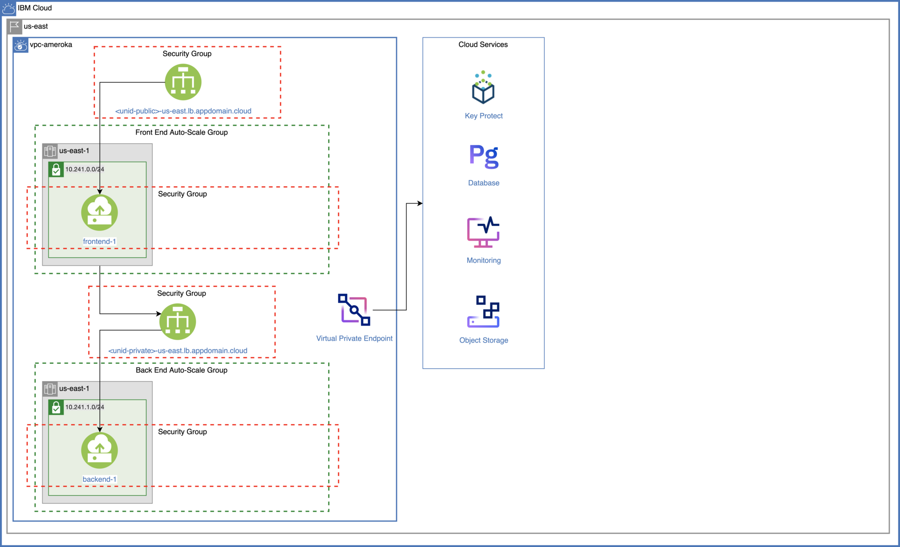

{:step: data-tutorial-type='step'}
{:java: #java .ph data-hd-programlang='java'}
{:swift: #swift .ph data-hd-programlang='swift'}
{:ios: #ios data-hd-operatingsystem="ios"}
{:android: #android data-hd-operatingsystem="android"}
{:shortdesc: .shortdesc}
{:new_window: target="_blank"}
{:codeblock: .codeblock}
{:screen: .screen}
{:pre: .pre}
{:deprecated: .deprecated}
{:important: .important}
{:note: .note}
{:tip: .tip}
{:preview: .preview}
{:beta: .beta}

# VPC scaling and dedicated compute
{: #vpc-scaling-dedicated-compute}
{: toc-content-type="tutorial"}
{: toc-services="vpc"}
{: toc-completion-time="2h"}

<!--##istutorial#-->
This tutorial may incur costs. Use the [Cost Estimator](https://{DomainName}/estimator/review) to generate a cost estimate based on your projected usage.
{: tip}
<!--#/istutorial#-->

This tutorial walks you through the steps of setting up isolated workloads by provisioning a {{site.data.keyword.vpc_full}} (VPC) with subnets spanning multiple availability zones (AZs) and virtual server instances (VSIs) that can autoscale according to your requirements in multiple zones within one region to ensure the high availability of the application. You will configure a global load balancer to provide high availability between zones and reduce network latency for users.

You will learn about the use of dedicated hosts by provisioning VSIs in a dedicated host. You will provision all of these services and resources using {{site.data.keyword.bpfull_notm}} . 
{:shortdesc}

A {{site.data.keyword.bpfull_notm}} template is a set of files that define the IBM Cloud resources that you want to create, update, or delete. You create a{{site.data.keyword.bpshort}} workspace that points to your template and use the built-in capabilities of the IBM Cloud provider plug-in for Terraform to provision your IBM Cloud resources.

## Objectives
{: #vpc-scaling-dedicated-compute-objectives}

* Learn how to set up a multi-zone VPC with instance autoscaling
* Understand the concepts of public and private load balancing
* Learn the use of dedicated hosts

1. The admin provisions a Virtual Private Cloud with:
    - both a Private and a Public Load Balancers, 
    - multiple Availability Zones and Subnets, 
    - Auto-Scale for Virtual Server Instances.
2. The admin provisions Cloud Services to include:
    - Key Protect, 
    - Databases for PostgreSQL, 
    - Monitoring, 
    - Object Storage
3. The admin provisions a Virtual Private Cloud with: 
    - Virtual Server Instances running on top of Dedicated Hosts.
    - Data Volume (Block Storage).

## Before you begin
{: #vpc-scaling-dedicated-compute-prereqs}

This tutorial requires:
* An {{site.data.keyword.cloud_notm}} [billable account](https://{DomainName}/docs/account?topic=account-accounts),
* {{site.data.keyword.cloud_notm}} CLI,
   * {{site.data.keyword.vpc_short}} plugin (`vpc-infrastructure`),
* `terraform` to use Infrastructure as Code to provision resources

<!--##istutorial#-->
You will find instructions to download and install these tools for your operating environment in the [Getting started with tutorials](https://{DomainName}/docs/solution-tutorials?topic=solution-tutorials-tutorials) guide.

Note: To avoid the installation of these tools you can use the [{{site.data.keyword.cloud-shell_short}}](https://{DomainName}/shell) from the {{site.data.keyword.cloud_notm}} console.
{:tip}
<!--#/istutorial#-->

## Create services
{: #vpc-scaling-dedicated-compute-services}
{: step}

In this section, you will create the cloud services required for the application using {{site.data.keyword.bpfull_notm}}

1. Navigate to [{{site.data.keyword.bpshort}} Workspaces](https://{DomainName}/schematics/workspaces), click on **Create workspace** 
   1. Provide a workspace name - **vpc-scaling-workspace**
   2. choosing a resource group and location
   3. Click on **Create**
2. Under Settings, scroll to the **Import your Terraform template** section,
   1. Provide `https://github.ibm.com/portfolio-solutions/vpc-scaling-dedicated-host` under GitHub or GitLab repository URL.
   2. Select `terraform_v0.14` as the Terraform version
   3. Click on **Save template information**
3. Under **Variables**, provide the `IBM Cloud API key` by clicking the action menu (three vertical dots) in the row,       
   1. Enter your IBM Cloud API key,
   2. Uncheck **Use default** and check **Sensitive** 
   3. Click on **Save**.
4. Set `step1_create_services` to **true** by clicking the action menu, uncheck **Use default**, choose **true** from the dropdown and click on **Save**.
5. Similarly, set a `basename` for all of the resources and change the other variables based on your requirement.
6. Scroll to the top of the page and click **Generate plan**. This is same as `terraform plan` command.
7. Click on **View log** to see the details.
8. On the workspace page, click on **Apply plan** and check the logs to see the status of the services provisioned.

You should see the cloud services required for this tutorial provisioned in the resource group you mentioned. All the services and the data are encrypted with {{site.data.keyword.keymanagementservicefull_notm}}.

## Create a VPC for autoscaling
{: #vpc-scaling-dedicated-compute-vpc-setup}
{: step}
In this section, you will provision a {{site.data.keyword.vpc_full}} (VPC) with subnets spanning across two availability zones (in short zones) in region/location you opted.

1. Under **Settings** tab of your {{site.data.keyword.bpshort}} workspace, set the `step2_create_vpc` to **true** and **Save** the setting.
2. Click on **Generate plan** to view the resources to be provisioned or simply click on **Apply plan** to provision the VPC resources.
3. Follow the status logs by clicking on **View log**.
   You just provisioned 
    - a VPC 
    - two subnets (one in each zone) 
    - a public load balancer with a security group driving traffic to the frontend application.
    - a private load balancer with a security group driving requests from frontend to the backend.
    - an instance template and an instance group for provisioning and scaling the instances.
      - two VSIs (one frontend instance and one backend) with respective security groups attached.

    
4. **Copy** the public load balancer URL from the log output and paste it in a browser to see the frontend application.
    
    To check the provisioned VPC resources, you can either use the [VPC layout](https://{DomainName}/vpc-ext/vpcLayout) or [{{site.data.keyword.cloud-shell_short}}](https://{DomainName}/shell) with `ibmcloud is` commands.
    {:tip}

## Scale the instances
{: #vpc-scaling-dedicated-compute-autoscale}
{: step}

In this section, you will start scaling the instances with scaling method already set to **static** and then move to scaling the instances with scaling method set to **dynamic** by setting up an instance manager and an instance group manager policy. Based on the target utilization metrics that you define, the instance group can dynamically add or remove instances to achieve your specified instance availability.

1. Let's start with **static** scaling method. Under **Settings** tab of your {{site.data.keyword.bpshort}} workspace, update the `instance_count` variable to **2** and **Save** the setting.
2. Apply the plan to see the additional two instances (one frontend VSI and one backend VSI) provisioned.
3. To enable **dynamic** scaling method, set the `is_dynamic` variable to **true** and **Save** the setting. 

   This setting adds an instance group manager and an instance group manager policy to the existing instance group thus switching the instance group scaling method from `static` to `dynamic`.
   {:tip}
4. To check the autoscaling capabilities, we can use a load generator to generate a load against our application. This load generator will simulate about 300 clients hitting the URL for 30 seconds. Navigate to the [load generator URL](https://load.fun.cloud.ibm.com/) and paste the public load balancer URL from the step above.
5. Click on **Generate load** a couple of times to generate more traffic.
6. Under **Memberships** tab of your [instance group](https://{DomainName}/vpc-ext/autoscale/groups), you should see new instances being provisioned. 

   Wait for the instances to scale as the aggregate period is set to `90 seconds` and cooldown period set to `120 seconds`.
   {:tip}

## Set up a dedicated host and provision a VSI with data volume
{: #vpc-scaling-dedicated-compute-dedicated}
{: step}

In this section, you will created a dedicated host in a group and provision an instance with encrypted data volume. 

1. Navigate to the **Settings** tab of your {{site.data.keyword.bpshort}} workspace, update the `step3_create_dedicated` variable to **true** and **Save** the setting.
2. Either **Generate a plan** to see what resources will be provisioned or **Apply the plan** to provision the following resources,
   - a dedicated host group
   - a dedicated host 
   - a VSI with encrypted data volume (encryption using {{site.data.keyword.keymanagementservicefull_notm}}) and with a security group attached.

## Resize the VSI and data volume on the dedicated host
{: #vpc-scaling-dedicated-compute-dedicated-resize}
{: step}

## Remove resources
{: #vpc-scaling-dedicated-compute-removeresources}
{: step}

1. On your {{site.data.keyword.bpshort}} workspace page, click on **Actions** and select **Destroy**.
2. Enter your `workspace name` and click **Destroy**.

## Related content
{: #vpc-scaling-dedicated-compute-related}

* [Securely access remote instances with a bastion host](https://{DomainName}/docs/solution-tutorials?topic=solution-tutorials-vpc-secure-management-bastion-server)
* [Accessing virtual server instances by using VNC or serial consoles](https://{DomainName}/docs/vpc?topic=vpc-vsi_is_connecting_console)
* [Getting started with IBM Cloud Hyper Protect Crypto Services](https://{DomainName}/docs/hs-crypto?topic=hs-crypto-get-started)
