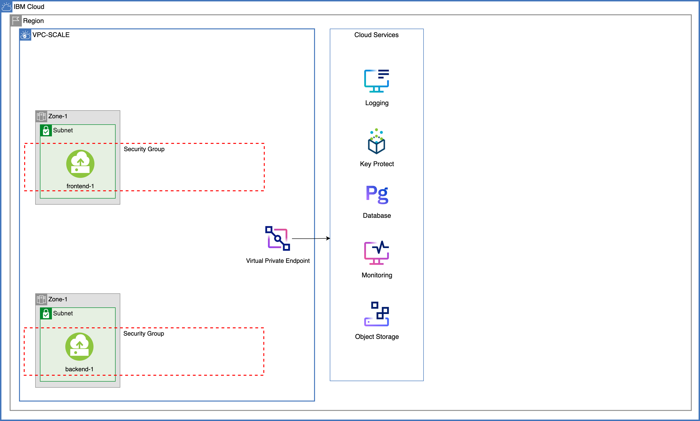
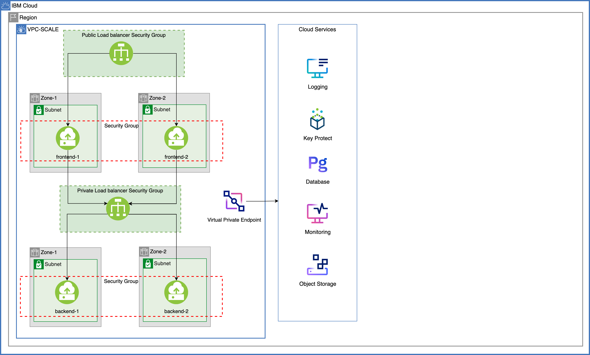
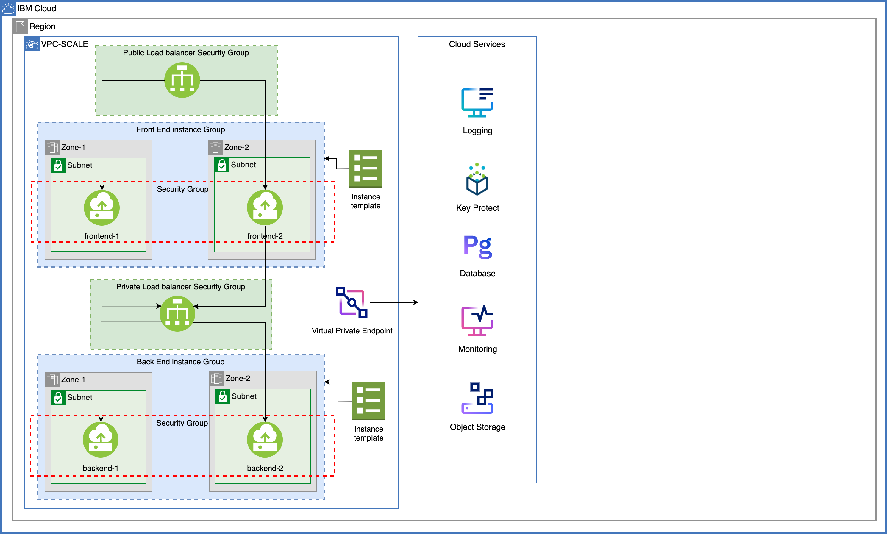
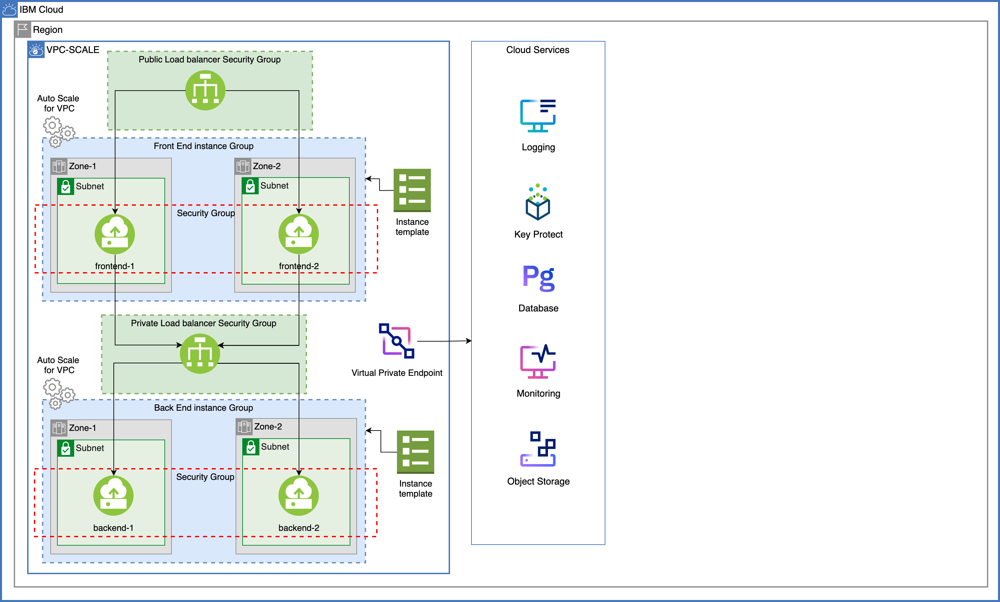

{:step: data-tutorial-type='step'}
{:java: #java .ph data-hd-programlang='java'}
{:swift: #swift .ph data-hd-programlang='swift'}
{:ios: #ios data-hd-operatingsystem="ios"}
{:android: #android data-hd-operatingsystem="android"}
{:shortdesc: .shortdesc}
{:new_window: target="_blank"}
{:codeblock: .codeblock}
{:screen: .screen}
{:pre: .pre}
{:deprecated: .deprecated}
{:important: .important}
{:note: .note}
{:tip: .tip}
{:preview: .preview}
{:beta: .beta}

# VPC scaling and dedicated compute
{: #vpc-scaling-dedicated-compute}
{: toc-content-type="tutorial"}
{: toc-services="vpc, databases-for-postgresql, schematics"}
{: toc-completion-time="2h"}

<!--##istutorial#-->
This tutorial may incur costs. Use the [Cost Estimator](https://{DomainName}/estimator/review) to generate a cost estimate based on your projected usage.
{: tip}
<!--#/istutorial#-->

This tutorial walks you through the steps of setting up isolated workloads by provisioning a {{site.data.keyword.vpc_full}} (VPC) with subnets spanning multiple availability zones (AZs) and virtual server instances (VSIs) that can scale according to your requirements in multiple zones within one region to ensure the high availability of the application. You will also configure load balancers to provide high availability between zones and reduce network latency for users.

You will learn how to isolate your instances by provisioning them on a dedicated host and also resize the instances after provisioning. You will also attach an encrypted volume to your instance.You will provision all of these services and VPC resources using {{site.data.keyword.bpfull_notm}}. 
{:shortdesc}

A {{site.data.keyword.bpfull_notm}} template is a set of files that define the {{site.data.keyword.Bluemix_notm}} resources that you want to create, update, or delete. You create a{{site.data.keyword.bpshort}} workspace that points to your template and use the built-in capabilities of the {{site.data.keyword.Bluemix_notm}} provider plug-in for Terraform to provision your {{site.data.keyword.Bluemix_notm}} resources.

## Objectives
{: #vpc-scaling-dedicated-compute-objectives}

* Learn how to set up a multi-zone VPC with instance autoscaling
* Understand the concepts of public and private load balancing
* Learn the use of dedicated hosts

1. You will start by provisioning two VSIs (one frontend VSI and one backend VSI) on a VPC and cloud services.
2. As the load(traffic) increases, you will add more VSIs manually thus you need a public load balancer for your frontend and a load balancer for your backend application to distribute the load.
3. You will then add an autoscaler to dynamically add or remove VSIs based on the metrics like CPU, RAM etc.,
4. As the scope expands, you require dedicated compute to isolate and perform heavy computation on the data.
5. Additionally, to handle seasonal load you can bring in scheduled actions to schedule VSIs at a certain point of time.
## Before you begin
{: #vpc-scaling-dedicated-compute-prereqs}

This tutorial requires:
* An {{site.data.keyword.cloud_notm}} [billable account](https://{DomainName}/docs/account?topic=account-accounts),
* {{site.data.keyword.cloud_notm}} CLI,
   * {{site.data.keyword.vpc_short}} plugin (`vpc-infrastructure`),
* `terraform` to use Infrastructure as Code to provision resources

<!--##istutorial#-->
You will find instructions to download and install these tools for your operating environment in the [Getting started with tutorials](https://{DomainName}/docs/solution-tutorials?topic=solution-tutorials-tutorials) guide.

Note: To avoid the installation of these tools you can use the [{{site.data.keyword.cloud-shell_short}}](https://{DomainName}/shell) from the {{site.data.keyword.cloud_notm}} console.
{:tip}
<!--#/istutorial#-->

## Provision required cloud services
{: #vpc-scaling-dedicated-compute-services}
{: step}

In this section, you will create the cloud services required for the application using {{site.data.keyword.bpfull_notm}}. 

1. Navigate to [{{site.data.keyword.bpshort}} Workspaces](https://{DomainName}/schematics/workspaces), click on **Create workspace** 
   1. Provide a workspace name - **vpc-scaling-workspace**
   2. Choosing a resource group and location
   3. Click on **Create**
2. Under Settings, scroll to the **Import your Terraform template** section,
   1. Provide `https://github.ibm.com/portfolio-solutions/vpc-scaling-dedicated-host` under GitHub or GitLab repository URL.
   2. Select `terraform_v0.14` as the Terraform version
   3. Click on **Save template information**
3. Under **Variables**, provide the `{{site.data.keyword.Bluemix_notm}} API key` by clicking the action menu (three vertical dots) in the row,       
   1. Enter your {{site.data.keyword.Bluemix_notm}} API key,
   2. Uncheck **Use default** and check **Sensitive** 
   3. Click on **Save**.
4. Set `step1_create_services` to **true** by clicking the action menu, uncheck **Use default**, choose **true** from the dropdown and click on **Save**.Change the other variables based on your requirement.
5. Scroll to the top of the page and click **Generate plan**. This is same as `terraform plan` command.
6. Click on **View log** to see the details.
7. On the workspace page, click on **Apply plan** and check the logs to see the status of the services provisioned.

You should see the cloud services required for this tutorial provisioned in the resource group you mentioned. All the services and the data are encrypted with {{site.data.keyword.keymanagementservicefull_notm}}.

## Set up a multizone Virtual Private Cloud
{: #vpc-scaling-dedicated-compute-vpc-setup}
{: step}

In this section, you will provision a {{site.data.keyword.vpc_full}} (VPC) with subnets spanning across two availability zones (in short zones). You will provision VSIs in multiple zones within one region to ensure the high availability of your frontend and backend applications. 

You will also configure a public load balancer for your frontend and a private load balancer for your backend app to provide high availability between zones and reduce network latency for users.  With load balancers in place, you can always configure SSL termination, sticky sessions, health checks, end-to-end encryption etc., For more info, refer to this [blog post](https://www.ibm.com/cloud/blog/deploy-and-auto-scale-isolated-workloads-across-multiple-zones).

You will also create an instance template that is used to provision instances in your instance group and create an instance group in a single region that is made up of like virtual server instances.

### Progression
{: #vpc-scaling-dedicated-compute-vpc-progress}

- As you apply the infrastructure script later in this section, the script starts by provisioning two VSIs (one frontend and one backend) in one of the subnets spanning across two zones in the VPC.
   
- As the load increases, you may need more instances to serve the traffic. The script configures a load balancer (one for the frontend app and one for the backend app) to balance incoming requests across instances. With a load balancer you can configure specific health checks for the pool members that are associated with instances.
   

- An instance template is required before you can create an instance group for auto scaling. The instance template defines the details of the virtual server instances that are created for your instance group. For example, specify the profile (vCPU and memory), image, attached volumes, and network interfaces for the image template. Additionally, `user data` is specified to automatically run scripts required for the frontend and backend respectively. All of the VSIs that are created for an instance group use the instance template that is defined in the instance group. The script provisions an instance template and an instance group (one for frontend and one for backend) with no-scaling policies defined yet.
   VPC uses Cloud-init technology to configure virtual server instances. The `User Data` field on the New virtual server for VPC page allows users to put in custom configuration options by using cloud-init.
   {:tip}
   
   

### Provision the resources
{: #vpc-scaling-dedicated-compute-vpc-provision}

1. Under **Settings** tab of your {{site.data.keyword.bpshort}} workspace, set the `step2_create_vpc` to **true** and **Save** the setting.
2. Click on **Generate plan** to view the resources to be provisioned or simply click on **Apply plan** to provision the VPC resources.
3. Follow the status logs by clicking on **View log**.
   You just provisioned 
    - a VPC 
    - two subnets (one in each zone) 
    - a public load balancer with a security group driving traffic to the frontend application.
    - a private load balancer with a security group driving requests from frontend to the backend.
    - an instance template and an instance group for provisioning and scaling the instances.
      - two VSIs (one frontend instance and one backend) with respective security groups attached.
4. **Copy** the public load balancer URL from the log output and paste it in a browser by prefixing `http://` to see the frontend application.
    
    To check the provisioned VPC resources, you can either use the [VPC layout](https://{DomainName}/vpc-ext/vpcLayout) or [{{site.data.keyword.cloud-shell_short}}](https://{DomainName}/shell) with `ibmcloud is` commands.
    {:tip}

In the next section, you will choose a scaling method (static or dynamic) and create scaling policies.

## Increase load on your instances to check scaling
{: #vpc-scaling-dedicated-compute-scale}
{: step}

In this section, you will start scaling the instances with scaling method already set to **static** and then move to scaling the instances with scaling method set to **dynamic** by setting up an instance manager and an instance group manager policy. Based on the target utilization metrics that you define, the instance group can dynamically add or remove instances to achieve your specified instance availability.

### Manual scaling 
{: #vpc-scaling-dedicated-compute-manual-scale}

1. To check **static** scaling method, navigate to the **Settings** tab of your {{site.data.keyword.bpshort}} workspace.
2. Update the `step3_instance_count` variable to **2** and **Save** the setting.
3. Apply the plan to see the additional two instances (one frontend VSI and one backend VSI) provisioned.
4. Under **Memberships** tab of your [instance group](https://{DomainName}/vpc-ext/autoscale/groups), you should see new instances being provisioned. 
5. Refresh the load balancer URL multiple times to see the details of the VSI serving the request.

To monitor the load balancers and to check the logs, follow the steps mentioned in [this section of the tutorial](/docs/solution-tutorials?topic=solution-tutorials-vpc-scaling-dedicated-compute#vpc-scaling-dedicated-compute-observe) 

### Automatic scaling
{: #vpc-scaling-dedicated-compute-auto-scale}

1. To switch to **dynamic** scaling method, set the `step3_is_dynamic` variable to **true**, **Save** the setting and **Apply** the plan.

   This setting adds an instance group manager and an instance group manager policy to the existing instance group thus switching the instance group scaling method from `static` to `dynamic`.
   {:tip}

2. To check the autoscaling capabilities, you can use a load generator to generate a load against our application. This load generator will simulate about 300 clients hitting the URL for 30 seconds. Navigate to the [load generator URL](https://load.fun.cloud.ibm.com/) and paste the public load balancer URL from the step above.
    
3. Click on **Generate load** a couple of times to generate more traffic.
4. Under **Memberships** tab of your [instance group](https://{DomainName}/vpc-ext/autoscale/groups), you should see new instances being provisioned. 
5. Refresh the load balancer URL multiple times to see the details of the VSI serving the request.

   Wait for the instances to scale as the aggregate period is set to `90 seconds` and cooldown period set to `120 seconds`.To monitor the load balancers and to check the logs, follow the steps mentioned in [this section of the tutorial](/docs/solution-tutorials?topic=solution-tutorials-vpc-scaling-dedicated-compute#vpc-scaling-dedicated-compute-observe) 
   {:tip}

## Set up a dedicated host and provision a VSI with encrypted data volume
{: #vpc-scaling-dedicated-compute-dedicated}
{: step}

<!--##istutorial#-->
This tutorial may incur costs. Use the [Cost Estimator](https://{DomainName}/estimator/review) to generate a cost estimate based on your projected usage.
{: tip}
<!--#/istutorial#-->

In this section, you will created a dedicated host in a group and provision an instance with encrypted data volume. 

1. Navigate to the **Settings** tab of your {{site.data.keyword.bpshort}} workspace, update the `step4_create_dedicated` variable to **true** and **Save** the setting.
2. Either **Generate a plan** to see what resources will be provisioned or **Apply the plan** to provision the following resources,
   - a dedicated host group
   - a dedicated host 
   - a VSI with encrypted data volume (encryption using {{site.data.keyword.keymanagementservicefull_notm}}) and with a security group attached.

   

## Resize the VSI and data volume on the dedicated host
{: #vpc-scaling-dedicated-compute-dedicated-resize}
{: step}

If you have observed the profile of the instance provisioned on the dedicated host is set to `cx2-2x4` where `c` stands for **Compute** family(category) with 2 vCPUs and 4 GiB RAM. In this section, you will resize the instance by updating the profile to `cx2-8x16` with 8 vCPUs, 16 GiB RAM.

1. To resize the capacity of the attached volume to the instance, navigate to the **Settings** tab of your {{site.data.keyword.bpshort}} workspace, update `step5_resize_dedicated_instance` variable to **true** and **Save** the setting.

   Dedicated virtual servers can only be resized to profiles supported by the dedicated host the instance is hosted on. For example, a virtual server provisioned with a profile from the Compute family, can resize to other profiles also belonging to the Compute family. For more information on profiles, see [Instance Profiles](https://{DomainName}/docs/vpc?topic=vpc-profiles).
   {:tip}

2. **Apply the plan** to resize the instance from `2 VCPUs | 4 GiB RAM` to `8 VCPUs | 16 GiB RAM`. 
3. You can check the profile by launching [{{site.data.keyword.cloud-shell_short}}](https://{DomainName}/shell), selecting the `region` and running `ibmcloud is instances` command.

## View logs and monitor the load Balancer for VPC metrics
{: #vpc-scaling-dedicated-compute-observe}
{: step}

In this section, you will learn how to check the logs of your VPC resources and monitor the load balancer for VPC metrics. The {{site.data.keyword.loganalysislong_notm}} and {{site.data.keyword.monitoringlong_notm}} services are enabled to receive platform metrics while provisioning. 

### Check the logs
{: #vpc-scaling-dedicated-compute-logs}

VPC services generate platform logs in the same region where they are available. You can view, monitor, and manage VPC logs through the {{site.data.keyword.loganalysislong_notm}} instance that is marked as platform logs in the region.

Platform logs are logs that are exposed by logging-enabled services and the platform in {{site.data.keyword.Bluemix_notm}}. For more information, see Configuring [{{site.data.keyword.Bluemix_notm}} platform logs](https://{DomainName}/docs/log-analysis?topic=log-analysis-config_svc_logs).

1. Navigate to the [Observability](https://{DomainName}/observe) page and click **Logging** on the left pane.
2. Click on **View IBM Log Analysis** next to the instance marked as `Platform logs`.
3. Under **Apps** from the top menu, check the load balancer CRN you want to see the logs and click **Apply**. 
4. Alternatively, you can check the logs of a load balancer from the [Load balancers for VPC](https://{DomainName}/vpc-ext/network/loadBalancers) page by 
    1. Clicking on the load balancer name for which you wish to check the logs.
    2. Under `Overview` tab, click on **Launch logging** under the `Data logging` panel of the load balancer. 

For checking the logs of other VPC resources, refer [VPC logging](https://{DomainName}/docs/vpc?topic=vpc-logging)

### Monitoring Load Balancer for VPC metrics
{: #vpc-scaling-dedicated-compute-monitor}

Load balancers calculate the metrics and send those metrics to your monitoring instance, which reflects different types of use and traffic. You can visualize and analyze metrics from the {{site.data.keyword.monitoringlong_notm}} dashboard.

1. Navigate to the [Observability](https://{DomainName}/observe) page and click **Monitoring** on the left pane.
2. Click on **View {{site.data.keyword.monitoringlong_notm}}** next to the instance marked as `Platform metrics`.
3. Click on **Dashboards** on the left sidebar to open the IBM Load Balancer Monitoring Metrics dashboard. 
4. Under Dashboard templates, expand **IBM** > Load Balancer Monitoring Metrics. The default dashboard is not editable.

## Remove resources
{: #vpc-scaling-dedicated-compute-removeresources}
{: step}

1. On your {{site.data.keyword.bpshort}} workspace page, click on **Actions** and select **Destroy**.
2. Enter your `workspace name` and click **Destroy**.

## Related content
{: #vpc-scaling-dedicated-compute-related}

* [Securely access remote instances with a bastion host](https://{DomainName}/docs/solution-tutorials?topic=solution-tutorials-vpc-secure-management-bastion-server)
* [Accessing virtual server instances by using VNC or serial consoles](https://{DomainName}/docs/vpc?topic=vpc-vsi_is_connecting_console)
* [Getting started with {{site.data.keyword.Bluemix_notm}} Hyper Protect Crypto Services](https://{DomainName}/docs/hs-crypto?topic=hs-crypto-get-started)
