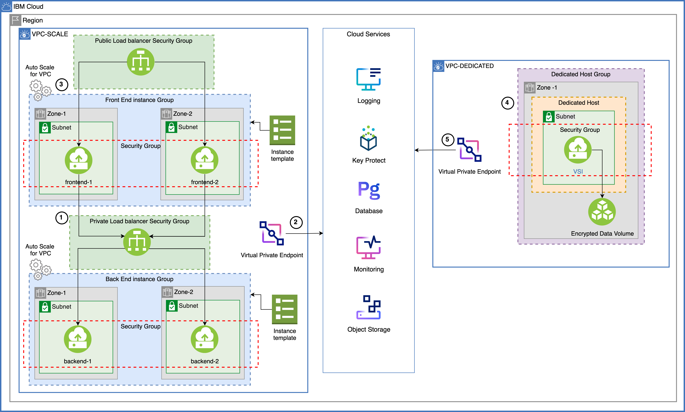

{:step: data-tutorial-type='step'}
{:java: #java .ph data-hd-programlang='java'}
{:swift: #swift .ph data-hd-programlang='swift'}
{:ios: #ios data-hd-operatingsystem="ios"}
{:android: #android data-hd-operatingsystem="android"}
{:shortdesc: .shortdesc}
{:new_window: target="_blank"}
{:codeblock: .codeblock}
{:screen: .screen}
{:pre: .pre}
{:deprecated: .deprecated}
{:important: .important}
{:note: .note}
{:tip: .tip}
{:preview: .preview}
{:beta: .beta}

# VPC scaling and dedicated compute
{: #vpc-scaling-dedicated-compute}
{: toc-content-type="tutorial"}
{: toc-services="vpc"}
{: toc-completion-time="2h"}

<!--##istutorial#-->
This tutorial may incur costs. Use the [Cost Estimator](https://{DomainName}/estimator/review) to generate a cost estimate based on your projected usage.
{: tip}
<!--#/istutorial#-->

This tutorial walks you through the steps of setting up isolated workloads by provisioning a {{site.data.keyword.vpc_full}} (VPC) with subnets spanning multiple availability zones (AZs) and virtual server instances (VSIs) that can autoscale according to your requirements in multiple zones within one region to ensure the high availability of the application. You will configure a global load balancer to provide high availability between zones and reduce network latency for users.

You will learn about the use of dedicated hosts by provisioning VSIs in a dedicated host. You will provision all of these services and resources using{{site.data.keyword.bpshort}}. 
{:shortdesc}

A {{site.data.keyword.bpfull_notm}} template is a set of files that define the IBM Cloud resources that you want to create, update, or delete. You create a{{site.data.keyword.bpshort}} workspace that points to your template and use the built-in capabilities of the IBM Cloud provider plug-in for Terraform to provision your IBM Cloud resources.

## Objectives
{: #vpc-scaling-dedicated-compute-objectives}

* Learn how to setup a multi-zone VPC with instance autoscaling
* Understand the concepts of public and private load balancing
* Learn the use of dedicated hosts



1. The admin provisions a Virtual Private Cloud with:
    - both a Private and a Public Load Balancers, 
    - multiple Availability Zones and Subnets, 
    - Auto-Scale for Virtual Server Instances.
2. The admin provisions Cloud Services to include:
    - Key Protect, 
    - Databases for PostgreSQL, 
    - Monitoring, 
    - Object Storage
3. The admin provisions a Virtual Private Cloud with: 
    - Virtual Server Instances running on top of Dedicated Hosts.
    - Data Volume (Block Storage).


## Before you begin
{: #vpc-scaling-dedicated-compute-prereqs}

This tutorial requires:
* An {{site.data.keyword.cloud_notm}} [billable account](https://{DomainName}/docs/account?topic=account-accounts),
* {{site.data.keyword.cloud_notm}} CLI,
   * {{site.data.keyword.vpc_short}} plugin (`vpc-infrastructure`),
* `terraform` to use Infrastructure as Code to provision resources

You will find instructions to download and install these tools for your operating environment in the [Getting started with tutorials](https://{DomainName}/docs/solution-tutorials?topic=solution-tutorials-tutorials) guide.

Note: To avoid the installation of these tools you can use the [{{site.data.keyword.cloud-shell_short}}](https://{DomainName}/shell) from the {{site.data.keyword.cloud_notm}} console.
{:tip}


## Create services
{: #vpc-scaling-dedicated-compute-services}
{: step}

In this section, you will create the cloud services required for the application using {{site.data.keyword.bpfull_notm}}

1. Navigate to [{{site.data.keyword.bpshort}} Workspaces](https://{DomainName}/schematics/workspaces), click on **Create workspace** 
   1. Provide a workspace name - **vpc-scaling-workspace**
   2. choosing a resource group and location
   3. Click on **Create**
2. Under Settings, scroll to the **Import your Terraform template** section,
   1. Provide `https://github.ibm.com/portfolio-solutions/vpc-scaling-dedicated-host` under GitHub or GitLab repository URL.
   2. Select `terraform_v0.14` as the Terraform version
   3. Click on **Save template information**
3. Under **Variables**, provide the `IBM Cloud API key` by clicking the action menu (three vertical dots) in the row,       
   1. Enter your IBM Cloud API key,
   2. Uncheck **Use default** and check **Sensitive** 
   3. Click on **Save**.
4. Set `step1_create_services` to **true** by clicking the action menu, uncheck **Use default**, choose **true** from the dropdown and click on **Save**.
5. Similarly, set a `basename` for all of the resources.
6. Scroll to the top of the page and click **Generate plan**. This is same as `terraform plan` command.
7. Click on **View log** to see the details.
8. On the workspace page, click on **Apply plan** and check the logs to see the status of the services provisioned.


## Create VPC for autoscaling
{: #vpc-scaling-dedicated-compute-autoscale}
{: step}


## Remove resources
{: #vpc-scaling-dedicated-compute-removeresources}
{: step}

Steps to take to remove the resources created in this tutorial

## Related content
{: #vpc-scaling-dedicated-compute-related}

* [Relevant links in IBM Cloud docs](https://{DomainName}/docs/cli?topic=blah)
* [Relevant links in external sources, i.e. normal link](https://kubernetes.io/docs/tutorials/hello-minikube/)


#### Terraform
{: #vpc-scaling-dedicated-compute-terraform}

```terraform
resource "ibm_is_vpc" "myvpc" {
  name = "the name using terraform"
}
```
{: codeblock}
