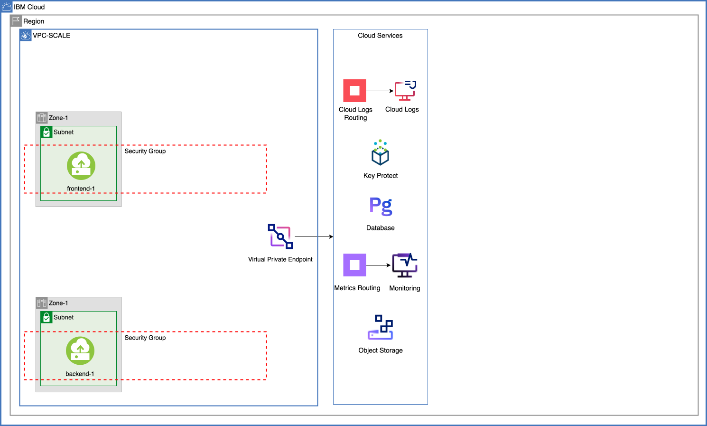
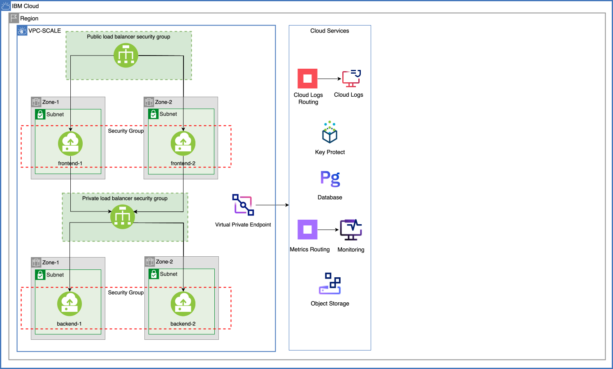
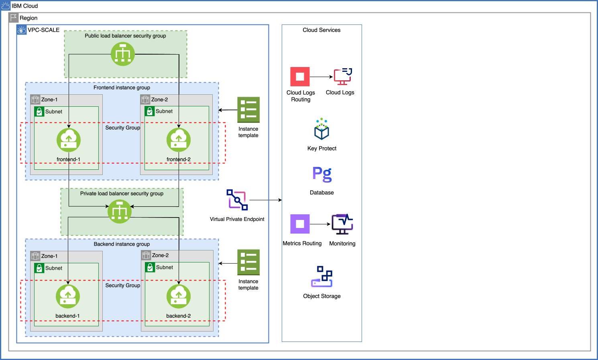
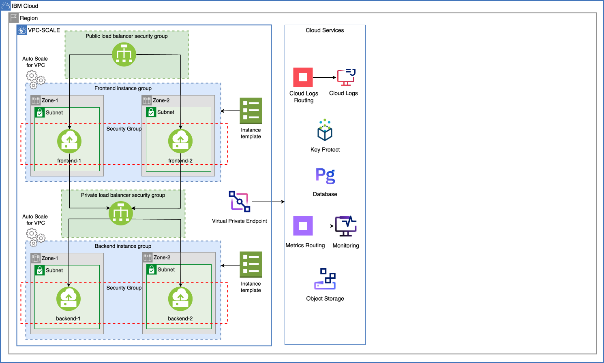
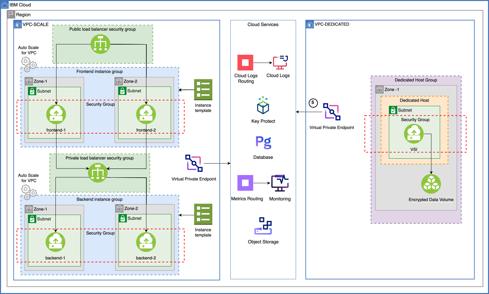

{{site.data.keyword.attribute-definition-list}}

# Scale workloads in shared and dedicated VPC environments
{: #vpc-scaling-dedicated-compute}
{: toc-content-type="tutorial"}
{: toc-services="vpc, databases-for-postgresql, schematics, cloud-object-storage"}
{: toc-completion-time="2h"}
{: toc-use-case="ApplicationModernization, Cybersecurity, VirtualPrivateCloud"}

This tutorial may incur costs. Use the [Cost Estimator](/estimator) to generate a cost estimate based on your projected usage.
{: tip}


This tutorial walks you through the steps of setting up isolated workloads in a shared (multi-tenant) environment and a dedicated (single-tenant) environment. Provision an {{site.data.keyword.vpc_full}} (VPC) with subnets spanning multiple availability zones (AZs) and virtual server instances (VSIs) that can scale according to your requirements to ensure the high availability of your application. Furthermore, configure load balancers to provide high availability between zones within one region. Configure Virtual Private Endpoints (VPE) for your VPC providing private routes to services on the IBM Cloud.

Isolate workloads by provisioning a dedicated host, attaching an encrypted data volume to a VSI, expanding the attached data volume, and resizing the VSI after the fact. 
{: shortdesc}

You will provision all of these services and VPC resources using {{site.data.keyword.bpfull_notm}}, which provides Terraform-as-a-Service capabilities. The Terraform template defines the {{site.data.keyword.Bluemix_notm}} resources to be created, updated, or deleted.

## Objectives
{: #vpc-scaling-dedicated-compute-objectives}

* Learn how to set up a multi-zone VPC with instance autoscaling.
* Understand the concepts of public and private load balancing.
* Learn how to scale instances dynamically or periodically.
* Learn the use of dedicated hosts.

{: caption="Architecture diagram of the tutorial" caption-side="bottom"}
{: style="text-align: center;"}

1. The frontend app deployed on VSI(s) communicates to the backend app via the private load balancer.
2. The backend app securely communicates with the cloud services via a virtual private endpoint (VPE).
3. As the load on the application increases, scaling for VPC is enabled and dynamically adds or removes VSIs based on metrics like CPU, RAM, etc., or through scheduled scaling.
4. As the scope expands, dedicated host isolates and performs heavy computation on the data. Resize the instance on the dedicated host by updating the profile based on your requirement. Also, expand the block storage volume capacity. 
5. All instances communicate with IBM Cloud services over the private backbone using a virtual private endpoint (VPE). See the [About virtual private endpoint gateways](/docs/vpc?topic=vpc-about-vpe) topic for more details.


## Before you begin
{: #vpc-scaling-dedicated-compute-prereqs}

The tutorial requires:
* An {{site.data.keyword.cloud_notm}} [billable account](/docs/account?topic=account-accounts).
* A local shell with `curl`.

## Enable logging and monitoring
{: #vpc-scaling-dedicated-compute-metrics}

1. Configure a {{site.data.keyword.logs_full_notm}} instance as a target of {{site.data.keyword.logs_routing_full_notm}}.  See [Getting started with {{site.data.keyword.logs_routing_full}}](/docs/logs-router?topic=logs-router-getting-started)
1. Configure a {{site.data.keyword.mon_short}} instance to collect platform metrics.  See [Enabling platform metrics](/docs/monitoring?topic=monitoring-platform_metrics_enabling)

## Provision required cloud services
{: #vpc-scaling-dedicated-compute-services}
{: step}

In this section, you will create the following cloud services required for the application using {{site.data.keyword.bpfull_notm}}: {{site.data.keyword.databases-for-postgresql_full_notm}} and {{site.data.keyword.cos_full_notm}}. 

1. Navigate to [{{site.data.keyword.bpshort}} Workspaces](/schematics/workspaces), click on **Create workspace**.
   1. Under the **Specify Template** section, provide `https://github.com/IBM-Cloud/vpc-scaling-dedicated-host` under GitHub or GitLab repository URL. 
   2. Select **terraform_v1.5** as the Terraform version and click **Next**.
2. Under **Workspace details**,
   1. Provide a workspace name : `vpc-scaling-workspace`.
   2. Choose a `Resource Group` and a `Location`.
   3. Click on **Next**.
3. Verify the details and then click on **Create**.
4. Under **Variables**, set `step1_create_services` to **true** by clicking the action menu in the row > Edit, uncheck **Use default**, choose **true** from the `Override Value` dropdown, and click on **Save**.
6. Set any additional variables you would like to override, the most typical ones are `region`, `resource_group_name`.
7. Scroll to the top of the page and click **Generate plan**. This is the same as `terraform plan` command.
8. Click on **Show more** to check the resources to be provisioned.
9. Navigate to the workspace page using the breadcrumb menu and click on **Apply plan**. Check the logs to see the status of the services created.

Navigate to the [resource list](/resources). Here, you can filter by the `basename` used to create the resources, i.e., **vpc-scaling**, and you will see the cloud services required for this tutorial provisioned in the resource group you specified. All the data stored with these services is encrypted with a key generated and stored in {{site.data.keyword.keymanagementservicefull_notm}}.

## Set up a multizone Virtual Private Cloud
{: #vpc-scaling-dedicated-compute-vpc-setup}
{: step}

In this section, you will:
- Provision an {{site.data.keyword.vpc_full}} (VPC) with subnets spanning across two zones. To ensure the high availability of your frontend app and backend app, you will create multiple VSIs across these zones.
- Configure a public load balancer for your frontend and a private load balancer for your backend app to provide high availability between zones. 
- Create an instance template used to provision instances in your instance group.

Initially, you may not deploy all the infrastructure resources to make it scale, even if you designed it in that way. You may start with only one or a few instances, as shown below.

{: caption="Deploy one VSI" caption-side="bottom"}

As the load increases, you may need more instances to serve the traffic. You may configure a public load balancer for the frontend app and a private load balancer for the backend app to equally distribute incoming requests across instances. With a load balancer, you can configure specific health checks for the pool members associated with instances.   

{: caption="Deploy multiple VSIs" caption-side="bottom"}

An instance template is required before you can create an instance group for auto scaling. The instance template defines the details of the virtual server instances that are created for your instance group. For example, specify the profile (vCPU and memory), image, attached volumes, and network interfaces for the image template. Additionally, `user data` is specified to automatically run [initialization scripts](https://github.com/IBM-Cloud/vpc-scaling-dedicated-host/blob/master/modules/create_vpc/main.tf#L109){: external} required for the frontend and backend applications respectively. All of the VSIs that are created for an instance group use the instance template that is defined in the instance group. The script provisions an instance template and an instance group (one for frontend and one for backend) with no auto scaling policies defined yet. This example does not require data volumes so they are commented out in the [modules/create_vpc/autoscale/main.tf](https://github.com/IBM-Cloud/vpc-scaling-dedicated-host/blob/master/modules/create_vpc/autoscale/main.tf#L20){: external} ibm_is_instance_group resource.

   VPC uses cloud-init technology to configure virtual server instances. The `user data` field on the new virtual server for VPC page allows users to put in custom configuration options by using cloud-init.
   {: tip}

   {: caption="Use an instance group" caption-side="bottom"}

### Provision the resources
{: #vpc-scaling-dedicated-compute-vpc-provision}

If you want to access the VSIs directly later, you can optionally [create an SSH key](/vpc-ext/compute/sshKeys) and set `ssh_keyname` to the name of the VPC SSH Key.

1. Go to the **Settings** tab of your {{site.data.keyword.bpshort}} workspace, click the action menu for `step2_create_vpc`,uncheck **Use default**, change the override value to **true** and **Save** the setting.
2. Click on **Apply plan** to provision the VPC resources.

   There are multiple Terraform modules involved in provisioning the VPC resources. To understand better, check the [main.tf](https://github.com/IBM-Cloud/vpc-scaling-dedicated-host/blob/master/modules/create_vpc/main.tf){: external} file.
   {: tip}

3. Follow the status logs by clicking on **Show more**.
   After the apply is successful, you should see the following resources provisioned:
    - a VPC
    - two subnets (one in each zone) 
    - a public load balancer with a [security group](/docs/vpc?topic=vpc-alb-integration-with-security-groups) driving traffic to the frontend application
    - a private load balancer with a security group driving requests from frontend to the backend
    - an instance template and an instance group for provisioning and scaling the instances
    - Initially, two VSIs (one frontend instance and one backend instance) with respective security groups attached

      The frontend instance runs an Nginx server to serve a PHP web application that talks to the backend to store and retrieve data. The backend instance runs a Node.js application with GraphQL API wrapper for {{site.data.keyword.databases-for-postgresql_full_notm}} and {{site.data.keyword.cos_full_notm}}.
      {: tip}

4. **Copy** the public load balancer hostname from the log output and paste the hostname in a browser by prefixing `http://` to see the frontend application. As shown in the diagram below, enter the balance, e.g.,10 and click **Submit** to see the details of the VSIs serving the request.

    {: caption="View application" caption-side="bottom"}

    To check the provisioned VPC resources, you can either use the [VPC UI](/vpc-ext/network/vpcs) or [{{site.data.keyword.cloud-shell_short}}](/shell) with [ibmcloud is](/docs/vpc?topic=vpc-vpc-reference&interface=cli) commands.
    {: tip}

In the next section, you will choose a scaling method (static or dynamic) and create scaling policies.

## Increase load on your instances to check scaling
{: #vpc-scaling-dedicated-compute-scale}
{: step}

In this section, you will start scaling the instances with the scaling method initially set to **static**. Then, you move to scaling the instances with **dynamic** scaling by setting up an instance manager and an instance group manager policy. Based on the target utilization metrics that you define, the instance group can dynamically add or remove instances to achieve your specified instance availability.

### Manual scaling 
{: #vpc-scaling-dedicated-compute-manual-scale}

1. To check **static** scaling method, navigate to the **Settings** tab of your {{site.data.keyword.bpshort}} workspace to see that the `step3_is_dynamic` variable is set to `false`.
2. Update the `step3_instance_count` variable to `2` and **Save** the setting.
3. Apply the plan to see the additional two instances (one frontend VSI and one backend VSI) provisioned.
4. Under **Memberships** tab of your frontend [instance group](/vpc-ext/autoscale/groups), you should now see `2` instances.
5. Navigate to the browser showing the frontend app and either click on the **Refresh** button or **submit**  a new balance multiple times to see the details of the frontend VSI and backend VSI serving the request. You should see two of the four VSIs serving your request.
6. Before moving to the next step, update the `step3_instance_count` variable from `2` to `1` and **Save** the setting.

You can check the logs and monitor your load balancers later in the tutorial.

### Automatic scaling
{: #vpc-scaling-dedicated-compute-auto-scale}

1. To switch to **dynamic** scaling method, set the `step3_is_dynamic` variable to **true**, **Save** the setting and **Apply** the plan. This setting adds an instance group manager and an instance group manager policy to the existing instance group thus switching the instance group scaling method from `static` to `dynamic`.
   
   {: caption="Scale instances" caption-side="bottom"}
2. To check the autoscaling capabilities, you can use a load generator against your application. The following shell script simulates a basic load of 90000 requests with up to 300 in parallel.
   1. Open a local terminal.
   2. Create a shell variable for the public load balancer URL from the above step with `/v1/controller/balance.php` appended.

      ```sh
      export APPURL=http://<load-balancer>/v1/controller/balance.php
      ```
      {: pre}

   3. Run the following script to generate some load. You can repeat it to create more traffic. The `[1-1000]` asks each curl call to make that many GETs. The `--retry` will capture each of the numbers from the `seq` command.

      ```sh
      seq 1 1000 | xargs -n1 -P100  curl -s $APPURL/"[1-1000]" -o /dev/null --retry
      ```
      {: pre}

3. Under **Memberships** tab of your [instance group](/vpc-ext/autoscale/groups), you should see new instances being provisioned. 

   You should see up to 5 instances taking the load as the maximum membership count is set to `5`. You can check the minimum and maximum instance group size under `Overview` tab of the instance group.
   {: tip}

4. Navigate to the browser showing the frontend app and **submit** balance multiple times to see the details of the frontend VSI and backend VSI serving the request.

   Wait for the instances to scale as the aggregate period is set to `90 seconds` and cooldown period set to `120 seconds`.
   {: tip}

5. Wait for the instances to scale to `1` before moving to the next step.

### Scheduled actions (Optional)
{: #vpc-scaling-dedicated-compute-scheduled-scale}

In this section, you will use scheduled scaling for VPC to schedule actions that automatically add or remove instance group capacity, based on daily, intermittent, or seasonal demand. You can create multiple scheduled actions that scale capacity monthly, weekly, daily, hourly, or even every set number of minutes. This section is optional and not required to complete the remainder of this tutorial.

1. To create a one-time scheduled action, set the `step3_is_scheduled` variable to **true**, **Save** the setting and **Apply** the plan.
2. Check the status of your scheduled action under the **scheduled actions** tab of the instance group. The Terraform template will schedule the actions for 5 minutes from the time you apply the plan. When the status of the action is changed to `completed`, the instance group size will be set to a minimum of `2` and a maximum of `5` instances. You should see `2` instances under the **Memberships** tab of the instance group.
3. Click on **Generate load** a couple of times to generate more traffic to see the instances scale to a maximum of `5`.

### Monitoring Load Balancer for VPC metrics
{: #vpc-scaling-dedicated-compute-monitor}

Load balancers calculate the metrics and send those metrics to your monitoring instance, which reflects different types of use and traffic. You can visualize and analyze metrics from the {{site.data.keyword.monitoringlong_notm}} dashboard.

1. You can monitor your load balancers from the [Load balancers for VPC](/vpc-ext/network/loadBalancers) page by 
   1. Clicking on the **name** of the load balancer.
   2. Under `Monitoring preview` tile of the load balancer, click on **Launch monitoring**.
2. Alternatively, you can also monitor the load balancers by navigating to the [Observability](/observe) page and click **Monitoring** on the left pane 
   1. Click **Instances**
   1. Click on **Open dashboard** next to the instance marked as `Platform metrics`.
   2. Click on **Dashboards** on the left sidebar to open the IBM Load Balancer for VPC Monitoring Metrics dashboard.
   3. Under Dashboard templates, expand **IBM** > Load Balancer for VPC Monitoring Metrics. _The default dashboard is not editable_.
3. Remember to generate load against your application.
  
### Check the logs
{: #vpc-scaling-dedicated-compute-logs}

VPC services generate platform logs in the same region where they are available. You can view, monitor, and manage VPC logs through the {{site.data.keyword.loganalysislong_notm}} instance that is marked as platform logs in the region.

Platform logs are logs that are exposed by logging-enabled services and the platform in {{site.data.keyword.Bluemix_notm}}. For more information, see Configuring [{{site.data.keyword.Bluemix_notm}} platform logs](/docs/logs-router?topic=logs-router-getting-started)

1. Navigate to the [Observability](/observability/overview) page and click **Logging > Instances** on the left pane.
1. Click **Cloud Logs** at the top of the pane
2. Click on **Open dashboard** next to the instance configured earlier to capture the logs.
3. Click **Explore logs > Logs** on the left hand tool selector.
4. Paste the the load balancer CRN into the search bar to see the logs.

For checking the logs of other VPC resources, refer to [VPC logging](/docs/vpc?topic=vpc-logging).
   
## Set up a dedicated host and provision a VSI with an encrypted data volume
{: #vpc-scaling-dedicated-compute-dedicated}
{: step}

Provisioning dedicated hosts will incur costs. Use the [Cost Estimator](/estimator) to generate a cost estimate based on your projected usage.
{: tip}


In this section, you will create a dedicated host in a group and provision an instance with an encrypted data volume. 

The reason you create a dedicated host is to carve out a single-tenant compute node, free from users outside of your organization. Within that dedicated space, you can create virtual server instances according to your needs. Additionally, you can create dedicated host groups that contain dedicated hosts for a specific purpose. Because a dedicated host is a single-tenant space, only users within your account that have the required permissions can create instances on the host.

1. Navigate to the **Settings** tab of your {{site.data.keyword.bpshort}} workspace, update the `step4_create_dedicated` variable to **true** and **Save** the setting.
2. Click on **Apply the plan** to provision the following resources,
   - a dedicated host group
   - a dedicated host 
   - a VSI with encrypted data volume (encryption using {{site.data.keyword.keymanagementservicefull_notm}}) and with a security group attached.

   {: caption="Add a dedicated host" caption-side="bottom"}
3. From the log output, **copy** the instance IP address and launch [{{site.data.keyword.cloud-shell_short}}](/shell) to run the below command by replacing the placeholder `<IP_ADDRESS`> with the instance IP address

   ```sh
   export INSTANCE_IP=<IP_ADDRESS>
   ```
   {: pre}

   Typically, you won't set a public IP (floating IP) for an instance. In this case, a floating IP is set allow curl to the app deployed on the instance.
   {: tip} 

4. Issue the following curl command to query the database. The application running on the instance will read content from the {{site.data.keyword.databases-for-postgresql}} over the private endpoint. The data is the same that is available from the frontend application.

   ```sh
   curl \
   -s -X POST \
   -H "Content-Type: application/json" \
   --data '{ "query": "query read_database { read_database { id balance transactiontime } }" }' \
   http://$INSTANCE_IP/api/bank
   ```
   {: pre}   

5. Issue the following curl command to query the COS bucket. The application running on the instance will read content from the {{site.data.keyword.cos_short}} and return the results in JSON format. The data stored in COS is only available to the application running from the instance on the dedicated host.
   ```sh
   curl \
   -s -X POST \
   -H "Content-Type: application/json" \
   --data '{ "query": "query read_items { read_items { key size modified } }" }' \
   http://$INSTANCE_IP/api/bank
   ```
   {: pre}

6. Issue the following curl command to query the database and COS bucket at once. The application running on the instance will read content from the {{site.data.keyword.databases-for-postgresql}} and {{site.data.keyword.cos_short}} and return the results in JSON format.
   ```sh
   curl \
   -s -X POST \
   -H "Content-Type: application/json" \
   --data '{ "query": "query read_database_and_items { read_database { id balance transactiontime } read_items { key size modified } }" }' \
   http://$INSTANCE_IP/api/bank
   ```
   {: pre}

## Resize the VSI and expand the attached block storage volume on the dedicated host
{: #vpc-scaling-dedicated-compute-dedicated-resize}
{: step}

If you have observed the profile of the instance provisioned on the dedicated host, it is set to `cx2-2x4` where `c` stands for **Compute** family (category) with 2 vCPUs and 4 GiB RAM. In this section, you will resize the instance by updating the profile to `cx2-8x16` with 8 vCPUs, 16 GiB RAM.

In this section, you will also expand the block storage volume attached to the VSI from 100 GB to 250 GB. To understand the maximum capacity on the selected volume profile, check [expanding block storage volume capacity](/docs/vpc?topic=vpc-expanding-block-storage-volumes&interface=ui)

### Resize the VSI 
{: #vpc-scaling-dedicated-compute-resize-vsi}

1. To resize the VSI, navigate to the **Settings** tab of your {{site.data.keyword.bpshort}} workspace, update `step5_resize_dedicated_instance` variable to **true** and **Save** the setting.

    Virtual servers can only be resized to profiles supported by the dedicated host the instance is hosted on. For example, a virtual server provisioned with a profile from the Compute family, can resize to other profiles also belonging to the Compute family. For more information on profiles, see [Instance Profiles](/docs/vpc?topic=vpc-profiles).
   {: tip}

2. **Apply the plan** to resize the instance from `2 VCPUs | 4 GiB RAM` to `8 VCPUs | 16 GiB RAM`. 
3. You can check the profile of the instance by launching [{{site.data.keyword.cloud-shell_short}}](/shell), changing the region to the one where you provisioned your VPC with `ibmcloud target -r us-south` command and then running `ibmcloud is instances` command or from [Virtual server instances for VPC](/vpc-ext/compute/vs) UI by clicking on the dedicated instance name.

### Expand block storage volume capacity
{: #vpc-scaling-dedicated-compute-expand-volume}

1. To expand the capacity of the attached block storage volume, navigate to the **Settings** tab of your {{site.data.keyword.bpshort}} workspace, update `step5_resize_dedicated_instance_volume` variable to **true** and **Save** the setting.
2. **Apply the plan** to increase the block storage volume capacity from `100 GB` to `250 GB`. 
3. You can check the size of the `Data volume` from [Virtual server instances for VPC](/vpc-ext/compute/vs) UI by clicking on the dedicated instance name.

## What's next?
{: #vpc-scaling-dedicated-compute-dedicated-next}
{: step}

Extend the scenario by configuring SSL termination, sticky sessions, and end-to-end encryption. For more information, refer to this [blog post](https://www.ibm.com/blog/deploy-and-auto-scale-isolated-workloads-across-multiple-zones){: external}.

## Remove resources
{: #vpc-scaling-dedicated-compute-removeresources}
{: step}

To remove the Schematics workspace and its resources, follow these steps:
1. Navigate to [{{site.data.keyword.bpshort}}](/schematics/workspaces) workspaces and select your workspace.
2. Click on the **Actions...** drop down and click **Destroy resources** to clean up all the resources that were provisioned via Schematics.
3. Click on the **Actions...** drop down and click **Delete workspace** to delete the workspace.

Depending on the resource it might not be deleted immediately, but retained (by default for 7 days). You can reclaim the resource by deleting it permanently or restore it within the retention period. See this document on how to [use resource reclamation](/docs/account?topic=account-resource-reclamation).
{: tip}

## Related content
{: #vpc-scaling-dedicated-compute-related}

* [Securely access remote instances with a bastion host](/docs/solution-tutorials?topic=solution-tutorials-vpc-secure-management-bastion-server)
* [Accessing virtual server instances by using VNC or serial consoles](/docs/vpc?topic=vpc-vsi_is_connecting_console)
* [Getting started with {{site.data.keyword.Bluemix_notm}} Hyper Protect Crypto Services](/docs/hs-crypto?topic=hs-crypto-get-started)
