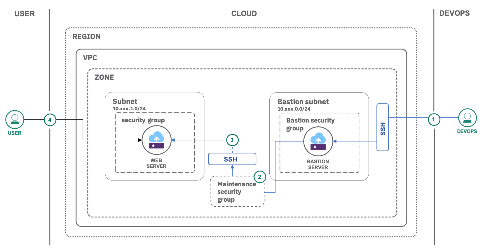

{{site.data.keyword.attribute-definition-list}}

# Securely access remote instances with a bastion host
{: #vpc-secure-management-bastion-server}
{: toc-content-type="tutorial"}
{: toc-services="vpc"}
{: toc-completion-time="1h"}

This tutorial may incur costs. Use the [Cost Estimator](/estimator) to generate a cost estimate based on your projected usage.
{: tip}


This tutorial walks you through the deployment of a bastion host to securely access remote instances within a Virtual Private Cloud (VPC). A bastion host is an instance that is provisioned with a public IP address and can be accessed via SSH. Once set up, the bastion host acts as a **jump** server, allowing secure connection to instances provisioned without a public IP address.
{: shortdesc}

To reduce exposure of servers within the VPC, you will create and use a bastion host. Administrative tasks on the individual servers are going to be performed using SSH, proxied through the bastion. Access to the servers and regular internet access from the servers, e.g., for software installation, will only be allowed with a special maintenance security group attached to those servers.

## Objectives
{: #vpc-secure-management-bastion-server-objectives}

- Learn how to set up a bastion host and security groups with rules
- Securely manage servers via the bastion host


{: caption="Figure 1. Architecture diagram of the tutorial" caption-side="bottom"}
{: style="text-align: center;"}

1. After setting up the required infrastructure (subnets, security groups with rules, virtual server instances) on the cloud, the admin (DevOps) connects (SSH) to the bastion host using the private SSH key.
2. The admin assigns a maintenance security group with proper outbound rules.
3. The admin connects (SSH) securely to the instance's private IP address via the bastion host to install or update any required software eg., a web server
4. The internet user makes an HTTP/HTTPS request to the web server.

## Before you begin
{: #vpc-secure-management-bastion-server-prereqs}

- Check for user permissions. Be sure that your user account has sufficient permissions to create and manage VPC resources. See the list of [required permissions](/docs/vpc?topic=vpc-managing-user-permissions-for-vpc-resources) for VPC.
- You need an SSH key to connect to the virtual servers. If you don't have an SSH key, see [the instructions](/docs/vpc?topic=vpc-ssh-keys) for creating a key for VPC.
- The tutorial assumes that you are adding the bastion host in an existing virtual private cloud. **If you don't have a VPC in your account, [create a VPC](/vpc-ext/provision/vpc){: external} before proceeding with the next steps.**

## Create a bastion host
{: #vpc-secure-management-bastion-server-create-bastion-host}
{: step}

In this section, you will create and configure a bastion host along with a security group in a separate subnet.

### Create a subnet
{: #vpc-secure-management-bastion-server-create-bastion-subnet}

1. Click **Subnets** under **Network** on the left pane, then click **Create**.
   1. Under **Location**, select a geography, region and zone.
   2. Enter **vpc-secure-bastion-subnet** as name, then select the Virtual Private Cloud you created.
   3. Select the same resource group as for your VPC.
   4. Leave the **Address prefix** as it is and select the **Total IP addresses** as 256.
2. Switch the **Public gateway** to **Attached**.

   Attach a public gateway to the subnet to allow all attached resources to communicate with the public internet.
   {: tip}

3. Click **Create subnet** to provision it.

### Create and configure bastion security group
{: #vpc-secure-management-bastion-server-create-configure-security-group }

Let's create a security group and configure inbound rules to your bastion VSI (virtual server instance).

1. Select [**Security groups**](/vpc-ext/network/securityGroups) under **Network**, then click **Create**.
2. Enter **vpc-secure-bastion-sg** as name and select the VPC you created earlier.
3. Select the same resource group as for your VPC.
3. Now, create the following inbound rules by clicking **Add** in the inbound section. They allow SSH access and Ping (ICMP). The values are shown in the table below.

   | Protocol | Port / Value                      | Source type |
   |------------|---------------------------------|-------------|
   |TCP         |Port range: 22-22                |Any          |
   |ICMP        |Type: **8**,Code: **Leave empty**|Any          |
   {: caption="Bastion: Inbound rules" caption-side="bottom"}

    To enhance security further, the inbound traffic could be restricted to the company network or a typical home network. You could run `curl ipecho.net/plain ; echo` to obtain your network's external IP address and use that instead.
    {: tip }

4. Click **Create security group** to create it.


### Create a bastion instance
{: #vpc-secure-management-bastion-server-create-bastion-instance}

With the subnet and security group already in place, next, create the bastion virtual server instance.

1. Under **Subnets** on the left pane, select **vpc-secure-bastion-subnet**.
2. Click on **Attached resources** and under **Attached instances**, click **Create** to provision a new virtual server called **vpc-secure-bastion-vsi** under the same resource group as your subnet.
3. Pick a **Location** and make sure to later use the same location again.
4. Under **Image** click on **Change image**. Use the search field to select **Ubuntu Linux** as your **Operating system**. You can pick any version of the image.
5. Click **Change profile**, select **Compute** as category and pick **cx2-2x4** (2 vCPUs and 4 GB RAM) as your profile.
6. Create a new **SSH key**, click **New key**
   1. Enter **vpc-ssh-key** as key name.
   2. Select the same resource group as for your VSI.
   3. Leave the **Region** as is.
   4. Copy the contents of your existing local SSH key and paste it under **Public key**.
   5. Click **Add SSH key**.
7. Scroll to select the VPC under **Networking**
8. Make sure that **Virtual network interface** is selected and **vpc-secure-bastion-subnet** is listed as subnet. Click the edit icon for that subnet.
   1. First, under **Network attachment and virtual network interface details**, verify that **vpc-secure-bastion-subnet** is selected. Click **Next**.
   2. For **Network** in the **Security Groups** section, uncheck the default security group and mark **vpc-secure-bastion-sg**. Click **Next**.
   3. In the **IP configuration** dialog leave everything as is and click **Next**.
   4. Last, review everything and finish by clicking **Save**.
9.  Click **Create virtual server**.
10.  Once the instance is up and **Running**, click on **vpc-secure-bastion-vsi** and **reserve** a floating IP by clicking on the **Edit** icon under **Network interfaces**, then under **Floating IP address** selecting **Reserve a new floating IP**. Click **Save** to finish.

### Test your bastion
{: #vpc-secure-management-bastion-server-6}

Once your bastion's floating IP address is active, try connecting to it using **ssh**:

```sh
ssh -i ~/.ssh/<PRIVATE_KEY> root@<BASTION_FLOATING_IP_ADDRESS>
```
{: pre}

## Configure a security group with maintenance access rules
{: #vpc-secure-management-bastion-server-maintenance-security-group}
{: step}

With access to the bastion working, continue and create the security group for maintenance tasks like installing and updating the software.

1. Select [**Security groups**](/vpc-ext/network/securityGroups) under **Network**, then click **Create**.
2. Enter **vpc-secure-maintenance-sg** as name and select the VPC you created earlier.
3. Select the same resource group as for your VPC.
4. Next, add the **inbound** rule shown in the table below. It allows SSH access from the bastion host.
   | Protocol | Port / Value  | Source type   | Source              |
   |------------|-------------|---------------|---------------------|
   |TCP         |Ports 22-22  |Security group |vpc-secure-bastion-sg|
   {: caption="Maintenance: Inbound rules" caption-side="bottom"}

5. Next, add the **outbound** rule shown in the table below. It allows SSH access from the bastion host.

   | Protocol   | Port / Value|Destination type |
   |------------|-------------|-----------------|
   |TCP         |Ports 80-80  |Any              |
   |TCP         |Ports 443-443|Any              |
   |TCP         |Ports 53-53  |Any              |
   |UDP         |Ports 53-53  |Any              |
   {: caption="Maintenance: Outbound rules" caption-side="bottom"}  

   DNS server requests are addressed on port 53. DNS uses TCP for Zone transfer and UDP for name queries either regular (primary) or reverse. HTTP requests are on port 80 and 443.
   {: tip }

6. Click **Create security group** to create it.
7. Navigate to **Security Groups**, then select **vpc-secure-bastion-sg**.
8. Finally, edit the security group and add the following **outbound** rule.


   | Protocol | Destination type | Destination | Port / Value   |
   |------------|---------------|----------|-----------  |
   |TCP         |Security group |vpc-secure-maintenance-sg|Ports 22-22  |
   {: caption="Bastion: Outbound rules" caption-side="bottom"}


## Use the bastion host to access other instances in the VPC
{: #vpc-secure-management-bastion-server-bastion-host-access-instances}
{: step}

In this section, you will create a subnet with virtual server instance and a security group.

If you already have virtual server instances in your VPC that you want to connect to, you can skip the next three sections and start at [Add virtual server instance(s) to the maintenance security group](#vpc-secure-management-bastion-server-add-vsi-to-maintenance).

### Create a subnet
{: #vpc-secure-management-bastion-server-create-private-subnet}

To create a new subnet,

1. Click **Subnets** under **Network** on the left pane, then click **Create**.
   1. Enter **vpc-secure-private-subnet** as name, then select the VPC you created.
   2. Select the same resource group as for your VPC.
   3. Select a **Location**.
   4. Leave the **Address prefix** as it is and select the **Total IP addresses** as 256.
2. Switch the **Public gateway** to **Attached**.
3. Click **Create subnet** to provision it.

### Create a security group
{: #vpc-secure-management-bastion-server-10}

To create a new security group:

1. Click **Security groups** under Network, then click **Create**.
2. Enter **vpc-secure-private-sg** as name and select the VPC you created earlier.
3. Click **Create security group**.

### Create a virtual server instance
{: #vpc-secure-management-bastion-server-11}

To create a virtual server instance in the newly created subnet:
1. Click on the subnet **vpc-secure-private-subnet** created earlier under **Subnets**.
1. Click **Attached resources**, under **Attached instances**, click **Create**.
1. To configure the instance:
   1. Enter a unique name, **vpc-secure-private-vsi** and resource group as earlier.
   2. Select the same **Location** already used by the bastion virtual server.
   3. Select **Public** type of virtual server.
   4. Under **Image** click on **Change image**. Use the search field to select **Ubuntu Linux** as your **Operating system**. You can pick any version of the image.
   5. Click **Change profile**, select **Compute** as category and pick **cx2-2x4** (2 vCPUs and 4 GB RAM) as your profile.
   6. For **SSH keys** pick the SSH key you created earlier for the bastion.
1. Further down, select the VPC your created. Similar to above, click the edit icon for **vpc-secure-private-subnet** under **Network attachment and virtual network interface details**. 
   1. Next, verify that **vpc-secure-private-subnet** is selected. Click **Next**.
   2. For **Network** in the **Security Groups** section, uncheck the default security group and mark **vpc-secure-private-sg**. Click **Next**.
   3. In the **IP configuration** dialog leave everything as is and click **Next**.
   4. Last, review everything and finish by clicking **Save**.
1. Click **Create virtual server**.

### Add virtual server instance(s) to the maintenance security group
{: #vpc-secure-management-bastion-server-add-vsi-to-maintenance}

For administrative work on the servers, you have to associate the specific virtual servers with the maintenance security group. In the following, you will enable maintenance, log into the private server, update the software package information, then disassociate the security group again.

Let's enable the maintenance security group for the server.

1. Navigate to **Security groups** and select **vpc-secure-maintenance-sg** security group.
2. Click on the **Attached resources** tab and in the filter select **Virtual server interface**.
3. Click **Edit virtual server interfaces** to see a list of VSIs. Expand the list and check the selection next to the **Interfaces** column for **vpc-secure-private-vsi**.
5. Click **Save** for the changes to be applied.

### Connect to the instance
{: #vpc-secure-management-bastion-server-13}

To SSH into an instance using its **private IP**, you will use the bastion host as your **jump host**.

1. In the left menu, select **Virtual server instances** in the Compute section. Note the **Reserved IP** (private IP) address for **vpc-secure-private-vsi**.
2. Use the ssh command with `-J` to log into the server with the bastion **floating IP** address you used earlier and the server **Private IP** address you just looked up.

   ```sh
   ssh -J root@<BASTION_FLOATING_IP_ADDRESS> root@<PRIVATE_IP_ADDRESS>
   ```
   {: pre}

   `-J` flag is supported in OpenSSH version 7.3+. In older versions `-J` is not available. In this case the safest and most straightforward way is to use ssh's stdio forwarding (`-W`) mode to "bounce" the connection through a bastion host. e.g., `ssh -o ProxyCommand="ssh -W %h:%p root@<BASTION_FLOATING_IP_ADDRESS" root@<PRIVATE_IP_ADDRESS>`
   {: tip }

### Install software and perform maintenance tasks
{: #vpc-secure-management-bastion-server-14}

Once connected, you can install software on the virtual server or perform maintenance tasks.

1. First, update the software package information:
   ```sh
   apt-get update
   ```
   {: pre}

2. Install the desired software, e.g., Nginx or MySQL or IBM Db2.

When done, disconnect from the server with `exit` command.

To allow HTTP/HTTPS requests from the internet user, assign a **floating IP** to the VSI and open required ports (80 - HTTP and 443 - HTTPS) via the inbound rules in the security group of private VSI.
{: tip}

### Disable the maintenance security group
{: #vpc-secure-management-bastion-server-15}

Once you're done installing software or performing maintenance, you should remove the virtual servers from the maintenance security group to keep them isolated.

1. Navigate to **Security groups** and select **vpc-secure-maintenance-sg** security group.
2. Click **Attached resources**, then **Edit virtual server interfaces**.
3. Expand the virtual server instances and uncheck the selection next to the **Interfaces** column for **vpc-secure-private-vsi**.
4. Click **Save** for the changes to be applied.

You may repeat the `ssh` command from above with the jump host option. It should fail now.
{: note}

## Remove resources
{: #vpc-secure-management-bastion-server-removeresources}
{: step}

1. Switch to **Virtual server instances**, **Stop** and **Delete** your instances by clicking the respective action menu.
2. Once the VSIs are gone, switch to **Subnets** and delete your subnets.
3. After the subnets have been deleted, switch to the **VPCs** tab and delete your VPC.

When using the console, you may need to refresh your browser to see updated status information after deleting a resource.
{: tip}

## Related content
{: #vpc-secure-management-bastion-server-related}

- [Public frontend and private backend in a Virtual Private Cloud](/docs/solution-tutorials?topic=solution-tutorials-vpc-public-app-private-backend#vpc-public-app-private-backend)
- [Install software on virtual server instances in VPC](/docs/solution-tutorials?topic=solution-tutorials-vpc-app-deploy)
