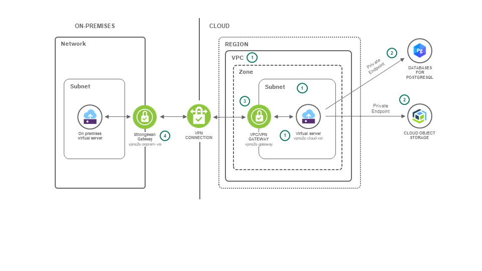

{:step: data-tutorial-type='step'}
{:shortdesc: .shortdesc}
{:new_window: target="_blank"}
{:codeblock: .codeblock}
{:screen: .screen}
{:tip: .tip}
{:pre: .pre}
{:important: .important}
{:note: .note}

# Use a VPC/VPN gateway for secure and private on-premises access to cloud resources
{: #vpc-site2site-vpn}
{: toc-content-type="tutorial"}
{: toc-services="vpc, cloud-object-storage, databases-for-postgresql"}
{: toc-completion-time="2h"}

<!--##istutorial#-->
This tutorial may incur costs. Use the [Cost Estimator](https://{DomainName}/estimator/review) to generate a cost estimate based on your projected usage.
{: tip}
<!--#/istutorial#-->

IBM offers a number of ways to securely extend an on-premises computer network with resources in the {{site.data.keyword.cloud_notm}}. This allows you to benefit from the elasticity of provisioning servers when you need them and removing them when no longer required. Moreover, you can easily and securely connect your on-premises capabilities to the {{site.data.keyword.cloud_notm}} services.

This tutorial walks you through connecting an on-premises Virtual Private Network (VPN) gateway to a cloud VPN created within a VPC (a VPC/VPN gateway). First, you will create a new {{site.data.keyword.vpc_full}} (VPC) and the associated resources like subnets, network Access Control Lists (ACLs), Security Groups and Virtual Server Instances (VSIs).
The VPC/VPN gateway will establish an [IPsec](https://en.wikipedia.org/wiki/IPsec) site-to-site link to an on-premises VPN gateway. The IPsec and the [Internet Key Exchange](https://en.wikipedia.org/wiki/Internet_Key_Exchange), IKE, protocols are proven open standards for secure communication.
{: shortdesc}

To further demonstrate secure and private access, you will deploy a microservice on a VSI to access {{site.data.keyword.cloud_notm}} services, representing a line of business application.
The services have direct or private endpoints that can be used for secure no cost ingress/egress when all access is within the same region of the {{site.data.keyword.cloud_notm}}. An on-premises computer will access the microservice. All traffic will flow through the VPN and hence privately through {{site.data.keyword.cloud_notm}}.

There are many popular on-premises VPN solutions for site-to-site gateways available. This tutorial utilizes the [strongSwan](https://www.strongswan.org/) VPN Gateway to connect with the VPC/VPN gateway. To simulate an on-premises data center, you will install the strongSwan gateway on a VSI in {{site.data.keyword.cloud_notm}}.

In short, using a VPC you can

- connect your on-premises systems to services and workloads running in {{site.data.keyword.cloud_notm}},
- ensure private and low cost connectivity to {{site.data.keyword.cloud_notm}} services,
- connect your cloud-based systems to services and workloads running on-premises.

## Objectives
{: #vpc-site2site-vpn-objectives}

* Access a virtual private cloud environment from an on-premises data center or (virtual) private cloud.
* Securely reach cloud services using private service endpoints.


The following diagram shows the virtual private cloud containing an app server. The app server hosts a microservice interfacing with {{site.data.keyword.cloud_notm}} services. A (simulated) on-premises network and the virtual cloud environment are connected via VPN gateways.



1. The infrastructure (VPC, Subnets, Security Groups with rules, Network ACL and VSIs) are set up using a provided script.
2. The microservice interfaces with {{site.data.keyword.cos_short}} and {{site.data.keyword.databases-for-postgresql}} through private endpoints.
3. A VPC/VPN Gateway is provisioned to expose the virtual private cloud environment to the on-premises network.
4. The strongSwan open source IPsec gateway software is used on-premises to establish the VPN connection with the cloud environment.
5. The VPC/VPN allows access to service endpoints from on-premises [Access service endpoints using VPN](https://{DomainName}/docs/vpc?topic=vpc-build-se-connectivity-using-vpn), we will test this scenario at then end of this tutorial.

## Before you begin
{: #vpc-site2site-vpn-prereqs}

This tutorial requires:
* {{site.data.keyword.cloud_notm}} CLI,
   * {{site.data.keyword.vpc_short}} plugin (`vpc-infrastructure`),
* `jq` to query JSON files,
* `git` to clone source code repository.

<!--##istutorial#-->
You will find instructions to download and install these tools for your operating environment in the [Getting started with tutorials](https://{DomainName}/docs/solution-tutorials?topic=solution-tutorials-tutorials) guide.
<!--#/istutorial#-->

In addition:
- check for user permissions. Be sure that your user account has sufficient permissions to create and manage VPC resources. For a list of required permissions, see [Granting permissions needed for VPC users](/docs/vpc?topic=vpc-managing-user-permissions-for-vpc-resources).
- you need an SSH key to connect to the virtual servers. If you don't have an SSH key, see the [instructions for creating a key](/docs/vpc?topic=vpc-getting-started#prereqs).
- you need another SSH key to connect to the classic infrastructure virtual server. If you don't have such an SSH key, see [Adding an SSH key](https://{DomainName}/docs/ssh-keys?topic=ssh-keys-adding-an-ssh-key).

## Deploy a virtual app server in a virtual private cloud
{: #vpc-site2site-vpn-deploy}
{: step}

In the following, you will download the scripts to set up a baseline VPC environment and code for a microservice to interface with the {{site.data.keyword.cos_short}}. Then, you will provision the services and set up the baseline VPC and simulated on-prem resources.

### Get the code
{: #vpc-site2site-vpn-setup}
The tutorial uses scripts to deploy a baseline of infrastructure resources before you create the VPN gateways. These scripts and the code for the microservice is available in a GitHub repository.

1. Get the application's code:
   ```sh
   git clone https://github.com/IBM-Cloud/vpc-tutorials
   ```
   {: codeblock}

2. Go to the directory for the scripts used for this tutorial by changing into **vpc-tutorials**, then **vpc-site2site-vpn**:
   ```sh
   cd vpc-tutorials/vpc-site2site-vpn
   ```
   {: codeblock}


### Create services
{: #vpc-site2site-vpn-create-services}

#### {{site.data.keyword.cos_short}}
{: #vpc-site2site-vpn-create-cos}

In this section, you will login to {{site.data.keyword.cloud_notm}} on the CLI and create an instance of {{site.data.keyword.cos_short}}.

1. Use `ibmcloud login` to log in interactively into {{site.data.keyword.cloud}}. You can reconfirm the details by running `ibmcloud target`.
2. Create an instance of [{{site.data.keyword.cos_short}}](https://{DomainName}/catalog/services/cloud-object-storage) using a **standard** or **lite** plan.
   ```sh
   ibmcloud resource service-instance-create vpns2s-cos cloud-object-storage standard global
   ```
   {: codeblock}

   Note that only one lite instance can be created per account. If you already have an instance of {{site.data.keyword.cos_short}}, you can reuse it.
   {: tip}

3. Create a service key with role **Writer**:
   ```sh
   ibmcloud resource service-key-create vpns2s-cos-key Writer --instance-name vpns2s-cos
   ```
   {: codeblock}

4. Obtain the service key details in JSON format and store it in a new file **credentials.json**. The file will be used later on by the app.
   ```sh
   ibmcloud resource service-key vpns2s-cos-key --output json > cos_credentials.json
   ```
   {: codeblock}

#### {{site.data.keyword.databases-for-postgresql}}
{: #vpc-site2site-vpn-create-postgresql}

In this section, you will create the database service.

1. Create an instance of [{{site.data.keyword.databases-for-postgresql}}](https://{DomainName}/catalog/services/databases-for-postgresql) using a **standard** plan. Replace **<region_name>** accordingly.
   ```sh
   ibmcloud resource service-instance-create vpns2s-pg databases-for-postgresql databases-for-postgresql-standard <region_name> --service-endpoints private
   ```
   {: codeblock}

   The service will take a few minutes to provision, you will receive an output similar to the following
   ```sh
   Name:                vpns2s-pg
   ID:                  crn:v1:bluemix:public:databases-for-postgresql:eu-gb:a/12412::
   GUID:                12312
   Location:            eu-gb
   State:               inactive
   Type:                service_instance
   Sub Type:            Public
   Service Endpoints:   private
   Created at:          2019-06-27T19:26:57Z
   Updated at:          2019-06-27T19:26:57Z
   Last Operation:
                        Status       create in progress
                        Updated At   2019-06-27 19:26:57.183633222 +0000 UTC
   ```

   You can get updates on the status by issuing the following command periodically
   ```sh
   ibmcloud resource service-instance vpns2s-pg
   ```
   {: codeblock}

   While waiting for the service to create, you can proceed with the steps in the other sections of this tutorial and come back to perform steps 2 and 3 below.  

2. Once you have verified the service status changed to "create succeeded", you may proceed to create a service key with role **Administrator**:
   ```sh
   ibmcloud resource service-key-create vpns2s-pg-key --instance-name vpns2s-pg
   ```
   {: codeblock}

3. Obtain the service key details in JSON format and store it in a new file **pg_credentials.json**. The file will be used later on by the app.
   ```sh
   ibmcloud resource service-key vpns2s-pg-key --output json > pg_credentials.json
   ```
   {: codeblock}

4. Save the self-signed certificate to a file **<generated>**. The file will be used later on.
   ```sh
   ibmcloud cdb deployment-cacert vpns2s-pg -e private -c ../sampleapps/nodejs-graphql/ -s
   ```
   {: codeblock}

   You will get a result similar to the following, take note of the name of the file generated following `nodejs-graphql/`:

   ```
   Retrieving certificate for vpns2s-pg...
   OK

   Certificate written to nodejs-graphql/1575c397-934c-11e9-a1a6-c27ac0347fc3
   ```

### Create Virtual Private Cloud baseline resources
{: #vpc-site2site-vpn-create-vpc}
The tutorial provides a script to create the baseline resources required for this tutorial, i.e., the starting environment. The script can either generate that environment in an existing VPC or create a new VPC.

In the following, create these resources by configuring and then running a setup script. The script incorporates the setup of a bastion host as discussed in [securely access remote instances with a bastion host](https://{DomainName}/docs/solution-tutorials?topic=solution-tutorials-vpc-secure-management-bastion-server).

1. In the directory **vpc-site2site-vpn**, copy over the sample configuration file into a file to use:

   ```sh
   cp config.sh.sample config.sh
   ```
   {: codeblock}

2. Edit the file **config.sh** and adapt the settings to your environment. You need to change the value of **SSHKEYNAME** to the name or comma-separated list of names of SSH keys (see "Before you begin"). Modify the different **ZONE** settings to match your cloud region. All other variables can be kept as is or are explained in the next section.
3. Make sure that your CLI environment is set up to the target generation 2. Run:
   ```sh
   ibmcloud is target --gen 2
   ```
   {: codeblock}

4. To create the resources in a new VPC, run the script as follows:
   ```sh
   ./vpc-site2site-vpn-baseline-create.sh
   ```
   {: codeblock}

   To reuse an existing VPC, pass its name to the script in this way. Replace **YOUR_EXISTING_VPC** with the actual VPC name.
   ```sh
   REUSE_VPC=YOUR_EXISTING_VPC ./vpc-site2site-vpn-baseline-create.sh
   ```
   {: codeblock}

5. This will result in creating the following resources, including the bastion-related resources:
   - 1 VPC (optional)
   - up to 3 public gateways, 1 per zone if not already present
   - 2 subnets within the VPC
   - 3 security groups with ingress and egress rules
   - 2 VSIs: vpns2s-cloud-vsi (floating-ip is VSI_CLOUD_IP) and vpns2s-bastion (floating-ip is BASTION_IP_ADDRESS)

   Note the values for **BASTION_IP_ADDRESS**, **VSI_CLOUD_IP**, and **CLOUD_CIDR**. The output is also stored in the file **network_config.sh**. The file can be used for automated setup.

### Create an on-premises virtual server
{: #vpc-site2site-vpn-create-onprem}

To simulate the on-premises environment, you create a virtual server (VSI) with classic infrastructure. In the same directory as for the previous section, follow these steps:
1. Edit the file **config.sh** and adapt the settings to your environment. Change the value of **SSHKEYNAME_CLASSIC** to the name or comma-separated list of names of SSH keys for classic infrastructure (see "Before you begin"). Modify **DATACENTER_ONPREM** to a different value if needed. You can obtain the list of supported data centers using `ibmcloud sl vs options`.
2. Create the VSI to simulate the on-prem environment by executing:

   ```sh
   ./onprem-vsi-create.sh
   ```
   {: codeblock}

3. Note down the returned values for **VSI_ONPREM_IP** and **ONPREM_CIDR**.  These values have also been added to the file **network_config.sh**


### Create the Virtual Private Network gateway and connection
{: #vpc-site2site-vpn-create-vpn}

In the following, you will add a VPN gateway and an associated connection to the subnet with the application VSI.  Values that come from the **network_config.sh** file created earlier are referenced with a **$x** like **$VSI_ONPREM_IP**

1. Navigate to [VPC overview](https://{DomainName}/vpc-ext/overview) page, then click on **VPN gateways** in the navigation tab and insure the **VPN Gateway** tab is selected and click **Create**.  The form **New VPN gateway for VPC** will be displayed.
1. Set **VPN gateway name** to **vpns2s-gateway**
1. Select the **Virtual Private Cloud** from the drop down created (vpns2s) or referenced earlier
1. Select the same **Resource group**
1. Select **vpns2s-cloud-subnet** as the subnet.
1. Select **Policy-based** as the **Mode**
1. Leave **New VPN connection for VPC** activated. 
1. Set **VPN connection name** to **vpns2s-gateway-conn**.
1. Set **Peer gateway address** to **$VSI_ONPREM_IP** (the floating IP address of **vpns2s-onprem-vsi**).
1. Set **Preshared key** to **20_PRESHARED_KEY_KEEP_SECRET_19**
1. Set **Local subnets** to **$CLOUD_CIDR**
1. Set **Peer subnets** to **$ONPREM_CIDR**.
1. Leave the defaults for **Dead peer detection**, IKE policy - Auto (IKEv2) and IPsec Policy - Auto
1. Click **Create VPN gateway**


- Wait for the VPN gateway to become available (you may need to refresh the screen).
- Click the VPN gateway created to open the details page
- Note the assigned VPN gateway **IP address** it will be referenced as **$GW_CLOUD_IP** below.
- The VPN connection status will be **down** until the peer on-premises Virtual Private Network gateway is created.

### Create the on-premises Virtual Private Network gateway
{: #vpc-site2site-vpn-10}
{: create-on-prem}

Next, you will create the VPN gateway on the other site, in the simulated on-premises environment. You will use the open source-based IPsec software [strongSwan](https://strongswan.org/).

1. Load the file **network_config.sh** into the shell environment to make the configuration available for further shell commands.
   ```sh
   source network_config.sh
   ```
   {: pre}

2. Connect to the "on-premises" VSI **vpns2s-onprem-vsi** using ssh.

   ```sh
   ssh root@$VSI_ONPREM_IP
   ```
   {: pre}

   Depending on your environment, you may need to use `ssh -i <path to your private key file> root@$VSI_ONPREM_IP`.
   {: tip}

3. Next, on the machine **vpns2s-onprem-vsi**, execute the following commands to update the package manager and to install the strongSwan software.

   ```sh
   apt-get update
   ```
   {: pre}

   ```sh
   apt-get install strongswan -y
   ```
   {: pre}

4. Configure the file **/etc/sysctl.conf** by adding three lines to its end. Copy the following over and run it:

   ```sh
   cat >> /etc/sysctl.conf << EOF
   net.ipv4.ip_forward = 1
   net.ipv4.conf.all.accept_redirects = 0
   net.ipv4.conf.all.send_redirects = 0
   EOF
   ```
   {: codeblock}

   Execute the following command to load values from the file created above: 
   ```sh
   sysctl -p
   ```
   {: codeblock}

5. Next, edit the file **/etc/ipsec.secrets**. Add the following line to configure source and destination IP addresses and the pre-shared key configured earlier. Replace **$VSI_ONPREM_IP** with the known value of the floating ip of the vpns2s-onprem-vsi.  Replace the **$GW_CLOUD_IP** with the known ip address of the VPC VPN gateway.

   ```
   $VSI_ONPREM_IP $GW_CLOUD_IP : PSK "20_PRESHARED_KEY_KEEP_SECRET_19"
   ```
   {: codeblock}

6. The last file you need to configure is **/etc/ipsec.conf**. Add the following codeblock to the end of that file. Replace **$ONPREM_IP**, **$ONPREM_CIDR**, **$GW_CLOUD_IP**, and **$CLOUD_CIDR** with the respective known values.

   ```sh
   # basic configuration
   config setup
      charondebug="all"
      uniqueids=yes
      strictcrlpolicy=no

   # connection to vpc/vpn datacenter
   # left=onprem / right=vpc
   conn tutorial-site2site-onprem-to-cloud
      authby=secret
      left=%defaultroute
      leftid=$VSI_ONPREM_IP
      leftsubnet=$ONPREM_CIDR
      right=$GW_CLOUD_IP
      rightsubnet=$CLOUD_CIDR,166.8.0.0/14,161.26.0.0/16
      ike=aes256-sha2_256-modp1024!
      esp=aes256-sha2_256!
      keyingtries=0
      ikelifetime=1h
      lifetime=8h
      dpddelay=30
      dpdtimeout=120
      dpdaction=restart
      auto=start
   ```
   {: codeblock}

7. Restart the VPN gateway, then check its status by running: ipsec restart

   ```sh
   ipsec restart
   ```
   {: pre}

   ```sh
   ipsec status
   ```
   {: pre}

   It should report that a connection has been established. Keep the terminal and ssh connection to this machine open.

## Test the connectivity
{: #vpc-site2site-vpn-test-connectivity}
{: step}

You can test the site to site VPN connection by using SSH or by deploying the microservice interfacing {{site.data.keyword.cos_short}}.

### Test using ssh
{: #vpc-site2site-vpn-test-with-ssh}

To test that the VPN connection has been successfully established, use the simulated on-premises environment as proxy to log in to the cloud-based application server.

1. In a new terminal, execute the following command after sourcing **network_config.sh** again. It uses the strongSwan host as jump host to connect via VPN to the application server's private IP address.
   ```sh
   source network_config.sh
   ```
   {: pre}

   ```sh
   ssh -J root@$VSI_ONPREM_IP root@$VSI_CLOUD_IP
   ```
   {: pre}

2. Once successfully connected, close the ssh connection.

3. In the "onprem" VSI terminal, stop the VPN gateway:
   ```sh
   ipsec stop
   ```
   {: pre}

4. In the command window from step 1), try to establish the connection again:

   ```sh
   ssh -J root@$VSI_ONPREM_IP root@$VSI_CLOUD_IP
   ```
   {: pre}

   The command should not succeed because the VPN connection is not active and hence there is no direct link between the simulated on-prem and cloud environments.

5. In the "onprem" VSI terminal, start the VPN gateway again:
   ```sh
   ipsec start
   ```
   {: pre}


### Set up a microservice for testing
{: #vpc-site2site-vpn-setup-microservice}

You can test the working VPN connection by accessing a microservice on the cloud VSI from the "onprem" VSI. You need to make sure to have completed all the steps found under [Create Services {{site.data.keyword.databases-for-postgresql}}](#create-postgresql) prior to proceeding through the steps in this section. Here you set up the app.

1. Back on your local machine, change the working directory and switch to **sampleapps**:
   ```sh
   cd ../sampleapps
   ```
   {: codeblock}

   Move over the previously generated configuration files into the **nodejs-graphql/config** subdirectory:
   ```sh
   mv ../vpc-site2site-vpn/*_credentials.json nodejs-graphql/config/
   ```
   {: codeblock}

2. The app is only run on the cloud VSI, but some of the configuration information is also needed on the on-premises VSI, so you will need to copy the directory to both computers.  The command uses the bastion as a jump host to the cloud VSI.
   ```sh
   scp -r -o "ProxyJump root@$BASTION_IP_ADDRESS" nodejs-graphql root@$VSI_CLOUD_IP:nodejs-graphql
   ```
   {: pre}

   ```sh
   scp -r nodejs-graphql root@$VSI_ONPREM_IP:nodejs-graphql
   ```
   {: pre}

2. Connect to the cloud VSI, again using the bastion as jump host.
   ```sh
   ssh -J root@$BASTION_IP_ADDRESS root@$VSI_CLOUD_IP
   ```
   {: pre}

3. On the cloud VSI, change into the code directory:
   ```sh
   cd nodejs-graphql
   ```
   {: pre}

4. Install Node.js 12.x and the Node package manager (NPM).
   ```sh
   curl -sL https://deb.nodesource.com/setup_12.x | bash -
   ```
   {: pre}

   ```sh
   apt-get update; apt-get install nodejs -y
   ```
   {: pre}

5. Install the necessary modules using **npm**, then build the app:
   ```sh
   npm install
   ```
   {: pre}

   ```sh
   npm run build
   ```
   {: pre}

6. Copy the config/config.template.json to config/config.json
   ```sh
   cp config/config.template.json config/config.json
   ```
   {: pre}

7. You can keep the defaults found in the `config/config.json` file or modify for your desired storage location/settings.
   ```json
   {
   "cookie": "some_ridiculously_long_string_of_your_choice_or_keep_this_one",
   "cloud_object_storage": {
      "bucketName": "vpns2s-bucket",
      "endpoint_type": "regional",
      "region": "us-south",
      "type": "direct",
      "location": "us-south",
      "location_constraint": "standard"
   }
   ```
   {: pre}

8. Create the tables in the PostgreSQL database. The script leverages the file `config/pg_credentials.json`, retrieves and uses the private endpoint to the PostgreSQL database, the private endpoint is reachable only from the VPC.
   ```sh
   node ./build/createTables.js
   ```
   {: pre}

9. Create the cloud object storage bucket in the database. The script leverages `config/config.json`, retrieves and uses the direct endpoint to Cloud Object Storage, the direct endpoint is reachable only from the VPC.
   ```sh
   node ./build/createBucket.js
   ```
   {: pre}

   The command should return something similar to this:
   ```
   Creating new bucket: transactions

   Bucket: transactions created!

   Retrieving list of buckets:
   Bucket Name: transactions
   ```
10. Run the app.
   ```sh
   npm run start
   ```
   {: pre}

### Test using a microservice
{: #vpc-site2site-vpn-test-with-microservice}

With the microservice app set up and running, test the scenario by accessing the cloud resources from the on-prem machine.

1. In a new terminal, retrieve the network configuration and then access the "onprem" VSI terminal via SSH.
   ```sh
   source ../vpc-site2site-vpn/network_config.sh
   ```
   {: pre}

   ```sh
   ssh root@$VSI_ONPREM_IP
   ```
   {: pre}

2. Issue the following curl commands to query the API server running on the cloud VSI. The API server will read content from the {{site.data.keyword.databases-for-postgresql}} over the private endpoint. There is no content in the database by default, it should return an empty array.

   ```sh
   VSI_CLOUD_IP=$VSI_CLOUD_IP
   ```
   {: pre}

   ```sh
   curl \
   -X POST \
   -H "Content-Type: application/json" \
   --data '{ "query": "query read_database { read_database { id balance transactiontime } }" }' \
   http://$VSI_CLOUD_IP/api/bank
   ```
   {: pre}

3. The API server will read content from the {{site.data.keyword.cos_short}} and return the results in JSON format over the direct endpoint, there is no content in the bucket by default, it should return an empty array.
   ```sh
   curl \
   -X POST \
   -H "Content-Type: application/json" \
   --data '{ "query": "query read_items { read_items { key size modified } }" }' \
   http://$VSI_CLOUD_IP/api/bank
   ```
   {: pre}

4. The API server will in a single operation create a record in the {{site.data.keyword.databases-for-postgresql}} using the private endpoint and add an item to the {{site.data.keyword.cos_short}} bucket using the direct endpoint and return the results in JSON format.
   ```sh
   curl \
   -X POST \
   -H "Content-Type: application/json" \
   --data '{ "query": "mutation add_to_database_and_storage_bucket { add(balance: 10, item_content: \"Payment for movie, popcorn and drink...\") { id status } }" }' \
   http://$VSI_CLOUD_IP/api/bank
   ```
   {: pre}

5. The API server will read content from the {{site.data.keyword.databases-for-postgresql}} and {{site.data.keyword.cos_short}} and return the results in JSON format.
   ```sh
   curl \
   -X POST \
   -H "Content-Type: application/json" \
   --data '{ "query": "query read_database_and_items { read_database { id balance transactiontime } read_items { key size modified } }" }' \
   http://$VSI_CLOUD_IP/api/bank
   ```
   {: pre}

6. Using your browser, access the [Resource List](https://{DomainName}/resources), navigate to the **Storage** category and open the `vpns2s-cos` {{site.data.keyword.cos_short}}.  You can open the storage bucket that was created and view the file that was added by the API server along with the metadata associated with it.

### Test connecting from on-premises to service endpoint over the VPN connection
{: #vpc-site2site-vpn-test-service-endpoint}

In some situations, it might be desirable to interact directly from an on-premises application to a Cloud service that is only accessible via a private endpoint. For example, leveraging a message-queueing service such as [{{site.data.keyword.messages-for-rabbitmq}}](https://{DomainName}/catalog/services/messages-for-rabbitmq) with a Producer running in the Cloud and a Consumer running on-premises.  In our example, we will interact directly with the {{site.data.keyword.databases-for-postgresql}} we have been using from the on-prem VSI.

1. Edit the file located under the
**sampleapps/nodejs-graphql/config/pg_credentials.json** subdirectory in your local system to obtain your {{site.data.keyword.databases-for-postgresql}} credentials.
1. Copy the command found under `credentials.connection.cli.composed` to be used later. You can use `jq` to extract the value: `jq '.[]|.credentials.connection.cli.composed' pg_credentials.json`.
2. In the same terminal window used to conduct the previous test and connected to the "onprem" VSI terminal via SSH. Issue the following command:

   ```sh
   apt-get install postgresql-client -y
   ```
   {: pre}

3. From the shell, issue the command captured in step 1 to connect to the {{site.data.keyword.databases-for-postgresql}} directly over the private endpoint.

4. From the `ibmclouddb=>` prompt issue the following command:

   ```sql
   select * from accounts;
   ```
   {: pre}

   You should get a listing of all records previously created via the curl command in the previous section. This demonstrate that you are able to access the {{site.data.keyword.databases-for-postgresql}} database over the private endpoint from an on-premises server.


## Remove resources
{: #vpc-site2site-vpn-remove-resources}
{: step}

1. In the VPC management console, click on **VPNs**. In the action menu on the VPN gateway select **Delete** to remove gateway.
2. Next, click **Floating IPs** in the navigation, then on the IP address for your VSIs. In the action menu select **Release**. Confirm that you want to release the IP address.
3. Next, switch to **Virtual server instances**, **Stop** and **Delete** your instances.
4. Once the VSIs are gone, switch to **Subnets**. If the subnet has an attached public gateway, then click on the subnet name. In the subnet details, detach the public gateway. Subnets without public gateway can be deleted from the overview page. Delete your subnets.
5. After the subnets have been deleted, switch to **VPC** and delete your VPC.
6. In the terminal and while in the directory **vpc-site2site-vpn**, remove the classic VSI by executing the script:
   ```sh
   BASENAME=vpns2s ./onprem-vsi-remove.sh
   ```
   {: codeblock}

7. Delete the instance of [{{site.data.keyword.cos_short}}](https://{DomainName}/catalog/services/cloud-object-storage).  Delete the key:
   ```sh
   ibmcloud resource service-key-delete vpns2s-cos-key
   ```
   {: codeblock}

   delete the resource
   ```sh
   ibmcloud resource service-instance-delete vpns2s-cos
   ```
   {: codeblock}

8. Delete the instance of [{{site.data.keyword.databases-for-postgresql}}](https://{DomainName}/catalog/services/databases-for-postgresql).
   ```sh
   ibmcloud resource service-key-delete vpns2s-pg-key
   ```
   {: codeblock}
   
   ```sh
   ibmcloud resource service-instance-delete vpns2s-pg
   ```
   {: codeblock}

When using the console, you may need to refresh your browser to see updated status information after deleting a resource.
{: tip}

## Expand the tutorial
{: #vpc-site2site-vpn-expand-tutorial}

Want to add to or extend this tutorial? Here are some ideas:

- Add a [load balancer](/docs/vpc?topic=vpc-nlb-vs-elb) to distribute inbound microservice traffic across multiple instances.
- Deploy the [application on a public server, your data and services on a private host](https://{DomainName}/docs/solution-tutorials?topic=solution-tutorials-vpc-public-app-private-backend).


## Related content
{: #vpc-site2site-vpn-related}

- [IBM Cloud CLI plugin for VPC Reference](/docs/vpc?topic=vpc-infrastructure-cli-plugin-vpc-reference)
- [VPC using the REST APIs](/docs/vpc?topic=vpc-creating-a-vpc-using-the-rest-apis)
- Solution tutorial: [Securely access remote instances with a bastion host](https://{DomainName}/docs/solution-tutorials?topic=solution-tutorials-vpc-secure-management-bastion-server)
