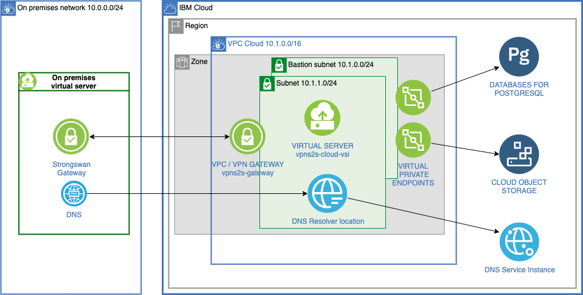
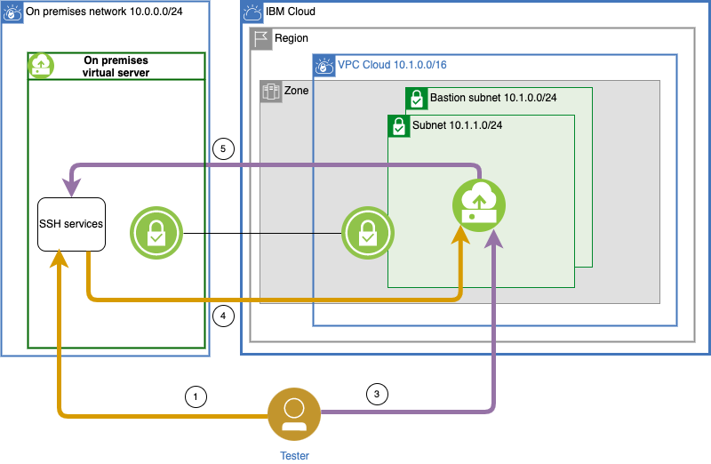

{{site.data.keyword.attribute-definition-list}}

# Use a VPC/VPN gateway for secure and private on-premises access to cloud resources
{: #vpc-site2site-vpn}
{: toc-content-type="tutorial"}
{: toc-services="schematics, vpc, cloud-object-storage, databases-for-postgresql, dns-svcs"}
{: toc-completion-time="2h"}
{: toc-use-case="Cybersecurity, VirtualPrivateCloud"}

This tutorial will incur costs. Use the [Cost Estimator](/estimator) to generate a cost estimate based on your projected usage.
{: tip}


IBM offers a number of ways to securely extend an on-premises computer network with resources in the {{site.data.keyword.cloud_notm}}. This allows you to benefit from the elasticity of provisioning cloud resources when you need them and removing them when no longer required. Moreover, you can easily and securely connect your on-premises capabilities to the {{site.data.keyword.cloud_notm}} services.

This tutorial provides the automation to create resources that demonstrate Virtual Private Network (VPN) connectivity between on-premises servers and cloud resources like {{site.data.keyword.vpc_full}} Virtual Service Instances (VSIs) and {{site.data.keyword.cloud_notm}} data services.  DNS resolution to cloud resources is also configured. The popular [strongSwan](https://www.strongswan.org/){: external} VPN Gateway is used to represent the on-premises VPN gateway.
{: shortdesc}


## Objectives
{: #vpc-site2site-vpn-objectives}

* Access a virtual private cloud (VPC) environment from an on-premises data center
* Securely reach cloud services using private endpoint gateways
* Use DNS on-premises to access cloud resources over VPN

The following diagram shows the resources created by this tutorial

{: caption="Architecture diagram of the tutorial" caption-side="bottom"}
{: style="text-align: center;"}

A terraform configuration will create the following resources:

1. The infrastructure (VPC, Subnets, Security Groups with rules, Network ACL and VSIs).
2. The {{site.data.keyword.cos_short}} and {{site.data.keyword.databases-for-postgresql}} private endpoint gateways to data services.
3. The strongSwan open source IPsec gateway software is used on-premises to establish the VPN connection with the cloud environment.
4. A VPC/VPN Gateway is provisioned to allow private connectivity between on-premises resources and cloud resources.
6. The on-premises DNS resolver is connected to the cloud DNS Resolver Location to allow TLS access to cloud resources including [access to virtual private endpoint gateways](https://www.ibm.com/blog/creating-virtual-private-endpoint-gateways-with-terraform){: external} through a VPN.

## Before you begin
{: #vpc-site2site-vpn-prereqs}

This tutorial requires:
* {{site.data.keyword.cloud_notm}} CLI,
   * {{site.data.keyword.bplong_notm}} plugin (`schematics`),
* `jq` to query JSON files,
* `git` to optionally clone source code repository,
* `Terraform CLI` to optionally run Terraform on your desktop instead of the Schematics service.

You will find instructions to download and install these tools for your operating environment in the [Getting started with tutorials](/docs/solution-tutorials?topic=solution-tutorials-tutorials) guide.

The on-premises data center in this tutorial will be simulated using a VSI within a VPC.

The preferred mechanism to connect VPCs is [{{site.data.keyword.tg_short}}](/interconnectivity/transit). Simulation of an on-premises environment with VPC, VSI and VPN is used only for illustration.
{: note}

In addition:
- Check for user permissions. Be sure that your user account has sufficient permissions to create and manage VPC resources. For a list of required permissions, see [Granting permissions needed for VPC resources](/docs/vpc?topic=vpc-managing-user-permissions-for-vpc-resources).
- You need an SSH key to connect to the virtual servers. If you don't have an SSH key, see the [instructions for creating a key](/docs/vpc?topic=vpc-managing-ssh-keys&interface=ui).

## Use {{site.data.keyword.bpshort}}  to create the resources
{: #vpc-site2site-vpn-create-ressources}
{: step}

1. Log in to [{{site.data.keyword.cloud_notm}}](/).
1. Navigate to [Create {{site.data.keyword.bpshort}} Workspaces](/schematics/workspaces/create?repository=https://github.com/IBM-Cloud/vpc-tutorials/tree/master/vpc-site2site-vpn&terraform_version=terraform_v1.5) Under the **Specify Template** section, verify:
   1.  **Repository URL** is `https://github.com/IBM-Cloud/vpc-tutorials/tree/master/vpc-site2site-vpn`
   1. **Terraform version** is **terraform_v1.2**
2. Under **Workspace details**,
   1. Provide a workspace name : **vpnsts**.
   2. Choose a `Resource Group` and a `Location`.
   3. Click on **Next**.
3. Verify the details and then click on **Create**.
4. Under the **Variables** section, provide the required values (**resource_group_name**, **ssh_key_name**) by clicking the overflow menu and selecting **Edit** for each row. The value for the variable **maintenance** must be set to true.
7. Scroll to the top of the page and click **Apply plan**. Check the logs to see the status of the services created.

Explore the resources that were created by clicking below and selecting the instance with matching prefix. Locate all of the resources in the diagram above.
- [{{site.data.keyword.vpc_short}}](/vpc-ext/network/vpcs)
- [{{site.data.keyword.vsi_is_short}}](/vpc-ext/compute/vs)
- [{{site.data.keyword.vpn_short}}](/vpc-ext/network/vpngateways)
- [{{site.data.keyword.vpe_short}}](/vpc-ext/network/endpointGateways)
- [{{site.data.keyword.databases-for-postgresql}} instance in Databases](/resources)
- [{{site.data.keyword.cos_short}}](/objectstorage/)

## Verify connectivity
{: #vpc-site2site-vpn-verify-connectivity}
{: step}

The {{site.data.keyword.bpshort}} workspace output contains variables that can be used to verify the VPN connectivity.

1. Get the list of workspaces, note the ID column, set the shell variable:
   ```sh
   ibmcloud schematics workspace list
   ```
   {: pre}

1. Set the WORKSPACE_ID variable:

   ```sh
   WORKSPACE_ID=YOUR_WORKSPACE_ID
   ```
   {: pre}

1. Get the environment variables for the cloud resources:
   ```sh
   ibmcloud schematics output --id $WORKSPACE_ID --output json | jq -r '.[0].output_values[].environment_variables.value'
   ```
   {: pre}

1. The output will look something like the following. Copy/paste these results into your shell in order to set them in the environment:
   ```sh
   IP_FIP_ONPREM=169.48.x.x
   IP_PRIVATE_ONPREM=10.0.0.4
   IP_PRIVATE_CLOUD=10.1.1.4
   IP_FIP_BASTION=52.118.x.x
   IP_PRIVATE_BASTION=10.1.0.4
   IP_DNS_SERVER_0=10.1.0.5
   IP_DNS_SERVER_1=10.1.1.6
   IP_ENDPOINT_GATEWAY_POSTGRESQL=10.1.1.9
   IP_ENDPOINT_GATEWAY_COS=10.1.1.5
   HOSTNAME_POSTGRESQL=a43ddb63-dcb1-430a-a2e4-5d87a0dd12a6.6131b73286f34215871dfad7254b4f7d.private.databases.appdomain.cloud
   HOSTNAME_COS=s3.direct.us-south.cloud-object-storage.appdomain.cloud
   PORT_POSTGRESQL=32525
   ```
1. You can now SSH into each of the instances following different paths including jumping through the VPN. The diagram shows the communication paths exercised by the steps.

   If the SSH key is not the default for SSH, you can set the option `-I PATH_TO_PRIVATE_KEY_FILE` or see the SSH reference manual for more help. 
   {: tip}

{: caption="Verify connectivity" caption-side="bottom"}
{: style="text-align: center;"}

   1. Test access to on-premises VSI:
      ```sh
      ssh root@$IP_FIP_ONPREM
      ```
      {: pre}

   1. Test access to cloud bastion:
      ```sh
      ssh root@$IP_FIP_BASTION
      ```
      {: pre}

   1. Test access to cloud VSI through bastion:
      ```sh
      ssh -J root@$IP_FIP_BASTION root@$IP_PRIVATE_CLOUD
      ```
      {: pre}

   1. Test access to cloud VSI through on-premises, through the VPN tunnel, through bastion:
      ```sh
      ssh -J root@$IP_FIP_ONPREM,root@$IP_FIP_BASTION root@$IP_PRIVATE_CLOUD
      ```
      {: pre}

   1. Test access to on-premises VSI through bastion, through cloud VSI, through VPN tunnel:
      ```sh
      ssh -J root@$IP_FIP_BASTION,root@$IP_PRIVATE_CLOUD root@$IP_PRIVATE_ONPREM
      ```
      {: pre}


## Verify DNS resolution
{: #vpc-site2site-vpn-verify-dns-resolution}
{: step}

The on-premises DNS resolution has been configured to use the {{site.data.keyword.vpc_short}} DNS resolver location.  This allows the cloud services to be accessed by name and resolved to the IP addresses of the private endpoint gateways.

Test DNS resolution to Postgresql and Object storage through the Virtual Endpoint Gateway. The two paths being verified are shown in the diagram below:

{: caption="Verify DNS resolution" caption-side="bottom"}
{: style="text-align: center;"}

   1. Access the on-premises VSI.
      ```sh
      ssh root@$IP_FIP_ONPREM
      ```
      {: pre}
   
   2. Copy and paste three(3) of the variables captured earlier: `HOSTNAME_POSTGRESQL`, `HOSTNAME_COS`, `PORT_POSTGRESQL`.
   
   3. Run a `dig` command to confirm resolution to the database instance through the Virtual Endpoint Gateway..
      ```sh
      dig $HOSTNAME_POSTGRESQL
      ```
      {: pre}

   4. Verify connectivity to the database by issuing a `telnet` command. It should display "connected".
      ```sh
      telnet $HOSTNAME_POSTGRESQL $PORT_POSTGRESQL
      ```
      {: pre}

   5. Once connected to the database, issue a `Ctrl+C` to disconnect.
   
   6. Run a `dig` command to confirm resolution to the cloud object storage instance through the Virtual Endpoint Gateway.
      ```sh
      dig $HOSTNAME_COS
      ```
      {: pre}

   7. Verify connectivity to the cloud object storage instance by issuing a `telnet` command. It should display "connected".
      ```sh
      telnet $HOSTNAME_COS 443
      ```
      {: pre}

   8. Once connected to the cloud object storage instance, issue a `Ctrl+C` to disconnect.


If there a problems see the [troubleshoot](https://github.com/IBM-Cloud/vpc-tutorials/tree/master/vpc-site2site-vpn#troubleshoot){: external} section in the GitHub repository.

## Optionally expand the tutorial
{: #vpc-site2site-vpn-expand-tutorial}
{: step}

Want to add to or extend this tutorial? Here are some ideas:

- In the [GitHub repository](https://github.com/IBM-Cloud/vpc-tutorials/tree/master/vpc-site2site-vpn){: external} there is an application that can be deployed that uses the database and cloud object storage. Instructions on how to deploy are in the README.
- If you deployed the application [add a DNS zone](/docs/dns-svcs?topic=dns-svcs-getting-started) for the application.
- Run the application on multiple {{site.data.keyword.vsi_is_short}} and add a [load balancer](/docs/vpc?topic=vpc-nlb-vs-elb) to distribute inbound microservice traffic.

## Remove resources
{: #vpc-site2site-vpn-remove-resources}

1. Navigate to [{{site.data.keyword.bpshort}} Workspaces](/schematics/workspaces), click on your workspace
1. Click **Actions... > Destroy resources**
1. Click **Actions... > Delete workspace**

## Related content
{: #vpc-site2site-vpn-related}

- [IBM Cloud CLI plugin for VPC Reference](/docs/vpc?topic=vpc-vpc-reference)
- [VPC using the REST APIs](/apidocs/vpc/latest)
- Solution tutorial: [Securely access remote instances with a bastion host](/docs/solution-tutorials?topic=solution-tutorials-vpc-secure-management-bastion-server)
