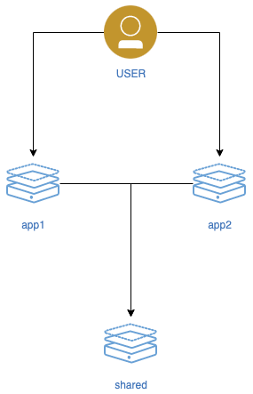
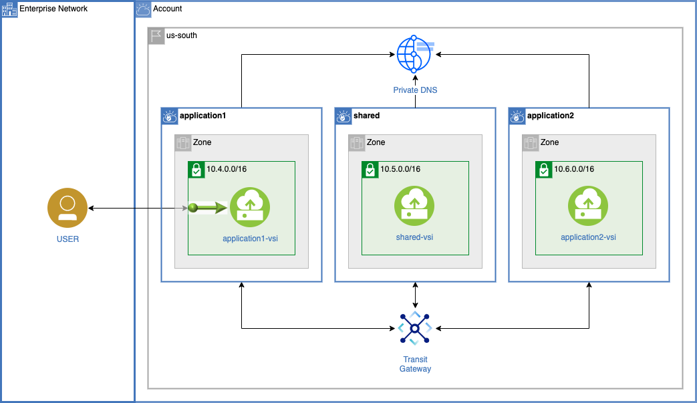
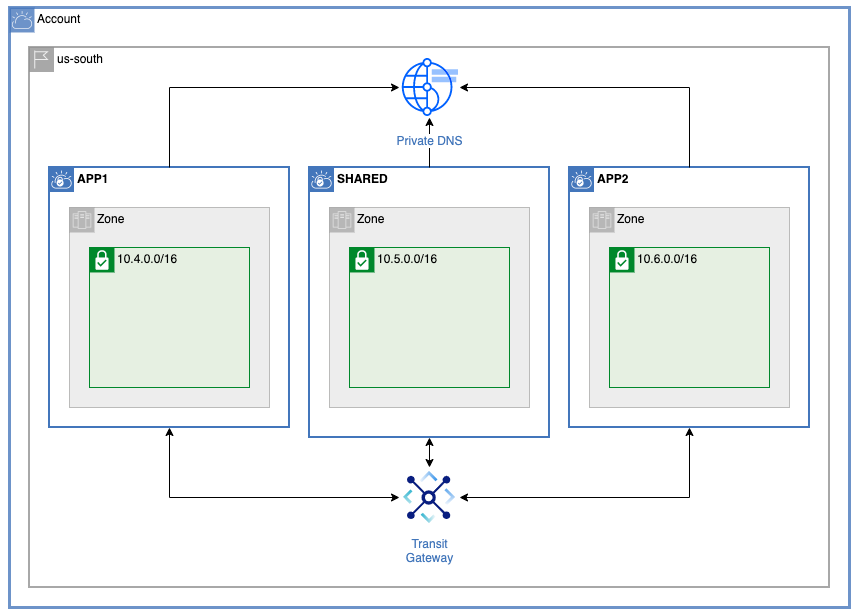
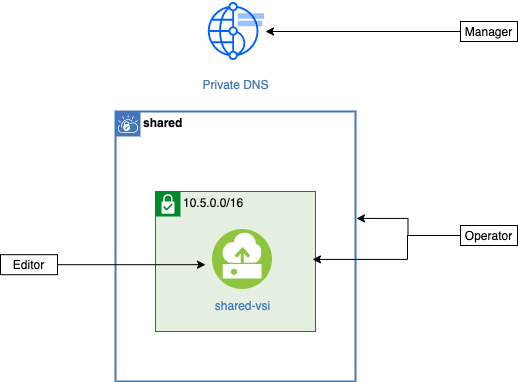
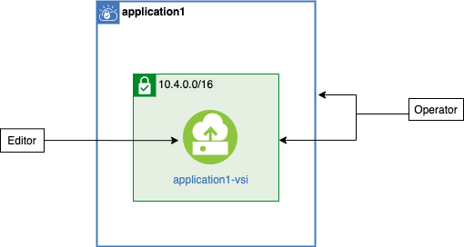

{:step: data-tutorial-type='step'}
{:shortdesc: .shortdesc}
{:new_window: target="_blank"}
{:codeblock: .codeblock}
{:screen: .screen}
{:tip: .tip}
{:pre: .pre}
{:important: .important}

# Team based privacy using IAM, VPC, Transit Gateway and DNS
{: #vpc-tg-dns-iam}
{: toc-content-type="tutorial"}
{: toc-services="vpc, account, transit-gateway, dns-svcs"}
{: toc-completion-time="2h"}

<!--##istutorial#-->
This tutorial may incur costs. Use the [Cost Estimator](https://{DomainName}/estimator/review) to generate a cost estimate based on your projected usage.
{: tip}
<!--#/istutorial#-->

Microservices are popular because they allow an enterprise to organize their people around the microservices they deliver.  This tutorial walks you through the steps of creating infrastructure for a {{site.data.keyword.vpc_full}} (VPC) based micro service architecture.  The VPCs are connected to each other using the {{site.data.keyword.tg_full}}.  The shared microservices are accessed through the {{site.data.keyword.dns_full}}. Each VPC is managed by a separate application team isolated by {{site.data.keyword.iamlong}}.  Optionally a {{site.data.keyword.loadbalancer_full}} can be used to scale out the shared microservice.

{:shortdesc}

## Objectives
{: #objectives}

* Learn how to isolate infrastructure using IAM and Resource groups
* Create the VPCs and associated resources: subnets, network ACLs, security groups, intstances, ...
* Connect VPCs via transit gateway
* Address micro-services using DNS name resolution

<p style="text-align: center;">

  
</p>

The user is accessing the applications.  The applications are leveraging some shared micro-services.  The company has separate devops teams that own application1, app2 and shared.  A networking team focuses on connectivity and network security. The devops teams manage Virtual Service Instances, VSIs, used to implement the services they create and support.

The teams determined the following architecture could meet their isolation and connectivity requirements.  Notice that application1, shared, and app2 are VPCs.  The single zone and subnet in each VPC can be expanded to a more detailed multi zone implementation over time.

<p style="text-align: center;">

  
</p>


## Before you begin
{: #prereqs}

- Check for user permissions. Be sure that your user account has sufficient permissions to create and manage VPC resources, create a {{site.data.keyword.tg_full}}and create a {{site.data.keyword.tg_full}} services. See the list of required permissions for [VPC for Gen 2](https://{DomainName}/docs/vpc?topic=vpc-managing-user-permissions-for-vpc-resources).
- You need an SSH key to connect to the virtual servers. If you don't have an SSH key, see the instructions for creating a key for [VPC for Gen 2](/docs/vpc?topic=vpc-ssh-keys). 

## Create a local working environment
{: #create}
{: step}

All of the operations will be done in a bash shell and making use of terraform and ibmcloud command.

You will find instructions to download and install these tools for your operating environment in the [Getting started with tutorials](/docs/solution-tutorials?topic=solution-tutorials-getting-started) guide.

Note: To avoid the installation of these tools you can use the [{{site.data.keyword.cloud-shell_short}}](https://{DomainName}/shell) from the {{site.data.keyword.cloud_notm}} console.
{:tip}

1. From the {{site.data.keyword.cloud_notm}} console in your browser, click the button in the upper right corner to create a new [{{site.data.keyword.cloud-shell_short}}](https://{DomainName}/shell).
1. Git clone the following repository:

   ```
   git clone https://github.com/IBM-Cloud/vpc-tg-dns-iam
   cd vpc-tg-dns-iam
   ```
   {:pre}

    Verify there is a directory for each team (skipping application2 for now):
    - admin/
    - network/
    - shared/
    - application1/

1. There is a terraform.tfvars file that you will need to create and edit:
   ```
   cp terraform.tfvars.template terraform.tfvars
   ```
   {:pre}
   ```
   edit terraform.tfvars
   ```
   {:pre}
    - ssh_key_name - it is **required** to specify an existing ssh key in the ibm_region as specified in the above prerequisites.
    - ibm_region - replace the default value, **us-south**, if required.  The cli command `ibmcloud regions` will display all possible regions.
    - basename - replace the default value, **widget0**, if required.  Most resources created will use this as a name prefix.

## Plan the Identity and Access Management Environment
{: #iam}
{: step}

The admin team will enable the other teams to administer their resources as much as possible.  The admin team will manage users and control access but will not create and destroy resources. 

Teams:
- Admin - define the resource groups, access groups, users, roles, ...
- Network - create network resources: {{site.data.keyword.dns_short}}, {{site.data.keyword.tg_short}} service, VPC, subnets, CIDR blocks, ...
- Shared - create VSI, block devices and add into shared VPC, create DNS records for shared services
- Application1 - create VSI, block devices and add into ap1 VPC
- Application2 - create VSI, block devices and add into ap2 VPC

### IAM Conceptual
{: #iam_conceptual}
A conceptual team ownership model was implemented.  It isn't surprising that the network team administers a lot of the diagram.

Network team Editor access:
<p style="text-align: center;">

  
</p>


The shared team creates the VSI in its isolated VPC.  In addition the team needs to write records into the DNS service since the IP addresses of the VSIs are determined at creation time.  Operator access to the VPC, subnets and security groups are required to create a VSI.

Shared team access:
<p style="text-align: center;">

  
</p>

The application teams needs the same access as the shared team with the exception of manager access to the {{site.data.keyword.dns_short}}.

Application team access:
<p style="text-align: center;">

  
</p>

### IAM Actual
#### Access Groups
{: #iam_access_groups}
Access policies do not need to be assigned to a specific user. Instead, access policies can be assigned to an access group.  Then users can be assigned to the access group.  The use of access groups can greatly simplify a system administrators life.

The Transit Gateway is managed exclusively by the network team.  Editor access allows the team to create it.  Manager access to the created instance allows VPCs to be connected to the Transit Gateway.

The DNS service is created by the network team (Editor) and VPCs are permitted to use the the created instance (Manager).  The shared team needs to list the DNS instances (Viewer) and then add zones (Manager).

[VPC](https://{DomainName}/docs/vpc) consists of different service types.  Some are only of concern to the network team, like VPNs.  Others are only of concern to the micro-service teams, like VSI instances.  But some are edited by the network team and operated by the micro-service team, like subnet.  The network team will create the subnet and a micro-service team will create an instance in a subnet.  For the purpose of this tutorial the VPC service types can be divided into the following groups.  In parenthesis are the terraform names for the service types.

is_network_service_types
- VPN gateway (vpnGatewayId)
- public gateway (publicGatewayId)
- flow log collector (flowLogCollectorId)
- network ACL (networkAclId)

is_instance_service_types
- VSI instance (instanceId)
- volume (volumeId)
- floating IP (floatingIpId)
- ssh key (keyId)
- image (imageId)
- instance group (instanceGroupId)
- dedicated host (dedicatedHostId)
- load balancer (loadBalancerId)

is_network_and_instance_service_types
- VPC (vpcId)
- subnet (subnetId)
- security group (securityGroupId)

The table below summarizes the access required by each access group.  See [IAM access](https://{DomainName}/docs/account?topic=account-userroles) for definitions of Editor, Operator, Viewer and Manager:

Service/Access Group|network|shared|application
-|-|-|-|-
Transit Gateway|Editor, Manager||
DNS|Editor, Manager|Viewer, Manager|
is_network_service_types|Editor||
is_instance_service_types||Editor|Editor
is_network_and_instance_service_types|Editor|Operator|Operator


#### Resource Groups
{: #iam_resource_groups}

The Shared team and the Network team are now nicely separated.  But how is Application1 isolated from Shared and Application2?  They are Editor for the same types of services.

This is where resource groups can help out. Think of a resource group as a bag of resources.  Each team has micro-services in a single VPC so all of the resources for a VPC can be put into a single resource group.  Each team will be allowed access described above but only to the resources in it's own bag of resources.

In this example there will be three resource groups used for VPC (is) resources: "shared", "application1" and "application2".  The network team will have Editor access for the VPC network service types in all of the bags. The micro-service teams will have Editor and Manager for the **is** resources in their resource group.

The shared resource group will also contain the DNS service.

A forth resource group, network, will contain {{site.data.keyword.tg_short}}.

### Becoming a team member
{: #iam_become}

It is possible to populate each team's access group with users.  In this example you are the administrator and will **become** a member of the different access groups by using api keys for yourself or from the service IDs that will be in the other access groups.  The service ID names are ${basename}-x where x is network, shared, application1 and application2.  Later you will populate a `local.env` file in each team's directory with contents similar to this:
   ```
   export TF_VAR_ibmcloud_api_key=0thisIsNotARealKeyALX0vkLNSUFC7rMLEWYpVtyZaS9
   ```
When you cd into a directory you will be reminded to execute: `source local.env`

Terraform will be used to create the resources.  Open `admin/main.tf` and notice the `provider ibm` clause and the reference to the ibmcloud_api_key initialized from the environment variable:

   ```
   provider ibm {
    ibmcloud_api_key = var.ibmcloud_api_key # initialized with the TF_VAR_ibmcloud_api_key
   }
   ```

## Create the IAM resources (Admin Team)
{: #admin}
{: step}

The admin team will be responsible for creating the IAM resources. After fetching the source code and making the initial terraform.tfvars changes suggested above set current directory to ./admin and use the `ibmcloud iam api-key-create` command to create an api key for the admin.  This is the same as a password to your account and it will be used by terraform to perform tasks on your behalf.  Keep the api key safe.

Change directory, generate your personal API key in the local.env that will be used by terraform to become you:
   ```
   cd admin
   echo export TF_VAR_ibmcloud_api_key=$(ibmcloud iam api-key-create widget0-admin --output json | jq .apikey) > local.env
   cat local.env
   source local.env
   ```
   {:pre}

Apply of the main.tf terraform configuration file creates the following resources:

- Resource groups for each team
- Access groups for each team and a service ID in each access group
- Access group policies for the resource groups
- Access group policies for the resources


   ```
   terraform init
   terraform apply
   ```
   {:pre}

Initialize the basename shell variable and verify some of the resources were created:

   ```
   basename=$(terraform output basename)
   ibmcloud resource groups | grep $basename
   ```
   {:pre}


   ```
   ibmcloud iam access-groups | grep $basename
   ```
   {:pre}


   ```
   ibmcloud iam service-ids | grep $basename
   ```
   {:pre}

   ```
   ibmcloud iam access-group-policies $basename-network
   ```
   {:pre}


Output will resemble this:

   ```
   $ ibmcloud resource groups | grep $basename
   widget0-application2   36b06a303f224f28ad42aebbb491cc44   false           ACTIVE
   widget0-shared         91518c45e47a427fa4f63edb58e4f227   false           ACTIVE
   widget0-network        bf6e75cd71854576a31056abced2abf0   false           ACTIVE
   widget0-application1   db2f3dc8aacf4a6aa2d2fa07e795cb57   false           ACTIVE
   $ ibmcloud iam access-groups | grep $basename
   widget0-application1   AccessGroupId-26b7ef37-78db-4a2c-a2af-7f6591e73c15   application1 administrators
   widget0-application2   AccessGroupId-8afdec20-f760-4a15-8f3e-296d81818028   application2 administrators
   widget0-network        AccessGroupId-d50b129d-9adc-4fc4-b297-487b3f938ec5   network administrators
   widget0-shared         AccessGroupId-30d73f44-5602-47a7-846e-e6480c9dceff   shared administrators
   $ ibmcloud iam service-ids | grep $basename
   ServiceId-5e919b97-380c-4343-a337-3901cafbd956   widget0-application2                                                                                                       2020-07-15T21:25+0000   2020-07-15T22:03+0000   application 2 service id                                                                                                                                              false
   ServiceId-307df062-f4b7-45f8-8ec8-94ad1ed61730   widget0-network                                                                                                            2020-07-15T21:49+0000   2020-07-15T22:03+0000   network service id                                                                                                                                                    false
   $ ibmcloud iam access-group-policies widget0-network
   Retrieving all policies of access group widget0-network under account 8675309 as jenny
   OK
   
   Policy ID:   00ceb354-7360-4ad5-9fda-5c03e462c5c0
   Roles:       Editor
   Resources:
                Resource Group ID     91518c45e47a427fa4f63edb58e4f227
                Resource Group Name   widget0-shared
                Service Name          is
                flowLogCollectorId    *
                Memo                  Policy applies to the resource(s) within the resource group
   
   
   
   
   Policy ID:   115ebe9f-eea0-4308-9e7f-bb887d64426b
   Roles:       Editor
   Resources:
                Resource Group ID     db2f3dc8aacf4a6aa2d2fa07e795cb57
                Resource Group Name   widget0-application1
                Service Name          is
                vpnGatewayId          *
                Memo                  Policy applies to the resource(s) within the resource group
...
   ```
These resources can be edited and displayed using the ibm cloud console.  Navigate to the account [Resource groups](https://{DomainName}/account/resource-groups ) and find the resource groups.  Navigate to [Access groups](https://{DomainName}/iam/groups) to see the access groups, click an access group, then click a **Service IDs** panel at the top.

## Create {{site.data.keyword.vpc_short}}}} network {{site.data.keyword.tg_short}} {{site.data.keyword.dns_short}} (Network Team)
{: #network}
{: step}


The network team will create the network resources to match the architecture ensuring that the connectivity goals are satisfied and the teams are isolated in their VPC.  They do not want to control the details of the VPC Instances.  It is likely that the number of applications, size of computers, DNS addresses of the micro services etc will be in constant flux and not a concern of the network team.

The Admin team has provided them just the right amount of permissions to create the VPC **is** resources, the {{site.data.keyword.dns_short}} and the {{site.data.keyword.tg_short}} service.

Change directory, generate an API key in the local.env and become a member of the network access group:

   ```
   team=network
   cd ../$team
   echo export TF_VAR_ibmcloud_api_key=$(ibmcloud iam service-api-key-create $team $basename-$team --output json | jq .apikey) > local.env
   cat local.env
   source local.env
   ```
   {:pre}

The `variables_network.tf` file captures the CIDR block specification and the zone layout.  Below is the shared VPC.  Notice that application1 and application2 are specified without overlapping IP addresses:
   ```
  variable network_architecture {
     default = {
       shared = {
         cidr        = "10.0.0.0/16"
         cidr_remote = "10.0.0.0/8"
         zones = {
           z1 = {
             zone_id = "1",
             cidr    = "10.0.0.0/24",
           }
           z2 = {
             zone_id = "2",
             cidr    = "10.0.1.0/24",
       ...
       application1 = {
         cidr        = "10.1.0.0/16"
         cidr_remote = "0.0.0.0"
         zones = {
           z1 = {
             zone_id = "1",
             cidr    = "10.1.0.0/24",
           }
           z2 = {
             zone_id = "2",
             cidr    = "10.1.1.0/24",
        ...
   ```

The {{site.data.keyword.tg_short}} will have a connection to each VPC and routes traffic based on the CIDR ranges so avoiding overlaps will insure success.


Create the resources:
   ```
   terraform init
   terraform apply
   ```
   {:pre}

### List the VPC resources
{: #network_vpc}

The VPC resources created is summarized by the output of the subnets command, shown below, edited for brevity.  Notice the three VPCs, the non overlapping CIDR blocks, and the resource groups membership:
   ```
   ibmcloud is target --gen 2
   ibmcloud is subnets | grep $basename
   ```
   {:pre}

Output will resemble this:

   ```
   $ ibmcloud is subnets | grep $basename
   widget0-shared-z1   available   10.0.0.0/24    widget0-shared   us-south-1   widget0-shared
   widget0-shared-z2   available   10.0.1.0/24    widget0-shared   us-south-2   widget0-shared
   widget0-shared-z3   available   10.0.2.0/24    widget0-shared   us-south-3   widget0-shared
   widget0-app1-z1     available   10.1.0.0/24    widget0-app1     us-south-1   widget0-application1
   widget0-app1-z2     available   10.1.1.0/24    widget0-app1     us-south-2   widget0-application1
   widget0-app1-z3     available   10.1.2.0/24    widget0-app1     us-south-3   widget0-application1
   widget0-app2-z1     available   10.2.0.0/24    widget0-app2     us-south-1   widget0-application2
   widget0-app2-z2     available   10.2.1.0/24    widget0-app2     us-south-2   widget0-application2
   widget0-app2-z3     available   10.2.2.0/24    widget0-app2     us-south-3   widget0-application2
   ```

The VPC configuration can be created, edited and displayed using the ibm cloud console.  Navigate to the [Virtual Private Clouds](https://{DomainName}/vpc-ext/network/vpcs) and find the VPCs, subnets and all of the other resources created above.

### List the {{site.data.keyword.tg_short}} resources
{: #network_tg}

The {{site.data.keyword.tg_short}} can be displayed using the two commands below.  A gateway was created that has three connections.  Notice the copy/paste of the GatewayID.

   ```
   ibmcloud tg gateways
   ```
   {:pre}

Output will resemble this:

   ```
   $ ibmcloud tg gateways
   Listing gateways under account 
   OK
   
   GatewayID           e2801c16-1a6d-4d47-9c58-1a3b3c1d9b1b
   CRN                 crn:v1:bluemix:public:transit:us-south:a/86785309::gateway:e2801c16-1a6d-4d47-9c58-1a3b3c1d9b1b
   Name                widget0-tgw
   Routing             local
   Location            us-south
   Created             2020-07-16T09:09:38.048-07:00
   Resource group ID   bf6e75cd71854576a31056abced2abf0
   Status              available
   $ ibmcloud tg connections e2801c16-1a6d-4d47-9c58-1a3b3c1d9b1b
   Listing connections for gateway e2801c16-1a6d-4d47-9c58-1a3b3c1d9b1b under account 
   OK
   
   Name            r006-b08a7c2c-c0ea-4908-b0ab-b96cd8ba221a
   NetworkID       crn:v1:bluemix:public:is:us-south:a/86785309::vpc:r006-b08a7c2c-c0ea-4908-b0ab-b96cd8ba221a
   Network Type    vpc
   Connection ID   dff6ecfd-388d-471a-908a-98880426fbee
   Status          attached
   
   Name            r006-8fdc0e7e-3a98-4f6b-93e0-505c61e3faac
   NetworkID       crn:v1:bluemix:public:is:us-south:a/86785309::vpc:r006-8fdc0e7e-3a98-4f6b-93e0-505c61e3faac
   Network Type    vpc
   Connection ID   bbce29f9-9ce4-47d4-911d-5341601cea07
   Status          attached
   
   Name            r006-fa80afa7-b16b-4db7-95dd-69a558db4285
   NetworkID       crn:v1:bluemix:public:is:us-south:a/86785309::vpc:r006-fa80afa7-b16b-4db7-95dd-69a558db4285
   Network Type    vpc
   Connection ID   208c00cc-aee2-498e-8b1c-37ddc276f200
   Status          attached
   ```

The {{site.data.keyword.tg_short}} configuration can be created, edited and displayed using the ibm cloud console.  Navigate to the [{{site.data.keyword.tg_short}}](https://{DomainName}/interconnectivity/transit) and find the gateway created above.

### List the {{site.data.keyword.dns_short}} resources
{: #network_dns}

The {{site.data.keyword.dns_short}} and zone were created with the terraform snippet:
   ```
   resource "ibm_resource_instance" "dns" {
     name              = "${var.basename}-dns"
     resource_group_id = data.ibm_resource_group.shared.id
     location          = "global"
     service           = "dns-svcs"
     plan              = "standard-dns"
   }
   
   resource "ibm_dns_zone" "widgets_com" {
     name        = "widgets.com"
     instance_id = ibm_resource_instance.dns.guid
     description = "this is a description"
     label       = "this-is-a-label"
   }
   ```

The zone is then added to a VPC as a permitted network:
   ```
   resource "ibm_dns_permitted_network" "shared" {
     instance_id = ibm_resource_instance.dns.guid
     zone_id     = ibm_dns_zone.widgets_com.zone_id
     vpc_crn     = module.vpc_shared.vpc.crn
     type        = "vpc"
   }
   
   ```

The DNS configuration can be displayed using the command below.  A {{site.data.keyword.dns_short}} instance was created.  The **widgets.com** zone was created.   Finally the zone was added to all of the VPCs.  Note the copy/paste of the IDs are required.

   ```
   ibmcloud dns instances
   ```
   {:pre}

   ```
   ibmcloud dns zones -i 7beda36e-919e-4f8f-a07a-9ef75380171e
   ```
   {:pre}

   ```
   ibmcloud dns permitted-networks widgets.com:168cc091-41a7-4d05-9809-a8df24848f5e -i 7beda36e-919e-4f8f-a07a-9ef75380171e
   ```
   {:pre}

Output will resemble this:

   ```
   $ ibmcloud dns instances
   Retrieving service instances for service 'dns-svcs' ...
   OK
   Name            ID                                     Location   State    Service Name
   widget0-dns   7beda36e-919e-4f8f-a07a-9ef75380171e   global     active   dns-svcs
   $ ibmcloud dns zones -i 7beda36e-919e-4f8f-a07a-9ef75380171e
   Listing zones for service instance '7beda36e-919e-4f8f-a07a-9ef75380171e' ...
   OK
   ID                                                 Name          Status
   widgets.com:168cc091-41a7-4d05-9809-a8df24848f5e   widgets.com   ACTIVE
   $ ibmcloud dns permitted-networks widgets.com:168cc091-41a7-4d05-9809-a8df24848f5e -i 7beda36e-919e-4f8f-a07a-9ef75380171e
   Listing permitted networks for zone 'widgets.com:168cc091-41a7-4d05-9809-a8df24848f5e' ...
   OK
   Name               ID                                          Type   VPC_CRN                                                                                       State
   widget0-shared   r006-b08a7c2c-c0ea-4908-b0ab-b96cd8ba221a   vpc    crn:v1:bluemix:public:is:us-south:a/8675309::vpc:r006-b08a7c2c-c0ea-4908-b0ab-b96cd8ba221a   ACTIVE
   widget0-app1     r006-8fdc0e7e-3a98-4f6b-93e0-505c61e3faac   vpc    crn:v1:bluemix:public:is:us-south:a/86785309::vpc:r006-8fdc0e7e-3a98-4f6b-93e0-505c61e3faac   ACTIVE
   widget0-app2     r006-fa80afa7-b16b-4db7-95dd-69a558db4285   vpc    crn:v1:bluemix:public:is:us-south:a/86785309::vpc:r006-fa80afa7-b16b-4db7-95dd-69a558db4285   ACTIVE
   ```

The DNS configuration can be created, edited and displayed using the ibm cloud console.  Navigate to the [resource list](https://{DomainName}/resources) and find the **{{site.data.keyword.dns_short}}**, click on it and investigate.

## Create the shared microservice and associated DNS record (Shared Team)
{: #shared}
{: step}

Change directory, generate an API key in the local.env and become a member of the shared access group:

   ```
   team=shared
   cd ../$team
   echo export TF_VAR_ibmcloud_api_key=$(ibmcloud iam service-api-key-create $team $basename-$team --output json | jq .apikey) > local.env
   cat local.env
   source local.env
   ```

The shared team is going to provide micro services.  The network team has provided the shared VPC. They have chosen the instance profile.  A Linux configuration script and simple demo application is provided in the user_data attribute and discussed in the **Application Team** section below.

In `main.tf` notice these two resources:
   ```
   locals {
     network_context = data.terraform_remote_state.network.outputs.shared
   }

   resource ibm_is_instance "vsishared" {
     name           = "${var.basename}-shared-vsi"
     vpc            = local.network_context.vpc.id
     resource_group = data.ibm_resource_group.shared.id
     zone           = local.network_context.subnets["z1"].zone
     keys           = [data.ibm_is_ssh_key.ssh_key.id]
     image          = data.ibm_is_image.image.id
     profile        = var.profile[var.generation]
   
     primary_network_interface {
       subnet = local.network_context.subnets["z1"].id
       security_groups = [
         local.network_context.security_group_outbound_all.id, # nodejs is not available on an IBM mirror
         local.network_context.security_group_ibm_dns.id,
         local.network_context.security_group_data_inbound.id,
       ]
     }
     user_data = module.user_data_app.user_data_centos
   }
   
   resource ibm_dns_resource_record "shared" {
     count = var.shared_lb ? 0 : 1 # shared load balancer?
     instance_id = local.network_context.dns.guid
     zone_id     = local.network_context.dns.zone_id
     type        = "A"
     name        = "shared"
     rdata       = ibm_is_instance.vsishared.primary_network_interface[0].primary_ipv4_address
     ttl         = 3600
   }
   ```

The network_context is the output generated by the network team specifically for the shared team.

The `count = var.shared_lb ? 1 : 0` is a terraform construct explained later in the {{site.data.keyword.loadbalancer_short}} and can be ignored at this point.

Create the resources:
   ```
   terraform init
   terraform apply
   ```
   {:pre}

Navigate to the [Virtual server instances for VPC](https://{DomainName}/vpc-ext/compute/vs) and find the shared instance.  Click on it and verify the following:
- The instance has no incoming connectivity from the public internet (check the Security Groups)
- Locate the private IP address

Navigate to the [resource list](https://{DomainName}/resources) and find the **{{site.data.keyword.dns_short}}**, click on it and find the DNS record with the name **shared**.  Notice the Value is the private IP address.

## Create a publicly facing microservice that uses the shared microservice (Application1 Team)
{: #application}
{: step}

Change directory, generate an API key in the local.env and become a member of the application1 access group:

   ```
   team=application1
   cd ../$team
   echo export TF_VAR_ibmcloud_api_key=$(ibmcloud iam service-api-key-create $team $basename-$team --output json | jq .apikey) > local.env
   cat local.env
   source local.env
   ```
   {:pre}


The application1 team resources are very similar to the shared team's.  In fact they are a little simpler since - it is not required to put records into the {{site.data.keyword.dns_short}}.  The application uses the address `http://shared.widgets.com` to access the shared micro-service.

### Linux demo application terraform module
{: #demo_application}

The Linux demo including DNS configuration and an example nodejs application is provided as a Linux service.  All this has been captured in a terraform module shared by all the teams during this exploratory stage.

In the directory ../common/user_data_app is a terraform module.

**../common/user_data_app/main.tf**:
   ```
   locals {
     shared_app_user_data_centos = <<EOS
   #!/bin/sh
   cat > /etc/dhcp/dhclient.conf <<EOF
   supersede domain-name-servers 161.26.0.7, 161.26.0.8;
   EOF
   dhclient -v -r eth0; dhclient -v eth0
   curl -sL https://rpm.nodesource.com/setup_10.x | sudo bash -
   yum install nodejs -y
   cat > /app.js << 'EOF'
   ${file("${path.module}/app.js")}
   EOF
   cat > /lib/systemd/system/a-app.service << 'EOF'
   ${file("${path.module}/a-app.service")}
   EOF
   systemctl daemon-reload
   systemctl start a-app
   EOS
   }

   output user_data_centos {
     value = "${replace(local.shared_app_user_data_centos, "REMOTE_IP", var.remote_ip)}"
   }
   ```

The next few sections document the local.shared_app_user_data_centos value.

### Adjust the DNS configuration
{: #application_dns}

[Updating the DNS resolver for your VSI](https://{DomainName}/docs/dns-svcs?topic=dns-svcs-updating-dns-resolver) for centos is accomplished by the lines:
- `supersede domain-name-servers 161.26.0.7, 161.26.0.8;`
- `dhclient ...`

### Nodejs run time installation
{: #application_nodjs}

Nodejs is required prerequisite for the application.  Node is installed with the two lines:
- curl -sL https://rpm.nodesource.com/setup_10.x | sudo bash -
- yum install nodejs -y

### app.js
{: #application_app}

The app is put into /app.js.  A systemctl service is created for the service so it starts up when the instance starts up.

The app.js file has two particularly interesting sections.  First there is a /info link that returns a description of the instance running the app:

   ```
   const server = http.createServer((req, res) => {
     switch(req.url) {
     case '/info':
       res.statusCode = 200;
       res.setHeader('Content-Type', 'application/json');
       res.end(JSON.stringify({
         req_url:  req.url,
         os_hostname:  os.hostname(),
         ipArrays: ips()
       }, null, 3));
       break
     case '/remote':
       getRemote(req, res)
       break
   ```

Second the /remote link calls to a remote server IP and returns a the description of that remote along with the remmote_url and remote_ip addresses used to access the remote.

   ```
   const IP='REMOTE_IP'
   
   function getRemote(req, res) {
     path = '/info'
     remote_url = 'http://' + IP + ':3000' + path
     http.get(remote_url, (resp) => {
       let rawData = '';
       resp.on('data', (chunk) => { rawData += chunk; });
       resp.on('end', () => {
         try {
           console.log(rawData)
           rawObj = JSON.parse(rawData)
           res.statusCode = 200;
           res.end(JSON.stringify({remote_url: remote_url, remote_ip: resp.connection.remoteAddress, remote_info: rawObj}, null, 3))
   ```

 In our case the REMOTE_IP will be `shared.widget.com` because of the following in common/user_data_app/main.tf:

   ```
   output user_data_centos {
     value = "${replace(local.shared_app_user_data_centos, "REMOTE_IP", var.remote_ip)}"
   }
   ```

And back in application1/main.tf:

   ```
   module user_data_app {
     source    = "../common/user_data_app"
     remote_ip = "shared.widgets.com"
   }
   ```

Create the resources:

   ```
   terraform init
   terraform apply
   ```
   {:pre}


Results look something like this:
   ```
   $ terraform apply
   ...
   Apply complete! Resources: 2 added, 0 changed, 0 destroyed.

   Outputs:

   ibm1_curl =
   ssh root@169.48.152.220
   curl 169.48.152.220:3000; # get hello world string
   curl 169.48.152.220:3000/info; # get the private IP address
   curl 169.48.152.220:3000/remote; # get the remote private IP address
   ```

Try the curl commands suggested.  See something like what was captured below where the private IP address of 169.48.152.220 is 10.1.0.4 and the /remote (shared.widgets.com) is 10.0.0.4.

   ```
   $ curl 169.48.152.220:3000/info

   {
      "req_url": "/info",
      "os_hostname": "widget0-application1-vsi",
      "ipArrays": [
         [
            "10.1.0.4"
         ]
      ]
   }

   $ curl 169.48.152.220:3000/remote; # get the remote private IP address
   
   {
      "remote_url": "http://shared.widgets.com:3000/info",
      "remote_ip": "10.0.0.4",
      "remote_info": {
         "req_url": "/info",
         "os_hostname": "widget0-shared-vsi",
         "ipArrays": [
            [
               "10.0.0.4"
            ]
         ]
      }
   }
   ```

Remember these curl commands, you will use them again shortly

### Insert a {{site.data.keyword.loadbalancer_short}} and replace the DNS record
{: #shared_lb}

Change directory and become a member of the shared access group (use the existing API key):

   ```
   cd ../shared
   source local.env
   ```

The shared team can insert a load balancer above the instance.  For now the load balancer pool will only have the single instance created earlier.  See the lb.tf for the implementation.  The dns record is this snippet:

   ```
   # shared.widgets.com
   resource ibm_dns_resource_record "shared_lb" {
     count = var.shared_lb ? 1 : 0 # shared load balancer?
     instance_id = local.network_context.dns.guid
     zone_id     = local.network_context.dns.zone_id
     type        = "CNAME"
     name        = "shared"
     rdata       = ibm_is_lb.shared_lb[0].hostname
     ttl         = 3600
   }
   ```

The `count = var.shared_lb ? 1 : 0` is a terraform construct that enables or disables the containing resource based on the value of `shared_lb`.  Change this value from false to true to enable this resource along with the rest of the resources in lb.tf.

Notice how the new record is CNAME record with a URL of the hostname produced by the load balancer: `ibm_is_lb.shared_lb[0].hostname`

Open the terraform.tfvars file and change `shared_lb` to `true`

   ```
   $ edit terraform.tfvars
   ```
   {:pre}
   ```
   $ terraform apply
   ```
   {:pre}

Now execute the curl commands from the previous application1 section (ignore the ones you just generated).  Notice how the remote_ip is 10.1.4, the load balancer, and the remote_info is 10.0.0.4, the instance.  Curl a few more times and notice the remote_ip for the load balancer may change.

   ```
   $ curl 169.48.152.220:3000/remote
   
   {
      "remote_url": "http://shared.widgets.com:3000/info",
      "remote_ip": "10.0.1.4",
      "remote_info": {
         "req_url": "/info",
         "os_hostname": "widget0-shared-vsi",
         "ipArrays": [
            [
               "10.0.0.4"
            ]
         ]
      }
   }
   ```

## Create a publicly facing microservice that uses the shared microservice (Application2 Team)
{: #application}
{: step}
The second application team environment is identical to the first.  Optionally create application2 by modifying application1.

Enter the ./application1 directory and create the application2 directory
   ```
   cd ../application1
   mkdir ../application2
   sed -e 's/application1/application2/g' main.tf > ../application2/main.tf
   cp terraform.tfvars variables.tf ../application2
   ```
   {:pre}

Change directory, generate an API key in the local.env and become a member of the application2 access group:

   ```
   team=application2
   cd ../$team
   echo export TF_VAR_ibmcloud_api_key=$(ibmcloud iam service-api-key-create $team $basename-$team --output json | jq .apikey) > local.env
   cat local.env
   source local.env
   ```
   {:pre}

Create the resources:

   ```
   terraform init
   terraform apply
   ```
   {:pre}

## Remove resources
{: #remove_resource}
{: step}

You can cd to the team directories in order, and execute `source local.env; terraform destroy`.  The order is application2, application1, shared, network, admin. There is also a script that will do this for you:

   ```
   cd ..
   ./bin/destroy.sh
   ```
   {:pre}


## Expand the tutorial

### Other Considerations
{: #expand_other}

- The Application team is providing access to the application via a floating IP address.  Consider connecting this to {{site.data.keyword.cis_full_notm}}.  It can manage the public DNS and provide security.  [Deploy isolated workloads across multiple locations and zones](https://{DomainName}/docs/solution-tutorials?topic=solution-tutorials-vpc-multi-region) has an example.
- The Application team can scale horizontally using a a load balancer like the shared team.
- The shared team can add additional instances to the load balancer by adding code to the shared/main.tf 
- The shared team could switch their implementation platform to Kubernetes

### Continuous Delivery
{: #expand_cd}

- Installation of software is currently done when the VPC instance is created.  The delivery of new versions of software to production has not been considered.  [Application Deployment to a Virtual Private Cloud with a DevOps Toolchain](https://www.ibm.com/cloud/blog/application-deployment-to-a-virtual-private-cloud-with-a-devops-toolchain) demonstrates one solution.
- For shared micro-services, a new VSI could be created with a new version and after verification DNS could be adjusted or the shared load balancer could be used to switch to the new version.

### Automation, Staging, and Development
{: #expand_automation}

- For production the teams can each have their own [{{site.data.keyword.bpshort}}](https://{DomainName}/schematics/overview) workspace.  With Schematics, terraform configurations can be executed directly in the cloud where state and output can be shared.
- The Terraform scripts can be adjusted to allow staging and development environments. Put these environments into new accounts.  
- A continuous deployment environment can be constructed to move the code and environments through the development, staging and into production.  Is roll back needed?  How would this be accomplished?

## Conclusions
{: #conclusions}

The architecture of a system is influenced by the containment and ownership of cloud resources.  It is important for architects from all aspects of the system contribute their concerns to the architecture.  Each team needs the ability to control the resources they produce and release.  Isolation will reduce the likelihood of problems and contain the blast radius when problems occur.

## Related content
{: #related}

* Tutorial: [Best practices for organizing users, teams, applications](https://{DomainName}/docs/solution-tutorials?topic=solution-tutorials-users-teams-applications#users-teams-applications)
* [Terraform tutorial](https://{DomainName}/docs/solution-tutorials?topic=solution-tutorials-infrastructure-as-code-terraform#infrastructure-as-code-terraform)
* [Public frontend and private backend in a Virtual Private Cloud](https://{DomainName}/docs/solution-tutorials?topic=solution-tutorials-vpc-public-app-private-backend),
* [Deploy a LAMP stack using Terraform](https://{DomainName}/docs/solution-tutorials?topic=solution-tutorials-infrastructure-as-code-terraform)
