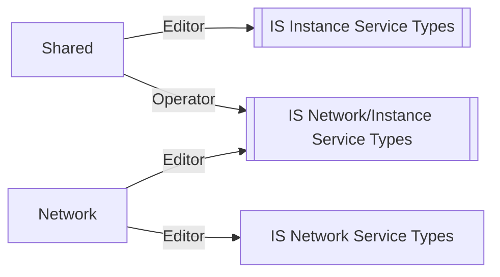
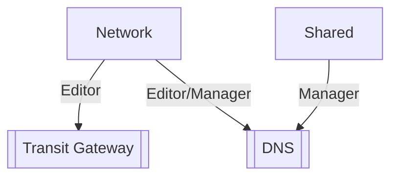

{:shortdesc: .shortdesc}
{:new_window: target="_blank"}
{:codeblock: .codeblock}
{:screen: .screen}
{:tip: .tip}
{:pre: .pre}
{:important: .important}

# Team based privacy using VPC, Transit Gateway and DNS
{: #vpc-tg-dns-iam}

Team based development of a microservice based application via vpc....
{:shortdesc}

## Objectives
{: #objectives}

* Learn how to isolate infrastructure using IAM and resource groups
* Use a separate VPC for each team
* Connect VPCs via transit gateway
* Logically connect microservices using DNS name resolution

## Services Used
{: #services}

This tutorial uses the following runtimes and services:
* [{{site.data.keyword.vsi_is_short}}](https://{DomainName}/vpc/provision/vs)
* iam
* vpc
* transit gateway
* dns
* terraform/schematics?

This tutorial may incur costs. Use the [Pricing Calculator](https://{DomainName}/estimator/review) to generate a cost estimate based on your projected usage.

## Architecture
{: #architecture}

Conceptual architecture:

<p style="text-align: center;">

  
</p>

The user is accessing the applications.  The applications are leveraging some shared microservices.  The company has separate devops teams that own app1, app2 and shared.  A networking team focuses on connectivity and network security. The devops teams manage Virtual Service Instances, VSIs, to implementing the services they support.

The teams determined the following architecture could meet the isolation and connectivity requirements.  Notice that APP1, SHARED, and APP2 are VPCs.  The single zone and subnet in each VPC can be expanded to a more detailed multi zone implementation over time.

<p style="text-align: center;">

  
</p>


## Create a local working environment

Git clone the following repository (todo relocate to IBM-Cloud)

   ```
   git clone https://github.com/powellquiring/vpc-tg-dns-iam
   cd vpc-tg-dns-iam
   ```
   {:pre}

Notice there is a directory for each team (skipping application2):
- admin/
- network/
- shared/
- application1/

There is a terraform.tfvars file that you will need to edit:
- ibm_region - select region from the `ibmcloud regions` command like us-south
- basename - a unique string (project10 in this text) that will prefix resources created
- ssh_key_name - an existing ssh key in the ibm_region.  See todo
- ibm_zones - initialize to zones that match the region.  For us-south `ibmcloud target -r us-south; ibmcloud is regions`

In an actual deployment the team access group would be populated with users.  In this example you are the administrator and will **become** a member of the different access groups by using api keys from the service IDs that have been added to each access group.  The api key names are ${basename}-x where x is network, shared, application1 andapplication2.  Later you will populate a `local.env` file in each directory with contents similar to this:
   ```
   export TF_VAR_ibmcloud_api_key=0thisIsNotARealKeyALX0vkLNSUFC7rMLEWYpVtyZaS9
   ```
Remember when you cd into a directory execute: `source local.env`

## Identity and Access Management

The admin team will enable the other teams to administer themselves as much as possible.  The admin team will manage users and control access but will not create and destroy resources. 

Teams:
- Admin - define the resource groups, access groups, users, roles, ...
- Network - create network resources: DNS services, Transit Gateway service, VPC, subnets, CIDR blocks, ...
- Shared - create VSI, block devices and add into SHARED VPC, create DNS records for shared services
- Application1 - create VSI, block devices and add into APP1 VPC
- Application2 - create VSI, block devices and add into APP2 VPC

### IAM Conceptual
A conceptual team ownership model was implemented.  It isn't surprising that the network team administers a lot of the diagram.

Network team Editor access:
<p style="text-align: center;">

  
</p>


The shared team creates the VSI in it's isolated VPC.  In addition the team needs to write records into the DNS servie since the IP addresses of the VSIs are determined at creation time.  Operator access to the VPC, subnets and security groups are required to create a VSI.

Shared team access:
<p style="text-align: center;">

  
</p>

The application teams do not need manager access to the DNS services.

Application team access:
<p style="text-align: center;">

  
</p>

### IAM Actual
#### Access Groups
Access policies do not need to be assigned to a specific user. Instead, access policies can be assigned to an access group.  Then users can be assigned to the access group.  The use of access groups can greatly simplify an syste administrators life.

Another way to think about the team access policies is captured in the drawing below.  An IAM access group is created for each team.  Team members can be added to the access group as needed.  In the diagrams below the normal boxes are the Access Groups, the double boxes are collections of similar resources, the lines are the roles.

    Service IDs can be added to the access group, just like users.  Then API Keys can be created for use by automated processes.
   {:tip}

For the VPC Infrastructure (is):



The Transit Gateway service is administered by the Network team.  Same with the DNS services.  The Shared team requires Manager access to DNS to write records.



#### Resource Groups

The Shared team and the Network team are now nicely separated.  But how is Application1 isolated from Shared and Application2?  They are Editor for the same types of services.

This is where resource groups can help out. Each team has microservices in a single VPC.  All of the resources for a VPC can be put into a single resource group.  And each team can only access it's own resource group. 

There will be three resource groups used for vpc (is) resources: "shared", "application1" and "application2".  The network team will have Editor access for the is network service type of resources in each of the resource groups.  The other teams will have Editor and and Manager for only the resources that are in their resource group.

These will be in a fourth resource group: "network" for the non IS resources: Transit Gateway and DNS.

#### Pulling it all together
This snippet of terraform sorts the VPC servie types into the associated resource collections shown earlier in the diagram:

```
locals {
  # types of resources that just the network team manage
  is_network_service_types = {
    "vpnGatewayId"       = "*"
    "publicGatewayId"    = "*"
    "flowLogCollectorId" = "*"
    "networkAclId"       = "*"
  }
  # types of resources that both the network team and the instance teams manage
  is_network_and_instance_service_types = {
    "vpcId"           = "*"
    "subnetId"        = "*"
    "securityGroupId" = "*"
  }
  # types of resources that just the instance teams manage
  is_instance_service_types = {
    "instanceId"      = "*"
    "volumeId"        = "*"
    "floatingIpId"    = "*"
    "keyId"           = "*"
    "imageId"         = "*"
    "instanceGroupId" = "*"
    "dedicatedHostId" = "*"
    "loadBalancerId"  = "*"
  }
}
```

Check out the admin/main.tf file for how this results in assigned roles.

The policy group details are captured in the tables below. 
- role-X platform role X
- serviceRole-X service role X
- sn:X service name X
- sn:X,Y service name X attribute Y.  Attribute is used to further subdivide the `is` service into resource types.
- rt:X resource type
- rg:x resource group name

Notice the following:
- network team has access viewer access to all of the resource groups, other teams just their own
- network team alone has acces to the transit (Transit Gateway)
- network team has Edtior acces to the transit (Transit Gateway), shared team has Manager access


Policy Group project10-network:
roles|resource group|access
-|-|-
role-Editor|project10-network|sn:transit
role-Editor,serviceRole-Manager|project10-shared|sn:dns-svcs
role-Editor|project10-application1|sn:is,flowLogCollectorId=*
role-Editor|project10-application1|sn:is,networkAclId=*
role-Editor|project10-application1|sn:is,publicGatewayId=*
role-Editor|project10-application1|sn:is,securityGroupId=*
role-Editor|project10-application1|sn:is,subnetId=*
role-Editor|project10-application1|sn:is,vpcId=*
role-Editor|project10-application1|sn:is,vpnGatewayId=*
role-Editor|project10-application2|sn:is,flowLogCollectorId=*
role-Editor|project10-application2|sn:is,networkAclId=*
role-Editor|project10-application2|sn:is,publicGatewayId=*
role-Editor|project10-application2|sn:is,securityGroupId=*
role-Editor|project10-application2|sn:is,subnetId=*
role-Editor|project10-application2|sn:is,vpcId=*
role-Editor|project10-application2|sn:is,vpnGatewayId=*
role-Editor|project10-shared|sn:is,flowLogCollectorId=*
role-Editor|project10-shared|sn:is,networkAclId=*
role-Editor|project10-shared|sn:is,publicGatewayId=*
role-Editor|project10-shared|sn:is,securityGroupId=*
role-Editor|project10-shared|sn:is,subnetId=*
role-Editor|project10-shared|sn:is,vpcId=*
role-Editor|project10-shared|sn:is,vpnGatewayId=*
role-Viewer||rt:resource-group,rg:project10-application1
role-Viewer||rt:resource-group,rg:project10-application2
role-Viewer||rt:resource-group,rg:project10-network
role-Viewer||rt:resource-group,rg:project10-shared

Policy Group project10-shared:
roles|resource group|access
-|-|-
role-Viewer,serviceRole-Manager|project10-shared|sn:dns-svcs
role-Editor|project10-shared|sn:is,dedicatedHostId=*
role-Editor|project10-shared|sn:is,floatingIpId=*
role-Editor|project10-shared|sn:is,imageId=*
role-Editor|project10-shared|sn:is,instanceGroupId=*
role-Editor|project10-shared|sn:is,instanceId=*
role-Editor|project10-shared|sn:is,keyId=*
role-Editor|project10-shared|sn:is,loadBalancerId=*
role-Editor|project10-shared|sn:is,volumeId=*
role-Operator|project10-shared|sn:is,securityGroupId=*
role-Operator|project10-shared|sn:is,subnetId=*
role-Operator|project10-shared|sn:is,vpcId=*
role-Operator||sn:is,keyId=pfq
role-Viewer||rt:resource-group,rg:project10-shared

Policy Group project10-application1:
roles|resource group|access
-|-|-
role-Editor|project10-application1|sn:is,dedicatedHostId=*
role-Editor|project10-application1|sn:is,floatingIpId=*
role-Editor|project10-application1|sn:is,imageId=*
role-Editor|project10-application1|sn:is,instanceGroupId=*
role-Editor|project10-application1|sn:is,instanceId=*
role-Editor|project10-application1|sn:is,keyId=*
role-Editor|project10-application1|sn:is,loadBalancerId=*
role-Editor|project10-application1|sn:is,volumeId=*
role-Operator|project10-application1|sn:is,securityGroupId=*
role-Operator|project10-application1|sn:is,subnetId=*
role-Operator|project10-application1|sn:is,vpcId=*
role-Operator||sn:is,keyId=pfq
role-Viewer||rt:resource-group,rg:project10-application1

Policy Group project10-application2:
roles|resource group|access
-|-|-
role-Editor|project10-application2|sn:is,dedicatedHostId=*
role-Editor|project10-application2|sn:is,floatingIpId=*
role-Editor|project10-application2|sn:is,imageId=*
role-Editor|project10-application2|sn:is,instanceGroupId=*
role-Editor|project10-application2|sn:is,instanceId=*
role-Editor|project10-application2|sn:is,keyId=*
role-Editor|project10-application2|sn:is,loadBalancerId=*
role-Editor|project10-application2|sn:is,volumeId=*
role-Operator|project10-application2|sn:is,securityGroupId=*
role-Operator|project10-application2|sn:is,subnetId=*
role-Operator|project10-application2|sn:is,vpcId=*
role-Operator||sn:is,keyId=pfq
role-Viewer||rt:resource-group,rg:project10-application2


A less compact view can be generated usin the ibmcloud cli:
```
$ ibmcloud iam access-group-policies project10-network
Retrieving all policies of access group project10-network under account 713c783d9a507a53135fe6793c37cc74 as pquiring@us.ibm.com...
OK

Policy ID:   00ceb354-7360-4ad5-9fda-5c03e462c5c0
Roles:       Editor
Resources:
             Resource Group ID     91518c45e47a427fa4f63edb58e4f227
             Resource Group Name   project10-shared
             Service Name          is
             flowLogCollectorId    *
             Memo                  Policy applies to the resource(s) within the resource group


Policy ID:   115ebe9f-eea0-4308-9e7f-bb887d64426b
Roles:       Editor
Resources:
             Resource Group ID     db2f3dc8aacf4a6aa2d2fa07e795cb57
             Resource Group Name   project10-application1
             Service Name          is
             vpnGatewayId          *
             Memo                  Policy applies to the resource(s) within the resource group
...
```

## Admin Team

After fetching the source code and making the initial terraform.tfvars changes suggested cd into the admin directory and use the `ibmcloud iam api-key-create` command to create an api key for yourself.  This is the same as a password to your account and it will be used by terraform to perform tasks on your behalf.  Keep the api key safe.

   ```
   cd admin
   echo export TF_VAR_ibmcloud_api_key=$(ibmcloud iam api-key-create project10-admin --output json | jq .apikey) > local.env
   cat local.env
   source local.env
   ```
   {:pre}

The main.tf file is a configuration that creates the following resources:
- Resource groups for each team
- Access groups for each team
- Access group policies 

   ```
   terraform apply
   ```
   {:pre}

Verify some of the resources were created:


   ```
   $ ibmcloud resource groups | grep $basename
   project10-application2   36b06a303f224f28ad42aebbb491cc44   false           ACTIVE
   project10-shared         91518c45e47a427fa4f63edb58e4f227   false           ACTIVE
   project10-network        bf6e75cd71854576a31056abced2abf0   false           ACTIVE
   project10-application1   db2f3dc8aacf4a6aa2d2fa07e795cb57   false           ACTIVE
   $ ibmcloud iam access-groups | grep $basename
   project10-application1   AccessGroupId-26b7ef37-78db-4a2c-a2af-7f6591e73c15   application1 administrators
   project10-application2   AccessGroupId-8afdec20-f760-4a15-8f3e-296d81818028   application2 administrators
   project10-network        AccessGroupId-d50b129d-9adc-4fc4-b297-487b3f938ec5   network administrators
   project10-shared         AccessGroupId-30d73f44-5602-47a7-846e-e6480c9dceff   shared administrators
   $ ibmcloud iam service-ids | grep $basename
   ServiceId-5e919b97-380c-4343-a337-3901cafbd956   project10-application2                                                                                                       2020-07-15T21:25+0000   2020-07-15T22:03+0000   application 2 service id                                                                                                                                              false
   ServiceId-307df062-f4b7-45f8-8ec8-94ad1ed61730   project10-network                                                                                                            2020-07-15T21:49+0000   2020-07-15T22:03+0000   network service id                                                                                                                                                    false
   ```

## Network Team

The network team is going to create the network resources to match the architecture insuring that the connectivity goals are satisfied and the teams are isolated in their VPC.  They do not want to control the details of the VPC Instances.  It is likely that the number of applications, size of computers, DNS addresses of the microservices etc will be in constant flux and not a concern of the network team.

The Admin team has provided them just the right amount of permissions to create the vpc **is** resources, the DNS services and the transit gateway service.

Change directory and become a member of the network access group:

   ```
   team=network
   cd ../$team
   echo export TF_VAR_ibmcloud_api_key=$(ibmcloud iam service-api-key-create $team $basename-$team --output json | jq .apikey) > local.env
   cat local.env
   source local.env
   ```

The `variables_network.tf` file captures the CIDR block specification and the zone layout.  Below is the shared vpc.  Notice that application1 and application2 are specified without overlapping IP addresses:
   ```
  variable network_architecture {
     default = {
       shared = {
         cidr        = "10.0.0.0/16"
         cidr_remote = "10.0.0.0/8"
         zones = {
           z1 = {
             zone_id = "1",
             cidr    = "10.0.0.0/24",
           }
           z2 = {
             zone_id = "2",
             cidr    = "10.0.1.0/24",
       ...
       application1 = {
         cidr        = "10.1.0.0/16"
         cidr_remote = "0.0.0.0"
         zones = {
           z1 = {
             zone_id = "1",
             cidr    = "10.1.0.0/24",
           }
           z2 = {
             zone_id = "2",
             cidr    = "10.1.1.0/24",
        ...
   ```

The Transit Gateway will have a connection to each VPC and routes traffic based on the CIDR ranges so avoiding overlaps will insure success.


Create the resources:
   ```
   terraform apply
   ```

### VPC is resources

The vpc resources created is summarized by the output of the subnets command, shown below, edited for brevity.  Notice the three VPCs, the non overlapping CIDR blocks, and the resource groups membership:

   ```
   $ ibmcloud is subnets
   Listing subnets for generation 2 compute in all resource groups and region us-south under account 
   Name                  Status      Subnet CIDR    VPC                Zone         Resource group
   project10-shared-z1   available   10.0.0.0/24    project10-shared   us-south-1   project10-shared
   project10-shared-z2   available   10.0.1.0/24    project10-shared   us-south-2   project10-shared
   project10-shared-z3   available   10.0.2.0/24    project10-shared   us-south-3   project10-shared
   project10-app1-z1     available   10.1.0.0/24    project10-app1     us-south-1   project10-application1
   project10-app1-z2     available   10.1.1.0/24    project10-app1     us-south-2   project10-application1
   project10-app1-z3     available   10.1.2.0/24    project10-app1     us-south-3   project10-application1
   project10-app2-z1     available   10.2.0.0/24    project10-app2     us-south-1   project10-application2
   project10-app2-z2     available   10.2.1.0/24    project10-app2     us-south-2   project10-application2
   project10-app2-z3     available   10.2.2.0/24    project10-app2     us-south-3   project10-application2
   ```

The VPC configuration can be created, edited and displayed using the ibm cloud console.  Navigate to the [Virtual Private Clouds](https://cloud.ibm.com/vpc-ext/network/vpcs) and find the VPCs, subnets and all of the other resources created above.

### Transit Gateway
The transit gateway can be displayed using the two commands below.  A gateway was created that has three connections.  Notice the copy/paste of the GatewayID.

   ```
   $ ibmcloud tg gateways
   Listing gateways under account 
   OK
   
   GatewayID           e2801c16-1a6d-4d47-9c58-1a3b3c1d9b1b
   CRN                 crn:v1:bluemix:public:transit:us-south:a/86785309::gateway:e2801c16-1a6d-4d47-9c58-1a3b3c1d9b1b
   Name                project10-tgw
   Routing             local
   Location            us-south
   Created             2020-07-16T09:09:38.048-07:00
   Resource group ID   bf6e75cd71854576a31056abced2abf0
   Status              available
   $ ic tg connections e2801c16-1a6d-4d47-9c58-1a3b3c1d9b1b
   Listing connections for gateway e2801c16-1a6d-4d47-9c58-1a3b3c1d9b1b under account 
   OK
   
   Name            r006-b08a7c2c-c0ea-4908-b0ab-b96cd8ba221a
   NetworkID       crn:v1:bluemix:public:is:us-south:a/86785309::vpc:r006-b08a7c2c-c0ea-4908-b0ab-b96cd8ba221a
   Network Type    vpc
   Connection ID   dff6ecfd-388d-471a-908a-98880426fbee
   Status          attached
   
   Name            r006-8fdc0e7e-3a98-4f6b-93e0-505c61e3faac
   NetworkID       crn:v1:bluemix:public:is:us-south:a/86785309::vpc:r006-8fdc0e7e-3a98-4f6b-93e0-505c61e3faac
   Network Type    vpc
   Connection ID   bbce29f9-9ce4-47d4-911d-5341601cea07
   Status          attached
   
   Name            r006-fa80afa7-b16b-4db7-95dd-69a558db4285
   NetworkID       crn:v1:bluemix:public:is:us-south:a/86785309::vpc:r006-fa80afa7-b16b-4db7-95dd-69a558db4285
   Network Type    vpc
   Connection ID   208c00cc-aee2-498e-8b1c-37ddc276f200
   Status          attached
   ```

The Transit Gateway configuration can be created, edited and displayed using the ibm cloud console.  Navigate to the [Transit Gateway](https://cloud.ibm.com/interconnectivity/transit) and find the gateway created above.

### DNS Services
The DNS services and zone were created with the terraform snippet:
   ```
   resource "ibm_resource_instance" "dns" {
     name              = "${var.basename}-dns"
     resource_group_id = data.ibm_resource_group.shared.id
     location          = "global"
     service           = "dns-svcs"
     plan              = "standard-dns"
   }
   
   resource "ibm_dns_zone" "widgets_com" {
     name        = "widgets.com"
     instance_id = ibm_resource_instance.dns.guid
     description = "this is a description"
     label       = "this-is-a-label"
   }
   ```

The zone is then added to a vpc as a permitted network:
   ```
   resource "ibm_dns_permitted_network" "shared" {
     instance_id = ibm_resource_instance.dns.guid
     zone_id     = ibm_dns_zone.widgets_com.zone_id
     vpc_crn     = module.vpc_shared.vpc.crn
     type        = "vpc"
   }
   
   ```

The DNS configuration can be displayed using the command below.  A DNS Service instance was created.  The **widgets.com** zone was created.   Finally the zone was added to all of the VPCs.  Note the copy/paste of the IDs are required.

   ```
   $ ibmcloud dns instances
   Retrieving service instances for service 'dns-svcs' ...
   OK
   Name            ID                                     Location   State    Service Name
   project10-dns   7beda36e-919e-4f8f-a07a-9ef75380171e   global     active   dns-svcs
   $ ibmcloud dns zones -i 7beda36e-919e-4f8f-a07a-9ef75380171e
   Listing zones for service instance '7beda36e-919e-4f8f-a07a-9ef75380171e' ...
   OK
   ID                                                 Name          Status
   widgets.com:168cc091-41a7-4d05-9809-a8df24848f5e   widgets.com   ACTIVE
   $ ibmcloud dns permitted-networks widgets.com:168cc091-41a7-4d05-9809-a8df24848f5e -i 7beda36e-919e-4f8f-a07a-9ef75380171e
   Listing permitted networks for zone 'widgets.com:168cc091-41a7-4d05-9809-a8df24848f5e' ...
   OK
   Name               ID                                          Type   VPC_CRN                                                                                       State
   project10-shared   r006-b08a7c2c-c0ea-4908-b0ab-b96cd8ba221a   vpc    crn:v1:bluemix:public:is:us-south:a/86785309::vpc:r006-b08a7c2c-c0ea-4908-b0ab-b96cd8ba221a   ACTIVE
   project10-app1     r006-8fdc0e7e-3a98-4f6b-93e0-505c61e3faac   vpc    crn:v1:bluemix:public:is:us-south:a/86785309::vpc:r006-8fdc0e7e-3a98-4f6b-93e0-505c61e3faac   ACTIVE
   project10-app2     r006-fa80afa7-b16b-4db7-95dd-69a558db4285   vpc    crn:v1:bluemix:public:is:us-south:a/86785309::vpc:r006-fa80afa7-b16b-4db7-95dd-69a558db4285   ACTIVE
   ```

The DNS configuration can be created, edited and displayed using the ibm cloud console.  Navigate to the [resource list](https://cloud.ibm.com/resources) and find the **DNS Services**

## Shared Team

Change directory and become a member of the shared access group:

   ```
   team=shared
   cd ../$team
   echo export TF_VAR_ibmcloud_api_key=$(ibmcloud iam service-api-key-create $team $basename-$team --output json | jq .apikey) > local.env
   cat local.env
   source local.env
   ```

The shared team is going to provide microservices.  The network team has provided the shared VPC. They have choosen the instance profile.  A linux configuration script and simple demo application is provided in the user_data attribute and discussed in the **Application Team** section below.

In `main.tf` notice these two resources:
   ```
   locals {
     network_context = data.terraform_remote_state.network.outputs.shared
   }

   resource ibm_is_instance "vsishared" {
     name           = "${var.basename}-shared-vsi"
     vpc            = local.network_context.vpc.id
     resource_group = data.ibm_resource_group.shared.id
     zone           = local.network_context.subnets["z1"].zone
     keys           = [data.ibm_is_ssh_key.ssh_key.id]
     image          = data.ibm_is_image.image.id
     profile        = var.profile[var.generation]
   
     primary_network_interface {
       subnet = local.network_context.subnets["z1"].id
       security_groups = [
         local.network_context.security_group_outbound_all.id, # nodejs is not available on an IBM mirror
         local.network_context.security_group_ibm_dns.id,
         local.network_context.security_group_data_inbound.id,
       ]
     }
     user_data = module.user_data_app.user_data_centos
   }
   
   resource ibm_dns_resource_record "shared" {
     count = var.shared_lb ? 0 : 1 # shared load balancer?
     instance_id = local.network_context.dns.guid
     zone_id     = local.network_context.dns.zone_id
     type        = "A"
     name        = "shared"
     rdata       = ibm_is_instance.vsishared.primary_network_interface[0].primary_ipv4_address
     ttl         = 3600
   }
   ```

The network_context is shared team's output from the network team.  Attempts to use the application teams output would fail due to resource group isolation.

The network team created the zone for 'widgets.com'
The dns record is put in the dns zone created by the netork 


It has no imcomming connectivity from the public internet.

They need operational access to the VPC, Subnets and Security Groups provided by the network team.

Looking in more details at the Admin team we can see how they were set up to have just the right amount of permissions:

## Application Team

Change directory and become a member of the network access group:

   ```
   team=application1
   cd ../$team
   echo export TF_VAR_ibmcloud_api_key=$(ibmcloud iam service-api-key-create $team $basename-$team --output json | jq .apikey) > local.env
   cat local.env
   source local.env
   ```

The application1 team resources are very similar to the shared team's.  In fact they are a little simpler since - it is not required to put records into the DNS Services.  The application uses the address `http://shared.widgets.com` to access the shared microservice.


The linux demo application written in nodejs is added as a linux service.  Some DNS configuration is also required.  All this has been captured in a terraform module shared by all the teams during this exploritory stage.

In the directory ../common/user_data_app is a terraform module.

`main.tf`:
   ```
   locals {
     shared_app_user_data_centos = <<EOS
   #!/bin/sh
   cat > /etc/dhcp/dhclient.conf <<EOF
   supersede domain-name-servers 161.26.0.7, 161.26.0.8;
   EOF
   dhclient -v -r eth0; dhclient -v eth0
   curl -sL https://rpm.nodesource.com/setup_10.x | sudo bash -
   yum install nodejs -y
   cat > /app.js << 'EOF'
   ${file("${path.module}/app.js")}
   EOF
   cat > /lib/systemd/system/a-app.service << 'EOF'
   ${file("${path.module}/a-app.service")}
   EOF
   systemctl daemon-reload
   systemctl start a-app
   EOS
   }

   output user_data_centos {
     value = "${replace(local.shared_app_user_data_centos, "REMOTE_IP", var.remote_ip)}"
   }
   ```
[Updating the DNS resolver for your VSI](https://cloud.ibm.com/docs/dns-svcs?topic=dns-svcs-updating-dns-resolver) for centos is accomplished by the lines:
- `supersede domain-name-servers 161.26.0.7, 161.26.0.8;`
- `dhclient ...`

Nodejs is required prerequisite for the application:
- `curl ...`
- `yum ...`

The app is put into /app.js.  A systemctl service is created for the service so it starts up when the instance starts up.

The app.js file has two particularly interesting sections.  First there is a /info link that returns a description of the instance running the app:

   ```
   const server = http.createServer((req, res) => {
     switch(req.url) {
     case '/info':
       res.statusCode = 200;
       res.setHeader('Content-Type', 'application/json');
       res.end(JSON.stringify({
         req_url:  req.url,
         os_hostname:  os.hostname(),
         ipArrays: ips()
       }, null, 3));
       break
     case '/remote':
       getRemote(req, res)
       break
   ```

Second the /remote link calls to a remote server IP and returns a the description of that remote along with the remmote_url and remote_ip addresses used to access the remote.

   ```
   const IP='REMOTE_IP'
   
   function getRemote(req, res) {
     path = '/info'
     remote_url = 'http://' + IP + ':3000' + path
     http.get(remote_url, (resp) => {
       let rawData = '';
       resp.on('data', (chunk) => { rawData += chunk; });
       resp.on('end', () => {
         try {
           console.log(rawData)
           rawObj = JSON.parse(rawData)
           res.statusCode = 200;
           res.end(JSON.stringify({remote_url: remote_url, remote_ip: resp.connection.remoteAddress, remote_info: rawObj}, null, 3))
   ```

 In our case the REMOTE_IP will be `shared.widget.com` because of the following in common/user_data_app/main.tf:

   ```
   output user_data_centos {
     value = "${replace(local.shared_app_user_data_centos, "REMOTE_IP", var.remote_ip)}"
   }
   ```

And back in application1/main.tf:

   ```
   module user_data_app {
     source    = "../common/user_data_app"
     remote_ip = "shared.widgets.com"
   }
   ```

Create the resources:
   ```
   terraform apply
   ...
   Apply complete! Resources: 2 added, 0 changed, 0 destroyed.

   Outputs:

   ibm1_curl =
   ssh root@169.48.152.220
   curl 169.48.152.220:3000; # get hello world string
   curl 169.48.152.220:3000/info; # get the private IP address
   curl 169.48.152.220:3000/remote; # get the remote private IP address
   ```

Try the curl commands suggested.  See something like what was captured below where the private IP address of 169.48.152.220 is 10.1.0.4 and the /remote (shared.widgets.com) is 10.0.0.4.

   ```
   $ curl 169.48.152.220:3000/info

   {
      "req_url": "/info",
      "os_hostname": "project10-app1-vsi",
      "ipArrays": [
         [
            "10.1.0.4"
         ]
      ]
   }

   $ curl 169.48.152.220:3000/remote; # get the remote private IP address
   
   {
      "remote_url": "http://shared.widgets.com:3000/info",
      "remote_ip": "10.0.0.4",
      "remote_info": {
         "req_url": "/info",
         "os_hostname": "project10-shared-vsi",
         "ipArrays": [
            [
               "10.0.0.4"
            ]
         ]
      }
   }
   ```

Remember these curl commands, you will use them again shortly

### Shared Load Balancer

Change directory and become a member of the shared access group:

   ```
   cd ../shared
   source local.env
   ```

The shared team can swap in a load balancer above the instance.  For now the load balancer pool will only have the single instance created earlier.  See the lb.tf for the implementation.  The dns record is this snippet:

   ```
   # shared.widgets.com
   resource ibm_dns_resource_record "shared_lb" {
     count = var.shared_lb ? 1 : 0 # shared load balancer?
     instance_id = local.network_context.dns.guid
     zone_id     = local.network_context.dns.zone_id
     type        = "CNAME"
     name        = "shared"
     rdata       = ibm_is_lb.shared_lb[0].hostname
     ttl         = 3600
   }
   ```

The `count = var.shared_lb ? 1 : 0` is a terraform construct that enables or disables the containing resource based on the value of `shared_lb`.  Change this value from false to true to enable this resource along with the rest of the resources in lb.tf.

Notice how the new record is CNAME record with a URL of the hostname produced by the load balancer: `ibm_is_lb.shared_lb[0].hostname`

Open the terraform.tfvars file and change `shared_lb` to `true`

   ```
   $ EDIT terraform.tfvars
   $ terraform apply
   ```

Now execute the curl commands from the previous section application section (ignore the ones generated by the shared)

   ```
   $ curl 169.48.152.220:3000/remote
   
   {
      "remote_url": "http://shared.widgets.com:3000/info",
      "remote_ip": "10.0.1.4",
      "remote_info": {
         "req_url": "/info",
         "os_hostname": "project10-shared-vsi",
         "ipArrays": [
            [
               "10.0.0.4"
            ]
         ]
      }
   }
   ```


## Continuous Delivery

- Installation of software is currently done when the VPC instance is created.  The delivery of new versions of software to production has not been considered.
- For shared microservices, a new VSI could be created with a new version and after verification DNS could be adjusted.

## Other Considerations
- The Application team is providing access to the application via a floating IP address.  Consider connecting this to the Cloud Internet Service, CIS.  It can manage the public DNS and provide security.
- The Application might need to scale horizontally via a load balancer.  Check out TODO
- One or more of the teams could use the Kubernetes service to implement their work load.  Check out TODO

## Extending the architecture with a Load Balancer

Extend the architecture with an application load balancer fronting the shared service.  The application team has IAM adminstrative access to the load balancer to create and manage all aspects of the load balancer.  A DNS Record can be added by the shared team that makes it transparent to the application teams.

## Automation, Staging, and Development

The existing production terraform configuration can be configured for execution by the schematics service.  Check out TODO

The Terraform scripts can be adjusted to allow staging and development environments. Put these environments into new accounts.  New teams will need to be defined to meet the level of isolation required.  Check out TODO

A continuous development environment can be constructed to move the code and environments through the various stages during the development process.

## Conclusions

The architecture of a system is influenced by the containment and ownership of cloud resources.  It will be important for architects from all aspects of the sytem contribute.  Each team needs the ability to control the resources they produce and release.  Isolation will reduce the likelyhood of problems and contain the blast radius when problems occur.

## Related content
{: #related}

* Tutorial
* Blog

* Tutorial: [Apply end to end security to a cloud application](https://{DomainName}/docs/solution-tutorials?topic=solution-tutorials-cloud-e2e-security)
* Blog: [Cloud App Security: What Makes a Secure App?](https://www.ibm.com/cloud/blog/cloud-app-security)
* Blog: [Use Your FIDO2 Key for 2FA on IBM Cloud Apps](https://www.ibm.com/cloud/blog/use-your-fido2-key-for-2fa-on-ibm-cloud-apps)
* Blog: [Going Passwordless on IBM Cloud Thanks to FIDO2](https://www.ibm.com/cloud/blog/going-passwordless-on-ibm-cloud-thanks-to-fido2)
* Blog: [IBM Cloud Security Hands-On: Share Your Chatbot Project](https://www.ibm.com/cloud/blog/share-your-chatbot-project)
* Blog: [Increase Information Security for Db2 on IBM Cloud](https://www.ibm.com/cloud/blog/increase-information-security-for-db2-on-ibm-cloud)
* IBM Architecture Center: [Security to safeguard and monitor your cloud apps](https://www.ibm.com/devops/method/content/architecture/securityArchitecture)
* [{{site.data.keyword.cloud_notm}} platform service CLIs and APIs](https://{DomainName}/docs/overview?topic=overview-platform-svc-cli-api)
* [IBM Cloud Compliance Programs](https://www.ibm.com/cloud/compliance)

