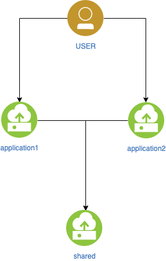
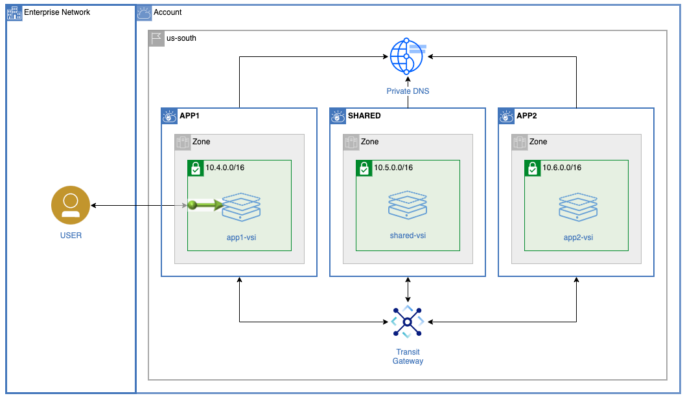
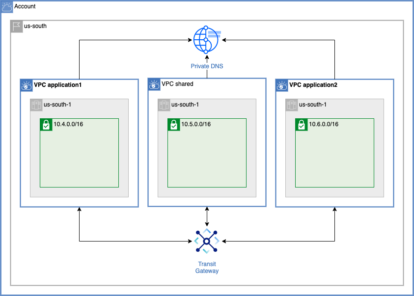
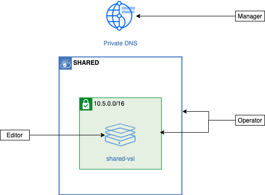
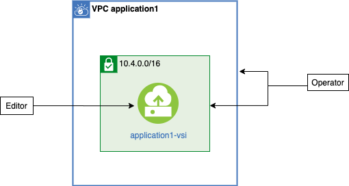
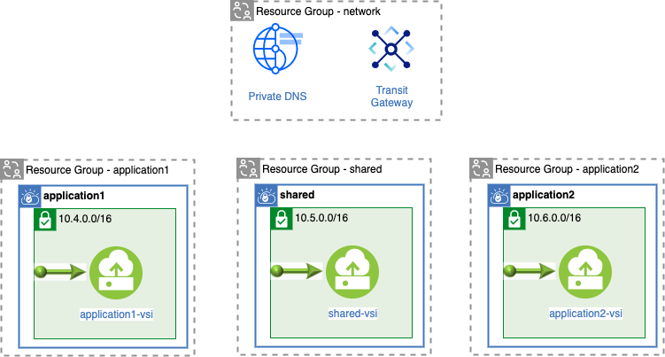
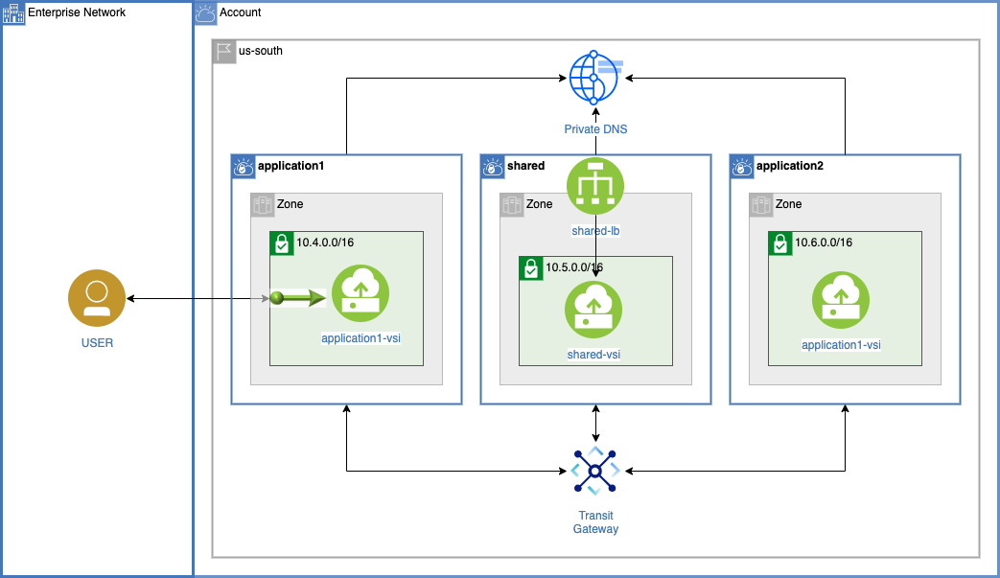

{:step: data-tutorial-type='step'}
{:shortdesc: .shortdesc}
{:new_window: target="_blank"}
{:codeblock: .codeblock}
{:screen: .screen}
{:tip: .tip}
{:pre: .pre}
{:important: .important}
{: note}

# Team based privacy using IAM, VPC, {{site.data.keyword.tg_short}} and DNS
{: #vpc-tg-dns-iam}
{: toc-content-type="tutorial"}
{: toc-services="vpc, account, transit-gateway, dns-svcs"}
{: toc-completion-time="2h"}

<!--##istutorial#-->
This tutorial may incur costs. Use the [Cost Estimator](https://{DomainName}/estimator/review) to generate a cost estimate based on your projected usage.
{: tip}

<!--#/istutorial#-->

Microservices are popular because they allow an enterprise to organize their development teams around the services they deliver. This tutorial walks you through the steps of creating infrastructure for a {{site.data.keyword.vpc_full}} (VPC) based microservice architecture. In this architecture, VPCs are connected to each other using the {{site.data.keyword.tg_full}}. A set of shared microservices is accessed through host names registered in the {{site.data.keyword.dns_full}}. Each VPC is managed by a separate team isolated by {{site.data.keyword.iamlong}}. Optionally a {{site.data.keyword.loadbalancer_full}} can be used to scale out the shared microservice.
{: shortdesc}

## Objectives
{: #vpc-tg-dns-iam-objectives}

* Learn how to isolate infrastructure using IAM and Resource groups
* Create the VPCs and associated resources such as subnets, network ACLs, security groups, instances.
* Address microservices by DNS name resolution using {{site.data.keyword.dns_short}}.
* Connect VPCs via {{site.data.keyword.tg_short}}.
* Transparently configure a {{site.data.keyword.loadbalancer_short}} for an application.

### Abstract Architecture:
{: #vpc-tg-dns-iam-1}

{: caption="Figure 1. Architecture diagram of the tutorial" caption-side="bottom"}
{: style="text-align: center;"}

In the diagram above the end user is accessing the applications. The applications are leveraging shared microservices. The company has separate DevOps teams that own application1, application2 and shared. A networking team focuses on connectivity and network security. The DevOps teams manage Virtual Service Instances, VSIs, used to implement the services they create and support.

### Concrete Architecture
{: #vpc-tg-dns-iam-2}

The following architecture implements the isolation and connectivity requirements set by the company. Notice that application1, shared, and application2 are VPCs. The single zone and subnet in each VPC can be expanded to a more detailed multi zone implementation over time.

{: class="center"}
{: style="text-align: center;"}

## Before you begin
{: #vpc-tg-dns-iam-prereqs}

This tutorial requires:
* {{site.data.keyword.cloud_notm}} CLI with these plugins:
   * {{site.data.keyword.tg_short}} (`tg`)
   * {{site.data.keyword.vpc_short}} (`vpc-infrastructure`)
   * {{site.data.keyword.dns_short}} (`dns`)
* `git` to clone source code repository.
* `terraform` CLI to run the Terraform commands.

<!--##istutorial#-->
You will find instructions to download and install these tools for your operating environment in the [Getting started with solution tutorials](https://{DomainName}/docs/solution-tutorials?topic=solution-tutorials-tutorials) guide.
<!--#/istutorial#-->

In addition:

- Check for user permissions. Be sure that your user account has sufficient permissions to create and manage VPC resources, create a {{site.data.keyword.tg_full}} and create a {{site.data.keyword.tg_full}} services. See the list of [required permissions](https://{DomainName}/docs/vpc?topic=vpc-managing-user-permissions-for-vpc-resources) for VPC. You will also need the ability to create resource groups and IAM resources like access groups, policies, service IDs, ...
- You need an SSH key to connect to the virtual servers. If you don't have an SSH key, see [the instructions](/docs/vpc?topic=vpc-ssh-keys) for creating a key for VPC. 

## Plan the Identity and Access Management Environment
{: #vpc-tg-dns-iam-iam}

The admin team will enable the other teams to administer their resources as much as possible. The admin team will manage users and control access but will not create and destroy the resources shown in the architecture diagram. 

Editor, Operator, Viewer and Manager are [IAM access roles](https://{DomainName}/docs/account?topic=account-userroles#iamusermanrol). Each service defines the exact meaning of the roles and the associated actions. For VPC see the [Required permissions](https://{DomainName}/docs/vpc?topic=vpc-resource-authorizations-required-for-api-and-cli-calls) section.

Teams:
- Admin - define the account structure such as resource groups, access groups, users, roles.
- Network - create network resources such as {{site.data.keyword.dns_short}}, {{site.data.keyword.tg_short}} service, VPC and subnets.
- Shared - create VSI and block devices in the shared VPC. Create DNS records for shared services.
- Application1 - create VSI and block devices in the application1 VPC
- Application2 - create VSI and block devices in the application2 VPC.

### IAM Conceptual
{: #vpc-tg-dns-iam-iam_conceptual}

#### Network Team
{: #vpc-tg-dns-iam-6}

A conceptual team ownership model was implemented. The *network* team administers all the network resources and hence most of what is shown in the diagram.

{: class="center"}
{: style="text-align: center;"}

#### Shared Team
{: #vpc-tg-dns-iam-7}

The *shared* team creates the VSI in its isolated VPC. In addition, the team needs to write records into the DNS service since the IP addresses of the VSIs are determined at creation time. Operator access to the VPC, subnets and security groups are required to create a VSI.

{: class="center"}
{: style="text-align: center;"}

The *application* teams needs the same access as the *shared* team except manager access to the {{site.data.keyword.dns_short}}.

*Application* team access:

{: class="center"}
{: style="text-align: center;"}

### IAM Architecture
{: #vpc-tg-dns-iam-8}

If you have a good understanding of resource groups and IAM Access Groups you can quickly skim this section and start the steps to create the resources.

#### Access Groups
{: #vpc-tg-dns-iam-iam_access_groups}

An access group will be created for each team. Access policies are added to access groups, and then users (team members) are added to the access group to grant access.

The {{site.data.keyword.tg_short}} service instance is managed exclusively by the *network* team. Editor access is required for creation. Manager access to the created instance allows VPCs to be connected to the {{site.data.keyword.tg_short}}.

In this example, a single DNS zone, `widgets.example.com` will be created and access to the DNS zone will be permitted to all the VPCs. The DNS service instance is created by the *network* team (Editor role) and permitting the zones requires the Manager role. DNS resolution at run time in an instance on a VPC does not require IAM access. The *shared* team needs to list the DNS instances (Viewer role) and add an A or CNAME record (Manager role).

[VPC](https://{DomainName}/docs/vpc) Infrastructure Service (IS) consists of about 15 different service types. Some are only of concern to the *network* team, like network ACLs (access control lists). Others are only of concern to the microservice teams, like VSI instances. But some are edited by the *network* team and operated by the microservice team, like subnets. The *network* team will create the subnet and a microservice team will create an instance in a subnet. For the purpose of this tutorial the VPC IS service types, {{site.data.keyword.tg_short}} and DNS are summarized for each access group in the table below. The contents of the table are the required roles.

|Service|network|shared|application|
|-|-|-|-|
|{{site.data.keyword.tg_short}}|Editor, Manager||
|DNS|Editor, Manager|Viewer, Manager|
|IS: Network ACL|Editor||
|IS: Instance, Volume, Floating IP, SSH Key, Image, Load Balancer||Editor|Editor|
|IS: VPC, Subnet, Security Group|Editor|Operator|Operator|

#### Resource Groups
{: #vpc-tg-dns-iam-iam_resource_groups}

The *shared* team and the *network* team are now nicely separated. But how is Application1 isolated from Shared and Application2? They are Editor for the same types of services.

This is where resource groups can help out. Each service instance (i.e. resource) has a resource group attribute that is initialized upon creation and cannot be changed. In other words, each resource is in one resource group. 

Resource Group diagram:

{: class="center"}
{: style="text-align: center;"}

Each microservice team will be allowed the access in the corresponding resource group. The **network** team will have access to all of these resource groups.

The network resource group contains {{site.data.keyword.tg_short}} and the DNS service. The network team has access to these resources. The shared team will have Manager acess to the DNS service. The shared team needs to write the DNS entries for the shared services.

Later in the tutorial, after all resources have been created, it can be informative to open the [Resources list](https://{DomainName}/resources) in the {{site.data.keyword.Bluemix_notm}} console. It is possible to filter on resource group.

## Create a local working environment
{: #vpc-tg-dns-iam-create}
{: step}

All the operations will be performed in a `bash` shell and making use of `terraform` and `ibmcloud` command. You will find instructions to download and install these tools for your operating environment in the [Getting started with solution tutorials](/docs/solution-tutorials?topic=solution-tutorials-tutorials) guide.

1. Git clone the following [repository](https://github.com/IBM-Cloud/vpc-tg-dns-iam):

   ```sh
   git clone https://github.com/IBM-Cloud/vpc-tg-dns-iam
   cd vpc-tg-dns-iam
   ```
   {: pre}

    Verify there is a directory for each team (skipping application2 for now):
    - admin/
    - network/
    - shared/
    - application1/

1. Create the `terraform.tfvars` file:
   ```sh
   cp terraform.tfvars.template terraform.tfvars
   ```
   {: pre}

   
   Next, edit `terraform.tfvars` to set these variables:
    - **ssh_key_name** - it is **required** to specify an existing SSH key in the ibm_region as specified in the **Before you begin** section above.
    - **ibm_region** - replace the default value, **us-south**, if required. The cli command `ibmcloud regions` will display all possible regions.
    - **basename** - replace the default value, **widget0**, with a name that is 7 characters or less, if required. Most resources created will use this as a name prefix.
    - Do not uncomment the `transit_gateway` or `shared_lb` at this time.

1. **Windows users only**: If git does not create the symbolic link on your Windows computer it is required to copy the file contents to the team folders:
   ```sh
   cp variables.tf terraform.tfvars admin
   cp variables.tf terraform.tfvars network
   cp variables.tf terraform.tfvars shared
   cp variables.tf terraform.tfvars application1
   ```
   {: pre}

### A Note about becoming a team member
{: #vpc-tg-dns-iam-iam_become}

It is possible to populate each team's access group with users. But rather than creating users, this tutorial will create a service ID in each team's access group. You are the administrator and will **become** a member of the different access groups by using the api key for the service ID for the team. The service ID names are `${basename}-x` where x is network, shared, application1 and application2. Later you will populate a `local.env` file in each team's directory with contents similar to this:
   ```sh
   export TF_VAR_ibmcloud_api_key=0thisIsNotARealKeyALX0vkLNSUFC7rMLEWYpVtyZaS9
   ```
In each step when you cd into a team directory you will be reminded to execute: `source local.env`

Terraform will be used to create the resources. Open `admin/main.tf` and notice the `provider ibm` clause and the reference to the `ibmcloud_api_key` initialized from the environment variable:

   ```terraform
   provider ibm {
    ibmcloud_api_key = var.ibmcloud_api_key # initialized with the TF_VAR_ibmcloud_api_key
   }
   ```

If you need to use the ibmcloud cli as a team member:
   ```sh
   ibmcloud login --apikey $TF_VAR_ibmcloud_api_key
   ```


## Create the IAM-enabled resources (Admin Team)
{: #vpc-tg-dns-iam-admin}
{: step}

The admin team will need to have Admin access to the IAM-enabled resources in the account used in this tutorial. See [How do I assign a user full access as an account administrator?](https://{DomainName}/docs/account?topic=account-iamfaq#account-administrator). The admin team will be responsible for creating the IAM resources. The instructions below use the `ibmcloud iam api-key-create` command to create an API key for the admin. The api key will be used by terraform to perform tasks on your behalf.

The api keys are the same as a passwords to your account. Keep the api keys safe.
{: note}

1. Initialize and verify the basename shell variable. Verify it matches the basename in the terraform.tfvars file:
   ```sh
   eval $(grep basename terraform.tfvars | sed -e 's/  *//g' -e 's/#.*//')
   echo basename=$basename
   ```
   {: pre}

1. Change directory, generate and source your personal API key in local.env. When Terraform is invoked it will become you. Terraform will be the administrator:
   ```sh
   cd admin
   echo export TF_VAR_ibmcloud_api_key=$(ibmcloud iam api-key-create $basename-admin --output json | jq .apikey) > local.env
   cat local.env
   source local.env
   ```
   {: pre}

1. Apply of the `main.tf` Terraform configuration file creates the following resources:
   - Resource groups for each team
   - Access groups for each team and a service ID in each access group
   - Access group policies for the resource groups
   - Access group policies for the resources

   ```sh
   terraform init
   terraform apply
   ```
   {: pre}

1. Verify some of the resources were created:
   ```sh
   ibmcloud resource groups | grep $basename
   ```
   {: pre}

   ```sh
   ibmcloud iam access-groups | grep $basename
   ```
   {: pre}

   ```sh
   ibmcloud iam service-ids | grep $basename
   ```
   {: pre}

   ```sh
   ibmcloud iam access-group-policies $basename-network
   ```
   {: pre}

   Output will resemble something like this:

   ```sh
   $ ibmcloud resource groups | grep $basename
   widget0-application2   36b06a303f224f28ad42aebbb491cc44   false           ACTIVE
   widget0-shared         91518c45e47a427fa4f63edb58e4f227   false           ACTIVE
   widget0-network        bf6e75cd71854576a31056abced2abf0   false           ACTIVE
   widget0-application1   db2f3dc8aacf4a6aa2d2fa07e795cb57   false           ACTIVE
   $ ibmcloud iam access-groups | grep $basename
   widget0-application1   AccessGroupId-26b7ef37-78db-4a2c-a2af-7f6591e73c15   application1 administrators
   widget0-application2   AccessGroupId-8afdec20-f760-4a15-8f3e-296d81818028   application2 administrators
   widget0-network        AccessGroupId-d50b129d-9adc-4fc4-b297-487b3f938ec5   network administrators
   widget0-shared         AccessGroupId-30d73f44-5602-47a7-846e-e6480c9dceff   shared administrators
   $ ibmcloud iam service-ids | grep $basename
   ServiceId-5e919b97-380c-4343-a337-3901cafbd956   widget0-application2                                                                                                       2020-07-15T21:25+0000   2020-07-15T22:03+0000   application 2 service id                                                                                                                                              false
   ServiceId-307df062-f4b7-45f8-8ec8-94ad1ed61730   widget0-network                                                                                                            2020-07-15T21:49+0000   2020-07-15T22:03+0000   network service id                                                                                                                                                    false
   $ ibmcloud iam access-group-policies $basename-network
   Retrieving all policies of access group widget0-network under account 8675309 as jenny@example.com
   OK
   
   Policy ID:   00ceb354-7360-4ad5-9fda-5c03e462c5c0
   Roles:       Editor
   Resources:
                Resource Group ID     91518c45e47a427fa4f63edb58e4f227
                Resource Group Name   widget0-shared
                Service Name          is
                flowLogCollectorId    *
                Memo                  Policy applies to the resource(s) within the resource group
   
   Policy ID:   115ebe9f-eea0-4308-9e7f-bb887d64426b
   Roles:       Editor
   Resources:
                Resource Group ID     db2f3dc8aacf4a6aa2d2fa07e795cb57
                Resource Group Name   widget0-application1
                Service Name          is
                vpnGatewayId          *
                Memo                  Policy applies to the resource(s) within the resource group
   ...
   ```
   {: screen}

1. Optionally navigate to the account [Resource groups](https://{DomainName}/account/resource-groups ) and find the resource groups.
1. Optionally navigate to [Access groups](https://{DomainName}/iam/groups) to see the access groups, click an access group, then click the **Service IDs** panel at the top to see the service ID created.

## Create VPCs and DNS (Network Team)
{: #vpc-tg-dns-iam-network}
{: step}

The *network* team will create the network resources to match the architecture ensuring that the connectivity goals are satisfied and the teams are isolated in their VPC. They do not want to control the details of the VPC Instances. It is likely that the number of applications, size of computers, DNS records for microservices etc. will be in constant flux and not a concern of the *network* team.

The Admin team has provided them just the right amount of permissions to create the VPC **is** resources, the {{site.data.keyword.dns_short}} and the {{site.data.keyword.tg_short}} service.

1. Change directory, generate an API key in the `local.env` and become a member of the network access group:

   ```sh
   team=network
   cd ../$team
   echo export TF_VAR_ibmcloud_api_key=$(ibmcloud iam service-api-key-create $team $basename-$team --output json | jq .apikey) > local.env
   cat local.env
   source local.env
   ```
   {: pre}

1. Optionally, open the `variables_network.tf` file and notice the CIDR block specification and the zone layout. In the snippet below notice that *shared* and application1 are specified without overlapping IP addresses:

   ```terraform
   variable network_architecture {
     default = {
       shared = {
         cidr        = "10.0.0.0/16"
         cidr_remote = "10.0.0.0/8"
         zones = {
           z1 = {
             zone_id = "1",
             cidr    = "10.0.0.0/24",
           }
           z2 = {
             zone_id = "2",
             cidr    = "10.0.1.0/24",
       ...
       application1 = {
         cidr        = "10.1.0.0/16"
         cidr_remote = "0.0.0.0"
         zones = {
           z1 = {
             zone_id = "1",
             cidr    = "10.1.0.0/24",
           }
           z2 = {
             zone_id = "2",
             cidr    = "10.1.1.0/24",
        ...
   ```

   The {{site.data.keyword.tg_short}} will have a connection to each VPC and routes traffic based on the CIDR ranges. So, avoiding overlaps will ensure success.


1. Create the resources:
   ```sh
   terraform init
   terraform apply
   ```
   {: pre}

1. List the VPC resources
{: #network_vpc}

   The VPC resources created is summarized by the output of the subnets command, shown below, edited for brevity. Notice the three VPCs, the non-overlapping CIDR blocks, and the resource groups membership:
   ```sh
   ibmcloud target -r $(grep ibm_region terraform.tfvars | sed -e 's/  *//g' -e 's/#.*//' -e 's/.*=//' -e 's/"//g')
   ibmcloud is subnets --all-resource-groups | grep $basename
   ```
   {: pre}

   The output will look like this:

   ```sh
   $ ibmcloud is subnets --all-resource-groups | grep $basename
   widget0-shared-z1           available   10.0.0.0/24    widget0-shared           us-south-1   widget0-shared
   widget0-shared-z2           available   10.0.1.0/24    widget0-shared           us-south-2   widget0-shared
   widget0-shared-z3           available   10.0.2.0/24    widget0-shared           us-south-3   widget0-shared
   widget0-application1-z1     available   10.1.0.0/24    widget0-application1     us-south-1   widget0-application1
   widget0-application1-z2     available   10.1.1.0/24    widget0-application1     us-south-2   widget0-application1
   widget0-application1-z3     available   10.1.2.0/24    widget0-application1     us-south-3   widget0-application1
   widget0-application2-z1     available   10.2.0.0/24    widget0-application2     us-south-1   widget0-application2
   widget0-application2-z2     available   10.2.1.0/24    widget0-application2     us-south-2   widget0-application2
   widget0-application2-z3     available   10.2.2.0/24    widget0-application2     us-south-3   widget0-application2
   ```
   {: screen}

1. Optionally, navigate to the [Virtual Private Clouds](https://{DomainName}/vpc-ext/network/vpcs) and find the VPCs, subnets and all the other resources created above.

1. Optionally, investigate the Terraform configuration in `main.tf` to understand the {{site.data.keyword.dns_short}} initialization. The {{site.data.keyword.dns_short}} instance and zone were created with the Terraform snippet:
   ```terraform
   resource "ibm_resource_instance" "dns" {
     name              = "${var.basename}-dns"
     resource_group_id = data.ibm_resource_group.shared.id
     location          = "global"
     service           = "dns-svcs"
     plan              = "standard-dns"
   }
   
   resource "ibm_dns_zone" "widgets_example_com" {
     name        = "widgets.example.com"
     instance_id = ibm_resource_instance.dns.guid
     description = "this is a description"
     label       = "this-is-a-label"
   }
   ```

   The zone is then added to a VPC as a permitted network:
   ```terraform
   resource "ibm_dns_permitted_network" "shared" {
     instance_id = ibm_resource_instance.dns.guid
     zone_id     = ibm_dns_zone.widgets_example_com.zone_id
     vpc_crn     = module.vpc_shared.vpc.crn
     type        = "vpc"
   }
   
   ```

1. List the DNS configuration. A {{site.data.keyword.dns_short}} instance was created. The **widgets.example.com** zone was created. Finally, the zone was added to all the VPCs.

   ```sh
   ibmcloud dns instances
   ```
   {: pre}

   ```sh
   ibmcloud dns zones -i $basename-dns
   ```
   {: pre}

   ```sh
   zone_id=$(ibmcloud dns zones -i $basename-dns --output json | jq -r '.[] | .id')
   ibmcloud dns permitted-networks $zone_id -i $basename-dns
   ```
   {: pre}

   The output will resemble this:

   ```sh
   $ ibmcloud dns instances
   Retrieving service instances for service 'dns-svcs' ...
   OK
   Name          ID                                     Location   State    Service Name   
   widget0-dns   3b0d5546-5999-4c7e-a757-f5fd21dd44ed   global     active   dns-svcs   
   $ ibmcloud dns zones -i $basename-dns
   Listing zones for service instance 'widget0-dns' ...
   OK
   ID                                               Name                  Status   
   5a1a2295-1c38-49dd-9809-aaaf5a127e79c1b          widgets.example.com   ACTIVE   
   $ zone_id=$(ibmcloud dns zones -i $basename-dns --output json | jq -r '.[] | .id')
   $ ibmcloud dns permitted-networks $zone_id -i $basename-dns
   Listing permitted networks for zone '5a1a2295-1c38-49dd-9809-f5a127e79c1b' ...
   OK
   Name                   ID                                          Type   VPC_CRN                                                                                                               State   
   widget0-shared         r006-353208ab-4e95-46fb-934b-b5566cde8975   vpc    crn:v1:bluemix:public:is:us-south:a/713c783d9a507a53135fe6793c37cc74::vpc:r006-353208ab-4e95-46fb-934b-b5566cde8975   ACTIVE   
   widget0-application1   r006-287258c6-2eb3-4908-b326-6f03c3e47aa6   vpc    crn:v1:bluemix:public:is:us-south:a/713c783d9a507a53135fe6793c37cc74::vpc:r006-287258c6-2eb3-4908-b326-6f03c3e47aa6   ACTIVE   
   widget0-application2   r006-fa51e99e-bd93-4451-a4eb-76eed9939d3c   vpc    crn:v1:bluemix:public:is:us-south:a/713c783d9a507a53135fe6793c37cc74::vpc:r006-fa51e99e-bd93-4451-a4eb-76eed9939d3c   ACTIVE   
   ```
   {: screen}

1. Optionally, navigate to the [resource list](https://{DomainName}/resources) and find the **{{site.data.keyword.dns_short}}**, click on it and investigate.

## Create the shared microservice and associated DNS record (Shared Team)
{: #vpc-tg-dns-iam-shared}
{: step}

1. Change directory, generate an API key in the `local.env` and become a member of the shared access group:

   ```sh
   team=shared
   cd ../$team
   echo export TF_VAR_ibmcloud_api_key=$(ibmcloud iam service-api-key-create $team $basename-$team --output json | jq .apikey) > local.env
   cat local.env
   source local.env
   ```
   {: pre}

1. Optionally, dig deeper at this point into some of the Terraform source code. The *shared* team is going to provide microservices. Although the *network* team has already created the shared VPC and some network resources the *shared* team will create the instance and choose the instance profile. A Linux configuration script and simple demo application is provided in the user_data attribute and discussed in the **Application Team** section below.

   In `main.tf` notice these two resources:
   ```terraform
   locals {
     network_context = data.terraform_remote_state.network.outputs.shared
   }

   resource ibm_is_instance "vsishared" {
     name           = "${var.basename}-shared-vsi"
     vpc            = local.network_context.vpc.id
     resource_group = data.ibm_resource_group.shared.id
     zone           = local.network_context.subnets["z1"].zone
     keys           = [data.ibm_is_ssh_key.ssh_key.id]
     image          = data.ibm_is_image.image.id
     profile        = var.profile[var.generation]
   
     primary_network_interface {
       subnet = local.network_context.subnets["z1"].id
       security_groups = [
         local.network_context.security_group_outbound_all.id, # nodejs is not available on an IBM mirror
         local.network_context.security_group_ibm_dns.id,
         local.network_context.security_group_data_inbound.id,
       ]
     }
     user_data = module.user_data_app.user_data_centos
   }
   
   resource ibm_dns_resource_record "shared" {
     count = var.shared_lb ? 0 : 1 # shared load balancer?
     instance_id = local.network_context.dns.guid
     zone_id     = local.network_context.dns.zone_id
     type        = "A"
     name        = "shared"
     rdata       = ibm_is_instance.vsishared.primary_network_interface[0].primary_ip.address
     ttl         = 3600
   }
   ```

   The `local.network_context` above is the output generated by the *network* team specifically for the *shared* team.

1. Create the shared resources:
   ```sh
   terraform init
   terraform apply
   ```
   {: pre}

1. Optionally, navigate to the [Virtual server instances for VPC](https://{DomainName}/vpc-ext/compute/vs) and find the shared instance. Click on it and verify the following:
   - The instance has no incoming connectivity from the public internet (check the Security Groups)
   - Locate the private IP address

1. Optionally, navigate to the [resource list](https://{DomainName}/resources) and find the **{{site.data.keyword.dns_short}}**, click on it and find the DNS record with the name **shared**. Notice the Value is the private IP address of the instance.

## Create a publicly facing microservice for an application (Application1 Team)
{: #vpc-tg-dns-iam-application1}
{: step}

1. Change directory, generate an API key in the local.env and become a member of the application1 access group:

   ```sh
   team=application1
   cd ../$team
   echo export TF_VAR_ibmcloud_api_key=$(ibmcloud iam service-api-key-create $team $basename-$team --output json | jq .apikey) > local.env
   cat local.env
   source local.env
   ```
   {: pre}

   The application1 team resources are very similar to the *shared* team's. In fact, they are a little simpler since - it is not required to put records into the {{site.data.keyword.dns_short}}. The application uses the address `http://shared.widgets.example.com` to access the shared microservice.

1. Optionally, investigate the source code that initializes the CentOS instance. It is has been captured in a terraform module shared by all the teams during this exploratory stage.

   **../common/user_data_app/main.tf**:
   ```terraform
   locals {
     shared_app_user_data_centos = <<EOS
   #!/bin/sh
   curl -sL https://rpm.nodesource.com/setup_10.x | sudo bash -
   yum install nodejs -y
   cat > /app.js << 'EOF'
   ${file("${path.module}/app.js")}
   EOF
   cat > /lib/systemd/system/a-app.service << 'EOF'
   ${file("${path.module}/a-app.service")}
   EOF
   systemctl daemon-reload
   systemctl start a-app
   EOS
   }

   output user_data_centos {
     value = replace(local.shared_app_user_data_centos, "REMOTE_IP", var.remote_ip)
   }
   ```
   Detailed explanation:
     - Nodejs is installed with the `curl` and `yum` commands
     - The nodejs application is put into /app.js.
     - A systemctl service is created for app.js
     - The service is started

1. Optionally investigate the app.js contents. It has two particularly interesting sections. First, there is a /info link that returns a description of the instance running the app.
   **../common/user_data_app/app.js**:
   ```js
   const server = http.createServer((req, res) => {
     switch(req.url) {
     case '/info':
       res.statusCode = 200;
       res.setHeader('Content-Type', 'application/json');
       res.end(JSON.stringify({
         req_url:  req.url,
         os_hostname:  os.hostname(),
         ipArrays: ips()
       }, null, 3));
       break
     case '/remote':
       getRemote(req, res)
       break
   ```
   Second, the /remote link calls to a remote server IP and returns the description of that remote along with the remote_url and remote_ip addresses used to access the remote.
   ```js
   const IP='REMOTE_IP'
   
   function getRemote(req, res) {
     path = '/info'
     remote_url = 'http://' + IP + ':3000' + path
     http.get(remote_url, (resp) => {
       let rawData = '';
       resp.on('data', (chunk) => { rawData += chunk; });
       resp.on('end', () => {
         try {
           console.log(rawData)
           rawObj = JSON.parse(rawData)
           res.statusCode = 200;
           res.end(JSON.stringify({remote_url: remote_url, remote_ip: resp.connection.remoteAddress, remote_info: rawObj}, null, 3))
   ```
    In our case the REMOTE_IP will be `shared.widgets.example.com` because of the following in common/user_data_app/main.tf:
   ```terraform
   output user_data_centos {
     value = replace(local.shared_app_user_data_centos, "REMOTE_IP", var.remote_ip)
   }
   ```

   And back in application1/main.tf:

   ```terraform
   module user_data_app {
     source    = "../common/user_data_app"
     remote_ip = "shared.widgets.example.com"
   }
   ```
1. Create the resources:
   ```sh
   terraform init
   terraform apply
   ```
   {: pre}

   Results look something like this:
   ```sh
   $ terraform apply
   ...
   Apply complete! Resources: 2 added, 0 changed, 0 destroyed.

   Outputs:
   
   ibm1_private_ip = "10.1.0.4"
   ibm1_public_ip = "52.116.140.202"
   test_info = "curl 52.116.140.202:3000/info"
   test_remote = "curl 52.116.140.202:3000/remote"
   ```
   {: screen}

   Try the two curl commands (**test_info**, **test_remote**) that were suggested above. Copy the statements from your output. 

   ```sh
   curl 52.116.140.202:3000/info
   ```
   {: pre}

   The first one results in something like what was captured below:
   ```sh
   {
      "req_url": "/info",
      "os_hostname": "widget0-application1-vsi",
      "ipArrays": [
         [
            "10.1.0.4"
         ]
      ]
   }
   ```
   {: screen}

   Then try the second command (from your output):
   ```sh
   curl 52.116.140.202:3000/remote
   ```
   {: pre}

   Wait, that second curl command did not work! Fix it in the next step. Remember these curl commands, you will use them again shortly.

## Create {{site.data.keyword.tg_short}}
{: #vpc-tg-dns-iam-transit_gateway}
{: step}

{{site.data.keyword.tg_full_notm}} is a network service used to interconnect IBM Cloud VPC resources providing dynamic scalability, high availability and peace of mind that data isn’t traversing the public internet. Earlier the CIDR blocks for each of the VPCs were chosen without overlap to allow {{site.data.keyword.tg_short}} to route packets by IP address.

1. Change directory and become a member of the network group (use the existing API key):

   ```sh
   cd ../network
   source local.env
   ```
   {: pre}

1. Optionally investigate the terraform files. Open the main.tf file and you will notice the {{site.data.keyword.tg_short}} resources (ibm_tg). Each has a `count = var.transit_gateway ? 1 : 0`. This is a Terraform construct that creates an array of resources of length 1 or 0 based on the value of `transit_gateway`. An array of length 0 will result in no resource. For example:

   ```terraform
   resource "ibm_tg_gateway" "tgw"{
     count = var.transit_gateway ? 1 : 0
     name              = "${var.basename}-tgw"
     location          = var.ibm_region
     global            = false
     resource_group    = data.ibm_resource_group.network.id
   } 
   ```


1. Edit the `terraform.tfvars` file and uncomment the line `transit_gateway = true` to enable the provisioning of {{site.data.keyword.tg_short}}.

1. Apply the change
   ```sh
   terraform apply
   ```
   {: pre}

1. Print the {{site.data.keyword.tg_short}} using the commands below.

   ```sh
   ibmcloud tg gateways
   GATEWAY_ID=$(ibmcloud tg gateways --output json | sed -e '/^OK$/d' | jq -r '.[]|select(.name=="'$basename-tgw'")|.id')
   ibmcloud tg connections $GATEWAY_ID
   ```
   {: pre}

   Notice the three VPC connections in the output. It will resemble this:

   ```sh
   $ ibmcloud tg gateways
   Listing gateways under account 
   OK
   
   GatewayID           e2801c16-1a6d-4d47-9c58-1a3b3c1d9b1b
   CRN                 crn:v1:bluemix:public:transit:us-south:a/86785309::gateway:e2801c16-1a6d-4d47-9c58-1a3b3c1d9b1b
   Name                widget0-tgw
   Routing             local
   Location            us-south
   Created             2020-07-16T09:09:38.048-07:00
   Resource group ID   bf6e75cd71854576a31056abced2abf0
   Status              available

   $ GATEWAY_ID=$(ibmcloud tg gateways --output json | sed -e '/^OK$/d' | jq -r '.[]|select(.name=="'$basename-tgw'")|.id')
   $ ibmcloud tg connections $GATEWAY_ID
   Listing connections for gateway e2801c16-1a6d-4d47-9c58-1a3b3c1d9b1b under account 
   OK
   
   Name                    widget0-shared
   Network Type            vpc
   Connection ID           dff6ecfd-388d-471a-908a-98880426fbee
   Status                  attached
   Default Prefix Filter   permit
   NetworkID               crn:v1:bluemix:public:is:us-south:a/86785309::vpc:r006-b08a7c2c-c0ea-4908-b0ab-b96cd8ba221a
   
   Name                    widget0-application1
   Network Type            vpc
   Connection ID           bbce29f9-9ce4-47d4-911d-5341601cea07
   Status                  attached
   Default Prefix Filter   permit
   NetworkID               crn:v1:bluemix:public:is:us-south:a/86785309::vpc:r006-8fdc0e7e-3a98-4f6b-93e0-505c61e3faac
   
   Name                    widget0-application2
   Network Type            vpc
   Connection ID           208c00cc-aee2-498e-8b1c-37ddc276f200
   Status                  attached
   Default Prefix Filter   permit
   NetworkID               crn:v1:bluemix:public:is:us-south:a/86785309::vpc:r006-fa80afa7-b16b-4db7-95dd-69a558db4285
   ```
   {: screen}

1. Optionally navigate the [{{site.data.keyword.tg_short}}](https://{DomainName}/interconnectivity/transit) and find the gateway created above.

1. Execute the curl command from above that failed earlier to verify there is a path from the application1 VPC to the shared VPC. It will look something like this:

   ```sh
   $ curl 169.48.152.220:3000/remote
   
   {
      "remote_url": "http://shared.widgets.example.com:3000/info",
      "remote_ip": "10.0.0.4",
      "remote_info": {
         "req_url": "/info",
         "os_hostname": "widget0-shared-vsi",
         "ipArrays": [
            [
               "10.0.0.4"
            ]
         ]
      }
   }
   ```
   {: screen}

## Insert a {{site.data.keyword.loadbalancer_short}} and replace the DNS record
{: #vpc-tg-dns-iam-shared_lb}
{: step}

{: class="center"}
{: style="text-align: center;"}

1. Change directory and become a member of the shared access group (use the existing API key):

   ```sh
   cd ../shared
   source local.env
   ```
   {: pre}

1. Optionally investigate the Terraform configuration files. The {{site.data.keyword.loadbalancer_short}} for VPC service distributes traffic among multiple server instances within the same region of your VPC. The *shared* team can balance load between multiple instances. For now the load balancer pool will only have the single instance created earlier. See the `lb.tf` for the implementation. The DNS record is this snippet:

   ```terraform
   # shared.widgets.example.com
   resource ibm_dns_resource_record "shared_lb" {
     count = var.shared_lb ? 1 : 0 # shared load balancer?
     instance_id = local.network_context.dns.guid
     zone_id     = local.network_context.dns.zone_id
     type        = "CNAME"
     name        = "shared"
     rdata       = ibm_is_lb.shared_lb[0].hostname
     ttl         = 3600
   }
   ```

   The same `count = var.shared_lb ? 1 : 0` is a used. Notice a CNAME record is initialized with the load balancer hostname: `ibm_is_lb.shared_lb[0].hostname`

1. Edit the `terraform.tfvars` file and uncomment `shared_lb = true`. Then apply the changes:

   ```sh
   terraform apply
   ```
   {: pre}

1. Execute the `curl .../remote` command from the previous *application1* section (ignore the output just generated for the shared microservice). Notice that the **remote_ip** is 10.0.1.4, the load balancer, and the **remote_info** is 10.0.0.4, the instance. Curl a few more times and notice the **remote_ip** for the load balancer may change.

   ```sh
   $ curl 169.48.152.220:3000/remote
   
   {
      "remote_url": "http://shared.widgets.example.com:3000/info",
      "remote_ip": "10.0.1.4",
      "remote_info": {
         "req_url": "/info",
         "os_hostname": "widget0-shared-vsi",
         "ipArrays": [
            [
               "10.0.0.4"
            ]
         ]
      }
   }
   ```
   {: screen}

## Create a publicly facing microservice for an application (Application2 Team)
{: #vpc-tg-dns-iam-application2}
{: step}

The second *application* team environment is identical to the first. **Optionally**, create **application2** by modifying application1.

1. Enter the ./application1 directory and create the application2 directory
   ```sh
   cd ../application1
   mkdir ../application2
   sed -e 's/application1/application2/g' main.tf > ../application2/main.tf
   cp terraform.tfvars variables.tf versions.tf ../application2
   ```
   {: pre}

1. Change directory, generate an API key in the `local.env`, and become a member of the **application2** access group:

   ```sh
   team=application2
   cd ../$team
   echo export TF_VAR_ibmcloud_api_key=$(ibmcloud iam service-api-key-create $team $basename-$team --output json | jq .apikey) > local.env
   cat local.env
   source local.env
   ```
   {: pre}

1. Create the resources:

   ```sh
   terraform init
   terraform apply
   ```
   {: pre}
   
1. Test the curl commands

## Remove resources
{: #vpc-tg-dns-iam-remove_resource}
{: step}

1. Destroy the resources. You can change (cd) to the team directories in order, and execute `source local.env; terraform destroy`. The order is application2, application1, shared, network, admin. There is also a script that will do this for you:

   ```sh
   cd ..
   ./bin/destroy.sh
   ```
   {: pre}

## Expand the tutorial
{: #vpc-tg-dns-iam-12}

### Other Considerations
{: #vpc-tg-dns-iam-expand_other}

- The *Application* team is providing access to the application via a floating IP address. Consider connecting this to {{site.data.keyword.cis_full_notm}}. It can manage the public DNS and provide security. [Deploy isolated workloads across multiple locations and zones](https://{DomainName}/docs/solution-tutorials?topic=solution-tutorials-vpc-multi-region) has an example.
- The *Application* team can scale horizontally using a load balancer like the *shared* team.
- The *shared* team can add additional instances to the load balancer by adding instances to the `shared/main.tf`. 
- The *shared* team could switch their implementation platform to Kubernetes.

### Continuous Delivery
{: #vpc-tg-dns-iam-expand_cd}

- Installation of software is currently done when the VPC instance is created. The delivery of new versions of software to production has not been considered. [Application Deployment to a Virtual Private Cloud with a DevOps Toolchain](https://www.ibm.com/cloud/blog/application-deployment-to-a-virtual-private-cloud-with-a-devops-toolchain) demonstrates one solution.
- For shared microservices, a new VSI could be created with a new version and after verification DNS could be adjusted or the shared load balancer could be used to switch to the new version.

### Automation, Staging, and Development
{: #vpc-tg-dns-iam-expand_automation}

- For production the teams can each have their own [{{site.data.keyword.bpshort}}](https://{DomainName}/schematics/overview) workspace. With Schematics, Terraform configurations can be executed directly in the cloud where state and output can be shared.
- The Terraform scripts can be adjusted to allow staging and development environments. Put these environments into new accounts.
- A continuous deployment environment can be constructed to move the code and environments through the development, staging and into production. Is roll back needed? How would this be accomplished?

## Conclusions
{: #vpc-tg-dns-iam-conclusions}

The architecture of a system is influenced by the containment and ownership of cloud resources. It is important for architects from all aspects of the system contribute their concerns to the architecture. Each team needs the ability to control the resources they produce and release. Isolation will reduce the likelihood of problems and contain the blast radius when problems occur.

## Related content
{: #vpc-tg-dns-iam-related}

* Tutorial: [Best practices for organizing users, teams, applications](https://{DomainName}/docs/solution-tutorials?topic=solution-tutorials-users-teams-applications#users-teams-applications)
* Tutorial: [Public frontend and private backend in a Virtual Private Cloud](https://{DomainName}/docs/solution-tutorials?topic=solution-tutorials-vpc-public-app-private-backend),
* Tutorial: [Deploy a LAMP stack using Terraform](https://{DomainName}/docs/solution-tutorials?topic=solution-tutorials-lamp-stack-on-vpc)
