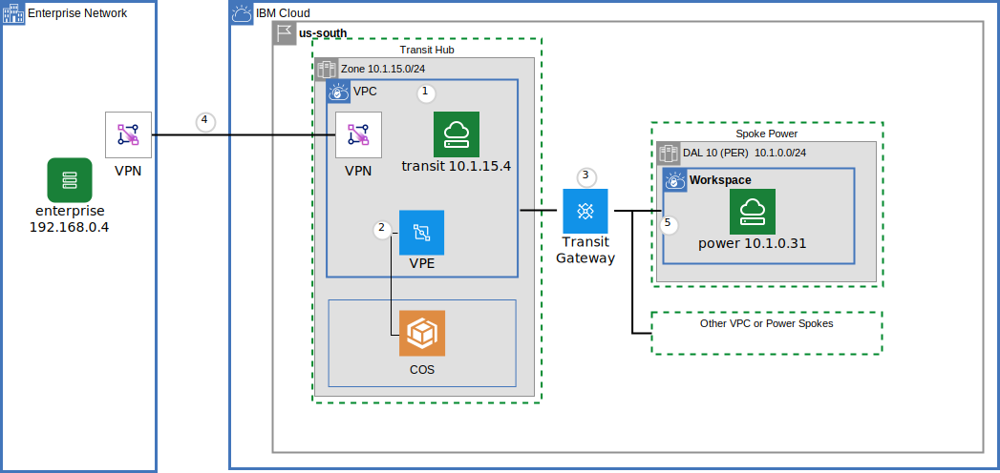
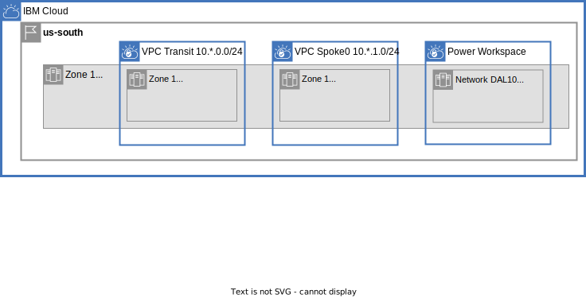

{{site.data.keyword.attribute-definition-list}}

# Power Systems communication through a VPC Transit Hub and Spoke architecture
{: #vpc-transit-power}
{: toc-content-type="tutorial"}
{: toc-services="vpc, transit-gateway, direct-link, dns-svcs, cloud-databases, databases-for-redis, power-iaas"}
{: toc-completion-time="2h"}

This tutorial may incur costs. Use the [Cost Estimator](/estimator/review) to generate a cost estimate based on your projected usage.
{: tip}

- site.data.keyword.powerSysFull {{site.data.keyword.powerSysFull}}
- site.data.keyword.powerSys_notm {{site.data.keyword.powerSys_notm}}
- site.data.keyword.powerSysShort {{site.data.keyword.powerSysShort}}

The [{{site.data.keyword.powerSysFull}}](/docs/power-iaas?topic=power-iaas-getting-started) can host {{site.data.keyword.powerSys_notm}} instances (.i.e virtual server instances) running a variety of different operating environments like Linux, AIX and IBM i. The {{site.data.keyword.cloud_notm}} also supports Virtual Private Cloud (VPC) which provides network isolation and security in the {{site.data.keyword.cloud_notm}}. {{site.data.keyword.powerSys_notm}} can connect to VPCs via a TGW and utilize the VPC network to access Virtual server instances in the VPC or networkdevices like a VPN or Virtual private endpoint gateways. A VPC or {{site.data.keyword.powerSys_notm}} workspace can be a building block that encapsulates a corporate division (marketing, development, accounting, ...) or a collection of microservices owned by a DevSecOps team. This may create the need to route traffic through centralized firewall-gateway appliances.
{: shortdesc}

This tutorial will walk through the implementation of a hub and spoke architecture depicted in this high-level view:

TODO UPDATE DIAGRAM:

{: caption="Figure 1. Architecture diagram of the tutorial" caption-side="bottom"}
{: style="text-align: center;"}

This tutorial is stand alone but layers on a two part tutorial on Centralize communication through a VPC Transit Hub and Spoke architecture.  See [part one](/docs/solution-tutorials?topic=solution-tutorials-vpc-transit1) and [part two](/docs/solution-tutorials?topic=solution-tutorials-vpc-transit-power). If you find yourself struggling through VPC concepts like network IP layout and planning in the {{site.data.keyword.cloud_notm}}, {{site.data.keyword.tg_short}}, {{site.data.keyword.BluDirectLink}} or VPC ingress routing - check out the foundation tutorials.

Private DNS is used for name resolution of microservice identification and {{site.data.keyword.cloud_notm}} service instance identification using a virtual private endpoint gateway.

The hub and spoke model supports a number of different scenarios:
- The hub can be the repository for shared micro services used by spokes and enterprise.
- The hub can be a central point of traffic between enterprise and the cloud.  VPN or Direct link connections can terminate in the hub and be shared by the spokes.
- The hub can be the repository for shared cloud resources, like databases, accessed through [virtual private endpoint gateways](/docs/vpc?topic=vpc-about-vpe) controlled with VPC security groups and subnet access control lists, shared by spokes and enterprise

There is a companion [GitHub repository](https://github.com/IBM-Cloud/vpc-transit){: external} that divides the connectivity into a number of incremental layers. In the tutorial thin layers enable the introduction of bite size challenges and solutions.

The following will be explored:
- {{site.data.keyword.powerSysShort}} communication with VPC instances
- {{site.data.keyword.powerSysShort}} communication with on premises servers
- DNS resolution.
- {{site.data.keyword.powerSysShort}} access to VPC virtual private endpoint gateway


## Objectives
{: #vpc-transit-power-objectives}

* Understand the concepts behind a {{site.data.keyword.powerSys_notm}} networking.
* Utilize the{{site.data.keyword.tg_full_notm}} for connecting {{site.data.keyword.powerSys_notm}} to VPC.
* Routing {{site.data.keyword.powerSys_notm}} traffic to on premises through a VPC site to site VPN, TGW or DL.
* Connect {{site.data.keyword.powerSys_notm}} instances through virtual private endpoint gateways to services.
* Utilize the DNS service routing and forwarding rules to build an architecturally sound name resolution system.

## Before you begin
{: #vpc-transit-power-prereqs}

This tutorial requires {{site.data.keyword.powerSys_notm}} data centers that support Power Edge Routing.  See [Getting started with the Power Edge Router](/docs/power-iaas?topic=power-iaas-per) for more information including the list of data centers where the solution is available.
{: note}

This tutorial requires:
* `terraform` to use Infrastructure as Code to provision resources,
* `python` to optionally run the pytest commands,

See the [prerequisites](https://github.com/IBM-Cloud/vpc-transit#prerequisites){: external} for a few options including a Dockerfile to easily create the prerequisite environment.

In addition:

- Check for user permissions. Be sure that your user account has sufficient permissions to create and manage all the resources in this tutorial. See the list of:
   - [required permissions for VPC](/docs/vpc?topic=vpc-managing-user-permissions-for-vpc-resources).
   - [required permissions for creating {{site.data.keyword.tg_short}}](/docs/transit-gateway?topic=transit-gateway-iam).
   - [required permissions for {{site.data.keyword.powerSys_notm}}](/docs/power-iaas?topic=power-iaas-managing-resources-and-users)

## Routing and Zones
{: #vpc-transit-power-routing-and-zones}

The address layout for the us-south region is shown below.  Notice:
- An availability zone address space 10.1.0.0/16 is used for VPC availability zone 1 and {{site.data.keyword.powerSys_notm}} workspaces in dal10.
- The address space for transit, spoke0 and spoke1 do not overlap.
- There is an address prefixin the transit for the enterprise. This is required to advertise the routes through the transit gateway.

TODO UPDATE DIAGRAM
{: caption="Components and connections" caption-side="bottom"}
{: style="text-align: center;"}

## Provision resources
{: #vpc-transit-power-provision-resources}
{: step}

1. The companion [GitHub Repository](https://github.com/IBM-Cloud/vpc-transit){: external} has the source files to implement the architecture. In a desktop shell clone the repository:
   ```sh
   git clone https://github.com/IBM-Cloud/vpc-transit
   cd vpc-transit
   ```
   {: codeblock}

1. The config_tf directory contains configuration variables that you are required to configure.

   ```sh
   cp config_tf/template.power.terraform.tfvars config_tf/terraform.tfvars
   ```
   {: codeblock}

1. Edit **config_tf/terraform.tfvars**. Use the comments in that file as your guide.

1. It is possible to provision the architecture a layer at a time. A shell command **./apply.sh** is provided to install the layers in order. The following will display help:

   ```sh
   ./apply.sh
   ```
   {: codeblock}

1. If you don't already have one, obtain a [Platform API key](/iam/apikeys) and export the API key for use by Terraform:

   ```sh
   export IBMCLOUD_API_KEY=YourAPIKEy
   ```
   {: codeblock}

1. Install all layers.  The ':' are used to represent the first and last layers.

   ```sh
   ./apply.sh : :
   ```
   {: codeblock}

The {{site.data.keyword.powerSys_notm}} has been created along with the VPCs and the enterprise connection: either VPC VPN or {{site.data.keyword.tg_short}} or {{site.data.keyword.tg_short}} depending on the configured.

## SSH keys
{: #vpc-transit-power-server-instance-configuration}
{: step}

The provision created two files one for each member of the key pair required to ssh:
- config_tf/id_rsa - private key that you should keep safe.
- config_tf/id_rsa.pub - public key that can be given to third parties.


The public key was used to create two SSH keys in the cloud:
- Power SSH keys
- SSH keys for VPC

Verify the Power SSH key:
- Navigate to [Power SSH keys](/power/ssh-keys).
- On the left side navigation panel select the workspace with your initials.

Find the key that has your initials.  Optionally verify that the contents of the cloud ssh key matches the content of the public key file.

Locate the key with the same name in [SSH keys for VPC](/vpc-ext/compute/sshKeys)

## Virtual server instance configuration
{: #vpc-transit-power-server-instance-configuration}
{: step}

The terraform configuration created a {{site.data.keyword.powerSys_notm}} linux Virtual server instance but was not able to fully configure it.  It is now possible to configure the ip route tables and install an nginx server to support testing.

```
cd power_tf; # should be in the .../vpc-transit/power_tf directory
terraform output fixpower
```

This experience will look something like this:
```
% cd power_tf
% terraform output fixpower
[
  {
    "per-spoke1" = <<-EOT
    # ssh -J root@52.116.131.48 root@10.1.2.31
    ssh -oProxyCommand="ssh -W %h:%p -i ../config_tf/id_rsa root@52.116.131.48" -i ../config_tf/id_rsa root@10.1.2.31
    ip route add 10.0.0.0/8 via 10.1.2.1 dev eth0
    ip route add 172.16.0.0/12 via 10.1.2.1 dev eth0
    ip route add 192.168.0.0/16 via 10.1.2.1 dev eth0
    ip route change default via 192.168.232.1 dev eth1
    exit
    # it is now possible to ssh directly to the public IP address
    ssh -i ../config_tf/id_rsa root@150.240.147.36
    # execute the rest of these commands to install nginx for testing
    zypper install -y nginx postgresql
    systemctl start nginx
    echo per-spoke1 > /srv/www/htdocs/name
    sleep 10
    curl localhost/name


    EOT
  },
]
```

Simply copy/paste the commands a line at a time.  Here is what is happening:
- The ssh command will log in to the virtual server instance using the private ssh key created earlier.  It is required to **jump** through an intermediate transit VPC virtual server.  The -oProxyCommand configures the jump server.
- The **ip route** commands executed on the Power Linux server will route all [Private network](https://en.wikipedia.org/wiki/Private_network) CIDR blocks through the private subnet (eth0).  Notice these include both the 10.0.0.0 cloud CIDR block and the 192.168.0.0 enterprise CIDR block.
- The default route captures will route the rest of the addresses including the IP address of your workstation through the public subnet (eth1). This will allow the test automation to ssh directly to the public IP address of the virtual server instance in the future and avoid the jump server
- Quit the ssh session.
- Use ssh to directly login to the instance using the public IP address.  This verifies that the iptable configuration is correct.
- The final step is to install nginx and postgresql.  Nginx is a http server that will host a web page that is verified using a curl command. The test suite will access the web page to verify connectivity.  The postgreql command line tool is used by the test suite to test connectivity to the {{site.data.keyword.postgresql}} instances.

## Test network connectivity
{: #vpc-transit-power-test-network-connectivity}
{: step}

A **pytest** test suite will be used to exhaustively tests communication paths.

It is not required for the reader to use **pytest** to verify the results. It is straight forward to reproduce the test results shown below by hand but quite tedious. For each line of the example output in the example below find the resource in the [Resources](/resources) view of the {{site.data.keyword.cloud_notm}} console and navigate to the left resource and locate the public IP addresses for an ssh session. Using the shell of the cloud instance execute a curl command to the private IP address of the instance on the right: curl `A.B.C.D/name`.
{: note}

There are a couple of different ways to install and use python as covered in the [README.md](https://github.com/IBM-Cloud/vpc-transit).

Each **pytest** test will SSH to an instance on the left and perform a connectivity test, like executing a `curl` command to the instance on the right. The default SSH environment is used to log in to the left hand instances. If you see unexpected test results try the [pytest troubleshooting](https://github.com/IBM-Cloud/vpc-transit#pytest-troubleshooting){: external} section.

Test connectivity It is now possible to test network connectivity using pytest.  Make sure your current directory is vpc-transit:

```
pytest -m curl
```
{: codeblock}

Example output:
```
(vpc-transit) % pytest -m curl
=============================================================================== test session starts ===============================================================================
platform darwin -- Python 3.11.5, pytest-7.4.2, pluggy-1.3.0 -- /Users/powellquiring/github.com/IBM-Cloud/vpc-transit/venv/bin/python
cachedir: .pytest_cache
rootdir: /Users/powellquiring/github.com/IBM-Cloud/vpc-transit
configfile: pytest.ini
testpaths: py
plugins: xdist-3.3.1
collected 61 items / 45 deselected / 16 selected

py/test_transit.py::test_curl[l-spoke1        -> r-spoke1] PASSED                                                                                                           [  6%]
py/test_transit.py::test_curl[l-spoke1        -> r-enterprise-z1] PASSED                                                                                                    [ 12%]
py/test_transit.py::test_curl[l-spoke1        -> r-transit-z1] PASSED                                                                                                       [ 18%]
py/test_transit.py::test_curl[l-spoke1        -> r-spoke0-z1] PASSED                                                                                                        [ 25%]
py/test_transit.py::test_curl[l-enterprise-z1 -> r-spoke1] PASSED                                                                                                           [ 31%]
py/test_transit.py::test_curl[l-enterprise-z1 -> r-enterprise-z1] PASSED                                                                                                    [ 37%]
py/test_transit.py::test_curl[l-enterprise-z1 -> r-transit-z1] PASSED                                                                                                       [ 43%]
py/test_transit.py::test_curl[l-enterprise-z1 -> r-spoke0-z1] PASSED                                                                                                        [ 50%]
py/test_transit.py::test_curl[l-transit-z1    -> r-spoke1] PASSED                                                                                                           [ 56%]
py/test_transit.py::test_curl[l-transit-z1    -> r-enterprise-z1] PASSED                                                                                                    [ 62%]
py/test_transit.py::test_curl[l-transit-z1    -> r-transit-z1] PASSED                                                                                                       [ 68%]
py/test_transit.py::test_curl[l-transit-z1    -> r-spoke0-z1] PASSED                                                                                                        [ 75%]
py/test_transit.py::test_curl[l-spoke0-z1     -> r-spoke1] PASSED                                                                                                           [ 81%]
py/test_transit.py::test_curl[l-spoke0-z1     -> r-enterprise-z1] PASSED                                                                                                    [ 87%]
py/test_transit.py::test_curl[l-spoke0-z1     -> r-transit-z1] PASSED                                                                                                       [ 93%]
py/test_transit.py::test_curl[l-spoke0-z1     -> r-spoke0-z1] PASSED                                                                                                        [100%]

======================================================================= 16 passed, 45 deselected in 14.91s ========================================================================
```

The first test `py/test_transit.py::test_curl[l-spoke1        -> r-spoke1]` is stating that the left side of the test (`l-`) is run on the test instance in spoke1.  The right (`r-`) is run against spoke1. The test will `ssh` to the left side and `curl` to the right side.

The spoke-1 is the {{site.data.keyword.powerSys_notm}} instance.

Run the vpe tests:

```
pytest -m vpe
```
{: codeblock}

Example output:
```
(vpc-transit) % pytest -m vpe
=============================================================================== test session starts ===============================================================================
platform darwin -- Python 3.11.5, pytest-7.4.2, pluggy-1.3.0 -- /Users/powellquiring/github.com/IBM-Cloud/vpc-transit/venv/bin/python
cachedir: .pytest_cache
rootdir: /Users/powellquiring/github.com/IBM-Cloud/vpc-transit
configfile: pytest.ini
testpaths: py
plugins: xdist-3.3.1
collected 61 items / 53 deselected / 8 selected

py/test_transit.py::test_vpe[postgresql spoke1 -> transit 14d0604b-288b-40af-8e9a-5cf3021c333d.bn2a2uid0up8mv7mv2ig.private.databases.appdomain.cloud] PASSED               [ 12%]
py/test_transit.py::test_vpe[postgresql enterprise-z1 -> transit 14d0604b-288b-40af-8e9a-5cf3021c333d.bn2a2uid0up8mv7mv2ig.private.databases.appdomain.cloud] PASSED        [ 25%]
py/test_transit.py::test_vpe[postgresql transit-z1 -> transit 14d0604b-288b-40af-8e9a-5cf3021c333d.bn2a2uid0up8mv7mv2ig.private.databases.appdomain.cloud] PASSED           [ 37%]
py/test_transit.py::test_vpe[postgresql spoke0-z1 -> transit 14d0604b-288b-40af-8e9a-5cf3021c333d.bn2a2uid0up8mv7mv2ig.private.databases.appdomain.cloud] PASSED            [ 50%]
py/test_transit.py::test_vpe[postgresql spoke1 -> spoke0 8443e306-55bb-4373-a7c2-3fee089034c0.c7e0lq3d0hm8lbg600bg.private.databases.appdomain.cloud] PASSED                [ 62%]
py/test_transit.py::test_vpe[postgresql enterprise-z1 -> spoke0 8443e306-55bb-4373-a7c2-3fee089034c0.c7e0lq3d0hm8lbg600bg.private.databases.appdomain.cloud] PASSED         [ 75%]
py/test_transit.py::test_vpe[postgresql transit-z1 -> spoke0 8443e306-55bb-4373-a7c2-3fee089034c0.c7e0lq3d0hm8lbg600bg.private.databases.appdomain.cloud] PASSED            [ 87%]
py/test_transit.py::test_vpe[postgresql spoke0-z1 -> spoke0 8443e306-55bb-4373-a7c2-3fee089034c0.c7e0lq3d0hm8lbg600bg.private.databases.appdomain.cloud] PASSED             [100%]

======================================================================== 8 passed, 53 deselected in 12.18s ========================================================================
```

The first test, `py/test_transit.py::test_vpe[postgresql spoke1 -> transit 14d0604b-288b-40af-8e9a-5cf3021c333d.bn2a2uid0up8mv7mv2ig.private.databases.appdomain.cloud] ` is stating that the test will `ssh` into spoke1 and then execute a postgresql command against the DNS name of the postgresql instance 14d0604b-288b-40af-8e9a-5cf3021c333d.bn2a2uid0up8mv7mv2ig.private.databases.appdomain.cloud`. This instance has a {{site.data.keyword.vpe_short}} in the transit VPC. You will notice in a future step that this is through the VPC Virtual private endpoint gateway path.

## Transit gateway
{: #vpc-transit-power-transit-gateway}
{: step}

This diagram has a green line showing the traffic path from the Power instance to the enterprise instance:

TODO UPDATE DIAGRAM
{: caption="Components and connections" caption-side="bottom"}
{: style="text-align: center;"}

Open [Transit gateway](/interconnectivity/transit) and select the **initials-tgw**. Ignore the **initials-tgw-link** if visible, it is used to simulate the direct link connection from the enterprise to the transit VPC.  Notice:
- There are three connections: transit, spoke0 and spoke1.
- Click on **BGP** and **Generate report**. It is interesting to note that enterprise CIDR, 192.168.0.0/24, is in the transit connection.  That is where the VPN or {{site.data.keyword.dl_short}} are located.

## Power to enterprise via transit VPC
{: #vpc-transit-power-power-to-enterpreise-via-transit-vpc}
{: step}

The previous step demonstrated that the Power instance can get to an enterprise instance with the address 192.168.0.4 through the transit gateway.  VPC ingress routing will route traffic directly to the VPN instance.  Visit the [Virtual private cloud](/vpc-ext/network/vpcs)

1. Click **VPCs** on the left.
1. Click the transit VPC
1. Scroll down and click **Manage routing tables**
1. Click the **vpn-ingress**

This shows that traffic heading towards 192.168.0.0/24 should actually be sent to a **Next hop** address in the VPC. Note the next hop IP address. You can find it in the VPC VPN service.

1. Navigate to [VPN](/vpc-ext/network/vpngateways) and select the transit VPN gateway.
1. Inspect the **Gateway member** section.  The **Private IP** should match.

## Power DNS resolution
{: #vpc-transit-power-dns-resolution}
{: step}

This diagram has blue line showing the DNS resolution chains used by the Power instance and a green line showing the data path.

TODO UPDATE DIAGRAM

{: caption="Components and connections" caption-side="bottom"}
{: style="text-align: center;"}

First find the DNS name of the postgresql database VPC Virtual private endpoint gateway in the spoke:
1. Navigate to the [VPC virtual private endpoint gateways](/vpc-ext/network/endpointGateways).
1. Click on the spoke0 instance.
1. Inspect the **Service endpoint** it will be something like: **spoke0 8443e306-55bb-4373-a7c2-3fee089034c0.c7e0lq3d0hm8lbg600bg.private.databases.appdomain.cloud**

This DNS name, **GUID.private.databases.appdomain.cloud** 

Follow the instructions used above to ssh to the Power instance.  Try the dig command to find the IP address.  Here is an example:

```
per-spoke1:~ # dig bb4815e2-b280-4add-9778-5ed374c65e8f.c7e0lq3d0hm8lbg600bg.private.databases.appdomain.cloud

; <<>> DiG 9.16.38 <<>> bb4815e2-b280-4add-9778-5ed374c65e8f.c7e0lq3d0hm8lbg600bg.private.databases.appdomain.cloud
...
;; ANSWER SECTION:
bb4815e2-b280-4add-9778-5ed374c65e8f.c7e0lq3d0hm8lbg600bg.private.databases.appdomain.cloud. 660 IN A 10.1.1.132
...
```
In this case **10.1.1.132** is the IP address of the database through the virtual private endpoint gateway.

It is possible to verify the DNS forwarding path shown on the blue line.  First find the DNS server that is resolving the address:
1. Navigate to [Power Systems Virtual Server](/power) and select your workspace.
1. Click on the private subnet.
1. One of the **DNS Servers** will be 10.1.0.xy.  Note the exact IP.

This is the address of a [{{site.data.keyword.dns_short}} custom resolver](/docs/dns-svcs?topic=dns-svcs-custom-resolver). The address 10.1.0 verifies that it is in the transit VPC. Locate the DNS instance and the custom resolver:
1. Navigate to the [Resource list](/resources).
1. Open the **Networking** section and click the transit instance of the {{site.data.keyword.dns_notm}} service.
1. In the transit DNS instance, click **Custom resolver** on the left.
1. Click on the custom resolver to open the details page.

Match the DNS server noted earlier (found in the Power private subnet) against the resolver location IP addresses.

The diagram shows an arrow from this DNS resolver to spoke0.  Verify this by following the forwarding rules:

1. Click the **Forwarding rules** tab at the top.
1. Find the DNS name **GUID.private.databases.appdomain.cloud** and note the IP address of the forwarding IP addresses.

Also note the forwarding rules for the spoke0.com subdomain. It is forwarded to the same resolvers. The forwarding rules for the enterprise.com subdomain is forwarded to the enterprise resolvers having 192.168.0.xy addresses.

Optionally find the {{site.data.keyword.dns_short}} instance custom resolvers in the spoke. In the spoke there will be no forwarding rule for the postgresql DNS name since the spoke instance will resolve the DNS address using the VPC virtual private endpoint gateway address.

## x content
{: #vpc-transit-power-x}
{: step}

## Related content
{: #vpc-transit-power-related}

* [IBM Cloud for Financial Services](/docs/framework-financial-services)
* Tutorial: [Best practices for organizing users, teams, applications](/docs/solution-tutorials?topic=solution-tutorials-users-teams-applications#users-teams-applications)
* [How to deploy isolated workloads across multiple locations and regions](/docs/solution-tutorials?topic=solution-tutorials-vpc-multi-region)
* [Public front end and private backend in a Virtual Private Cloud](/docs/solution-tutorials?topic=solution-tutorials-vpc-public-app-private-backend),
* [Network Function Virtualization](/docs/vpc?topic=vpc-about-vnf)
* [Private hub and spoke with transparent VNF and spoke-to-spoke traffic](/docs/vpc?topic=vpc-about-vnf-ha)
