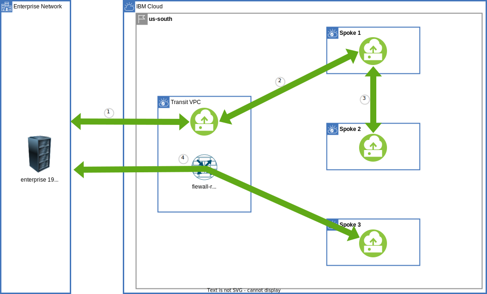

{{site.data.keyword.attribute-definition-list}}

# Power Systems communication through a VPC Transit Hub and Spoke architecture
{: #vpc-transit-power}
{: toc-content-type="tutorial"}
{: toc-services="vpc, transit-gateway, direct-link, dns-svcs, cloud-databases, databases-for-redis, power-iaas"}
{: toc-completion-time="2h"}

This tutorial may incur costs. Use the [Cost Estimator](/estimator/review) to generate a cost estimate based on your projected usage.
{: tip}

A {: site.data.keyword.powerSysFull} is used to host Power Virtual Machines running a variety of different operating environments like I, Linux, AIX TODO.  A Virtual Private Cloud (VPC) provides network isolation and security in the {{site.data.keyword.cloud_notm}}. PVC can connect to VPCs via a TGW and utilize the VPC network to access Virtual server instances in the VPC or networkdevices like a VPN or Virtual private endpoint gateways. A VPC or PVC can be a building block that encapsulates a corporate division (marketing, development, accounting, ...) or a collection of microservices owned by a DevSecOps team. This may create the need to route traffic through centralized firewall-gateway appliances. This tutorial will walk through the implementation of a hub and spoke architecture depicted in this high-level view:

{: caption="Figure 1. Architecture diagram of the tutorial" caption-side="bottom"}
{: style="text-align: center;"}

This tutorial is stand alone but layers on a two part tutorial on Centralize communication through a VPC Transit Hub and Spoke architecture.  See [part one](/docs/solution-tutorials?topic=solution-tutorials-vpc-transit1) and [part two](/docs/solution-tutorials?topic=solution-tutorials-vpc-transit-power). If you find yourself struggling through VPC concepts like network IP layout and planning in the {{site.data.keyword.cloud_notm}}, {{site.data.keyword.tg_short}}, {{site.data.keyword.BluDirectLink}} or asymmetric routing you can check out the foundation tutorials.


This tutorial will focus on {{site.data.keyword.powerSysFull}} and routing traffic through a transit hub firewall-router. Private DNS is used for both for microservice identification and {{site.data.keyword.cloud_notm}} service instance identification using a virtual private endpoint gateway.

The hub and spoke model supports a number of different scenarios:
- The hub can be the repository for shared micro services used by spokes and enterprise.
- The hub can be a central point of traffic firewall-router and routing between enterprise and the cloud.
- The hub can monitor all or some of the traffic - spoke <-> spoke, spoke <-> transit, or spoke <-> enterprise.
- The hub can hold the VPN resources that are shared by the spokes.
- The hub can be the repository for shared cloud resources, like databases, accessed through [virtual private endpoint gateways](/docs/vpc?topic=vpc-about-vpe) controlled with VPC security groups and subnet access control lists, shared by spokes and enterprise

There is a companion [GitHub repository](https://github.com/IBM-Cloud/vpc-transit){: external} that divides the connectivity into a number of incremental layers. In the tutorial thin layers enable the introduction of bite size challenges and solutions.

The following will be explored:
- {{site.data.keyword.powerSysShort}} access to VPC virtual private endpoint gateway
- {{site.data.keyword.powerSysShort}} communication with VPC instances
- {{site.data.keyword.powerSysShort}} communication with on premises servers
- DNS resolution.

A layered architecture will introduce resources and demonstrate connectivity. Each layer will add additional connectivity and resources. The layers are implemented in Terraform. It will be possible to change parameters, like number of zones, by changing a Terraform variable. A layered approach allows the tutorial to introduce small problems and demonstrate a solution in the context of a complete architecture.
{: shortdesc}

## Objectives
{: #vpc-transit-power-objectives}

* Understand the concepts behind a PVC networking.
* Utilize the TGW for connecting PVC to VPC.
* Routing PVC traffic to on premises through a VPC site to site VPN, TGW or DL.
* Connect PVC computers through virtual private endpoint gateways to services.
* Utilize the DNS service routing and forwarding rules to build an architecturally sound name resolution system.

## Before you begin
{: #vpc-transit-power-prereqs}

This tutorial requires:
* `terraform` to use Infrastructure as Code to provision resources,
* `python` to optionally run the pytest commands,
* Implementing a firewall-router will require that you [enable IP spoofing checks](/docs/vpc?topic=vpc-ip-spoofing-about#ip-spoofing-enable-check),
* An SSH key to connect to the virtual servers. If you don't have an SSH key, follow [the instructions](/docs/vpc?topic=vpc-ssh-keys) for creating a key for VPC. Keep your public SSH key handy it will be required to be created a PVC SSH key in a later step.

See the [prerequisites](https://github.com/IBM-Cloud/vpc-transit#prerequisites){: external} for a few options including a Dockerfile to easily create the prerequisite environment.

In addition:

- Check for user permissions. Be sure that your user account has sufficient permissions to create and manage all the resources in this tutorial. See the list of:
   - [required permissions for VPC](/docs/vpc?topic=vpc-managing-user-permissions-for-vpc-resources).
   - [required permissions for creating {{site.data.keyword.tg_short}}](/docs/transit-gateway?topic=transit-gateway-iam).
   - [required permissions for IP spoofing checks](/docs/vpc?topic=vpc-ip-spoofing-about).

## Routing and Zones
{: #vpc-transit-power-routing-and-zones}

This diagram shows the traffic flow. Only the enterprise <-> spoke is passing through the firewall:

{: caption="Traffic flow" caption-side="bottom"}
{: style="text-align: center;"}

1. enterprise <-> transit
2. spoke <-> transit
3. spoke <-> spoke
4. enterprise <--transit firewall-router--> spoke

DL traffic to the spokes is passing through the firewall-router.

For the rest of this tutorial a transit VPC, a spoke VPC and a PVS spoke in the IBM Cloud will be demonstrated:

{: caption="Components and connections" caption-side="bottom"}
{: style="text-align: center;"}

## Provision VPC network resources
{: #vpc-transit-power-provision-vpc-network-resources}
{: step}

1. The companion [GitHub Repository](https://github.com/IBM-Cloud/vpc-transit){: external} has the source files to implement the architecture. In a desktop shell clone the repository:
   ```sh
   git clone https://github.com/IBM-Cloud/vpc-transit
   cd vpc-transit
   ```
   {: codeblock}

1. The config_tf directory contains configuration variables that you are required to configure.

   ```sh
   cp config_tf/template.terraform.tfvars config_tf/terraform.tfvars
   ```
   {: codeblock}

1. Edit **config_tf/terraform.tfvars** and use the comments in that file as your guide.

1. Since it is important that each layer is installed in the correct order and some steps in this tutorial will install multiple layers a shell command **./apply.sh** is provided. The following will display help:

   ```sh
   ./apply.sh
   ```
   {: codeblock}

1. You could apply all of the layers configured by executing `./apply.sh : :`. The colons are shorthand for first (or config_tf) and last (vpe_dns_forwarding_rules_tf). The **-p** prints the layers:

   ```sh
   ./apply.sh -p : :
   ```
   {: codeblock}

   It will look something like:
   ```sh
   directories: config_tf enterprise_tf transit_tf spokes_tf test_instances_tf test_lbs_tf transit_spoke_tgw_tf enterprise_link_tf firewall_tf transit_ingress_tf spokes_egress_tf all_firewall_tf all_firewall_asym_tf dns_tf vpe_transit_tf vpe_spokes_tf vpe_dns_forwarding_rules_tf
   ```

1. If you don't already have one, obtain a [Platform API key](/iam/apikeys) and export the API key for use by Terraform:

   ```sh
   export IBMCLOUD_API_KEY=YourAPIKEy
   ```
   {: codeblock}

1. In this first step apply in config_tf, enterprise_tf, transit_tf and spokes_tf:

   ```sh
   ./apply.sh : spokes_tf
   ```
   {: codeblock}

The PVC has been created along with the VPCs and VPC VPN.

Open the PVC [workspaces](https://cloud.ibm.com/power/workspaces) and then open the spoke workspace.  Under **Networking** open **Subnets** and note the public and private subnet.  Note the CIDR block for the private subnet: 10.1.2.4 — 10.1.2.62.

## Virtual server instance configuration
{: #vpc-transit-power-server-instance-configuration}
{: step}

The terraform configuration created a Linux Virtual server instance but was not able to fully configure it.  It is now possible to change the ip route tables and install nginx to allow some testing.

```
cd vpc-transit/test_instances_tf
terraform output fixpower
```

This experience will look something like this:
```
% cd vpc-transit/test_instances_tf
% terraform output fixpower

[
  {
    "per-spoke1" = <<-EOT
    ssh -J root@150.240.160.119 root@10.1.2.49
    ip route add 10.0.0.0/8 via 10.1.2.1 dev eth0
    ip route add 172.16.0.0/12 via 10.1.2.1 dev eth0
    ip route add 192.168.0.0/16 via 10.1.2.1 dev eth0
    ip route change default via 192.168.230.193 dev eth1

    #!/bin/bash

    # parameters via substitution done in terraform
    NAME=per-spoke1

    zypper update -y
    zypper install -y nginx postgresql
    systemctl start nginx
    # ifconfig ens3 mtu 1200;# see https://jiracloud.swg.usma.ibm.com:8443/browse/VPN-365
    echo $NAME > /srv/www/htdocs/name
    sleep 10
    curl localhost/name
    curl localhost/name

    EOT
  },
]
```

The ssh command will log in to the virtual server instances using the ssh key created earlier.  

Once logged in the **ip route** commands will route all [Private network](https://en.wikipedia.org/wiki/Private_network) CIDR blocks through the private subnet and the provided router on eth0.

The default route will catch all of the other addresses including the IP address of your workstation that is used to ssh.  This will allow the test automation (and you) to login directly to the public IP address of the virtual server instance in the future and avoid the jump server.

The final step is to install nginx and postgresql.  Nginx is used to host a web page that is verified using the curl command. The curl portion of the test suite will use this to verify connectivity.

## Test network connectivity
{: #vpc-transit-power-test-network-connectivity}
{: step}

It is now possible to test network connectivity using pytest.  Make sure your current directory is vpc-transit:

```
pytest -m curl
```

The results will resemble this output:
```
% pytest -m curl
============================= test session starts ==============================
platform darwin -- Python 3.11.5, pytest-7.4.2, pluggy-1.3.0 -- /Users/powellquiring/github.com/IBM-Cloud/vpc-transit/venv/bin/python
cachedir: .pytest_cache
rootdir: /Users/powellquiring/github.com/IBM-Cloud/vpc-transit
configfile: pytest.ini
testpaths: py
plugins: xdist-3.3.1
collected 65 items / 49 deselected / 16 selected

py/test_transit.py::test_curl[l-enterprise-z1 -> r-enterprise-z1] PASSED [  6%]
py/test_transit.py::test_curl[l-enterprise-z1 -> r-transit-z1] PASSED    [ 12%]
py/test_transit.py::test_curl[l-enterprise-z1 -> r-spoke0-z1] PASSED     [ 18%]
py/test_transit.py::test_curl[l-enterprise-z1 -> r-spoke1] PASSED        [ 25%]
py/test_transit.py::test_curl[l-transit-z1    -> r-enterprise-z1] PASSED [ 31%]
py/test_transit.py::test_curl[l-transit-z1    -> r-transit-z1] PASSED    [ 37%]
py/test_transit.py::test_curl[l-transit-z1    -> r-spoke0-z1] PASSED     [ 43%]
py/test_transit.py::test_curl[l-transit-z1    -> r-spoke1] PASSED        [ 50%]
py/test_transit.py::test_curl[l-spoke0-z1     -> r-enterprise-z1] PASSED [ 56%]
py/test_transit.py::test_curl[l-spoke0-z1     -> r-transit-z1] PASSED    [ 62%]
py/test_transit.py::test_curl[l-spoke0-z1     -> r-spoke0-z1] PASSED     [ 68%]
py/test_transit.py::test_curl[l-spoke0-z1     -> r-spoke1] PASSED        [ 75%]
py/test_transit.py::test_curl[l-spoke1        -> r-enterprise-z1] PASSED [ 81%]
py/test_transit.py::test_curl[l-spoke1        -> r-transit-z1] PASSED    [ 87%]
py/test_transit.py::test_curl[l-spoke1        -> r-spoke0-z1] PASSED     [ 93%]
py/test_transit.py::test_curl[l-spoke1        -> r-spoke1] PASSED        [100%]

====================== 16 passed, 49 deselected in 17.03s ======================
```

The tests run a curl command from the instance on the left `l-` and connect to an instance on the right `r-`.  The spoke1 is the Power virtual server instance.  Notice how enterprise, transit, and spoke0 are all able to connect to it.  In addition spoke1 is able to access the other servers.

If you want to verify the connectivity yourself you can ssh into the instances.  Turn on the TEST_DEBUG flag to display the IP addresses you will need:

```
TEST_DEBUG=1  pytest -m curl
```

## Virtual private endpoint gateways
{: #vpc-transit-power-vpe}
{: step}
The terraform configuration will deploy a postgress instance for the transit VPC and the spoke0 VPC.  Both of these VPCs will have VPEs that can be accessed from the Power virtual server instance.

Run the following to execute the entire stack and make these VPEs available.

```
./apply.sh : :
```

## Network subnet DNS configuration
{: #vpc-transit-power-network-subnet-dns-configuration}
{: step}


Navigate to [Power Systems Virtual Server](https://cloud.ibm.com/power) and select your workspace.  Notice there is both a public and private subnet.

and click the **Create ssh key** button if needed. There are instructions on how to create a public/private key pair if you do not already have a pair that you typically use for ssh. Complete the cloud ssh public key create step.


If you make a change to the terraform.tfvars file you must apply in the config_tf directory:
```
./apply.sh config_tf
```
{: codeblock}


## x content
{: #vpc-transit-power-x}
{: step}

## Related content
{: #vpc-transit-power-related}

* [IBM Cloud for Financial Services](/docs/framework-financial-services)
* Tutorial: [Best practices for organizing users, teams, applications](/docs/solution-tutorials?topic=solution-tutorials-users-teams-applications#users-teams-applications)
* [How to deploy isolated workloads across multiple locations and regions](/docs/solution-tutorials?topic=solution-tutorials-vpc-multi-region)
* [Public front end and private backend in a Virtual Private Cloud](/docs/solution-tutorials?topic=solution-tutorials-vpc-public-app-private-backend),
* [Network Function Virtualization](/docs/vpc?topic=vpc-about-vnf)
* [Private hub and spoke with transparent VNF and spoke-to-spoke traffic](/docs/vpc?topic=vpc-about-vnf-ha)
