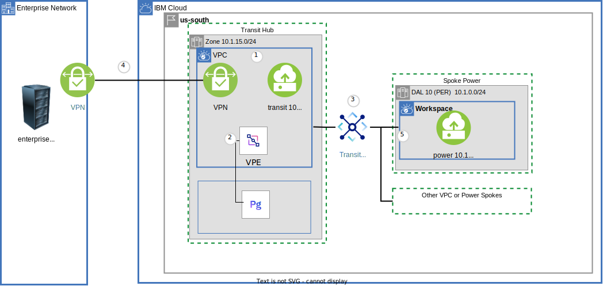
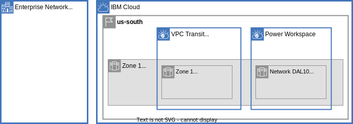
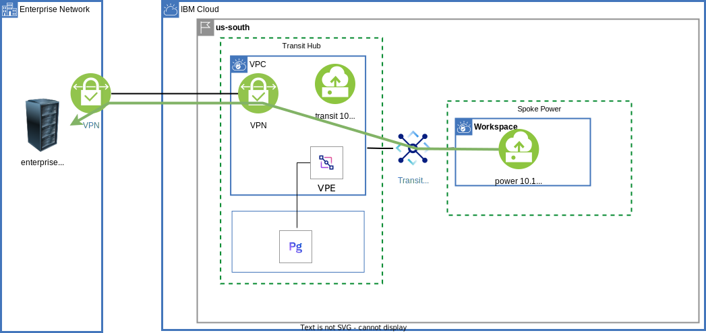
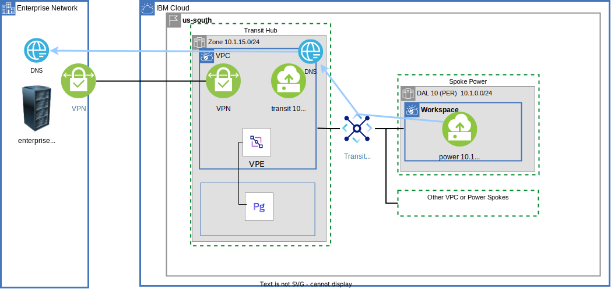

{{site.data.keyword.attribute-definition-list}}

# Power Systems communication through a VPC Transit Hub - VPN, DNS, ...
{: #vpc-transit-power}
{: toc-content-type="tutorial"}
{: toc-services="power-iaas, vpc, transit-gateway, dns-svcs, cloud-databases"}
{: toc-completion-time="2h"}

This tutorial may incur costs. Use the [Cost Estimator](/estimator) to generate a cost estimate based on your projected usage.
{: tip}

The [{{site.data.keyword.powerSysFull}}](/docs/power-iaas?topic=power-iaas-getting-started) can host {{site.data.keyword.powerSys_notm}} instances. The {{site.data.keyword.cloud_notm}} also supports Virtual Private Cloud (VPC). {{site.data.keyword.powerSys_notm}} can connect to VPCs via a {{site.data.keyword.tg_full}} and access VPC resources. This tutorial walks you through an example implementation and explores the architecture depicted in this high-level view:
{: shortdesc}

{: caption="Figure 1. Architecture diagram of the tutorial" caption-side="bottom"}
{: style="text-align: center;"}

1. Transit VPC and children resources like virtual server instances.
1. VPC virtual private endpoint gateways (VPEs) are used to access cloud service instances like {{site.data.keyword.databases-for-postgresql}}.
1. A {{site.data.keyword.tg_short}} connected to the transit VPC and the spokes.
1. {{site.data.keyword.vpn_vpc_short}} connectivity between the transit VPC and enterprise network.
1. {{site.data.keyword.powerSys_notm}} in a region with Power Edge Router (PER) can access everything through the attached {{site.data.keyword.tg_short}}.

This tutorial is stand-alone but conceptually layers on a two-part tutorial on Centralize communication through a VPC Transit Hub and Spoke architecture. Dive even deeper into VPC in the foundation tutorials: [part one](/docs/solution-tutorials?topic=solution-tutorials-vpc-transit1) and [part two](/docs/solution-tutorials?topic=solution-tutorials-vpc-transit2).

## Objectives
{: #vpc-transit-power-objectives}

* Understand the concepts behind a {{site.data.keyword.powerSys_notm}} networking.
* Utilize the {{site.data.keyword.tg_full_notm}} for connecting {{site.data.keyword.powerSys_notm}} to VPC.
* Route {{site.data.keyword.powerSys_notm}} traffic to on-premises through a VPC site-to-site VPN.
* Connect {{site.data.keyword.powerSys_notm}} instances through VPC virtual private endpoint gateways to services.
* Utilize the DNS service routing and forwarding rules to build an architecturally sound name resolution system.
* Use VPC virtual private endpoint gateways to securely access cloud services.

## Before you begin
{: #vpc-transit-power-prereqs}

This tutorial requires {{site.data.keyword.powerSys_notm}} data centers that support Power Edge Routing (PER). See [Getting started with the Power Edge Router](/docs/power-iaas?topic=power-iaas-per) for more information including the list of data centers where the solution is available.
{: note}

This tutorial requires:
* Terraform to use Infrastructure as Code to provision resources
* Python to optionally run the **pytest** commands
* Prerequisites in the companion [GitHub repository](https://github.com/IBM-Cloud/vpc-transit){: external}

   See the [prerequisites](https://github.com/IBM-Cloud/vpc-transit#prerequisites){: external} for a few options including a Dockerfile to build the prerequisite environment.
   {: note}

In addition, check for user permissions. Be sure that your user account has sufficient permissions to create and manage all the resources in this tutorial. See the list of:
- [Required permissions for VPC](/docs/vpc?topic=vpc-managing-user-permissions-for-vpc-resources).
- [Required permissions for creating {{site.data.keyword.tg_short}}](/docs/transit-gateway?topic=transit-gateway-iam).
- [Required permissions for {{site.data.keyword.powerSys_notm}}](/docs/power-iaas?topic=power-iaas-managing-resources-and-users).

## Provision resources
{: #vpc-transit-power-provision-resources}
{: step}

1. The companion [GitHub Repository](https://github.com/IBM-Cloud/vpc-transit){: external} has the source files to implement the architecture. In a desktop shell, clone the repository:

   ```sh
   git clone https://github.com/IBM-Cloud/vpc-transit
   cd vpc-transit
   ```
   {: codeblock}

1. The config_tf directory requires a file **terraform.tfvars**. The file **template.power.terraform.tfvars** is the starting point for this tutorial.

   ```sh
   cp config_tf/template.power.terraform.tfvars config_tf/terraform.tfvars
   ```
   {: codeblock}

1. Edit **config_tf/terraform.tfvars**. Use the comments in that file as your guide. Change the values of your existing **resource_group_name** and **basename**. The string $BASENAME in the text below refers to the basename provided here.

1. It is possible to provision the architecture a layer at a time. A shell command **./apply.sh** is provided to install the layers in order. The following displays help:

   ```sh
   ./apply.sh
   ```
   {: codeblock}

1. If you don't already have one, obtain a [Platform API key](/iam/apikeys) and export the API key for use by Terraform:

   ```sh
   export IBMCLOUD_API_KEY=YourAPIKEy
   ```
   {: codeblock}

1. Install all layers. The ':' characters are used to represent the first and last layers.

   ```sh
   ./apply.sh : :
   ```
   {: codeblock}

It can take up to 30 minutes to create the resources in the diagram. The enterprise is simulated using a VPC.

## Check the non-overlapping IP address layout
{: #vpc-transit-power-ip-address-layout}
{: step}

The address layout is shown below. Notice the non-overlapping addresses.

{: caption="Figure 2. IP address layout" caption-side="bottom"}
{: style="text-align: center;"}

Notice:
- An availability zone address space `10.1.0.0/16` is used for VPC availability zone 1 and {{site.data.keyword.powerSys_notm}} workspaces in dal10.
- The address space for enterprise, transit, and spoke0 do not overlap.
- An on-prem address prefix in the transit VPC is used to advertise the enterprise routes through the {{site.data.keyword.tg_short}}. No subnets are created in the transit VPC from the on-prem prefix. This is discussed in the "investigate the {{site.data.keyword.tg_short}}" step below.

Explore the architecture in the {{site.data.keyword.cloud_notm}} console:

1. Navigate to [Virtual private clouds](/vpc-ext/network/vpcs).
1. Select your region from the menu.
1. Select the enterprise VPC and notice the address prefix: `192.168.0.0/24`
1. Navigate to [Virtual private clouds](/vpc-ext/network/vpcs).
1. Select the transit VPC and notice:
   - The address prefix `10.1.15.0/24` defines the transit VPC zone 1.
   - The `on-prem address prefix`, `192.168.0.0/24`.

## Verify the SSH keys
{: #vpc-transit-power-server-ssh-keys}
{: step}

1. The provision created two files one for each member of the key pair required to SSH:
   - config_tf/id_rsa - private key that you should keep safe.
   - config_tf/id_rsa.pub - public key that can be given to third parties.
1. The public key was used to create two SSH keys in the cloud:
   - Power SSH key.
   - SSH key for VPC.
1. Locate VPC SSH key:
   - Navigate to [SSH keys for VPC](/vpc-ext/compute/sshKeys).
   - Notice the SSH key with your $BASENAME.
1. Locate the Power SSH key:
   - Navigate to [Power SSH keys](/power/ssh-keys).
   - On the left side navigation panel select the workspace from the drop down below the word **Workspaces** with your $BASENAME.
   - Notice the SSH key with your $BASENAME.

Optionally, verify that the contents of the cloud SSH key matches the content of the public key file.

## Open the {{site.data.keyword.powerSysShort}} workspace
{: #vpc-transit-power-server-workspace}
{: step}

Along with the SSH keys, the provision created a {{site.data.keyword.powerSysShort}} workspace, subnets, and an instance.

- Open the [Power Virtual Server subnets](/power/subnets) page.
- On the left side navigation panel select the workspace from the drop down below the word **Workspaces** with your $BASENAME.
- Click the **Subnets** in the **Networking** menu on the left (if required) and notice the public and private subnets that were created.
- Click the private subnet name and notice the **Gateway** address that will be referenced later in the ip table configuration of the instance.
- Click the public subnet name and notice the **Gateway** address that will be referenced later in the ip table configuration of the instance.
- Click the **Virtual server instances** on the left and notice the instance that was provisioned along with the public and private IP addresses.

## Configure the virtual server
{: #vpc-transit-power-server-instance-configuration}
{: step}

The Terraform configuration created a {{site.data.keyword.powerSys_notm}} Linux virtual server instance, but was not able to fully configure. It is now possible to configure the IP route tables and install an NGINX server to support testing.

```sh
cd power_tf; # should be in the .../vpc-transit/power_tf directory
terraform output fixpower
```
{: codeblock}

This experience looks something like this:
```
% cd power_tf
% terraform output fixpower
[
  {
    "abc-spoke1" = <<-EOT
    # ssh -J root@52.116.131.48 root@10.1.2.31
    ssh -oProxyCommand="ssh -W %h:%p -i ../config_tf/id_rsa root@52.116.131.48" -i ../config_tf/id_rsa root@10.1.2.31
    ip route add 10.0.0.0/8 via 10.1.2.1 dev eth0
    ip route add 172.16.0.0/12 via 10.1.2.1 dev eth0
    ip route add 192.168.0.0/16 via 10.1.2.1 dev eth0
    ip route change default via 192.168.232.1 dev eth1
    exit
    # it is now possible to ssh directly to the public IP address
    ssh -i ../config_tf/id_rsa root@150.240.147.36
    # execute the rest of these commands to install nginx for testing
    zypper install -y nginx postgresql
    systemctl start nginx
    echo abc-spoke1 > /srv/www/htdocs/name
    sleep 10
    curl localhost/name


    EOT
  },
]
```

In a new terminal window, copy and paste the commands a line at a time. Here is what is happening:
- The SSH command logs in to the virtual server instance using the private SSH key created earlier. It is required to **jump** through an intermediate transit VPC virtual server. The -oProxyCommand configures the jump server.
- The **ip route** commands run on the PowerLinux server route all [private network](https://en.wikipedia.org/wiki/Private_network){: external} CIDR blocks through the private subnet (eth0). Notice that these include both the `10.0.0.0` cloud CIDR block and the `192.168.0.0` enterprise CIDR block.
- The default routes the rest of the addresses, including the IP address of your workstation through the public subnet (eth1). This allows the test automation to SSH directly to the public IP address of the virtual server instance in the future and avoid the jump server.
- Quit the SSH session.
- Use SSH to directly log in to the instance using the public IP address. This verifies that the iptable configuration is correct.
- The final step is to install NGINX and PostgreSQL. NGINX is an HTTP server that hosts a web page that is verified using a `curl` command. The test suite accesses the web page to verify connectivity. The PostgreSQL command line tool is used by the test suite to test connectivity to the {{site.data.keyword.postgresql}} instances.

You can keep this shell available for use in future steps.

## Test network connectivity
{: #vpc-transit-power-test-network-connectivity}
{: step}

A **pytest** test suite is used to exhaustively test communication paths.

It is not required for the reader to use **pytest** to verify the results. It is straight forward to reproduce the test results shown below by hand but tedious. For each line of the example output, find the resource in the [Resources](/resources) view of the {{site.data.keyword.cloud_notm}} console, navigate to the left resource, and locate the public IP addresses for an SSH session. Using the shell of the cloud instance, run a `curl` command to the private IP address of the instance on the right: `curl A.B.C.D/name`.
{: note}

There are a couple of ways to install and use python as covered in the [README.md](https://github.com/IBM-Cloud/vpc-transit){: external}.

Each **pytest** test SSHs to an instance on the left and performs a connectivity test, like running a `curl` command to the instance on the right. The default SSH environment is used to log in to the instances on the left. If you see unexpected test results, try the [pytest troubleshooting](https://github.com/IBM-Cloud/vpc-transit#pytest-troubleshooting){: external} section.

Make sure that your current directory is vpc-transit.

```sh
cd ..
pwd; # .../vpc-transit
```
{: codeblock}

Test network connectivity using pytest:

```sh
pytest
```
{: codeblock}

Example output:

```text
(vpc-transit) % pytest
============================================ test session starts =============================================
platform darwin -- Python 3.11.5, pytest-7.4.2, pluggy-1.3.0 -- /Users/powellquiring/github.com/IBM-Cloud/vpc-transit/venv/bin/python
cachedir: .pytest_cache
rootdir: /Users/powellquiring/github.com/IBM-Cloud/vpc-transit
configfile: pytest.ini
testpaths: py
plugins: xdist-3.3.1
collected 31 items

py/test_transit.py::test_ping[l-spoke0        -> r-spoke0] PASSED                                      [  3%]
py/test_transit.py::test_ping[l-spoke0        -> r-enterprise-z1] PASSED                               [  6%]
py/test_transit.py::test_ping[l-spoke0        -> r-transit-z1] PASSED                                  [  9%]
py/test_transit.py::test_ping[l-enterprise-z1 -> r-spoke0] PASSED                                      [ 12%]
py/test_transit.py::test_ping[l-enterprise-z1 -> r-enterprise-z1] PASSED                               [ 16%]
py/test_transit.py::test_ping[l-enterprise-z1 -> r-transit-z1] PASSED                                  [ 19%]
py/test_transit.py::test_ping[l-transit-z1    -> r-spoke0] PASSED                                      [ 22%]
py/test_transit.py::test_ping[l-transit-z1    -> r-enterprise-z1] PASSED                               [ 25%]
py/test_transit.py::test_ping[l-transit-z1    -> r-transit-z1] PASSED                                  [ 29%]
py/test_transit.py::test_curl[l-spoke0        -> r-spoke0] PASSED                                      [ 32%]
py/test_transit.py::test_curl[l-spoke0        -> r-enterprise-z1] PASSED                               [ 35%]
py/test_transit.py::test_curl[l-spoke0        -> r-transit-z1] PASSED                                  [ 38%]
py/test_transit.py::test_curl[l-enterprise-z1 -> r-spoke0] PASSED                                      [ 41%]
py/test_transit.py::test_curl[l-enterprise-z1 -> r-enterprise-z1] PASSED                               [ 45%]
py/test_transit.py::test_curl[l-enterprise-z1 -> r-transit-z1] PASSED                                  [ 48%]
py/test_transit.py::test_curl[l-transit-z1    -> r-spoke0] PASSED                                      [ 51%]
py/test_transit.py::test_curl[l-transit-z1    -> r-enterprise-z1] PASSED                               [ 54%]
py/test_transit.py::test_curl[l-transit-z1    -> r-transit-z1] PASSED                                  [ 58%]
py/test_transit.py::test_curl_dns[l-spoke0        -> r-abc-enterprise-z1-s0.abc-enterprise.com] PASSED [ 61%]
py/test_transit.py::test_curl_dns[l-spoke0        -> r-abc-transit-z1-s0.abc-transit.com] PASSED       [ 64%]
py/test_transit.py::test_curl_dns[l-enterprise-z1 -> r-abc-enterprise-z1-s0.abc-enterprise.com] PASSED [ 67%]
py/test_transit.py::test_curl_dns[l-enterprise-z1 -> r-abc-transit-z1-s0.abc-transit.com] PASSED       [ 70%]
py/test_transit.py::test_curl_dns[l-transit-z1    -> r-abc-enterprise-z1-s0.abc-enterprise.com] PASSED [ 74%]
py/test_transit.py::test_curl_dns[l-transit-z1    -> r-abc-transit-z1-s0.abc-transit.com] PASSED       [ 77%]
py/test_transit.py::test_vpe_dns_resolution[postgresql spoke0 -> transit 94d98d68-4a3b-462b-9e6e-8266181e6ce6.c7e0lq3d0hm8lbg600bg.private.databases.appdomain.cloud] PASSED [ 80%]
py/test_transit.py::test_vpe_dns_resolution[postgresql enterprise-z1 -> transit 94d98d68-4a3b-462b-9e6e-8266181e6ce6.c7e0lq3d0hm8lbg600bg.private.databases.appdomain.cloud] PASSED [ 83%]
py/test_transit.py::test_vpe_dns_resolution[postgresql transit-z1 -> transit 94d98d68-4a3b-462b-9e6e-8266181e6ce6.c7e0lq3d0hm8lbg600bg.private.databases.appdomain.cloud] PASSED [ 87%]
py/test_transit.py::test_vpe[postgresql spoke0 -> transit 94d98d68-4a3b-462b-9e6e-8266181e6ce6.c7e0lq3d0hm8lbg600bg.private.databases.appdomain.cloud] PASSED [ 90%]
py/test_transit.py::test_vpe[postgresql enterprise-z1 -> transit 94d98d68-4a3b-462b-9e6e-8266181e6ce6.c7e0lq3d0hm8lbg600bg.private.databases.appdomain.cloud] PASSED [ 93%]
py/test_transit.py::test_vpe[postgresql transit-z1 -> transit 94d98d68-4a3b-462b-9e6e-8266181e6ce6.c7e0lq3d0hm8lbg600bg.private.databases.appdomain.cloud] PASSED [ 96%]
py/test_transit.py::test_lb[lb0] SKIPPED (got empty parameter set ['lb'], function test_lb at /Use...) [100%]

======================================= 30 passed, 1 skipped in 38.71s =======================================
```
Each test SSHs to the instance on the left side of the arrow '->' and accesses the right side of the arrow in the following way:
- `test_ping` - Ping IP address.
- `test_curl` - Curl IP address.
- `test_curl_dns` - Curl the DNS name.
- `test_vpe_dns_resolution` - Verify the VPC virtual private endpoint (VPE) name DNS name resolves to an IP address in the CIDR block of the cloud (this test does not actually access the right side.)
- `test_vpe` - Exercise the resource using the DNS name and the resource-specific tool (`psql` for PostgreSQL).

All tests should pass except for the load balancer (lb) test, which is skipped in this configuration.

## Investigate the {{site.data.keyword.tg_short}}
{: #vpc-transit-power-transit-gateway}
{: step}

This diagram has a green line showing the traffic path from the Power instance to the enterprise instance:

{: caption="Figure 3. Power to enterprise data path" caption-side="bottom"}
{: style="text-align: center;"}

Inspect the transit {{site.data.keyword.tg_short}}:
- Open [Transit gateway](/interconnectivity/transit) and select the **$BASENAME-tgw**.
- There are two connections:
   1. Transit VPC.
   1. Spoke0 (Power Systems Virtual Server).
- Click **BGP** and **Generate report**. The enterprise CIDR, `192.168.0.0/24`, is advertised by the transit VPC.

### Why an on-prem address prefix in the transit VPC?
{: #vpc-transit-power-note-on-the-on-prem-address-prefix}

VPC address prefix routes are advertised through the {{site.data.keyword.tg_short}}. The transit VPC address prefix, `10.1.15.0/24`, is advertised and allows the {{site.data.keyword.powerSysShort}} to route traffic to the resources in the transit VPC. The on-prem address prefix in the transit VPC, `192.168.0.0/24`, allows the {{site.data.keyword.powerSysShort}} to route traffic to this range to the transit VPC. See [policy-based ingress routing integration](/docs/vpc?topic=vpc-vpn-policy-based-ingress-routing-integration-example).

## Understand the Power to enterprise data path through the transit VPC
{: #vpc-transit-power-power-to-enterpreise-via-transit-vpc}
{: step}

The previous step demonstrated how the {{site.data.keyword.tg_short}} learned the enterprise routes needed for the Power instance to reach the transit VPC when sending to an enterprise IP address like `192.168.0.4`. VPC ingress routing in the transit VPC routes traffic directly to the VPN instance.

1. Navigate to the [Virtual private cloud](/vpc-ext/network/vpcs).
1. Click **VPCs** on the left.
1. Click the transit VPC.
1. Scroll down and click **Manage routing tables**.
1. Click the **vpn-ingress** routing table.

In the **Traffic** box, the **Accepts routes from** indicates **VPN gateway**. This configuration allows the VPN gateway to automatically create a route in this routing table "and" adjust the next hop address of the route as needed.

The current status of this route can be found in the **Routes** table. It indicates that traffic addressed to 192.168.0.0/24 will be forwarded to a **Next hop** address in the VPC. Note the next hop IP address. You can find it in the VPC VPN service.

1. Navigate to [VPN](/vpc-ext/network/vpngateways) and select the transit VPN gateway.
1. Inspect the **Gateway members** section. The **Private IP** of the active IP should match the **Next hop** noted earlier.

To ensure high availability, the VPN service keeps the **Next hop** IP address consistent with the active IP address of the available VPN resources!

## Verify Power DNS resolution
{: #vpc-transit-power-dns-resolution}
{: step}

This diagram has blue line showing the DNS resolution forward chain used by the {{site.data.keyword.powerSysShort}} instance.

{: caption="Figure 4. DNS resolution forward path" caption-side="bottom"}
{: style="text-align: center;"}

The $BASENAME shown below are `abc`; substitute in your own $BASENAME. In the {{site.data.keyword.powerSysShort}} instance shell:

```sh
abc-spoke0:~ # BASENAME=abc
abc-spoke0:~ # dig  abc-enterprise-z1-worker.$BASENAME-enterprise.com

; <<>> DiG 9.16.44 <<>> abc-enterprise-z1-worker.abc-enterprise.com
;; global options: +cmd
;; Got answer:
...
;; ANSWER SECTION:
abc-enterprise-z1-worker.abc-enterprise.com. 2454 IN A 192.168.0.4
...
```

A curl command returns data from the enterprise:

```sh
curl $BASENAME-enterprise-z1-worker.$BASENAME-enterprise.com/name
```
{: codeblock}

Example:
```
abc-spoke0:~ # curl $BASENAME-enterprise-z1-worker.$BASENAME-enterprise.com/name
abc-enterprise-z1-worker
```

It is possible to verify the DNS forwarding path shown on the blue line. First find the DNS server that is resolving the address:

1. Navigate to [Power Systems Virtual Server](/power) and select your workspace.
1. Click **Subnets** on the left.
1. Click the private subnet.
1. One of the **DNS Servers** is `10.1.15.xy`. Note the exact IP.

This is the address of a [{{site.data.keyword.dns_short}} custom resolver](/docs/dns-svcs?topic=dns-svcs-custom-resolver). The initial bits of the address, `10.1.15` indicates it is in the transit VPC. Locate the DNS instance and the custom resolver:

1. Navigate to the [Resource list](/resources).
1. Open the **Networking** section and click the transit instance of the DNS service.
1. In the transit DNS instance, click **Custom resolver** on the left.
1. Click the custom resolver to open the details page.

Match the DNS Server IP address noted earlier (found in the Power private subnet) to the **Resolver locations** IP addresses.

The diagram shows an arrow from this DNS resolver to the enterprise network. Verify this by following the forwarding rules:

1. Click the **Forwarding rules** tab at the top.
1. Note the forwarding rules for the **$BASENAME-enterprise.com** subdomain is forwarded to the enterprise resolvers having `192.168.0.xy` addresses.  These are the IP addresses of DNS resolvers in the enterprise.  You can verify these by locating the DNS service for the enterprise in the Resource list.

## Understand the VPC Virtual private endpoint gateway
{: #vpc-transit-power-vpc-private-endpoint-gateway}
{: step}
{{site.data.keyword.cloud_notm}} {{site.data.keyword.vpe_short}} enables you to connect to supported IBM Cloud services from your VPC network by using the IP addresses of your choosing, which are allocated from a subnet within your VPC. A {{site.data.keyword.databases-for-postgresql_full_notm}} has been provisioned. When a {{site.data.keyword.vpe_short}} for the database was provisioned a DNS record was created in the DNS service. Find the DNS name of the database in the transit VPC:

1. Navigate to the [VPC virtual private endpoint gateways](/vpc-ext/network/endpointGateways).
1. Select the $BASENAME-transit-postgresql VPC virtual private endpoint gateway.

- Note the attached resource IP address. It is `10.1.15.x` in the transit VPC zone 1.
- Note **Service endpoint**. It is something like: **transit 8443e306-55bb-4373-a7c2-3fee089034c0.c7e0lq3d0hm8lbg600bg.private.databases.appdomain.cloud**.

This DNS for the postgres instance is, **GUID.private.databases.appdomain.cloud**.

In the {{site.data.keyword.powerSysShort}} instance shell use the `dig` command with the DNS name to find the IP address. Here is an example (abbreviated):

```sh
abc-spoke0:~ # dig 1bad854c-09a3-4afb-942e-89bff2590a43.c7e0lq3d0hm8lbg600bg.private.databases.appdomain.cloud

; <<>> DiG 9.16.44 <<>> 1bad854c-09a3-4afb-942e-89bff2590a43.c7e0lq3d0hm8lbg600bg.private.databases.appdomain.cloud
...
;; ANSWER SECTION:
1bad854c-09a3-4afb-942e-89bff2590a43.c7e0lq3d0hm8lbg600bg.private.databases.appdomain.cloud. 900 IN A 10.1.15.132
...
```
In this case **10.1.15.132** is the IP address of the database through the virtual private endpoint gateway.

## Enforce VPC security
{: #vpc-transit-power-security}
{: step}

VPCs have Network Access Control Lists (ACLs)](/docs/vpc?topic=vpc-using-acls) for subnets and [security groups](/docs/vpc?topic=vpc-using-security-groups) for network interfaces that can be configured to limit access to network resources.

Introduce a security group rule to restrict access to the VPC virtual private endpoint gateway from just the {{site.data.keyword.powerSys_notm}} instances.

In the {{site.data.keyword.powerSysShort}} instance shell, use the `curl` command to access a VPC instance in the transit VPC:

```sh
BASENAME=abc
curl $BASENAME-transit-z1-worker.$BASENAME-transit.com/name
```
{: codeblock}

Locate the security group and tighten up the rules.

- Navigate to [Virtual server instances for VPC](/vpc-ext/compute/vs).
- Click the transit instance.
- Scroll down to **Network interfaces** and click the entry in **Security groups**.
- Click the **Rules** tab in the **Security group** property page.
- Locate the `10.0.0.0/8` **Source**. Click the hamburger menu on the right, then click **Edit**.
- Temporarily change the CIDR to `10.0.0.0/32`.

Back in the {{site.data.keyword.powerSysShort}} instance shell, repeat the `curl` command. The command does not complete:

```sh
curl $BASENAME-transit-z1-s0.$BASENAME-transit.com/name
```
{: codeblock}

Determine the IP address in the shell:

```sh
hostname -I
```
{: codeblock}

Example:

```sh
abc-spoke0:~ # hostname -I
10.1.0.37 192.168.230.234
```

The first `10.1.0.x` number is the private IP address. Back in the VPC security group tab of the browser, edit the security group rule and change it to the `address/32` (for example, `10.1.0.37/32`).

Try the `curl` again and it should work.

```sh
curl $BASENAME-transit-z1-s0.$BASENAME-transit.com/name
```
{: codeblock}

Back in the security group rule, change the CIDR block back to the original value `10.0.0.0/8`.

## Remove resources
{: #vpc-transit-power-remove-resources}

Run `terraform destroy` in all directories in reverse order using the `./apply.sh` command:

   ```sh
   ./apply.sh -d : :
   ```
   {: codeblock}

## Expand the tutorial
{: #vpc-transit-power-expand-tutorial}

Your architecture might not be the same as the one presented, but will likely be constructed from the fundamental components discussed here. Ideas to expand this tutorial:

- Use a VPC load balancer](/docs/openshift?topic=openshift-vpc-lbaas) to balance traffic between multiple {{site.data.keyword.powerSys_notm}} instances.
- Integrate incoming public Internet access using [{{site.data.keyword.cis_full}}](/docs/cis?topic=cis-getting-started).
- Add [{{site.data.keyword.fl_full}} capture](/docs/vpc?topic=vpc-flow-logs) in the transit.
- Put each of the spokes in a separate account in an [enterprise](/docs/secure-enterprise?topic=secure-enterprise-enterprise-tutorial#account_groups_tutorial).

## Related content
{: #vpc-transit-power-related}

* Already have a {{site.data.keyword.powerSys_notm}} workspace and just need to install a VPC site to site VPN? See [PowerVPN Site to Site](https://github.com/IBM/power-vpn-gateway){: external}.
* [IBM Cloud for Financial Services](/docs/framework-financial-services)
* [How to deploy isolated workloads across multiple locations and regions](/docs/solution-tutorials?topic=solution-tutorials-vpc-multi-region)
* [Public front end and private backend in a Virtual Private Cloud](/docs/solution-tutorials?topic=solution-tutorials-vpc-public-app-private-backend),
* [Private hub and spoke with transparent VNF and spoke-to-spoke traffic](/docs/vpc?topic=vpc-about-vnf-ha)
