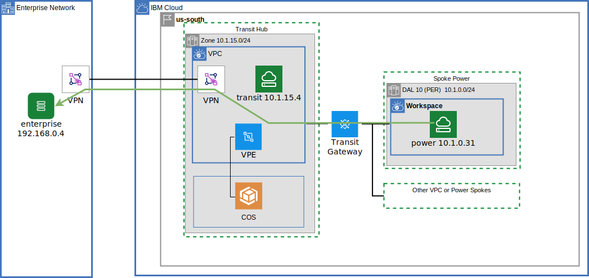
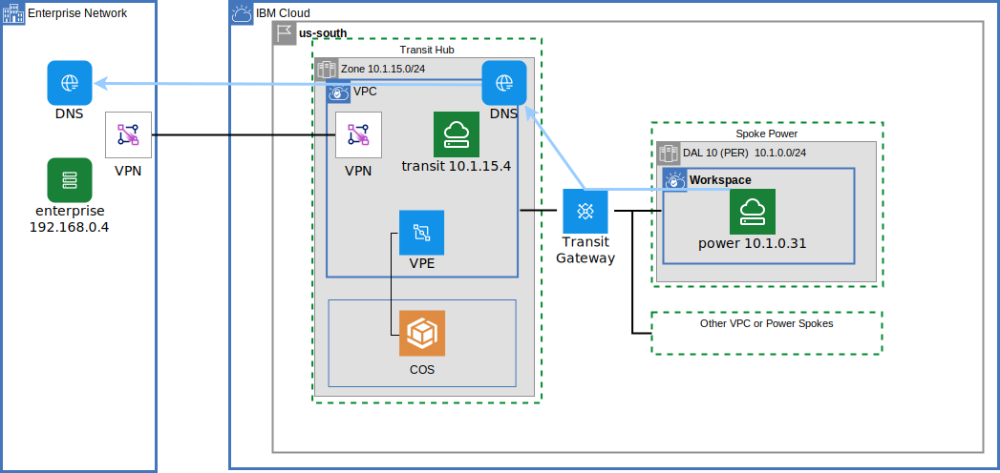

{{site.data.keyword.attribute-definition-list}}

# Power Systems communication through a VPC Transit Hub
{: #vpc-transit-power}
{: toc-content-type="tutorial"}
{: toc-services="vpc, transit-gateway, direct-link, dns-svcs, cloud-databases, databases-for-redis, power-iaas"}
{: toc-completion-time="2h"}

This tutorial may incur costs. Use the [Cost Estimator](/estimator/review) to generate a cost estimate based on your projected usage.
{: tip}

The [{{site.data.keyword.powerSysFull}}](/docs/power-iaas?topic=power-iaas-getting-started) can host {{site.data.keyword.powerSys_notm}} instances. The {{site.data.keyword.cloud_notm}} also supports Virtual Private Cloud (VPC). {{site.data.keyword.powerSys_notm}} can connect to VPCs via a {{site.data.keyword.tg_full}} and access VPC resources. This tutorial will walk through an example implementation and explore the architecture depicted in this high-level view:
{: shortdesc}

TODO UPDATE DIAGRAM

{: caption="Figure 1. Architecture diagram of the tutorial" caption-side="bottom"}
{: style="text-align: center;"}

1. A transit VPC and component resources are created.
1. VPC virtual private endpoint gateways are used to access cloud service instances.
1. A {{site.data.keyword.tg_short}} is provisioned and connected to the transit VPC.
1. {{site.data.keyword.vpn_short}} VPN connectivity is added between the VPC and enterprise network.
1. {{site.data.keyword.powerSys_notm}} can access everything through the attached {{site.data.keyword.tg_short}}

This tutorial is stand alone but conceptually layers on a two part tutorial on Centralize communication through a VPC Transit Hub and Spoke architecture. Dive even deeper into VPC in the foundation tutorials: [part one](/docs/solution-tutorials?topic=solution-tutorials-vpc-transit1) and [part two](/docs/solution-tutorials?topic=solution-tutorials-vpc-transit-power).

## Objectives
{: #vpc-transit-power-objectives}

* Understand the concepts behind a {{site.data.keyword.powerSys_notm}} networking.
* Utilize the {{site.data.keyword.tg_full_notm}} for connecting {{site.data.keyword.powerSys_notm}} to VPC.
* Route {{site.data.keyword.powerSys_notm}} traffic to on premises through a VPC site to site VPN, TGW or DL.
* Connect {{site.data.keyword.powerSys_notm}} instances through virtual private endpoint gateways to services.
* Utilize the DNS service routing and forwarding rules to build an architecturally sound name resolution system.

## Before you begin
{: #vpc-transit-power-prereqs}

This tutorial requires {{site.data.keyword.powerSys_notm}} data centers that support Power Edge Routing.  See [Getting started with the Power Edge Router](/docs/power-iaas?topic=power-iaas-per) for more information including the list of data centers where the solution is available.
{: note}

This tutorial requires:
* `terraform` to use Infrastructure as Code to provision resources,
* `python` to optionally run the pytest commands,

See the [prerequisites](https://github.com/IBM-Cloud/vpc-transit#prerequisites){: external} for a few options including a Dockerfile to build the prerequisite environment.

In addition:

- Check for user permissions. Be sure that your user account has sufficient permissions to create and manage all the resources in this tutorial. See the list of:
   - [required permissions for VPC](/docs/vpc?topic=vpc-managing-user-permissions-for-vpc-resources).
   - [required permissions for creating {{site.data.keyword.tg_short}}](/docs/transit-gateway?topic=transit-gateway-iam).
   - [required permissions for {{site.data.keyword.powerSys_notm}}](/docs/power-iaas?topic=power-iaas-managing-resources-and-users)

## Provision resources
{: #vpc-transit-power-provision-resources}
{: step}

1. The companion [GitHub Repository](https://github.com/IBM-Cloud/vpc-transit){: external} has the source files to implement the architecture. In a desktop shell clone the repository:
   ```sh
   git clone https://github.com/IBM-Cloud/vpc-transit
   cd vpc-transit
   ```
   {: codeblock}

1. The config_tf directory contains configuration variables that you are required to configure.

   ```sh
   cp config_tf/template.power.terraform.tfvars config_tf/terraform.tfvars
   ```
   {: codeblock}

1. Edit **config_tf/terraform.tfvars**. Use the comments in that file as your guide. Change the values of **resource_group_name** and **basename**.

1. It is possible to provision the architecture a layer at a time. A shell command **./apply.sh** is provided to install the layers in order. The following will display help:

   ```sh
   ./apply.sh
   ```
   {: codeblock}

1. If you don't already have one, obtain a [Platform API key](/iam/apikeys) and export the API key for use by Terraform:

   ```sh
   export IBMCLOUD_API_KEY=YourAPIKEy
   ```
   {: codeblock}

1. Install all layers.  The ':' are used to represent the first and last layers.

   ```sh
   ./apply.sh : :
   ```
   {: codeblock}

It may take 30 minutes to create the resources in the diagram.  The enterprise is simulated using a VPC.

## IP address layout
{: #vpc-transit-power-ip-address-layout}
{: step}

The address layout is shown below:

{: caption="Figure 2. IP address layout" caption-side="bottom"}
{: style="text-align: center;"}

Notice:
- An availability zone address space 10.1.0.0/16 is used for VPC availability zone 1 and {{site.data.keyword.powerSys_notm}} workspaces in dal10.
- The address space for enterprise, transit and spoke0 not overlap.
- There is an phantom address prefix in the transit. It matches the enterprise.  No subnets will be added to this address prefix. This is required to advertise the routes through the transit gateway.

Explore the architecture in the {{site.data.keyword.cloud_notm}} console:

1. Navigate to [Virtual private clouds](/vpc-ext/network/vpcs).
1. Select the enterprise VPC and notice the two address prefixes that together define 192.168.0.0/24
1. Navigate to [Virtual private clouds](/vpc-ext/network/vpcs).
1. Select the transit VPC and notice:
   - The address prefix 10.1.0.0/16 is defined to advertise the routes for entire zone over VPN to the enterprise.
   - The address prefix 192.168.0.0/24 is used to advertise the routes for the enterprise over {{site.data.keyword.tg_short}} to the {{site.data.keyword.powerSysShort}} workspace.

## SSH keys
{: #vpc-transit-power-server-ssh-keys}
{: step}

The provision created two files one for each member of the key pair required to ssh:
- config_tf/id_rsa - private key that you should keep safe.
- config_tf/id_rsa.pub - public key that can be given to third parties.


The public key was used to create two SSH keys in the cloud:
- Power SSH key
- SSH key for VPC

Locate the Power SSH key:
- Navigate to [Power SSH keys](/power/ssh-keys).
- On the left side navigation panel select the workspace with your initials.

Optionally verify that the contents of the cloud ssh key matches the content of the public key file.

Locate VPC SSH key:
- Navigate to [SSH keys for VPC](/vpc-ext/compute/sshKeys)
- On the left side navigation panel select the workspace with your initials.

## Virtual server instance configuration
{: #vpc-transit-power-server-instance-configuration}
{: step}

The terraform configuration created a {{site.data.keyword.powerSys_notm}} linux Virtual server instance but was not able to fully configure.  It is now possible to configure the ip route tables and install an nginx server to support testing.

```sh
cd power_tf; # should be in the .../vpc-transit/power_tf directory
terraform output fixpower
```
{: codeblock}

This experience will look something like this:
```
% cd power_tf
% terraform output fixpower
[
  {
    "per-spoke1" = <<-EOT
    # ssh -J root@52.116.131.48 root@10.1.2.31
    ssh -oProxyCommand="ssh -W %h:%p -i ../config_tf/id_rsa root@52.116.131.48" -i ../config_tf/id_rsa root@10.1.2.31
    ip route add 10.0.0.0/8 via 10.1.2.1 dev eth0
    ip route add 172.16.0.0/12 via 10.1.2.1 dev eth0
    ip route add 192.168.0.0/16 via 10.1.2.1 dev eth0
    ip route change default via 192.168.232.1 dev eth1
    exit
    # it is now possible to ssh directly to the public IP address
    ssh -i ../config_tf/id_rsa root@150.240.147.36
    # execute the rest of these commands to install nginx for testing
    zypper install -y nginx postgresql
    systemctl start nginx
    echo per-spoke1 > /srv/www/htdocs/name
    sleep 10
    curl localhost/name


    EOT
  },
]
```

Copy/paste the commands a line at a time.  Here is what is happening:
- The ssh command will log in to the virtual server instance using the private ssh key created earlier.  It is required to **jump** through an intermediate transit VPC virtual server.  The -oProxyCommand configures the jump server.
- The **ip route** commands executed on the Power Linux server will route all [Private network](https://en.wikipedia.org/wiki/Private_network) CIDR blocks through the private subnet (eth0).  Notice these include both the 10.0.0.0 cloud CIDR block and the 192.168.0.0 enterprise CIDR block.
- The default route captures will route the rest of the addresses including the IP address of your workstation through the public subnet (eth1). This will allow the test automation to ssh directly to the public IP address of the virtual server instance in the future and avoid the jump server
- Quit the ssh session.
- Use ssh to directly login to the instance using the public IP address.  This verifies that the iptable configuration is correct.
- The final step is to install nginx and postgresql.  Nginx is a http server that will host a web page that is verified using a curl command. The test suite will access the web page to verify connectivity.  The postgreql command line tool is used by the test suite to test connectivity to the {{site.data.keyword.postgresql}} instances.

Keep this shell available for use in future steps.

## Test network connectivity
{: #vpc-transit-power-test-network-connectivity}
{: step}

A **pytest** test suite will be used to exhaustively tests communication paths.

It is not required for the reader to use **pytest** to verify the results. It is straight forward to reproduce the test results shown below by hand but tedious. For each line of the example output below find the resource in the [Resources](/resources) view of the {{site.data.keyword.cloud_notm}} console and navigate to the left resource and locate the public IP addresses for an ssh session. Using the shell of the cloud instance execute a curl command to the private IP address of the instance on the right: curl `A.B.C.D/name`.
{: note}

There are a couple of different ways to install and use python as covered in the [README.md](https://github.com/IBM-Cloud/vpc-transit).

Each **pytest** test will SSH to an instance on the left and perform a connectivity test, like executing a `curl` command to the instance on the right. The default SSH environment is used to log in to the left hand instances. If you see unexpected test results try the [pytest troubleshooting](https://github.com/IBM-Cloud/vpc-transit#pytest-troubleshooting){: external} section.

Make sure your current directory is vpc-transit.
```sh
cd ..
pwd; # .../vpc-transit
```
{: codeblock}

Test network connectivity using pytest:

```sh
pytest -m curl
```
{: codeblock}

Example output:
```
(vpc-transit) % pytest
============================================ test session starts =============================================
platform darwin -- Python 3.11.5, pytest-7.4.2, pluggy-1.3.0 -- /Users/powellquiring/github.com/IBM-Cloud/vpc-transit/venv/bin/python
cachedir: .pytest_cache
rootdir: /Users/powellquiring/github.com/IBM-Cloud/vpc-transit
configfile: pytest.ini
testpaths: py
plugins: xdist-3.3.1
collected 31 items

py/test_transit.py::test_ping[l-spoke0        -> r-spoke0] PASSED                                      [  3%]
py/test_transit.py::test_ping[l-spoke0        -> r-enterprise-z1] PASSED                               [  6%]
py/test_transit.py::test_ping[l-spoke0        -> r-transit-z1] PASSED                                  [  9%]
py/test_transit.py::test_ping[l-enterprise-z1 -> r-spoke0] PASSED                                      [ 12%]
py/test_transit.py::test_ping[l-enterprise-z1 -> r-enterprise-z1] PASSED                               [ 16%]
py/test_transit.py::test_ping[l-enterprise-z1 -> r-transit-z1] PASSED                                  [ 19%]
py/test_transit.py::test_ping[l-transit-z1    -> r-spoke0] PASSED                                      [ 22%]
py/test_transit.py::test_ping[l-transit-z1    -> r-enterprise-z1] PASSED                               [ 25%]
py/test_transit.py::test_ping[l-transit-z1    -> r-transit-z1] PASSED                                  [ 29%]
py/test_transit.py::test_curl[l-spoke0        -> r-spoke0] PASSED                                      [ 32%]
py/test_transit.py::test_curl[l-spoke0        -> r-enterprise-z1] PASSED                               [ 35%]
py/test_transit.py::test_curl[l-spoke0        -> r-transit-z1] PASSED                                  [ 38%]
py/test_transit.py::test_curl[l-enterprise-z1 -> r-spoke0] PASSED                                      [ 41%]
py/test_transit.py::test_curl[l-enterprise-z1 -> r-enterprise-z1] PASSED                               [ 45%]
py/test_transit.py::test_curl[l-enterprise-z1 -> r-transit-z1] PASSED                                  [ 48%]
py/test_transit.py::test_curl[l-transit-z1    -> r-spoke0] PASSED                                      [ 51%]
py/test_transit.py::test_curl[l-transit-z1    -> r-enterprise-z1] PASSED                               [ 54%]
py/test_transit.py::test_curl[l-transit-z1    -> r-transit-z1] PASSED                                  [ 58%]
py/test_transit.py::test_curl_dns[l-spoke0        -> r-per-enterprise-z1-s0.per-enterprise.com] PASSED [ 61%]
py/test_transit.py::test_curl_dns[l-spoke0        -> r-per-transit-z1-s0.per-transit.com] PASSED       [ 64%]
py/test_transit.py::test_curl_dns[l-enterprise-z1 -> r-per-enterprise-z1-s0.per-enterprise.com] PASSED [ 67%]
py/test_transit.py::test_curl_dns[l-enterprise-z1 -> r-per-transit-z1-s0.per-transit.com] PASSED       [ 70%]
py/test_transit.py::test_curl_dns[l-transit-z1    -> r-per-enterprise-z1-s0.per-enterprise.com] PASSED [ 74%]
py/test_transit.py::test_curl_dns[l-transit-z1    -> r-per-transit-z1-s0.per-transit.com] PASSED       [ 77%]
py/test_transit.py::test_vpe_dns_resolution[postgresql spoke0 -> transit 94d98d68-4a3b-462b-9e6e-8266181e6ce6.c7e0lq3d0hm8lbg600bg.private.databases.appdomain.cloud] PASSED [ 80%]
py/test_transit.py::test_vpe_dns_resolution[postgresql enterprise-z1 -> transit 94d98d68-4a3b-462b-9e6e-8266181e6ce6.c7e0lq3d0hm8lbg600bg.private.databases.appdomain.cloud] PASSED [ 83%]
py/test_transit.py::test_vpe_dns_resolution[postgresql transit-z1 -> transit 94d98d68-4a3b-462b-9e6e-8266181e6ce6.c7e0lq3d0hm8lbg600bg.private.databases.appdomain.cloud] PASSED [ 87%]
py/test_transit.py::test_vpe[postgresql spoke0 -> transit 94d98d68-4a3b-462b-9e6e-8266181e6ce6.c7e0lq3d0hm8lbg600bg.private.databases.appdomain.cloud] PASSED [ 90%]
py/test_transit.py::test_vpe[postgresql enterprise-z1 -> transit 94d98d68-4a3b-462b-9e6e-8266181e6ce6.c7e0lq3d0hm8lbg600bg.private.databases.appdomain.cloud] PASSED [ 93%]
py/test_transit.py::test_vpe[postgresql transit-z1 -> transit 94d98d68-4a3b-462b-9e6e-8266181e6ce6.c7e0lq3d0hm8lbg600bg.private.databases.appdomain.cloud] PASSED [ 96%]
py/test_transit.py::test_lb[lb0] SKIPPED (got empty parameter set ['lb'], function test_lb at /Use...) [100%]

======================================= 30 passed, 1 skipped in 38.71s =======================================
```
Each test will ssh to the instance on the left side of the arrow '->' and access the right side of the arrow in the following way:
- test_ping - ping ip address
- test_curl - curl ip address
- test_curl_dns - curl the DNS name
- test_vpe_dns_resolution - verify the VPC virtual private endpoint (VPE) name DNS name resolves to an IP address in the CIDR block of the cloud (this test does not actually access the right side.)
- test_vpe - exercise the resource using the DNS name and the resource specific tool (psql for postgresql)


## Transit gateway
{: #vpc-transit-power-transit-gateway}
{: step}

This diagram has a green line showing the traffic path from the Power instance to the enterprise instance:

{: caption="Figure 3. Power to enterprise data path" caption-side="bottom"}
{: style="text-align: center;"}

Inspect the transit {{site.data.keyword.tg_short}}:
- Open [Transit gateway](/interconnectivity/transit) and select the **initials-tgw**. Ignore the **initials-tgw-link** if visible, it is used to simulate the direct link connection from the enterprise to the transit VPC.  
- Notice the three connections: transit, spoke0 and spoke1.
- Click on **BGP** and **Generate report**. It is interesting to note that enterprise CIDR, 192.168.0.0/24, was advertised by the transit VPC.

## Power to enterprise via transit VPC
{: #vpc-transit-power-power-to-enterpreise-via-transit-vpc}
{: step}

The previous step demonstrated how the {{site.data.keyword.tg_short}} learned the enterprise routes needed for the Power instance to reach the transit VPC. VPC ingress routing in the transit VPC will route traffic directly to the VPN instance.  Visit the [Virtual private cloud](/vpc-ext/network/vpcs)

1. Click **VPCs** on the left.
1. Click the transit VPC
1. Scroll down and click **Manage routing tables**
1. Click **vpn-ingress** routing table

In the **Traffic** box the **Accepts routes from** indicates **VPN gateway**.  This configuration allows the VPN gateway to automatically create a route in this routing table **and** adjust the next hop address of the route as needed.

The current status of this route can be found in the **Routes** table.  It indicates that traffic destine to 192.168.0.0/24 will be forwarded to a **Next hop** address in the VPC. Note the next hop IP address. You can find it in the VPC VPN service.

1. Navigate to [VPN](/vpc-ext/network/vpngateways) and select the transit VPN gateway.
1. Inspect the **Gateway member** section.  The **Private IP** should match.

## Power DNS resolution
{: #vpc-transit-power-dns-resolution}
{: step}

This diagram has blue line showing the DNS resolution forward chain used by the {{site.data.keyword.powerSysShort}} instance.

{: caption="Figure 4. DNS resolution forward path" caption-side="bottom"}
{: style="text-align: center;"}


In the {{site.data.keyword.powerSysShort}} instance shell:
```sh
dig per-enterprise-z1-s0.per-enterprise.com
```
{: codeblock}

Notice the ANSWER SECTION.  It will have the IP address in the enterprise (abbreviated):
```
per-spoke0:~ # dig per-enterprise-z1-s0.per-enterprise.com

; <<>> DiG 9.16.38 <<>> per-enterprise-z1-s0.per-enterprise.com
;; global options: +cmd
;; Got answer:
...
;; ANSWER SECTION:
per-enterprise-z1-s0.per-enterprise.com. 3359 IN A 192.168.0.4
...
```

A curl command will return data from the enterprise

```sh
curl per-enterprise-z1-s0.per-enterprise.com/name
```
{: codeblock}

Example:
```
per-spoke0:~ # curl per-enterprise-z1-s0.per-enterprise.com/name
per-enterprise-z1-s0
```

It is possible to verify the DNS forwarding path shown on the blue line.  First find the DNS server that is resolving the address:
1. Navigate to [Power Systems Virtual Server](/power) and select your workspace.
1. Click on the private subnet.
1. One of the **DNS Servers** will be 10.1.0.xy.  Note the exact IP.

This is the address of a [{{site.data.keyword.dns_short}} custom resolver](/docs/dns-svcs?topic=dns-svcs-custom-resolver). The initial bits of the address, `10.1.0` indicates it is in the transit VPC. Locate the DNS instance and the custom resolver:
1. Navigate to the [Resource list](/resources).
1. Open the **Networking** section and click the transit instance of the {{site.data.keyword.dns_notm}} service.
1. In the transit DNS instance, click **Custom resolver** on the left.
1. Click on the custom resolver to open the details page.

Match the DNS server noted earlier (found in the Power private subnet) to the **Resolver locations** IP addresses.

The diagram shows an arrow from this DNS resolver to the enterprise network.  Verify this by following the forwarding rules:

1. Click the **Forwarding rules** tab at the top.
1. Note the forwarding rules for the per-enterprise.com subdomain is forwarded to the enterprise resolvers having 192.168.0.xy addresses.  These are the IP addresses of DNS resolvers in the enterprise.

## VPC private endpoint gateway
{: #vpc-transit-power-vpc-private-endpoint-gateway}
{: step}

First find the DNS name of the postgresql database VPC Virtual private endpoint gateway in the spoke:
1. Navigate to the [VPC virtual private endpoint gateways](/vpc-ext/network/endpointGateways).
1. Click on the transit instance.
1. Select the **Region**
1. Select the initials-transit-postgresql VPC virtual private endpoint gateway.

- Note the attached resource IP address.  It is 10.1.0.x in the transit VPC zone 1.
- Note **Service endpoint**. It will be something like: **transit 8443e306-55bb-4373-a7c2-3fee089034c0.c7e0lq3d0hm8lbg600bg.private.databases.appdomain.cloud**

This DNS for the postgres instance is, **GUID.private.databases.appdomain.cloud** 

In the {{site.data.keyword.powerSysShort}} instance shell use the dig command with the DNS name to find the IP address.  Here is an example (abbreviated):

```
per-spoke1:~ # dig bb4815e2-b280-4add-9778-5ed374c65e8f.c7e0lq3d0hm8lbg600bg.private.databases.appdomain.cloud

; <<>> DiG 9.16.38 <<>> bb4815e2-b280-4add-9778-5ed374c65e8f.c7e0lq3d0hm8lbg600bg.private.databases.appdomain.cloud
...
;; ANSWER SECTION:
bb4815e2-b280-4add-9778-5ed374c65e8f.c7e0lq3d0hm8lbg600bg.private.databases.appdomain.cloud. 660 IN A 10.1.0.132
...
```
In this case **10.1.0.132** is the IP address of the database through the virtual private endpoint gateway.


## VPC Security
{: #vpc-transit-power-security}
{: step}
VPCs have [network Access Control Lists (ACLs)](/docs/vpc?topic=vpc-using-acls) for subnets and [Security groups](/docs/vpc?topic=vpc-using-security-groups) for network interfaces that can be configured to limit access to network resources.

Introduce a security group rule to restrict access to the VPC virtual private endpoint gateway from just the {{site.data.keyword.powerSys_notm}} instances.

In the {{site.data.keyword.powerSysShort}} instance shell use the curl command to access a VPC instance in the transit VPC.:

```sh
INITIALS=abc
curl $INITIALS-transit-z1-s0.$INITIALS-transit.com/name
```
{: codeblock}

Locate the security group and tighten up the rules.

- Navigate to [Virtrual server instances for VPC](/vpc-ext/compute/vs)
- Click the transit instance
- Scroll down to **Network interfaces** and click the entry in **Security groups**
- Click the **Rules** tab in the **Security group** property page
- Locate the 10.0.0.0/8 **Source** and click the hamburger menu on the right, click **Edit**
- Temporarily change the CIDR to 10.0.0.0/32

Back in the {{site.data.keyword.powerSysShort}} instance shell repeat the curl command. The command will not complete:

```sh
curl $INITIALS-transit-z1-s0.$INITIALS-transit.com/name
```
{: codeblock}

Determine the IP address in the shell:

```sh
hostname -I
```
{: codeblock}

Example:

```
per-spoke0:~ # hostname -I
10.1.1.54 192.168.232.6
```

The first 10.1.1.x number is the private IP address.  Back in the VPC security group tab of the browser edit the security group rule and change it to the address/32.  Something like 10.1.1.54/32.

Try the curl again and it should work
```sh
curl $INITIALS-transit-z1-s0.$INITIALS-transit.com/name
```
{: codeblock}


Back in the security group rule change the CIDR block back to the original value 10.0.0.0/8.

## Related content
{: #vpc-transit-power-related}

* [IBM Cloud for Financial Services](/docs/framework-financial-services)
* Tutorial: [Best practices for organizing users, teams, applications](/docs/solution-tutorials?topic=solution-tutorials-users-teams-applications#users-teams-applications)
* [How to deploy isolated workloads across multiple locations and regions](/docs/solution-tutorials?topic=solution-tutorials-vpc-multi-region)
* [Public front end and private backend in a Virtual Private Cloud](/docs/solution-tutorials?topic=solution-tutorials-vpc-public-app-private-backend),
* [Network Function Virtualization](/docs/vpc?topic=vpc-about-vnf)
* [Private hub and spoke with transparent VNF and spoke-to-spoke traffic](/docs/vpc?topic=vpc-about-vnf-ha)
