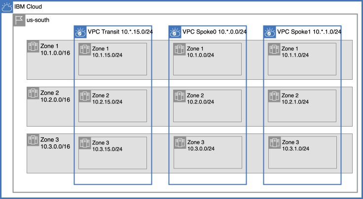
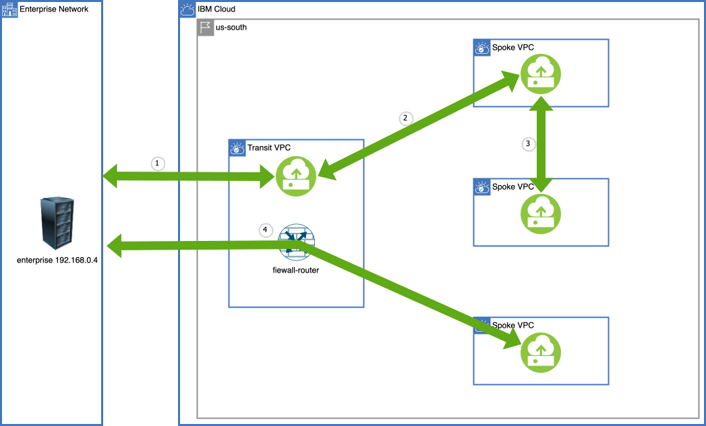

{{site.data.keyword.attribute-definition-list}}

# Power Systems communication through a VPC Transit Hub and Spoke architecture
{: #vpc-transit-power}
{: toc-content-type="tutorial"}
{: toc-services="vpc, transit-gateway, direct-link, dns-svcs, cloud-databases, databases-for-redis, power-iaas"}
{: toc-completion-time="2h"}

This tutorial may incur costs. Use the [Cost Estimator](/estimator/review) to generate a cost estimate based on your projected usage.
{: tip}

A Virtual Private Cloud (VPC) provides network isolation and security in the {{site.data.keyword.cloud_notm}}. A VPC can be a building block that encapsulates a corporate division (marketing, development, accounting, ...) or a collection of microservices owned by a DevSecOps team. VPCs can be connected to an on-premises enterprise and each other. This may create the need to route traffic through centralized firewall-gateway appliances. This tutorial will walk through the implementation of a hub and spoke architecture depicted in this high-level view:

{: caption="Figure 1. Architecture diagram of the tutorial" caption-side="bottom"}
{: style="text-align: center;"}

This tutorial is stand alone. It layers on a two part tutorial on Centralize communication through a VPC Transit Hub and Spoke architecture.  See [part one](/docs/solution-tutorials?topic=solution-tutorials-vpc-transit1) and [part two](/docs/solution-tutorials?topic=solution-tutorials-vpc-transit-power). If you find yourself struggling through VPC concepts like network IP layout and planning in the {{site.data.keyword.cloud_notm}}, {{site.data.keyword.tg_short}}, {{site.data.keyword.BluDirectLink}} or asymmetric routing you can check out the foundation tutorials.

This tutorial will focus on {{site.data.keyword.powerSysFull}} and routing traffic through a transit hub firewall-router. Private DNS is used for both for microservice identification and {{site.data.keyword.cloud_notm}} service instance identification using a virtual private endpoint gateway.

The hub and spoke model supports a number of different scenarios:
- The hub can be the repository for shared micro services used by spokes and enterprise.
- The hub can be a central point of traffic firewall-router and routing between enterprise and the cloud.
- The hub can monitor all or some of the traffic - spoke <-> spoke, spoke <-> transit, or spoke <-> enterprise.
- The hub can hold the VPN resources that are shared by the spokes.
- The hub can be the repository for shared cloud resources, like databases, accessed through [virtual private endpoint gateways](/docs/vpc?topic=vpc-about-vpe) controlled with VPC security groups and subnet access control lists, shared by spokes and enterprise

There is a companion [GitHub repository](https://github.com/IBM-Cloud/vpc-transit){: external} that divides the connectivity into a number of incremental layers. In the tutorial thin layers enable the introduction of bite size challenges and solutions.

The following will be explored:
- {{site.data.keyword.powerSysShort}} access to VPC virtual private endpoint gateway
- {{site.data.keyword.powerSysShort}} communication with VPC instances
- {{site.data.keyword.powerSysShort}} communication with on premises servers
- DNS resolution.

A layered architecture will introduce resources and demonstrate connectivity. Each layer will add additional connectivity and resources. The layers are implemented in Terraform. It will be possible to change parameters, like number of zones, by changing a Terraform variable. A layered approach allows the tutorial to introduce small problems and demonstrate a solution in the context of a complete architecture.
{: shortdesc}

## Objectives
{: #vpc-transit-power-objectives}

* Understand the concepts behind a VPC based hub and spoke model for managing all VPC to VPC traffic.
* Understand VPC ingress and egress routing.
* Identify and optionally resolve asymmetric routing issues.
* Understand the use of a Network Load Balancer for a highly available and scalable firewall-router.
* Utilize the DNS service routing and forwarding rules to build an architecturally sound name resolution system.

## Before you begin
{: #vpc-transit-power-prereqs}

This tutorial requires:
* `terraform` to use Infrastructure as Code to provision resources,
* `python` to optionally run the pytest commands,
* Implementing a firewall-router will require that you [enable IP spoofing checks](/docs/vpc?topic=vpc-ip-spoofing-about#ip-spoofing-enable-check),
* An SSH key to connect to the virtual servers. If you don't have an SSH key, follow [the instructions](/docs/vpc?topic=vpc-ssh-keys) for creating a key for VPC. 

See the [prerequisites](https://github.com/IBM-Cloud/vpc-transit#prerequisites){: external} for a few options including a Dockerfile to easily create the prerequisite environment.

In addition:

- Check for user permissions. Be sure that your user account has sufficient permissions to create and manage all the resources in this tutorial. See the list of:
   - [required permissions for VPC](/docs/vpc?topic=vpc-managing-user-permissions-for-vpc-resources).
   - [required permissions for creating {{site.data.keyword.tg_short}}](/docs/transit-gateway?topic=transit-gateway-iam).
   - [required permissions for IP spoofing checks](/docs/vpc?topic=vpc-ip-spoofing-about).

## Summary of Part one
{: #vpc-transit-power-summary-of-part-one}

In [part one](/docs/solution-tutorials?topic=solution-tutorials-vpc-transit1) of this tutorial we carefully planned the address space of the transit and spoke VPCs. The zone based architecture is shown below:

{: caption="Zones" caption-side="bottom"}
{: style="text-align: center;"}

This diagram shows the traffic flow. Only the enterprise <-> spoke is passing through the firewall:

{: caption="Traffic flow" caption-side="bottom"}
{: style="text-align: center;"}

This was achieved with {{site.data.keyword.dl_short}}, {{site.data.keyword.tg_short}} and VPC routing. All zones are configured similarly and the diagram below shows the details of zone 1:

{: caption="VPC Layout" caption-side="bottom"}
{: style="text-align: center;"}

The phantom address prefixes in the transit are used to advertise routes. The CIDR 10.1.0.0/16 covers transit and the spokes and is passed through {{site.data.keyword.dl_short}} to the enterprise as an advertised route. Similarly the CIDR 192.168.0.0/24 covers the enterprise and is passed through the {{site.data.keyword.tg_short}} to the spokes as an advertised route.

Egress routes in the spokes route traffic to the firewall-router. Ingress routes in the transit route enterprise <-> spoke traffic through the firewall-router.

## Related content
{: #vpc-transit-power-related}

* [IBM Cloud for Financial Services](/docs/framework-financial-services)
* Tutorial: [Best practices for organizing users, teams, applications](/docs/solution-tutorials?topic=solution-tutorials-users-teams-applications#users-teams-applications)
* [How to deploy isolated workloads across multiple locations and regions](/docs/solution-tutorials?topic=solution-tutorials-vpc-multi-region)
* [Public front end and private backend in a Virtual Private Cloud](/docs/solution-tutorials?topic=solution-tutorials-vpc-public-app-private-backend),
* [Network Function Virtualization](/docs/vpc?topic=vpc-about-vnf)
* [Private hub and spoke with transparent VNF and spoke-to-spoke traffic](/docs/vpc?topic=vpc-about-vnf-ha)
