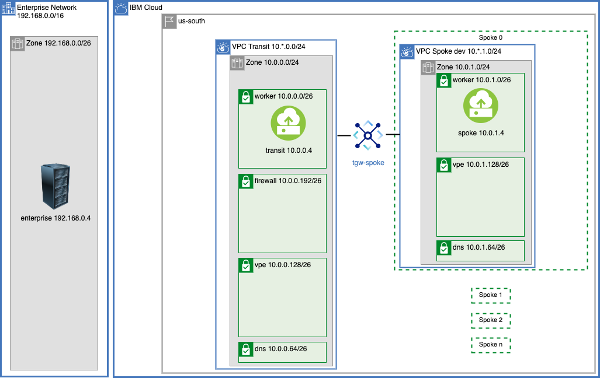

{:step: data-tutorial-type='step'}
{:shortdesc: .shortdesc}
{:new_window: target="_blank"}
{:codeblock: .codeblock}
{:screen: .screen}
{:tip: .tip}
{:pre: .pre}
{:important: .important}
{:note: .note}

# Build VPC Hub and Spoke and extended to On Premises via a Transit VPC
{: #vpc-transit}
{: toc-content-type="tutorial"}
{: toc-services="vpc, transit-gateway, direct-link, dns-svcs cloud-databases,databases-for-redis"}
{: toc-completion-time="2h"}

This tutorial may incur costs. Use the [Cost Estimator](https://{DomainName}/estimator/review) to generate a cost estimate based on your projected usage.
{: tip}

The {{site.data.keyword.vpc_full}} (VPC) is used to securely manage network traffic in the cloud.  VPCs can also be used as a way to encapsulate functionality.  The VPCs can be connected to each other using Transit Gateway.

A hub and spoke model connects multiple VPCs via transit gateway.  Each VPC could be managed by a different team. The isolation and connectivity support a number of scenarios:

- The hub can be the respository for shared microservices used by some spokes
- The hub can be the repository for shared cloud resources, like databases, accessed through [virtual private endpoint gateways](https://{DomainName}/docs/vpc?topic=vpc-about-vpe) controlled with VPC security groups and subnet access control lists, shared by some spokes.
- The hub can be a central point of traffic routing between on premises and the cloud.
- Enterprise to cloud traffic can be routed, monitored, and logged through a Virtual Network Function, VNF, appliance in the hub
- The hub can also can monitor all or some of the traffic - spoke <-> spoke, spoke <-> transit, or spoke <-> enterperise.
- The hub can hold the VPN resources that are shared by the spokes.

This solution tutorial will walk through communication paths in a hub and spoke VPC model.  There is a companion [GitHub repository](https://github.com/IBM-Cloud/vpc-transit) that divides the connectivity into a number of incremental layers.  It is typical for an organization to use a subset of the possible paths. The thin layers help the reader modify or eliminate layers in order to model an environment.


 During the journey we will explore:
- VPC egress and ingress routing
- Virtual private endpoint gateways
- Transit Gateway
- DNS resolution
- Virtual Network Functions with optional Network Load Balancers to support high availability

A layered architecture will introduce resources and allow connectivity to be provided.  Each layer will add connectivity. The layers are implemented in terraform. It will be possible to change parameters, like number of zones, by changing a terraform variable.

This tutorial walks you through a complete example demonstrating the network connectivity, routing, DNS name resolution and other details that potentially need to be considered when stiching together multi VPC architectures.  A layered presentation approach allows you to pick and choose parts of this tutorial that might be applicable in your environment.
{: shortdesc}

## Objectives
{: #vpc-transit-objectives}

* todo
* Address micro-services by DNS name resolution using {{site.data.keyword.dns_short}}.
* Connect VPCs via {{site.data.keyword.tg_short}}.

There is a companion GitHub repository with instructions on how to build and test the architecture.  If follows the layers defined in this tutorial.  It allows you to demonstrate connectivity problems and solutions as layers are added.

## Architecture:
{: #vpc-transit-architecture}
{: class="center"}
{: style="text-align: center;"}

The diagram above shows an enterprise data center connected to the IBM cloud.  The VPCs are arranged in a hub and spoke model.  All enterprise traffic flows through the transit VPC.  A separate DNS instance and cloud service instances are associated and managed by a spoke team. Each spoke could be implemented in an account of an IBM Enterperise Account todo link.  This solution tutorial will demonstrate the architecture in a single account.

## VPC Layout
{: #vpc-transit-layout}
{: step}

todo layer-background 
{: class="center"}
{: style="text-align: center;"}

The diagram above shows the VPC layout in more detail. The on premises is CIDR 192.168.0.0/16 and a zone within the enterprise is shown.  In the IBM Cloud there is a transit VPC and one spoke VPC (the other spokes are configured similarly).  The zones in a multi zone region (todo link mzr definition) are 10.0.0.0/16, 10.1.0.0/16, 10.2.0.0/16.  The transit VPC consumes CIDRs 10.*.0.0/24 or 10.0.0.0/24, 10.1.0.0/24 and 10.2.0.0/24 spoke 0 consumes 10.*.1.0/24 or CIDRs 10.0.1.0/24, 10.1.1.0/24 and 10.2.1.0/24.  It is tempting to divide up the CIDR space first by VPC but this complicates routing as we will see in later steps.

There are a few subnets in the the transit and spokes:
- workers - Worker subnets for load balancers, ROCS todo, VPC instances that each spoke group will be producing.
- firewall - firewall router.
- vpe - all of the Virtual Private Endpoint Gateways for private connectivity to cloud services.
- dns - For DNS locations (todo link).  The DNS location appliances managed by the DNS Service consume network interfaces in this subnet.

There is a companion [GitHub Repository](https://github.com/IBM-Cloud/vpc-transit) that can be used to follow along as the resources are created.  Clone and initialize the files **local.env** and **config_tf/terraform.tfvars**.  The APIKEY in local.env is a secret that should not be shared.  The config_tf/terraform.tfvars has an initial section that requires modification.

   ```sh
   git clone https://github.com/IBM-Cloud/vpc-transit
   cd vpc-transit
   cp template.local.env local.env
   vi local.env; # make the suggested change
   source local.env
   ```
   {: codeblock}

   ```
   cp config_tf/template.terraform.tfvars config_tf/terraform.tfvars
   vi config_tf/terraform.tfvars; # make the initial changes suggested
   ```
   {: codeblock}

Each section will apply one or more layers to the diagram.  You could cd into the directory and execute the terraform commands as shown for **config_tf**:

   ```sh
   cd config_tf
   terraform init
   terraform apply 
   cd ..
   ```
   {: codeblock}

Since it is important that each layer is installed in the correct order and some steps in this tutorial will install multiple layers a shell command **./apply.sh** is provided.  Try it out:

   ```sh
   ./apply.sh -p; # print only do not apply any changes
   ```
   {: codeblock}

Results will look something like this indicating the order of execution.  You could apply all of the layers configured by execting `./apply.sh : :`.  The colons are shorthand for first (or config_tf) and last (vpe_spokes_tf).

   ```sh
   $ ./apply.sh : : -p
   directories: config_tf enterprise_tf transit_tf spokes_tf test_instances_tf transit_spoke_tgw_tf enterprise_link_tf firewall_tf spokes_egress_tf all_firewall_tf dns_tf vpe_transit_tf vpe_spokes_tf
   >>> success
   ```
   {: codeblock}

In this first step apply in config_tf, enterprise_tf, transit_tf and spokes_tf, to verify this and then do it try the following:

   ```sh
   ./apply.sh -p : spokes_tf
   ./apply.sh : spokes_tf
   ```

## Testing
{: #vpc-transit-testing}
{: step}
VPC Virtual Server Instances, VSIs, can be provisioned to test the network connectivity. A test instance will be added to each of the worker subnets or one per zone in the enterprise, transit and each of the spokes.  If the default configuratio of 2 zones and 2 spokes is used then 8 instances will be provisioned.

   ```sh
   ./apply.sh test_instances_tf
   ```
   {: codeblock}

{: class="center"}
{: style="text-align: center;"}


The python py/test_transit.py pytest script tests the connectivity of the test instances.  Each test will ssh to one of the instances and perform different types of connectitiby tests using the instances.

Validation was done with python 3.10.7.  You can install and activate a virtual environment using the following steps.

   ```sh
   python -m venv venv --prompt transit_vpc; # install a python virtual environment with activiation prompt of transit_vpc
   source venv/bin/activate; # now pip and python will come from the virtual environment
   pip install --upgrade pip; # upgrade to latest version of pip
   pip install -r requirements.txt; #install dependencies
   ```

Each time a fresh shell is initialized remember to activate the python virtual environment.  Do this now:
   ```sh
   source venv/bin/activate
   ```
   {: codeblock}

Run the test suite and notice that connectivity within a VPC is working but no cross VPC connectivity is working. 

   ```sh
   pytest -v
   ```
   {: codeblock}
   ```sh

Your output will resemble:
   ```sh
   ...
   py/test_transit.py::test_curl[tvpc-transit-z1-s0 (52.118.204.173) 10.1.0.4       -> tvpc-transit-z1-s0 10.1.0.4] PASSED              [ 11%]
py/test_transit.py::test_curl[tvpc-enterprise-z0-s0 (52.116.140.173) 192.168.0.4 -> tvpc-transit-z0-s0 10.0.0.4] FAILED              [ 13%]
py/test_transit.py::test_curl[tvpc-enterprise-z0-s0 (52.116.140.173) 192.168.0.4 -> tvpc-transit-z1-s0 10.1.0.4] FAILED              [ 14%]
   ...
   ... lots of stack traces
   ...
   FAILED py/test_transit.py::test_curl[tvpc-spoke1-z1-s0 (150.239.167.126) 10.1.2.4       -> tvpc-spoke0-z0-s0 10.0.1.4] - assert False
FAILED py/test_transit.py::test_curl[tvpc-spoke1-z1-s0 (150.239.167.126) 10.1.2.4       -> tvpc-spoke0-z1-s0 10.1.1.4] - assert False
=================================== 48 failed, 16 passed, 3 skipped, 18223 warnings in 203.68s (0:03:23) ===================================
   ```
   {: codeblock}

## Transit to Spokes via Transit Gateway
{: step}
{: #vpc-transit-transit-to-spokes}

Connect the spokes to each other and to the transit:

   ```sh
   ./apply.sh transit_spoke_tgw_tf
   ```

{: class="center"}
{: style="text-align: center;"}

The diagram shows the Transit Gateway between the transit vpc and the spoke vpcs.  Running the tests will now demonstrate passing tests between the transit and the spokes.

   ```sh
   pytest -v
   ```

## Enterprise to Transit via Direct Link and Transit Gateway
{: step}
{: #vpc-transit-enterprise-to-transit}
The enterprise to cloud tests are failing. [Direct Link](todo) is a high speed secure data path for connecting an enterprise to the IBM cloud.  Direct link can also be connected to a Transit Gateway for distribution.

The enterprise in this simulation is a VPC. The enterprise to VPC connection uses a Transit Gateway that will closely match a Direct Link connection.

   ```sh
   ./apply.sh enterprise_link_tf
   ```

{: class="center"}
{: style="text-align: center;"}

The diagram had been enhanced to include the Direct Link simulation using Transit Gateway. Running the tests will now demonstrate passing tests between the enterprise and the transit.

## Enterprise to Spoke via Transit NFV Router
{: step}
{: #vpc-transit-router}

The incentive for a transit vpc for enterprise <-> cloud traffic is to have a central place to monitor, inspect, route and log traffic.  A firewall/routing appliance can be installed in the transit VPC. 

An off the shelf appliance can be used for a router.  There are many to choose from in the IBM Catalog.  A subnet has been created in each of the zones of the transit VPC to hold the firewall. 

### NFV Router
The enterprise to spoke tests are failing.  Connectivity from the enterprise to a spoke is achieved through a Network Function Virtualization, [NFV](https://cloud.ibm.com/docs/vpc?topic=vpc-about-vnf), router in the transit VPC.  Choose one from the catalog or bring your own.  This demonstration will use an Ubuntu stock image with a iptables set up to forward all packets from the source to destination.  No firewall inspection is performed.

The terraform configuration will be configure the firewall instance with [allow_ip_spoofing](https://cloud.ibm.com/docs/vpc?topic=vpc-ip-spoofing-about).  You must [enable IP spoofing checks](https://cloud.ibm.com/docs/vpc?topic=vpc-ip-spoofing-about#ip-spoofing-enable-check) before continuing.
{: note}


   ```sh
   ./apply.sh firewall_tf
   ```

{: class="center"}
{: style="text-align: center;"}

The diagram shows the firewall routing appliance.  An ingress route table for Transit Gateways has been added to the transit VPC as indicated by the dotted lines.


### Ingress Routing
Traffic reaches the firewall routing appliance through routing tables.  Visit the [VPCs](https://cloud.ibm.com/vpc-ext/network/vpcs) in the IBM Cloud Console.  Select the transit VPC and then click on **Manage routing tables** click on the **Ingress** routing table.

The next_hop firewall routers in the table below are 10.0.0.196 (Dallas 1) and 10.1.0.196 (Dallas 2). All ingress traffic for the transit VPC will simply remain in the same zone.

Zone is the transit zone determined by the Transit Gateway. The destination CIDR block will be in the enterprise range (192.168.*.*) when the source is a spoke or the cloud range (10.*.*.*) when the source is the enterprise.

zone|destination|next_hop|note
--|--|--|--
Dallas 1|192.168.0.0/16|10.0.0.196|spoke to enterprise
Dallas 2|192.168.0.0/16|10.1.0.196|spoke to enterprise
Dallas 1|10.0.1.0/24|10.0.0.0.196|enterprise to spoke
Dallas 1|10.0.2.0/24|10.0.0.0.196|enterprise to spoke
Dallas 2|10.1.1.0/24|10.1.0.0.196|enterprise to spoke
Dallas 2|10.1.2.0/24|10.1.0.0.196|enterprise to spoke

### VPC Address Prefixes
The Transit Gateways learn routes to the attached VPCs through [VPC Address Prefixes](https://cloud.ibm.com/docs/vpc?topic=vpc-vpc-addressing-plan-design).  But how does the spoke learn the route to the enterprise (192.168.0.0/16)?  By adding phantom VPC address prefixes to the transit VPC.

The transit VPC zone in the diagram has the additional address prefixes: 192.168.0.0/24 and 10.0.1.0/24.  Open the [VPCs](https://cloud.ibm.com/vpc-ext/network/vpcs) in the Cloud Console and select the **transit VPC** and notice the Address prefixes disaplayed and find the additional address prefixes that have been added.

With these additional address prefixes the spoke VPCs learn that traffic destined to 192.168.0.0/16 should pass through the connected transit gateway.  Similary the enterprise learn that traffic destined to 10.*.1.0/24 should pass through its connected transit gateway.


### Transit Gateway Prefix Filters
Additional address prefixes are required for routes to be advertised by the VPC but the transit gateway will report that there are conflicting routes.  For example the enterprise transit gateway sees 192.168.0.0/16 routes on both sides.  How does it know which ones to choose?

Clearly the desire is all traffic destined to 192.168.0.0/16 to flow to the enterprise.  [Prefix filters](https://cloud.ibm.com/docs/transit-gateway?topic=transit-gateway-adding-prefix-filters are added to hide the routes.  
 
Open [Transit Gateway](https://cloud.ibm.com/interconnectivity/transit) in the IBM Cloud Console and select the enterprise transit gateway. Notice the filter icon next to the transit VPC connection and click to open.  Click the **View** in the **Prefix filters** row.  Notice the **Deny** action for 192.168.0.0/16 that is shown in the diagram.  You can visit the other transit gateway if you wish.


### Testing enterprise <-> spoke

Running the tests will demonstrate passing tests between the enterprise and the spokes within the same zone.

## Cross Zone and Asymmetric Routing
{: step}
{: #vpc-transit-asymmetric}

The enterperprise <-> spoke cross zone tests are failing.

{: class="center"}
{: style="text-align: center;"}

### Asymmetric Routing Limitation
The green connections are working. The blue line represents a TCP connection request flowing from an on premise zone through the transit gateway: 192.168.0.4 <--TCP--> 10.1.1.4.  The transit gateway will choose a transit VPC zone based on the address prefix in that zone.  The matching address prefix for 10.1.1.4 is 10.1.1.0/24 in the lower zone.

The red line represents the TCP connection response to 192.168.0.4.  The transit gateway delivers to the transit VPC using the matching address prefix 192.168.0.0/24 in the upper zone.  The IBM VPC uses the industry standard state based routing for secuire TCP connection tracking.  This requires that the TCP connection pass through the same firewall in both directions. This limitation of TCP routing is referred to as the "Asymmetric Routing Limitation".

It is interesting to note that an attempt to ping using the ICMP protocol would not suffer from this limitation.  Connectivity from 192.168.0.4 <--ICMP--> 10.1.1.4 via ICMP is possible.


If the goal is to create an architecture that is resiliant across IBM Cloud zonal failures then cross zone traffic should generally be avoided.  Routing on the enterprise could insure that all traffic destined to the cloud be organized and routed to avoid the cross zone traffic in the cloud.

### Spoke Egress routing
{: class="center"}
{: style="text-align: center;"}

It is possible to work around this limiation by using egress routing in the spokes.  In the diagram this is represented by the egress dashed line.

   ```sh
   ./apply.sh spokes_egress_tf
   ```

Visit the [VPCs](https://cloud.ibm.com/vpc-ext/network/vpcs) in the IBM Cloud Console.  Select one of the spoke VPCs and then click on **Manage routing tables** click on the **Egress** routing table directing all egress traffic in Dallas 1 should be directed to 10.0.0.196 in Dallas 1.  With this change spoke traffic originating in Dallas 2 remains in Dallas 2 in the transit VPC.

zone|destination|next_hop|note
--|--|--|--
Dallas 1|192.168.0.0/16|10.0.0.196|spoke to enterprise
Dallas 2|192.168.0.0/16|10.1.0.196|spoke to enterprise

Run `pytest -v` and verify that all tests are now passing.


## Firewall
{: step}
{: #vpc-transit-firewall}
Currently enterprise <-> spoke traffic is flowing through the transit router/firewall.  Some architectures require some spoke to spoke traffic to flow through the firewall.  The following additional routing tables are required:

## DNS
{: step}
{: #vpc-transit-dns}
The DNS service is used to provie names to IP addresses.
If a single DNS service for the cloud would meet your isolation needs it is a simpler solution.
In this example a DNS service is created for the transit and each of the spokes to provide isolation between teams.  DNS ....

### Microservices DNS
   ```sh
   ./apply.sh dns_tf
   ```

## STEP Virtual Private Endpoint Gateways
{: #vpc-transit-VPE}
{: step}
VPC allows private access through ...

## STEP Routing Considerations for Virtual Private Endpoint Gateways
{: #vpc-transit-VPE-routing}
{: step}


## Production Notes
{: #vpc-transit-production-notes}
More detailed notes for production environments can be found in the todo link.

Some obvious changes to make:
- CIDR blocks were chosen for clarity and ease of explination.  The Availability Zones in the Multizone Region could be 10.0.0.0/10, 10.4.0.0/10, 10.8.0.0/10 to conserve address space.  Similarly the address space for Worker nodes could be expanded at the expense of firewall, DNS and VPE space.
- Security Groups for each of the network interfaces for worker VSIs, Virtual Private Endpoint Gateways, DNS Locations and firewalls should all be carefully considered
- Network Access Control Lists for each subnet should be carefull considered
- 

DNS
The appliances are used as both DNS resolvers used by remote DNS servers and DNS forwarders.


## Remove resources
{: #vpc-transit-remove-resources}
{: #vpc-tg-dns-iam-remove_resource}

1. Destroy the resources. You can cd to the team directories in order, and execute `source local.env; terraform destroy`.  The order is application2, application1, shared, network, admin. There is also a script that will do this for you:

   ```sh
   cd ..
   ./bin/destroy.sh
   ```
   {: pre}

## Expand the tutorial
{: #vpc-transit-expand-tutorial}
{: #vpc-tg-dns-iam-12}


## Conclusions
{: #vpc-transit-conclusions}
{: #vpc-tg-dns-iam-conclusions}

The architecture of a system is influenced by the containment and ownership of cloud resources. It is important for architects from all aspects of the system contribute their concerns to the architecture. Each team needs the ability to control the resources they produce and release. Isolation will reduce the likelihood of problems and contain the blast radius when problems occur.

## Related content
{: #vpc-transit-related}
{: #vpc-tg-dns-iam-related}

* Tutorial: [Best practices for organizing users, teams, applications](https://{DomainName}/docs/solution-tutorials?topic=solution-tutorials-users-teams-applications#users-teams-applications)
* [Public frontend and private backend in a Virtual Private Cloud](https://{DomainName}/docs/solution-tutorials?topic=solution-tutorials-vpc-public-app-private-backend),
* [Deploy a LAMP stack using Terraform](https://{DomainName}/docs/solution-tutorials?topic=solution-tutorials-lamp-stack-on-vpc)

Network Function Virtualization
https://www.ibm.com/cloud/blog/network-function-virtualization-nfv-using-vpc-routing

  See [Private hub and spoke with transparent VNF and spoke-to-spoke traffic Figure](https://cloud.ibm.com/docs/vpc?topic=vpc-about-vnf-ha) for some additional information.

{: class="center"}
{: style="text-align: center;"}