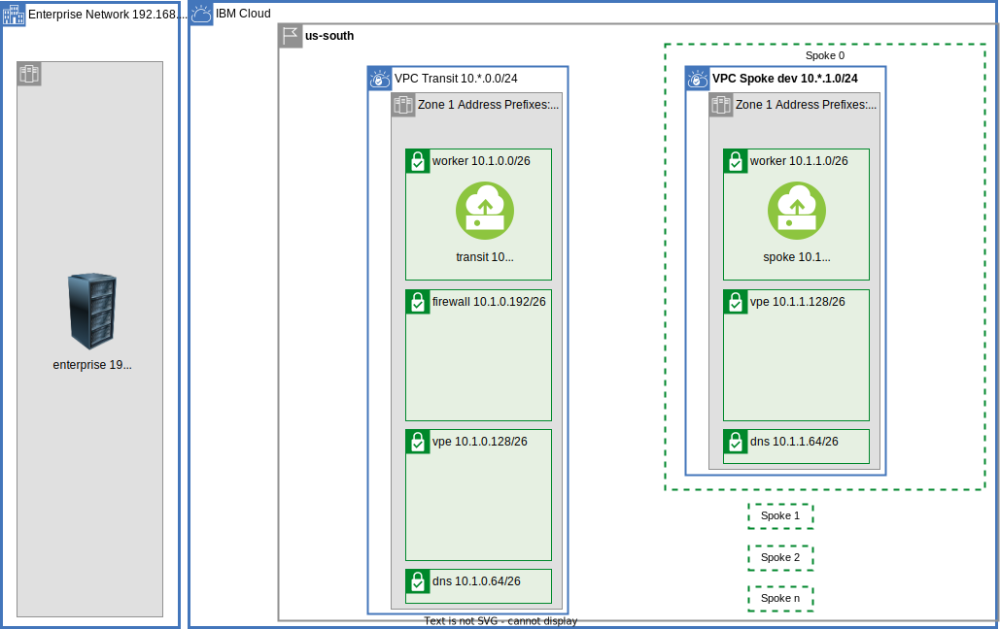

{:step: data-tutorial-type='step'}
{:shortdesc: .shortdesc}
{:new_window: target="_blank"}
{:codeblock: .codeblock}
{:screen: .screen}
{:tip: .tip}
{:pre: .pre}
{:important: .important}
{:note: .note}

# Build VPC Transit Hub and Spoke
{: #vpc-transit}
{: toc-content-type="tutorial"}
{: toc-services="vpc, transit-gateway, direct-link, dns-svcs cloud-databases,databases-for-redis"}
{: toc-completion-time="2h"}

This tutorial may incur costs. Use the [Cost Estimator](https://{DomainName}/estimator/review) to generate a cost estimate based on your projected usage.
{: tip}

The {{site.data.keyword.vpc_full}} (VPC) is used to securely manage network traffic in the {{site.data.keyword.cloud_notm}}.  VPCs can also be used as a way to encapsulate functionality.  The VPCs can be connected to each other and to on premises.  Here is a high level diagram:

{: class="center"}
{: style="text-align: center;"}

A hub and spoke model connects multiple VPCs via {{site.data.keyword.tg_short}} and to on premises using {{site.data.keyword.BluDirectLink}}.  Each spoke could be managed by a different team perhaps in a different account.  The isolation and connectivity support a number of scenarios:

- The hub can be the repository for shared micro services used by spokes
- The hub can be the repository for shared cloud resources, like databases, accessed through [virtual private endpoint gateways](https://{DomainName}/docs/vpc?topic=vpc-about-vpe) controlled with VPC security groups and subnet access control lists, shared by spokes.
- The hub can be a central point of traffic routing between on premises and the cloud.
- Enterprise to cloud traffic can be routed, monitored, and logged through a Virtual Network Function, VNF, appliance in the hub
- The hub can also can monitor all or some of the traffic - spoke <-> spoke, spoke <-> transit, or spoke <-> enterprise.
- The hub can hold the VPN resources that are shared by the spokes.

This solution tutorial will walk through communication paths in a hub and spoke VPC model.  There is a companion [GitHub repository](https://github.com/IBM-Cloud/vpc-transit) that divides the connectivity into a number of incremental layers.  It is typical for an organization to use a subset of the layers. The thin layers focus on bite size challenges and solutions.

 During the journey the following are explored:
- [{{site.data.keyword.tg_full_notm}}](https://www.ibm.com/cloud/transit-gateway)
- VPC egress and ingress routing
- Virtual Network Functions with optional Network Load Balancers to support high availability
- Virtual private endpoint gateways
- DNS resolution

A layered architecture will introduce resources and demonstrate connectivity. Each layer will add additional connectivity and resources. The layers are implemented in terraform. It will be possible to change parameters, like number of zones, by changing a terraform variable.

This tutorial walks you through a complete example demonstrating the network connectivity, VPC routing, DNS name resolution and other details to considered when stitching together a multi VPC architecture.  A layered approach allows the tutorial to introduce small problem and demonstrate a solution in the context of a complete architecture.
{: shortdesc}

## Objectives
{: #vpc-transit-objectives}

* Understand the concepts behind a VPC based hub and spoke model.
* Understand the applicability of a firewall-router and a transit VPC environment.
* Understand VPC ingress and egress routing.
* Identify and optionally resolve asymmetric routing issues.
* Connect VPCs via {{site.data.keyword.tg_short}}.
* Utilize the DNS service routing and forwarding rules to build architecturally sound name resolution system.

There is a companion [GitHub repository](https://github.com/IBM-Cloud/vpc-transit) with the source code for this tutorial and more. If follows the layers defined in this tutorial.

## VPC Layout
{: #vpc-transit-layout}
{: step}

{: class="center"}
{: style="text-align: center;"}

The diagram above shows the VPC layout in more detail. The on premises is CIDR 192.168.0.0/16 and a zone within the enterprise is shown.  In the IBM Cloud there is a transit VPC and one spoke VPC (the other spokes are configured similarly).  The zones in this [multi zone region](https://{DomainName}/docs/overview?topic=overview-locations) are 10.0.0.0/16, 10.1.0.0/16, 10.2.0.0/16.  The transit VPC consumes CIDRs 10.Z.0.0/24 or 10.0.0.0/24, 10.1.0.0/24 and 10.2.0.0/24 spoke 0 consumes 10.Z.1.0/24 or CIDRs 10.0.1.0/24, 10.1.1.0/24 and 10.2.1.0/24.  It is tempting to divide up the CIDR space first by VPC but this complicates routing as we will see in later steps.

There are a few subnets in the the transit and spokes:
- workers - Worker subnets for network accessible compute resources via load balancers, [{{site.data.keyword.redhat_openshift_notm}}](https://www.ibm.com/cloud/openshift), VPC instances, etc.
- firewall - firewall-router.
- vpe - All of the Virtual Private Endpoint Gateways for private connectivity to cloud services.
- dns - For DNS locations see [working with custom resolvers[(https://{DomainName}/docs/dns-svcs?topic=dns-svcs-custom-resolver&interface=ui).  The DNS location appliances managed by the DNS Service consume network interfaces in this subnet.

There is a companion [GitHub Repository](https://github.com/IBM-Cloud/vpc-transit) that can be used to follow along as the resources are created.  Clone and initialize the files **local.env** and **config_tf/terraform.tfvars**.  The APIKEY in local.env is a secret that should not be kept secret.

   ```sh
   git clone https://github.com/IBM-Cloud/vpc-transit
   cd vpc-transit
   cp template.local.env local.env
   vi local.env; # make the suggested change
   source local.env
   ```
   {: codeblock}

 The config_tf/terraform.tfvars has an initial section that requires modification.

   ```
   cp config_tf/template.terraform.tfvars config_tf/terraform.tfvars
   vi config_tf/terraform.tfvars; # make the initial changes suggested
   ```
   {: codeblock}

Below each **Step** will apply one or more layers to the diagram.  You could cd into the directory and execute the terraform commands as shown for **config_tf**:

   ```sh
   cd config_tf
   terraform init
   terraform apply 
   cd ..
   ```
   {: codeblock}

Since it is important that each layer is installed in the correct order and some steps in this tutorial will install multiple layers a shell command **./apply.sh** is provided.  Try it out:

   ```sh
   ./apply.sh; # display help
   ```
   {: codeblock}

You could apply all of the layers configured by executing `./apply.sh : :`.  The colons are shorthand for first (or config_tf) and last (vpe_dns_forwarding_rules_tf).  The **-p** prints the layers:

   ```sh
   $ ./apply.sh : : -p
   directories: config_tf enterprise_tf transit_tf spokes_tf test_instances_tf transit_spoke_tgw_tf enterprise_link_tf firewall_tf all_firewall_tf spokes_egress_tf all_firewall_asym_tf dns_tf vpe_transit_tf vpe_spokes_tf vpe_dns_forwarding_rules_tf
   >>> success
   ```

In this first step apply in config_tf, enterprise_tf, transit_tf and spokes_tf.  First use the -p then do it:

   ```sh
   ./apply.sh -p : spokes_tf
   ./apply.sh : spokes_tf
   ```
   {: codeblock}

## Testing
{: #vpc-transit-testing}
{: step}

{: class="center"}
{: style="text-align: center;"}

VPC Virtual Server Instances, VSIs, can be provisioned to test the network connectivity. A test instance will be added to each of the worker subnets (one per zone) in the enterprise, transit and each of the spokes.  If the default configuration of 2 zones and 2 spokes is used then 8 instances will be provisioned.

   ```sh
   ./apply.sh test_instances_tf
   ```
   {: codeblock}


The python py/test_transit.py pytest script tests the connectivity of the test instances.  Each test will ssh to one of the instances and perform different types of connectivity tests.

Validation was done with python 3.10.7.  You can install and activate a virtual environment using the following steps.

   ```sh
   python --version; # ensure python 3 is active
   python -m venv venv --prompt transit_vpc; # install a python virtual environment with activation prompt of transit_vpc
   source venv/bin/activate; # now pip and python will come from the virtual environment
   pip install --upgrade pip; # upgrade to latest version of pip
   pip install -r requirements.txt; #install dependencies
   ```
   {: codeblock}

Each time a fresh shell is initialized remember to activate the python virtual environment:
   ```sh
   source venv/bin/activate
   ```
   {: codeblock}

Run the test suite and notice connectivity within a VPC, like enterprise -> enterprise, is working but cross VPC connectivity, like enterprise -> transit, is not working. 

   ```sh
   pytest
   ```
   {: codeblock}

Your output will resemble:
   ```sh
   ...
   py/test_transit.py::test_curl[tvpc-transit-z1-s0 (52.118.204.173) 10.1.0.4       -> tvpc-transit-z1-s0 10.1.0.4] PASSED              [ 11%]
   py/test_transit.py::test_curl[tvpc-enterprise-z0-s0 (52.116.140.173) 192.168.0.4 -> tvpc-transit-z0-s0 10.0.0.4] FAILED              [ 13%]
   py/test_transit.py::test_curl[tvpc-enterprise-z0-s0 (52.116.140.173) 192.168.0.4 -> tvpc-transit-z1-s0 10.1.0.4] FAILED              [ 14%]
   ...
   =======================================short test summary info ===========================================================================
   ...
   FAILED py/test_transit.py::test_curl[tvpc-spoke1-z1-s0 (150.239.167.126) 10.1.2.4       -> tvpc-spoke0-z0-s0 10.0.1.4] - assert False
   FAILED py/test_transit.py::test_curl[tvpc-spoke1-z1-s0 (150.239.167.126) 10.1.2.4       -> tvpc-spoke0-z1-s0 10.1.1.4] - assert False
   =================================== 96 failed, 32 passed, 4 skipped in 896.72s (0:14:56) =================================================
   ```

A change to the network configuration can take a couple of test runs for the underlying VPC network system to become consistent.  If you do not see the expected results initially be prepared to run the test again a couple of times.
{: note}

## Transit to Spokes via Transit Gateway
{: #vpc-transit-transit-to-spokes}
{: step}

{: class="center"}
{: style="text-align: center;"}

The Transit Gateway between the transit vpc and the spoke vpcs has been added to the diagram.  Apply the layer:

   ```sh
   ./apply.sh transit_spoke_tgw_tf
   ```
   {: codeblock}


Running the curl tests (-m curl) will demonstrate passing tests between the transit and the spokes.

   ```sh
   pytest -v -m curl
   ```
   {: codeblock}

## Enterprise to Transit via Direct Link and Transit Gateway
{: #vpc-transit-enterprise-to-transit}
{: step}

{: class="center"}
{: style="text-align: center;"}

The {{site.data.keyword.BluDirectLink}} using {{site.data.keyword.tg_short}} has been added to the diagram.

{{site.data.keyword.dl_full}} is a high speed secure data path for connecting an enterprise to the IBM cloud. {{site.data.keyword.dl_full_notm}}  can optionally be connected to {{site.data.keyword.tg_short}} for distribution.  The enterprise in this simulation is a VPC and uses a {{site.data.keyword.tg_short}} to ensure an experience very close to {{site.data.keyword.dl_short}}.

Apply the enterprise_link_tf layer:
   ```sh
   ./apply.sh enterprise_link_tf
   ```
   {: codeblock}

Running the curl tests (-m curl) will demonstrate passing tests between the enterprise and the transit.

   ```sh
   pytest -v -m curl
   ```
   {: codeblock}


## Enterprise to Spoke via Transit NFV Router
{: #vpc-transit-router}
{: step}

The incentive of a transit vpc for enterprise <-> cloud traffic is for central monitor, inspect, route and logging of network traffic.  A firewall-router appliance can be installed in the transit VPC.  A subnet has been created in each of the zones of the transit VPC to hold the firewall-router. 

### NFV Router
{: #vpc-transit-nfv-router}
{: class="center"}
{: style="text-align: center;"}

The diagram shows the firewall-router appliances.  An ingress route table for Transit Gateways has been added to the transit VPC as indicated by the dotted lines.

Connectivity from the enterprise to a spoke is achieved through a Network Function Virtualization, [NFV](https://{DomainName}/docs/vpc?topic=vpc-about-vnf), firewall-router in the transit VPC.  In production you can choose one from the catalog or bring your own.  This demonstration will use an Ubuntu stock image with kernel iptables set up to forward all packets from the source to destination.  No firewall inspection is performed.

The terraform configuration will configure the firewall-router instance with [allow_ip_spoofing](https://{DomainName}/docs/vpc?topic=vpc-ip-spoofing-about).  You must [enable IP spoofing checks](https://{DomainName}/docs/vpc?topic=vpc-ip-spoofing-about#ip-spoofing-enable-check) before continuing.
{: note}

Apply the firewall_tf layer:
   ```sh
   ./apply.sh firewall_tf
   ```
   {: codeblock}

### Ingress Routing
{: #vpc-transit-ingress-routing}
Traffic reaches the firewall-router appliance through routing tables.  Visit the [VPCs](https://{DomainName}/vpc-ext/network/vpcs) in the {{site.data.keyword.cloud_notm}} console.  Select the transit VPC and then click on **Manage routing tables** click on the **tgw-ingress** routing table.

The zone is determined by the Transit Gateway which will examine the destination IP address of each packet and route it to the matching zone based on VPC Address Prefixes discussed in the next section.

Notice how wide the routes are in the ingress routing table for the three zone configuration:

zone|destination|next_hop
--|--|--
Dallas 1|0.0.0.0/0|10.0.0.196
Dallas 2|0.0.0.0/0|10.1.0.196
Dallas 3|0.0.0.0/0|10.2.0.196

The next_hop identifies the firewall-router.  In the table below 10.0.0.196 zone Dallas 1 and 10.1.0.196 zone Dallas 2.  Check [Virtual server instances for VPC](https://{DomainName}/vpc-ext/compute/vs) to find the **fw** instances and associated **Reserved IP**.

### VPC Address Prefixes
{: #vpc-transit-vpc-address-prefixes}
Transit Gateways learn routes in the attached VPCs through the [VPC Address Prefixes](https://{DomainName}/docs/vpc?topic=vpc-vpc-addressing-plan-design).  But how does a spoke learn the route to the enterprise (192.168.0.0/16)?  And how does the enterprise learn the route to a spoke?  By adding phantom VPC address prefixes to the transit VPC.

The transit VPC zone in the diagram has the additional address prefixes: 192.168.0.0/24 Dallas 1 and 192.168.1.0/24 Dallas 2.  Open the [VPCs](https://{DomainName}/vpc-ext/network/vpcs) in the {{site.data.keyword.cloud_notm}} and select the **transit VPC** and notice the Address prefixes displayed and find the additional address prefixes that have been added.

Also notice that the Address prefix for that transit VPC itself is 10.0.0.0/16 Dallas 1 and 10.1.0.0/16 Dallas 2.  The transit VPC will only use a subset of each zone 10.0.0.0/24 Dallas 1 and 10.1.0.0/24 Dallas 2.  The address prefixes for the transit is expanded to include all of the spokes to allow the routes to flow to the enterprise.

With these additional address prefixes the spoke VPCs learn that traffic spoke -> 192.168.0.0/24, 192.168.1.0/24, 192.168.2.0/24 should pass through the connected transit gateway.  Similarly the enterprise will learn that traffic destined to 10.0.0.0/16, 10.1.0.0/16 10.2.0.0/16 should pass through its connected transit gateway.

### Testing enterprise <-> spoke
{: #vpc-transit-testing-enterprise-spoke}

Running the tests will demonstrate passing tests between the enterprise and the spokes within the same zone but new failures with transit -> enterprise.

   ```sh
   pytest -v -m curl
   ```
   {: codeblock}

Example failure:
   ```sh
   FAILED py/test_transit.py::test_curl[l-tvpc-transit-z0-s0 (150.240.68.219) 10.0.0.4     -> r-tvpc-enterprise-z0-s0 192.168.0.4] - assert False
   ```

## Stateful Routing and Direct Server Return
{: #vpc-transit-stateful-routing}
{: step}
The IBM VPC uses the industry standard state based routing for secure TCP connection tracking.  This requires that the TCP connections use the same path on the way in as the way out.  One exception to this is Direct Server Return used by routers like [{{site.data.keyword.loadbalancer_short}}](https://{DomainName}/docs/vpc?topic=vpc-network-load-balancers).  This allows incoming connections from the enterprise to pass through the firewall to the transit test instance and then return directly to the originator.


{: class="center"}
{: style="text-align: center;"}

This does not help with the traffic originating in the transit test instance passing through the transit gateway then back through ingress routing to the firewall-router.  This connection will not complete.

{: class="center"}
{: style="text-align: center;"}


One possible solution is to not send transit traffic through the firewall-router.  Adding the following routes (three zone configuration) to the transit vpc ingress route table would restore it back to the pre firewall-router configuration for traffic destined to the transit test instances.  Routes for three zone configuration:

zone|destination|next_hop
--|--|--
Dallas 1|10.0.0.0/24|Delegate
Dallas 2|10.1.0.0/24|Delegate
Dallas 3|10.2.0.0/24|Delegate

Optionally visit the [Routing tables for VPC](https://{DomainName}/vpc-ext/network/routingTables) in the {{site.data.keyword.cloud_notm}} console.  Select the **transit** vpc from the drop down and then select the **tgw-ingress** routing table.  Click **Create** to add each route.  **Delegate** will delegate to the default VPC routing behavior for the matching CIDR block in the zone.

If you created the routes do not forget to remove them as noted below.

An alternative solution, used below, is to route the transit VPC test instance traffic through the firewall/router.

## Cross Zone and Asymmetric Routing
{: #vpc-transit-asymmetric}
{: step}

{: class="center"}
{: style="text-align: center;"}

Green: successful routing, Blue: initial connection, Red: failure on return.

### Asymmetric Routing Limitation
{: #vpc-transit-asymmetric-routing-limitation}
Ignoring the transit -> enterprise and transit -> spoke failures the remaining failures are cross zone failures enterprise <-> spoke.

Example failure:
   ```sh
   FAILED py/test_transit.py::test_curl[l-tvpc-enterprise-z0-s0 (52.118.186.209) 192.168.0.4 -> r-tvpc-spoke0-z1-s0 10.1.1.4] - assert False
   ```

In the diagram the green connections are working. The blue line represents a TCP connection request from enterprise through the transit gateway: 192.168.0.4 <--TCP--> 10.1.1.4.  The transit gateway will choose a transit VPC zone based on the address prefix in that zone.  The matching address prefix for 10.1.1.4 is 10.1.1.0/24 in the lower zone.

The red line represents the TCP connection response to 192.168.0.4.  The transit gateway delivers to the transit VPC using the matching address prefix 192.168.0.0/24 in the upper zone.  The IBM VPC uses the industry standard state based routing for secure TCP connection tracking.  This requires that the TCP connection pass through the same firewall-router in both directions.  The VPC does not support tcp "Asymmetric Routing".

It is interesting to note that an attempt to ping using the ICMP protocol would not suffer from this limitation.  ICMP does not require a stateful connection.  Connectivity from 192.168.0.4 <--ICMP--> 10.1.1.4 via ICMP is possible.  You can run the ping marked tests to verify via copy paste of the failed output  The **l-** is for left and **r-** is for right:

Success:
   ```sh
   pytest -v -m ping -k 'l-enterprise-z0-s0 and r-spoke0-z1-s0'
   ```
   {: codeblock}

Failure:
   ```sh
   pytest -v -m curl -k 'l-enterprise-z0-s0 and r-spoke0-z1-s0'
   ```
   {: codeblock}

If the goal is to create an architecture that is resilient across {{site.data.keyword.cloud_notm}} zonal failures then cross zone traffic should generally be avoided.  Routing on the enterprise could insure that all traffic destined to the cloud be organized and routed to avoid the cross zone traffic in the cloud.  The enterprise concept of zones will need to be understood.  In this tutorial the phantom VPC address prefixes will identify the cloud zone associated with an enterprise device.

### Spoke Egress routing
{: #vpc-transit-spoke-egress-routing}
{: class="center"}
{: style="text-align: center;"}

It is possible to work around this cross zone limitation by using egress routing in the spokes.  In the diagram this is represented by the egress dashed line.

Apply the spoke_egress_tf layer:
   ```sh
   ./apply.sh spokes_egress_tf
   ```
   {: codeblock}

Visit the [VPCs](https://{DomainName}/vpc-ext/network/vpcs) in the {{site.data.keyword.cloud_notm}} console.  Select one of the spoke VPCs and then click on **Manage routing tables** click on the **Egress** routing table directing all egress traffic in Dallas 1 should be directed to 10.0.0.196 in Dallas 1.  With this change spoke traffic originating in a spoke in Dallas 2 remains in Dallas 2 as it flows through the firewall-router in the transit VPC.

{: class="center"}
{: style="text-align: center;"}

Spoke egress routes for the three zone configuration:

zone|destination|next_hop
--|--|--
Dallas 1|192.168.0.0/16|10.0.0.196
Dallas 2|192.168.0.0/16|10.1.0.196
Dallas 3|192.168.0.0/16|10.2.0.196


Verify that more tests are passing.  If you manually added the ingress routes earlier all of the tests are passing:
   ```sh
   pytest -v -m curl
   ```
   {: codeblock}

## More Firewall Protection
{: #vpc-transit-firewall}
{: step}
If you only need routing capability and you added the optional routes the hub and spoke model is complete. Routing is possible from transit (hub) and spoke.  Enterprise to both transit and spoke is complete.  You can skip this step.

Often an enterprise uses a transit VPC to monitor the traffic with the firewall-router.  Currently enterprise <-> spoke traffic is flowing through the transit firewall-router.  This section is about routing all VPC to VPC traffic through firewall-router.  

If you added routes to fix the transit -> enterprise and transit -> spoke as an optional step earlier now is the time to remove the routes that you manually added using the {{site.data.keyword.cloud_notm}} console.
{: note}

### Route Spoke and Transit to the firewall-router
{: #vpc-transit-route-spoke-and-transit-to-firewall-router}
Routing all cloud traffic originating at the spokes through the transit VPC firewall-router in the same zone is accomplished by these routing table routes in the spoke egress routing table.

Egress routes in spokes for the three zone configuration:

zone|destination|next_hop
--|--|--
Dallas 1|10.0.0.0/8|10.0.0.196
Dallas 2|10.0.0.0/8|10.1.0.196
Dallas 3|10.0.0.0/8|10.2.0.196

Similarly in the transit VPC route all enterprise and cloud traffic through the firewall-router in the same zone as the originating transit instance.  For example a transit test instance 10.0.0.4 (Dallas 1) attempting contact with 10.1.1.4 (Dallas 2) will be sent through the firewall-router in Dallas 1: 10.0.0.196.  

Egress routes in transit for the three zone configuration:

zone|destination|next_hop
--|--|--
Dallas 1|10.0.0.0/8|10.0.0.0.196
Dallas 2|10.0.0.0/8|10.1.0.0.196
Dallas 3|10.0.0.0/8|10.2.0.0.196
Dallas 1|192.168.0.0/16|10.0.0.0.196
Dallas 2|192.168.0.0/16|10.1.0.0.196
Dallas 3|192.168.0.0/16|10.2.0.0.196

This is going to introduce another cross zone asymmetric route transit <--> spoke.  For example a transit worker in an upper zone pictorially will choose the firewall in the upper zone.  On the return trip the spoke in the lower zone will choose the firewall in the lower zone.  In the spokes, traffic destine to the transit should be delegated to normal traffic routing, meaning the{{site.data.keyword.tg_short}} will route to the zone of the destination.,

Egress routes in the spokes for the three zone configuration:

zone|destination|next_hop
--|--|--
Dallas 1|10.0.0.0/24|delegate
Dallas 2|10.0.0.0/24|delegate
Dallas 3|10.0.0.0/24|delegate
Dallas 1|10.1.0.0/24|delegate
Dallas 2|10.1.0.0/24|delegate
Dallas 3|10.1.0.0/24|delegate
Dallas 1|10.2.0.0/24|delegate
Dallas 2|10.2.0.0/24|delegate
Dallas 3|10.2.0.0/24|delegate


### Do not route Intra VPC traffic to the firewall-router
{: #vpc-transit-do-not-route-intra-zone-traffic-to-firewall-router}
In this example Intra-VPC traffic will not pass through the firewall-router.  Additional more specific routes can be added to delegate internal traffic.  For example in spoke 0, which has the CIDR ranges: 10.0.1.0/24, 10.1.1.0/24, 10.2.1.0/24 the internal routes can be delegated.

Egress routes for spoke0 for the three zone configuration:

zone|destination|action
--|--|--
Dallas 1|10.0.1.0/24|delegate
Dallas 1|10.1.1.0/24|delegate
Dallas 1|10.2.1.0/24|delegate
Dallas 2|10.0.1.0/24|delegate
Dallas 2|10.1.1.0/24|delegate
Dallas 2|10.2.1.0/24|delegate
Dallas 3|10.0.1.0/24|delegate
Dallas 3|10.1.1.0/24|delegate
Dallas 3|10.2.1.0/24|delegate

Similar routes are added to the transit and other spokes.

### Firewall Subnets
{: #vpc-transit-firewall-subnets}
What about the firewall-router itself?  This was not mentioned earlier but in anticipation of this change there was a egress_delegate router created in the transit vpc that delegates routing to the default for all destinations.  It is only associated with the firewall-router subnets so the firewall-router is not effected by the changes to the default egress routing table used by the other subnets.  Check the routing tables for the transit VPC for more details. Visit the [VPCs](https://{DomainName}/vpc-ext/network/vpcs) in the {{site.data.keyword.cloud_notm}} console.  Select the transit VPC and then click on **Manage routing tables**, click on the **egress-delegate** routing table, click on the **Subnets** tab and note the -s3 subnets used for firewall-routers.

### Apply and Test More Firewall
{: #vpc-transit-apply-and-test-more-firewall}
Apply the all_firewall_tf layer:
   ```sh
   ./apply.sh all_firewall_tf
   ```
   {: codeblock}

Test:
   ```sh
   pytest -v -m curl
   ```
   {: codeblock}

Only the cross zone transit <-> spoke and spoke <-> spoke tests are failing.

### Optionally fix cross zone routing
{: #vpc-transit-optionally-fix-cross-zone-routing}

As mentioned earlier for a system to be resilient across zonal failures it is best to eliminate cross zone traffic. If cross zone support is required additional egress routes can be added.  The problem for spoke to spoke traffic is shown in this diagram

{: class="center"}
{: style="text-align: center;"}

The green path is an example of the originator spoke0 10.0.1.4 routing to 10.1.2.4.  The matching egress route is:

zone|destination|next_hop
--|--|--
Dallas 2|10.0.0.0/8|10.1.0.196

Moving right to left Which the is the firewall-router in the middle zone of the diagram.  On the return path the lower zone is selected.

To fix this a few more specific routes need to be added to force the upper zones to route to the lower zones.


{: class="center"}
{: style="text-align: center;"}

Routes for the three zone configuration.  Added to each of the spokes:

zone|destination|next_hop
--|--|--
Dallas 2|10.0.0.0/16|10.0.0.196
Dallas 3|10.0.0.0/16|10.0.0.196
Dallas 3|10.1.0.0/16|10.1.0.196

Apply the all_firewall_asym_tf layer:
   ```sh
   ./apply.sh all_firewall_asym_tf
   ```
   {: codeblock}

Test:
   ```sh
   pytest -v -m curl
   ```
   {: codeblock}

All tests are passing!

## High Availability (HA) Firewall-Router
{: #vpc-transit-ha-firewall-router}
{: step}
To prevent a firewall-router from becoming a single point of failure it is possible to add a VPC Network Load Balancer to distribute traffic to the zonal firewall-routers to create a Highly Available, HA, firewall-router.

{: class="center"}

This diagram shows a single zone with a network load balancer fronting two firewall-routers. To optionally see this constructed it is required to change the configuration and apply again.  Note that configuring the HA firewall-router it is not required for this tutorial.  You may read through this step but skip the actions.


Optionally change config_tf/terraform.tfvars:
   ```sh
   firewall                     = true
   firewall_lb                  = true
   number_of_firewalls_per_zone = 2
   ```
   {: codeblock}

   ```sh
   vi config_tf/terraform.tfvars; # make the above changes
   ```
   {: codeblock}

This change results in the IP address of the firewall-router changing from the firewall-router instance used earlier to the IP address of the network load balancer.  The optional HA firewall router will need to be applied to a number of VPC route table routes in the transit and spoke vpcs.  It is best to start over:


Optionally apply all the layers through the all_firewall_asym_tf layer:
   ```sh
   ./apply.sh : all_firewall_asym_tf
   ```
   {: codeblock}

## DNS
{: #vpc-transit-dns}
{: step}
{: class="center"}
{: style="text-align: center;"}

The {{site.data.keyword.dns_full_notm}} service is used to provide names to IP addresses.  In this example a separate DNS service is created for the transit and each of the spokes.  This approach provides isolation between teams and allows the architecture to spread across different accounts.  If a single DNS service in a single account meets your isolation requirements it is the preferred solution.


### DNS Resources
{: #vpc-transit-dns-resources}
Create the dns services and add a DNS zone for each VPC and an A record for each of the test instances:

Apply the dns_tf layer:
   ```sh
   ./apply.sh dns_tf
   ```
   {: codeblock}

Open the [Resources](https://{DomainName}/resources) in the {{site.data.keyword.cloud_notm}} console.  Open the **Networking** section and notice the **DNS Services**.  Open the **x-spoke0** instance.  Click the **x-spoke0.com** DNS zone.  Notice the A records associated with the test instances that are in the spoke instance.  Optional explore the other DNS instances and find similarly named DNS zones and A records for the other test instances.

Click on the **Custom resolver** tab on the left and notice the forwarding rules.

### DNS Forwarding
{: #vpc-transit-dns-forwarding}
Separate DNS instances learn each other's DNS names with forwarding rules.  In the diagram there are arrows that indicate a forwarding rule.  The associated table indicates when the forwarding rule will be used.  Starting on the left notice that the enterprise DNS forwarding rule will look to the transit for the DNS zones: x-transit.com, x-spoke0.com, and x-spoke1.com.

The transit DNS instance can resolve x-transit.com and has forwarding rules to the spokes to resolve the rest.  Similarly the spokes rely on the transit DNS instance to resolve the enterprise, transit and the other spokes.

You can verify these forwarding rules in the {{site.data.keyword.cloud_notm}} console in the **Custom resolver** tab in each of the DNS instances.  After locating the custom resolve click to open then click **Forwarding rules** tab.

### DNS Testing
{: #vpc-transit-dns-testing}

There are now a set of **curl DNS** tests that have been made available in type pytest script.  These tests will curl using the DNS name of the remote.

Test:
   ```sh
   pytest -v -m dns
   ```
   {: codeblock}

## Virtual Private Endpoint Gateways
{: #vpc-transit-VPE}
{: step}

{: class="center"}

{: style="text-align: center;"}
VPC allows private access to IBM Cloud Services through [{{site.data.keyword.vpe_full}}](https://{DomainName}/docs/vpc?topic=vpc-about-vpe). The VPEs allow fine grain network access control via standard {{site.data.keyword.vpc_short}} controls:
- [{{site.data.keyword.security-groups}}](https://{DomainName}/docs/vpc?topic=vpc-using-security-groups)
- [VPC Network Access Control Lists](https://{DomainName}/docs/vpc?topic=vpc-using-acls)
- [Routing tables and routes](https://{DomainName}/docs/vpc?topic=vpc-about-custom-routes)

Create the VPEs for the transit and the spokes, by applying the vpe layers:
   ```sh
   ./apply.sh vpe_transit_tf vpe_spokes_tf
   ```
   {: codeblock}

There are now a set of **vpe**  and **vpedns**tests that have been made available in type pytest script.  These **vpedns** test will verify that the DNS name of a redis instance is within the private CIDR block of the enclosing VPC. The **vpe** test will execute a **redli** command to access redis remotely.

Test vpe and vpedns
   ```sh
   pytest -v -m 'vpe or vpedns'
   ```
   {: codeblock}

Notice the failing vpedns tests like this one:

   ```sh
   FAILED py/test_transit.py::test_vpe_dns_resolution[redis tvpc-spoke0-z0-s0 (169.48.153.106)) 10.0.1.4 -> tvpc-transit (['10.0.0.128/26', '10.1.0.128/26']) 5c60b3e4-1920-48a3-8e7b-98d5edc6c38a.c7e0lq3d0hm8lbg600bg.private.databases.appdomain.cloud] - AssertionErro...
   ```

These are failing because the DNS resolution.  In the example above the ID.private.databases.appdomain.cloud should resolve to a VPE that is in the CIDR block 10.0.0.128/26 or 10.1.0.128/26.  Looking at the stack trace notice it is resolving to an address like 166.9.14.12 which is a Cloud [Service Endpoint](https://{DomainName}/docs/vpc?topic=vpc-service-endpoints-for-vpc#cloud-service-endpoints).  The DNS names can not be resolved by the private DNS resolvers.  Adding additional DNS forwarding rules will resolve this issue.

To make the DNS names for the VPE available outside the DNS owning service it is required to update the DNS forwarding rules.
- For enterprise `appdomain.com` will forward to the transit.
- For transit the fully qualified DNS name of the REDIS instance will be forwarded to the spoke instance that owns the REDIS instance.
- For spoke_from -> spoke_to access to REDIS the spoke_from needs the DNS name for the REDIS instance.

{: class="center"}
{: style="text-align: center;"}

The diagram uses **transit-.databases.appdomain.cloud** to identify the database in the transit instead of the fully qualified name like **5c60b3e4-1920-48a3-8e7b-98d5edc6c38a.c7e0lq3d0hm8lbg600bg.private.databases.appdomain.cloud**.

Apply the vpe_dns_forwarding_rules_tf layer:
   ```sh
   ./apply.sh vpe_dns_forwarding_rules_tf
   ```
   {: codeblock}

Verify that all VPEs can be accessed from all test instances.
   ```sh
   pytest -v -m 'vpe or vpedns'
   ```
   {: codeblock}

It can take a few tries for the DNS names to be resolved accurately.  So try the test at least three times.  All tests should pass except the enterprise to spoke VPE tests:

   ```sh
   pytest
   ```
   {: codeblock}

Powell: todo need to consider taking out the failing tests.  Meeting with Shaival to determine what to do.

## Production Notes
{: #vpc-transit-production-notes}

The [VPC reference architecture for IBM Cloud for Financial Services](https://{DomainName}/docs/framework-financial-services?topic=framework-financial-services-vpc-architecture-about) has much more detail on securing workloads in the {{site.data.keyword.cloud_notm}}.

Some obvious changes to make:
- CIDR blocks were chosen for clarity and ease of explanation.  The Availability Zones in the Multi zone Region could be 10.0.0.0/10, 10.64.0.0/10, 10.128.0.0/10 to conserve address space.  Similarly the address space for Worker nodes could be expanded at the expense of firewall, DNS and VPE space.
- Security Groups for each of the network interfaces for worker VSIs, Virtual Private Endpoint Gateways, DNS Locations and firewalls should all be carefully considered
- Network Access Control Lists for each subnet should be carefully considered

DNS
The appliances are used as both DNS resolvers used by remote DNS servers and DNS forwarders.

## Remove resources
{: #vpc-transit-remove-resources}

You can cd to the team directories in order, and execute `terraform destroy`.  Or use the `./apply.sh` command:

   ```sh
   ./apply.sh -d : :
   ```
   {: codeblock}

## Conclusions
{: #vpc-transit-conclusions}
In this tutorial you created a hub VPC and a set of spoke VPCs.  You identified the required Availability Zones for the architecture and created a set of subnets in the VPCs.  You created a transit VPC firewall-router in each zone for centralized monitoring.  Test instances were used to verify connectivity and identify potential problems.  Routing table routes were used to identify the traffic paths required.

## Expand the tutorial
{: #vpc-transit-expand-tutorial}

Your architecture will likely be different than the one presented but will likely be constructed from the fundamental components discussed here. Ideas to expand this tutorial:

- Force all outbound traffic through the firewall in the transit VPC.
- Integrate incoming public internet access using [{{site.data.keyword.cis_full}}](https://{DomainName}/docs/cis?topic=cis-getting-started)
- Add flow log capture in the transit
- Put each of the spokes in a separate account in an [enterprise](https://{DomainName}/docs/account?topic=account-enterprise-tutorial#account_groups_tutorial)
- Force some of the spoke to spoke traffic through the firewall and some not through the firewall.
- Replace the worker VSIs with [{{site.data.keyword.openshiftlong_notm}} and VPC load balancer](https://{DomainName}/openshift?topic=openshift-vpc-lbaas)

## Related content
{: #vpc-transit-related}

* [IBM Cloud for Financial Services](https://{DomainName}/docs/framework-financial-services) has 
* Tutorial: [Best practices for organizing users, teams, applications](https://{DomainName}/docs/solution-tutorials?topic=solution-tutorials-users-teams-applications#users-teams-applications)
* [How to deploy isolated workloads across multiple locations and regions](https://{DomainName}/docs/solution-tutorials?topic=solution-tutorials-vpc-multi-region)
* [Public frontend and private backend in a Virtual Private Cloud](https://{DomainName}/docs/solution-tutorials?topic=solution-tutorials-vpc-public-app-private-backend),
* [Network Function Virtualization](https://{DomainName}/docs/vpc?topic=vpc-about-vnf)
* [Private hub and spoke with transparent VNF and spoke-to-spoke traffic](https://{DomainName}/docs/vpc?topic=vpc-about-vnf-ha)
