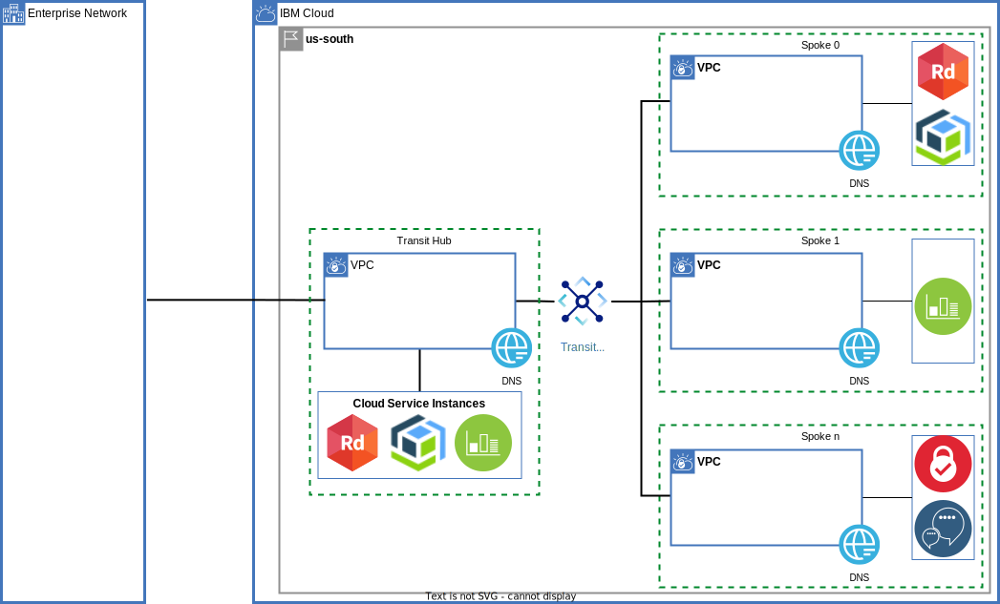

{:step: data-tutorial-type='step'}
{:shortdesc: .shortdesc}
{:new_window: target="_blank"}
{:codeblock: .codeblock}
{:screen: .screen}
{:tip: .tip}
{:pre: .pre}
{:important: .important}
{:note: .note}

# Build VPC Hub and Spoke extended to On Premises via a Transit VPC
{: #vpc-transit}
{: toc-content-type="tutorial"}
{: toc-services="vpc, account, transit-gateway, dns-svcs", "todo"}
{: toc-completion-time="2h"}

This tutorial may incur costs. Use the [Cost Estimator](https://{DomainName}/estimator/review) to generate a cost estimate based on your projected usage.
{: tip}

{{site.data.keyword.vpc_full}} (VPC) is private blahblah.

A hub and spoke model connects multiple VPCs via transit gateway.  Each VPC can be managed by a different team. ...

This tutorial walks you through a complete example demonstrating the network connectivity, routing, DNS name resolution and other details that potentially need to be considered when stiching together multi VPC architectures.  A layered presentation approach allows you to pick and choose parts of this tutorial that might be applicable in your environment.
{: shortdesc}

## Objectives
{: #vpc-transit-objectives}

* todo
* Address micro-services by DNS name resolution using {{site.data.keyword.dns_short}}.
* Connect VPCs via {{site.data.keyword.tg_short}}.

There is a companion GitHub repository with instructions on how to build and test the architecture.  If follows the layers defined in this tutorial.  It allows you to demonstrate connectivity problems and solutions as layers are added.

## Architecture:
{: class="center"}
{: style="text-align: center;"}

The diagram above shows an enterprise data center connected to the IBM cloud.  The VPCs are arranged in a hub and spoke model.  All enterprise traffic flows through the transit VPC.  A separate DNS instance and cloud service instances are associated and managed by a spoke team. Each spoke could be implemented in an account of an IBM Enterperise Account todo link.  This solution tutorial will demonstrate the architecture in a single account.

## VPC Layout
{: #vpc-transit-vpc-layout}
{: step}

todo layer-background 
{: class="center"}
{: style="text-align: center;"}

The diagram above shows the VPC layout in more detail. The on premises is CIDR 192.168.0.0/16 and a zone within the enterprise is shown.  In the IBM Cloud there is a transit VPC and one spoke VPC (the other spokes are configured similarly).  The zones in a multi zone region (todo link mzr definition) are 10.0.0.0/16, 10.1.0.0/16, 10.2.0.0/16.  The transit VPC consumes CIDRs 10.*.0.0/24 or 10.0.0.0/24, 10.1.0.0/24 and 10.2.0.0/24 spoke 0 consumes 10.*.1.0/24 or CIDRs 10.0.1.0/24, 10.1.1.0/24 and 10.2.1.0/24.  It is tempting to divide up the CIDR space first by VPC but this complicates routing as we will see in later steps.

There are a few subnets in the the transit and spokes:
- worker - Worker instances, load balancers, ROCS todo can be added into this subnet
- firewall - firewall router
- vpe - all of the Virtual Endpoint Gateways for cloud services
- dns - For DNS locations (todo link).  The DNS location appliances managed by the DNS Service consume network interfaces in this subnet.

## STEP Testing
{: step}
VPC Virtual Server Instances, VSIs, can be provisioned to test the network connectivity. A test instance will be added to each of the worker subnets or one per zone in the enterprise, transit and each of the spokes.  If the default configuratio of 2 zones and 2 spokes is used then 8 instances will be provisioned.

```
./apply.sh test_instances_tf
```

The python py/test_transit.py pytest script tests the connectivity of the test instances.  Each test will ssh to one of the instances and perform different types of connectitiby tests to the instances.

Validation was done with python 3.10.7.  You can install and activate a virtual environment using the following steps.

```
python -m venv venv --prompt transit_vpc
source venv/bin/activate; # now pip and python will come from the virtual environment
pip install --upgrade pip
pip install -r requirements.txt
```

Now (and each time a fresh shell is initialized) remember to activate the python virtual environment:
```
source venv/bin/activate
```

Run the test suite and notice that connectivity within a VPC is working but no cross VPC connectivity is working. 

```
pytest -v
```

## STEP Transit to Spokes via Transit Gateway
{: step}
The Transit Gateway todo link will connect the 

todo image layer-spokegateway 

The diagram has been enhanced to include the Transit Gateway between the transit vpc and the spoke vpcs.  Running the tests will now demonstrate passing tests between the transit and the spokes.

## STEP Enterprise to Transit via Direct Link and Transit Gateway
{: step}
The enterprise to cloud tests are failing. Customers often use [Direct Link](todo) for connecting enterprise to the IBM cloud.  Direct Link is great blah blah. Direct link can also be connected to a Transit Gateway for distribution.

The enterprise in this simulation is a VPC. The enterprise to VPC connection uses a Transit Gateway that will closely match a Direct Link connection.

todo image directink

The diagram had been enhanced to include the Direct Link simulation using Transit Gateway Running the tests will now demonstrate passing tests between the enterprise and the transit.


## STEP Enterprise to Spoke via Transit NFV Router
{: step}

Network Function Virtualization
https://www.ibm.com/cloud/blog/network-function-virtualization-nfv-using-vpc-routing


The enterprise to spoke tests are failing.  Connectivity from the enterprise to a spoke can only be achieved through a Virtual Network Function router in the transit VPC.  Choose one from the catalog or bring your own.  This demonstration will use an Ubuntu stock image with a iptables set up to forward all packets from the source to destination.  No firewall inspection.


todo image firewal

The diagram had been enhanced to include a firewall routing appliance.  In addition an ingress route table has been added to the transit VPC as indicated by the dotted line.

Fire

zone|destination|next_hop|name
--|--|--|--
us-south-1|192.168.0.0/16|10.0.0.196|zone-0

This ingress route table applies to traffic into the transit VPC from any transit gateway.  Zone is the transit zone determined by the Transit Gateway. The destination CIDR block will be in the enterprise range (192.168.*.*) when the source is a spoke or the cloud range (10.*.*.*) when the source is the enterprise.


Running the tests will demonstrate passing tests between the enterprise and the spokes within the same zone.

## STEP Cross Zone and Asymetric Routing
{: step}

The cross zone tests are failing. If the goal is to create an architecture that is resiliant across IBM Cloud zonal failures then cross zone traffic should be avoided.  The following diagram shows the working fows in green.

todo image asymmetric

The blue flow shows a tcp connection request flowing cross zone.  yada yada

## STEP Firewall
{: step}
Currently enterprise <-> spoke traffic is flowing through the transit router/firewall.  Some architectures require some spoke to spoke traffic to flow through the firewall.  The following additional routing tables are required:

## STEP DNS
{: step}
The DNS service is used to provie names to IP addresses.
If a single DNS service for the cloud would meet your isolation needs it is a simpler solution.
In this example a DNS service is created for the transit and each of the spokes to provide isolation between teams.  DNS ....

## STEP Virtual Private Endpoint Gateways
{: step}
VPC allows private access through ...

## STEP Routing Considerations for Virtual Private Endpoint Gateways
{: step}


## Production Notes
More detailed notes for production environments can be found in the todo link.

Some obvious changes to make:
- CIDR blocks were chosen for clarity and ease of explination.  The Availability Zones in the Multizone Region could be 10.0.0.0/10, 10.4.0.0/10, 10.8.0.0/10 to conserve address space.  Similarly the address space for Worker nodes could be expanded at the expense of firewall, DNS and VPE space.
- Security Groups for each of the network interfaces for worker VSIs, Virtual Private Endpoint Gateways, DNS Locations and firewalls should all be carefully considered
- Network Access Control Lists for each subnet should be carefull considered
- 

DNS
The appliances are used as both DNS resolvers used by remote DNS servers and DNS forwarders.


## Remove resources
{: #vpc-tg-dns-iam-remove_resource}

1. Destroy the resources. You can cd to the team directories in order, and execute `source local.env; terraform destroy`.  The order is application2, application1, shared, network, admin. There is also a script that will do this for you:

   ```sh
   cd ..
   ./bin/destroy.sh
   ```
   {: pre}

## Expand the tutorial
{: #vpc-tg-dns-iam-12}


## Conclusions
{: #vpc-tg-dns-iam-conclusions}

The architecture of a system is influenced by the containment and ownership of cloud resources. It is important for architects from all aspects of the system contribute their concerns to the architecture. Each team needs the ability to control the resources they produce and release. Isolation will reduce the likelihood of problems and contain the blast radius when problems occur.

## Related content
{: #vpc-tg-dns-iam-related}

* Tutorial: [Best practices for organizing users, teams, applications](https://{DomainName}/docs/solution-tutorials?topic=solution-tutorials-users-teams-applications#users-teams-applications)
* [Public frontend and private backend in a Virtual Private Cloud](https://{DomainName}/docs/solution-tutorials?topic=solution-tutorials-vpc-public-app-private-backend),
* [Deploy a LAMP stack using Terraform](https://{DomainName}/docs/solution-tutorials?topic=solution-tutorials-lamp-stack-on-vpc)
