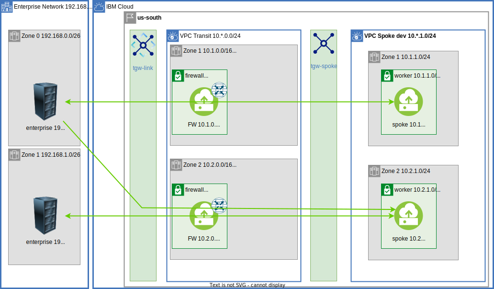

{:step: data-tutorial-type='step'}
{:shortdesc: .shortdesc}
{:new_window: target="_blank"}
{:codeblock: .codeblock}
{:screen: .screen}
{:tip: .tip}
{:pre: .pre}
{:important: .important}
{:note: .note}

# Build VPC Hub and Spoke and extended to On Premises via a Transit VPC
{: #vpc-transit}
{: toc-content-type="tutorial"}
{: toc-services="vpc, transit-gateway, direct-link, dns-svcs cloud-databases,databases-for-redis"}
{: toc-completion-time="2h"}

This tutorial may incur costs. Use the [Cost Estimator](https://{DomainName}/estimator/review) to generate a cost estimate based on your projected usage.
{: tip}

The {{site.data.keyword.vpc_full}} (VPC) is used to securely manage network traffic in the {{site.data.keyword.cloud_notm}}.  VPCs can also be used as a way to encapsulate functionality.  The VPCs can be connected to each other and to on premises.

{: class="center"}
{: style="text-align: center;"}


A hub and spoke model connects multiple VPCs via {{site.data.keyword.tg_short}} and to on premises using {{site.data.keyword.BluDirectLink}}.  Each spoke could be managed by a different team perhaps in a different account.  The isolation and connectivity support a number of scenarios:

- The hub can be the respository for shared microservices used by spokes
- The hub can be the repository for shared cloud resources, like databases, accessed through [virtual private endpoint gateways](https://{DomainName}/docs/vpc?topic=vpc-about-vpe) controlled with VPC security groups and subnet access control lists, shared by spokes.
- The hub can be a central point of traffic routing between on premises and the cloud.
- Enterprise to cloud traffic can be routed, monitored, and logged through a Virtual Network Function, VNF, appliance in the hub
- The hub can also can monitor all or some of the traffic - spoke <-> spoke, spoke <-> transit, or spoke <-> enterprise.
- The hub can hold the VPN resources that are shared by the spokes.

This solution tutorial will walk through communication paths in a hub and spoke VPC model.  There is a companion [GitHub repository](https://github.com/IBM-Cloud/vpc-transit) that divides the connectivity into a number of incremental layers.  It is typical for an organization to use a subset of the layers. The thin layers focus in on bite size challenges and solutions.

 During the journey the follosing are explored:
- [{{site.data.keyword.tg_full_notm}}](https://www.ibm.com/cloud/transit-gateway)
- VPC egress and ingress routing
- Virtual Network Functions with optional Network Load Balancers to support high availability
- Virtual private endpoint gateways
- DNS resolution

A layered architecture will introduce resources and allow connectivity to be provided.  Each layer will add connectivity. The layers are implemented in terraform. It will be possible to change parameters, like number of zones, by changing a terraform variable.

This tutorial walks you through a complete example demonstrating the network connectivity, routing, DNS name resolution and other details that potentially need to be considered when stiching together multi VPC architectures.  A layered presentation approach allows you to pick and choose parts of this tutorial that might be applicable in your environment.
{: shortdesc}

## Objectives
{: #vpc-transit-objectives}

* todo
* Address micro-services by DNS name resolution using {{site.data.keyword.dns_short}}.
* Connect VPCs via {{site.data.keyword.tg_short}}.

There is a companion GitHub repository with instructions on how to build and test the architecture.  If follows the layers defined in this tutorial.  It allows you to demonstrate connectivity problems and solutions as layers are added.

## VPC Layout
{: #vpc-transit-layout}
{: step}

todo layer-background 
{: class="center"}
{: style="text-align: center;"}

The diagram above shows the VPC layout in more detail. The on premises is CIDR 192.168.0.0/16 and a zone within the enterprise is shown.  In the IBM Cloud there is a transit VPC and one spoke VPC (the other spokes are configured similarly).  The zones in a multi zone region (todo link mzr definition) are 10.0.0.0/16, 10.1.0.0/16, 10.2.0.0/16.  The transit VPC consumes CIDRs 10.*.0.0/24 or 10.0.0.0/24, 10.1.0.0/24 and 10.2.0.0/24 spoke 0 consumes 10.*.1.0/24 or CIDRs 10.0.1.0/24, 10.1.1.0/24 and 10.2.1.0/24.  It is tempting to divide up the CIDR space first by VPC but this complicates routing as we will see in later steps.

There are a few subnets in the the transit and spokes:
- workers - Worker subnets for load balancers, ROCS todo, VPC instances that each spoke group will be producing.
- firewall - firewall router.
- vpe - all of the Virtual Private Endpoint Gateways for private connectivity to cloud services.
- dns - For DNS locations (todo link).  The DNS location appliances managed by the DNS Service consume network interfaces in this subnet.

There is a companion [GitHub Repository](https://github.com/IBM-Cloud/vpc-transit) that can be used to follow along as the resources are created.  Clone and initialize the files **local.env** and **config_tf/terraform.tfvars**.  The APIKEY in local.env is a secret that should not be shared.  The config_tf/terraform.tfvars has an initial section that requires modification.

   ```sh
   git clone https://github.com/IBM-Cloud/vpc-transit
   cd vpc-transit
   cp template.local.env local.env
   vi local.env; # make the suggested change
   source local.env
   ```
   {: codeblock}

   ```
   cp config_tf/template.terraform.tfvars config_tf/terraform.tfvars
   vi config_tf/terraform.tfvars; # make the initial changes suggested
   ```
   {: codeblock}

Each section will apply one or more layers to the diagram.  You could cd into the directory and execute the terraform commands as shown for **config_tf**:

   ```sh
   cd config_tf
   terraform init
   terraform apply 
   cd ..
   ```
   {: codeblock}

Since it is important that each layer is installed in the correct order and some steps in this tutorial will install multiple layers a shell command **./apply.sh** is provided.  Try it out:

   ```sh
   ./apply.shp; # display help
   ```
   {: codeblock}

Results will look something like this indicating the order of execution.  You could apply all of the layers configured by execting `./apply.sh : :`.  The colons are shorthand for first (or config_tf) and last (vpe_spokes_tf).

   ```sh
   $ ./apply.sh : : -p
   directories: config_tf enterprise_tf transit_tf spokes_tf test_instances_tf transit_spoke_tgw_tf enterprise_link_tf firewall_tf all_firewall_tf spokes_egress_tf all_firewall_asym_tf dns_tf vpe_transit_tf vpe_spokes_tf vpe_dns_forwarding_rules_tf
   >>> success
   ```
   {: codeblock}

In this first step apply in config_tf, enterprise_tf, transit_tf and spokes_tf, to verify this and then do it try the following:

   ```sh
   ./apply.sh -p : spokes_tf
   ./apply.sh : spokes_tf
   ```
   {: codeblock}

## Testing
{: #vpc-transit-testing}
{: step}
VPC Virtual Server Instances, VSIs, can be provisioned to test the network connectivity. A test instance will be added to each of the worker subnets or one per zone in the enterprise, transit and each of the spokes.  If the default configuratio of 2 zones and 2 spokes is used then 8 instances will be provisioned.

   ```sh
   ./apply.sh test_instances_tf
   ```
   {: codeblock}

{: class="center"}
{: style="text-align: center;"}


The python py/test_transit.py pytest script tests the connectivity of the test instances.  Each test will ssh to one of the instances and perform different types of connectitiby tests using the instances.

Validation was done with python 3.10.7.  You can install and activate a virtual environment using the following steps.

   ```sh
   python -m venv venv --prompt transit_vpc; # install a python virtual environment with activiation prompt of transit_vpc
   source venv/bin/activate; # now pip and python will come from the virtual environment
   pip install --upgrade pip; # upgrade to latest version of pip
   pip install -r requirements.txt; #install dependencies
   ```
   {: codeblock}

Each time a fresh shell is initialized remember to activate the python virtual environment.  Do this now:
   ```sh
   source venv/bin/activate
   ```
   {: codeblock}

Run the test suite and notice that connectivity within a VPC is working but no cross VPC connectivity is working. 

   ```sh
   pytest -v
   ```
   {: codeblock}
   ```sh

Your output will resemble:
   ```sh
   ...
   py/test_transit.py::test_curl[tvpc-transit-z1-s0 (52.118.204.173) 10.1.0.4       -> tvpc-transit-z1-s0 10.1.0.4] PASSED              [ 11%]
py/test_transit.py::test_curl[tvpc-enterprise-z0-s0 (52.116.140.173) 192.168.0.4 -> tvpc-transit-z0-s0 10.0.0.4] FAILED              [ 13%]
py/test_transit.py::test_curl[tvpc-enterprise-z0-s0 (52.116.140.173) 192.168.0.4 -> tvpc-transit-z1-s0 10.1.0.4] FAILED              [ 14%]
   ...
   ... lots of stack traces
   ...
   FAILED py/test_transit.py::test_curl[tvpc-spoke1-z1-s0 (150.239.167.126) 10.1.2.4       -> tvpc-spoke0-z0-s0 10.0.1.4] - assert False
FAILED py/test_transit.py::test_curl[tvpc-spoke1-z1-s0 (150.239.167.126) 10.1.2.4       -> tvpc-spoke0-z1-s0 10.1.1.4] - assert False
=================================== 48 failed, 16 passed, 3 skipped, 18223 warnings in 203.68s (0:03:23) ===================================
   ```
   {: codeblock}

## Transit to Spokes via Transit Gateway
{: #vpc-transit-transit-to-spokes}
{: step}

Connect the spokes to each other and to the transit:

   ```sh
   ./apply.sh transit_spoke_tgw_tf
   ```
   {: codeblock}

{: class="center"}
{: style="text-align: center;"}

The diagram shows the Transit Gateway between the transit vpc and the spoke vpcs.  Running the tests will now demonstrate passing tests between the transit and the spokes.

   ```sh
   pytest -v
   ```
   {: codeblock}

## Enterprise to Transit via Direct Link and Transit Gateway
{: #vpc-transit-enterprise-to-transit}
{: step}
The enterprise to cloud tests are failing. [Direct Link](todo) is a high speed secure data path for connecting an enterprise to the IBM cloud.  Direct link can also be connected to a Transit Gateway for distribution.

The enterprise in this simulation is a VPC. The enterprise to VPC connection uses a Transit Gateway that will closely match a Direct Link connection.

   ```sh
   ./apply.sh enterprise_link_tf
   ```
   {: codeblock}

{: class="center"}
{: style="text-align: center;"}

The diagram had been enhanced to include the Direct Link simulation using Transit Gateway. Running the tests will now demonstrate passing tests between the enterprise and the transit.

## Enterprise to Spoke via Transit NFV Router
{: #vpc-transit-router}
{: step}

The incentive for a transit vpc for enterprise <-> cloud traffic is to have a central place to monitor, inspect, route and log traffic.  A firewall/routing appliance can be installed in the transit VPC. 

An off the shelf appliance can be used for a router.  There are many to choose from in the IBM Catalog.  A subnet has been created in each of the zones of the transit VPC to hold the firewall. 

### NFV Router
{: #vpc-transit-nfv-router}
The enterprise to spoke tests are failing.  Connectivity from the enterprise to a spoke is achieved through a Network Function Virtualization, [NFV](https://{DomainName}/docs/vpc?topic=vpc-about-vnf), router in the transit VPC.  Choose one from the catalog or bring your own.  This demonstration will use an Ubuntu stock image with a iptables set up to forward all packets from the source to destination.  No firewall inspection is performed.

The terraform configuration will be configure the firewall instance with [allow_ip_spoofing](https://{DomainName}/docs/vpc?topic=vpc-ip-spoofing-about).  You must [enable IP spoofing checks](https://{DomainName}/docs/vpc?topic=vpc-ip-spoofing-about#ip-spoofing-enable-check) before continuing.
{: note}


   ```sh
   ./apply.sh firewall_tf
   ```
   {: codeblock}

{: class="center"}
{: style="text-align: center;"}

The diagram shows the firewall routing appliance.  An ingress route table for Transit Gateways has been added to the transit VPC as indicated by the dotted lines.

### Ingress Routing
{: #vpc-transit-ingress-routing}
Traffic reaches the firewall routing appliance through routing tables.  Visit the [VPCs](https://{DomainName}/vpc-ext/network/vpcs) in the IBM Cloud Console.  Select the transit VPC and then click on **Manage routing tables** click on the **Ingress** routing table.

The next_hop firewall routers in the table below are 10.0.0.196 (Dallas 1) and 10.1.0.196 (Dallas 2). All ingress traffic for the transit VPC will remain in the same zone.

Zone is the transit zone determined by the Transit Gateway. The destination CIDR block will be in the enterprise range (192.168.*.*) when the source is a spoke or the cloud range (10.*.*.*) when the source is the enterprise.  Notice how wide the routes are

TODO update table
zone|destination|next_hop|note
--|--|--|--
Dallas 1|192.168.0.0/16|10.0.0.196|spoke to enterprise
Dallas 2|192.168.0.0/16|10.1.0.196|spoke to enterprise
Dallas 1|10.0.1.0/24|10.0.0.0.196|enterprise to spoke
Dallas 1|10.0.2.0/24|10.0.0.0.196|enterprise to spoke
Dallas 2|10.1.1.0/24|10.1.0.0.196|enterprise to spoke
Dallas 2|10.1.2.0/24|10.1.0.0.196|enterprise to spoke


### VPC Address Prefixes
{: #vpc-transit-vpc-address-prefixes}
The Transit Gateways learn routes to the attached VPCs through [VPC Address Prefixes](https://{DomainName}/docs/vpc?topic=vpc-vpc-addressing-plan-design).  But how does the spoke learn the route to the enterprise (192.168.0.0/16)?  By adding phantom VPC address prefixes to the transit VPC.

The transit VPC zone in the diagram has the additional address prefixes: 192.168.0.0/24 and 10.0.1.0/24.  Open the [VPCs](https://{DomainName}/vpc-ext/network/vpcs) in the Cloud Console and select the **transit VPC** and notice the Address prefixes disaplayed and find the additional address prefixes that have been added.

With these additional address prefixes the spoke VPCs learn that traffic destined to 192.168.0.0/16 should pass through the connected transit gateway.  Similary the enterprise learn that traffic destined to 10.*.1.0/24 should pass through its connected transit gateway.


### Transit Gateway Prefix Filters
{: #vpc-transit-transit-gateway-prefix-filters}
TODO remove
Additional address prefixes are required for routes to be advertised by the VPC but the transit gateway will report that there are conflicting routes.  For example the enterprise transit gateway sees 192.168.0.0/16 routes on both sides.  How does it know which ones to choose?

Clearly the desire is all traffic destined to 192.168.0.0/16 to flow to the enterprise.  [Prefix filters](https://{DomainName}/docs/transit-gateway?topic=transit-gateway-adding-prefix-filters are added to hide the routes.  
 
Open [Transit Gateway](https://{DomainName}/interconnectivity/transit) in the IBM Cloud Console and select the enterprise transit gateway. Notice the filter icon next to the transit VPC connection and click to open.  Click the **View** in the **Prefix filters** row.  Notice the **Deny** action for 192.168.0.0/16 that is shown in the diagram.  You can visit the other transit gateway if you wish.


### Testing enterprise <-> spoke
{: #vpc-transit-testing-enterperise-spoke}

Running the tests will demonstrate passing tests between the enterprise and the spokes within the same zone but new failures with transit -> enterprise.

## Stateful Routing and Direct Server Return
{: #vpc-transit-stateful-routing}
{: step}
The IBM VPC uses the industry standard state based routing for secuire TCP connection tracking.  This requires that the TCP connections use the same path on the way in as the way out.  One exception to this is Direct Server Return, DSR, todo link.  This allows incoming connections to pass through the fireweall to the transit test instance and then return directly to the originator.

todo add diagram with green

This does not help with the traffic originating in the transit test instance passing through the transit gateway then back through ingress routing to the firewall/router.  This connection will not complete.

One possible solution is to not send transit traffic through the firewall.  Essentially restore it back to the pre firewall configuration.  By adding the following routes to the transit vpc ingress route table:


zone|destination|next_hop|note
--|--|--|--
Dallas 1|10.0.0.0/24|Delegate|skip firewall for transit 
Dallas 2|10.1.0.0/24|Delegate|skip firewall for transit 
Dallas 3|10.2.0.0/24|Add if testing a 3 zone configuration

Optionally visit the [Routing tables for VPC](https://{DomainName}/vpc-ext/network/routingTables) in the IBM Cloud Console.  Select the **transit** vpc from the drop down and then select the **tgw-ingress** routing table.  Click **Create** to add each route.  **Delegate** will delegate to the default routing behavior for the matching CIDR block in the zone.

If you created the routes do not forget to remove them now before moving on to the next step.

An alternative solution which will be used here is to route the transit VPC test instance traffic through the firewall/router.

## Cross Zone and Asymmetric Routing
{: #vpc-transit-asymmetric}
{: step}

{: class="center"}
{: style="text-align: center;"}

### Asymmetric Routing Limitation
{: #vpc-transit-asymmeteric-routing-limitation}
The green connections are working. The blue line represents a TCP connection request flowing from an on premise zone through the transit gateway: 192.168.0.4 <--TCP--> 10.1.1.4.  The transit gateway will choose a transit VPC zone based on the address prefix in that zone.  The matching address prefix for 10.1.1.4 is 10.1.1.0/24 in the lower zone.

The red line represents the TCP connection response to 192.168.0.4.  The transit gateway delivers to the transit VPC using the matching address prefix 192.168.0.0/24 in the upper zone.  The IBM VPC uses the industry standard state based routing for secuire TCP connection tracking.  This requires that the TCP connection pass through the same firewall in both directions.  The VPC does not support tcp "Asymmetric Routing".

It is interesting to note that an attempt to ping using the ICMP protocol would not suffer from this limitation.  ICMP does not require a stateful connection.  Connectivity from 192.168.0.4 <--ICMP--> 10.1.1.4 via ICMP is possible.  You can run the ping marked tests to verify:

   ```sh
   pytest -m ping
   ```
   {: codeblock}

If the goal is to create an architecture that is resiliant across IBM Cloud zonal failures then cross zone traffic should generally be avoided.  Routing on the enterprise could insure that all traffic destined to the cloud be organized and routed to avoid the cross zone traffic in the cloud.

### Spoke Egress routing
{: #vpc-transit-spoke-egress-routing}
{: class="center"}
{: style="text-align: center;"}

It is possible to work around this cross zone limiation by using egress routing in the spokes.  In the diagram this is represented by the egress dashed line.

   ```sh
   ./apply.sh spokes_egress_tf
   ```
   {: codeblock}

Visit the [VPCs](https://{DomainName}/vpc-ext/network/vpcs) in the IBM Cloud Console.  Select one of the spoke VPCs and then click on **Manage routing tables** click on the **Egress** routing table directing all egress traffic in Dallas 1 should be directed to 10.0.0.196 in Dallas 1.  With this change spoke traffic originating in Dallas 2 remains in Dallas 2 in the transit VPC.

zone|destination|next_hop|note
--|--|--|--
Dallas 1|192.168.0.0/16|10.0.0.196|spoke to enterprise
Dallas 2|192.168.0.0/16|10.1.0.196|spoke to enterprise


Run `pytest -v` and verify that all tests are now passing.


## More Firewall Protection
{: #vpc-transit-firewall}
{: step}
Currently enterprise <-> spoke traffic is flowing through the transit router/firewall.  It is not unusual to require spoke <-> spoke traffic and transit <-> spoke traffic to flow through the firewall.
Due to direct service return currently transit -> enterprise traffic is also not flowing through the firewall.

### Route Spoke and Transit to the firewall
{: #vpc-transit-route-spoke-and-transit-to-firewall}
Routing all cloud traffic originating at the spokes through the firewall is accomplished by these routing table routes in the spokes:

zone|destination|next_hop
--|--|--
Dallas 1|10.0.0.0/8|10.0.0.196
Dallas 2|10.0.0.0/8|10.1.0.196
Dallas 3|10.0.0.0/8|10.1.0.196

Routing all cloud traffic originating at the transit through the firewall is accomplished by these routing table routes in the transit:

zone|destination|next_hop
--|--|--
Dallas 1|10.0.0.0/8|10.0.0.196
Dallas 2|10.0.0.0/8|10.1.0.196
Dallas 3|10.0.0.0/8|10.1.0.196

Typically there is no reason to send the inter spoke traffic through the firewall, so additional more specific routes can be added to delegate.  For example in spoke 0, which has the CIDR ranges: 10.0.1.0/24, 10.1.1.0/24, 10.2.1.0/24:


### Do not route Inter Zone and Inter Spoke traffic to the firewall
{: #vpc-transit-do-not-route-inter-zone-to-firewall}
zone|destination
--|--|--
Dallas 1|10.0.0.0/24
Dallas 1|10.1.0.0/24
Dallas 1|10.2.0.0/24
Dallas 2|10.0.0.0/24
Dallas 2|10.1.0.0/24
Dallas 2|10.2.0.0/24
Dallas 3|10.0.0.0/24
Dallas 3|10.1.0.0/24
Dallas 3|10.2.0.0/24

Similarly routing the transit VPC through the firewall is done by adding additional routes to the egress route table attached to the subnets in the transit VPC.  All egress traffic in the transit VPC is directed to the firewall in the originator's zone.  For example a test instance 10.0.0.4 attempting contact with 192.168.1.4 will be sent through the firewall in us-south-1, 10.0.0.196.

zone|destination|next_hop
--|--|--|--
Dallas 1|10.0.0.0/8|10.0.0.0.196
Dallas 2|10.1.0.0/8|10.1.0.0.196
Dallas 3|10.2.0.0/8|10.2.0.0.196
Dallas 1|192.168.0.0/16|10.0.0.0.196
Dallas 2|192.168.1.0/16|10.1.0.0.196
Dallas 3|192.168.2.0/16|10.2.0.0.196

This will also send transit to transit traffic through the firewall.  This is generally not required.  The traffic flowing into the transit VPC should pass through the firewall.  This can be disabled by delegating the following routes:

zone|destination
--|--|--|--
Dallas 1|10.0.0.0/24
Dallas 2|10.0.0.0/24
Dallas 3|10.0.0.0/24
Dallas 1|10.1.0.0/24
Dallas 2|10.1.0.0/24
Dallas 3|10.1.0.0/24
Dallas 1|10.2.0.0/24
Dallas 2|10.2.0.0/24
Dallas 3|10.2.0.0/24

### Apply and Test More Firewall
{: #vpc-transit-apply-and-test-more-firewall}
   ```sh
   ./apply.sh all_firewall.tf
   ```
   {: codeblock}

What about the firewall itself?  This was not mentioned earlier but in anticipation of this change there was a egress_delegate router created in the transit vpc that delegates routing to the default for all destinations.  It is only associated with the firewall subnets so the firewall is not effected by the changes to the default egress routing table used by the other subnets.  Check the routing tables for the transit VPC for more details.

With these changes the transit <-> (enterprise, transit, spokes) are all working.  Only the enterperprise <-> spoke cross zone tests are failing.

   ```sh
   pytest -v -m curl
   ```
   {: codeblock}

All the tests are now passing except the cross zone tests transit <-> spoke and spoke <-> spoke.  

### Optionally fix cross zone routing
{: #vpc-transit-optionally-fix-cross-zone-routing}

As mentioned earlier for a system to be resiliant across zonal failures it is best to eliminate cross zone traffic. If it is required additional egress routes can be added.  The problem for spoke to spoke traffic is shown in this diagram

{: class="center"}
{: style="text-align: center;"}


The green path is an example of the originator spoke0 10.0.1.4 routing to 10.1.2.4.  The matching egress route is:

zone|destination|next_hop
--|--|--
Dallas 2|10.0.0.0/8|10.1.0.196

Which the is the firewall in the middle zone of the diagram.  On the return path the lower zone is selected.

To fix this a few more specific routes need to be added to force the upper zones to route to the lower zones.  The return trip will then .  For the transit and each of the spokes the following routes have been added:

zone|destination|next_hop
--|--|--
Dallas 2|10.0.0.0/16|10.0.0.196
Dallas 3|10.0.0.0/16|10.0.0.196
Dallas 3|10.1.0.0/16|10.1.0.196

   ```sh
   ./apply.sh all_firewall_asym_tf
   ```
   {: codeblock}

## Firewall and High Availability
{: #vpc-transit-firewall-and-high-availability}
{: step}
To prevent a firewall from becoming a single point of failure it is possible to add a VPC Network Load Balancer to distribute traffic to the zonal firewalls.

{: class="center"}

This diagram shows a single zone with a network load balancer fronting two firewalls. To optionally see this constructed it is required to change the configuration and apply again. 


config_tf/terraform.tfvars:
   ```sh
   firewall                     = true
   firewall_lb                  = true
   number_of_firewalls_per_zone = 2
   ```
   {: codeblock}

   ```sh
   vi config_tf/terraform.tfvars; # make the above changes
   ```
   {: codeblock}

This change results in the IP address of the firewall changing from the firewall instance used earlier to the IP address of the network load balancer.  This will need to be applied to a number of VPC route table routes in the transit and spoke vpcs.  It is best to start over:


   ```sh
   ./apply.sh : all_firewall_asym_tf
   ```
   {: codeblock}


## DNS
{: #vpc-transit-dns}
{: step}
{: class="center"}
{: style="text-align: center;"}

The DNS service is used to provie names to IP addresses.
If a single DNS service for the cloud would meet your isolation needs it is a simpler solution.
In this example a DNS service is created for the transit and each of the spokes to provide isolation between teams.  DNS ....

{: class="center"}
{: style="text-align: center;"}

### DNS Resources
{: #vpc-transit-dns-resources}
Create the dns services and add a DNS zone for each VPC and an A record for each of the test instances:

   ```sh
   ./apply.sh dns_tf
   ```
   {: codeblock}

Open the [Resources](https://{DomainName}/resources) in the IBM Cloud Console.  Open the **Networking** section and notice the **DNS Services**.  Open the **x-spoke0** instance.  Click the **x-spoke0.com** DNS zone.  Notice the A records associated with the test instances that are in the spoke instance.  Optional explore the other DNS instances and find similarly named DNS zones and A records for the other test instances.

Click on the **Custom resolver** tab on the left and notice the forwarding rules.

### DNS Forwarding
{: #vpc-transit-dns-forwarding}
Separate DNS instances learn each other's DNS names with forwarding rules.  In the diagram there are arrows that indicate a forwarding rule.  The associated table indicates when the forwarding rule will be used.  Starting on the left notice that the enterprise DNS forwarding rule will look to the transit for the DNS zones: x-transit.com, x-spoke0.com, and x-spoke1.com.

The tranit DNS instance can resolve x-transit.com and has forwarding rules to the spokes to resolve the rest.  Similarly the spokes rely on the transit DNS instance to resolve the enterprise, transit and the other spokes.

You can verify these forwarding rules in the IBM Cloud Console in the **Custom resolver** tab in each of the DNS instances.  After locating the custom resolve click to open then click **Forwarding rules** tab.

### DNS Testing
{: #vpc-transit-dns-testing}

There are now a set of **curl DNS** tests that have been made available in type pytest script.  These tests will curl using the DNS name of the remote.


   ```sh
   pytest -v -m dns
   ```
   {: codeblock}


## Virtual Private Endpoint Gateways
{: #vpc-transit-VPE}
{: step}

{: class="center"}

{: style="text-align: center;"}
VPC allows private access to IBM Cloud Services through Virtual Private Endpoint Gateways, VPEs, todo link.  Network access to VPE is controlled with Security Groups and subnet Access Control Lists just like a VSI

Create the VPEs for the transit and the spokes:

   ```sh
   ./apply.sh vpe_transit_tf vpe_spokes_tf
   ```
   {: codeblock}

There are now a set of **vpe**  and **vpedns**tests that have been made available in type pytest script.  These vpedns test will verify that the DNS name of a redis instance is within the private CIDR block. The vpe test will exectute a **redli** command to access redis remotely.


   ```sh
   pytest -v -m vpedns -m vpe
   ```
   {: codeblock}

## Routing Considerations for Virtual Private Endpoint Gateways
{: #vpc-transit-VPE-routing}
{: step}
You will notice that there are some cross zone connection problems.  These are expected.


## Production Notes
{: #vpc-transit-production-notes}
More detailed notes for production environments can be found in the todo link.

Some obvious changes to make:
- CIDR blocks were chosen for clarity and ease of explination.  The Availability Zones in the Multizone Region could be 10.0.0.0/10, 10.4.0.0/10, 10.8.0.0/10 to conserve address space.  Similarly the address space for Worker nodes could be expanded at the expense of firewall, DNS and VPE space.
- Security Groups for each of the network interfaces for worker VSIs, Virtual Private Endpoint Gateways, DNS Locations and firewalls should all be carefully considered
- Network Access Control Lists for each subnet should be carefull considered
- 

DNS
The appliances are used as both DNS resolvers used by remote DNS servers and DNS forwarders.


## Remove resources
{: #vpc-transit-remove-resources}
{: #vpc-tg-dns-iam-remove_resource}

1. Destroy the resources. You can cd to the team directories in order, and execute `source local.env; terraform destroy`.  The order is application2, application1, shared, network, admin. There is also a script that will do this for you:

   ```sh
   cd ..
   ./bin/destroy.sh
   ```
   {: codeblock}

## Expand the tutorial
{: #vpc-transit-expand-tutorial}

Flow Logs
Multi account


## Conclusions
{: #vpc-transit-conclusions}

The architecture of a system is influenced by the containment and ownership of cloud resources. It is important for architects from all aspects of the system contribute their concerns to the architecture. Each team needs the ability to control the resources they produce and release. Isolation will reduce the likelihood of problems and contain the blast radius when problems occur.

## Related content
{: #vpc-transit-related}

Flow Logs
* Tutorial: [Best practices for organizing users, teams, applications](https://{DomainName}/docs/solution-tutorials?topic=solution-tutorials-users-teams-applications#users-teams-applications)
* [Public frontend and private backend in a Virtual Private Cloud](https://{DomainName}/docs/solution-tutorials?topic=solution-tutorials-vpc-public-app-private-backend),
* [Deploy a LAMP stack using Terraform](https://{DomainName}/docs/solution-tutorials?topic=solution-tutorials-lamp-stack-on-vpc)

Network Function Virtualization
https://www.ibm.com/cloud/blog/network-function-virtualization-nfv-using-vpc-routing

  See [Private hub and spoke with transparent VNF and spoke-to-spoke traffic Figure](https://{DomainName}/docs/vpc?topic=vpc-about-vnf-ha) for some additional information.
