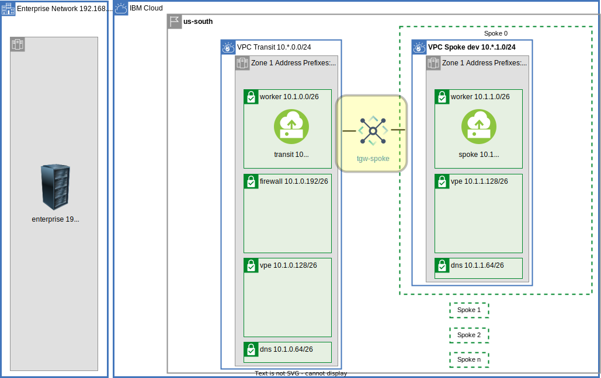
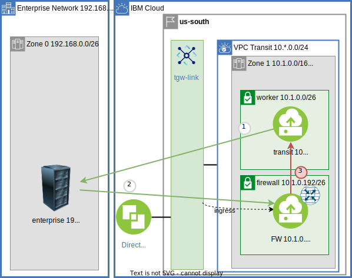

{:step: data-tutorial-type='step'}
{:shortdesc: .shortdesc}
{:new_window: target="_blank"}
{:codeblock: .codeblock}
{:screen: .screen}
{:tip: .tip}
{:pre: .pre}
{:important: .important}
{:note: .note}

# Centralize communication through a VPC Transit Hub and Spoke architecture - Part 1
{: #vpc-transit1}
{: toc-content-type="tutorial"}
{: toc-services="vpc, transit-gateway, direct-link, dns-svcs, cloud-databases, databases-for-redis"}
{: toc-completion-time="2h"}

This tutorial may incur costs. Use the [Cost Estimator](https://{DomainName}/estimator/review) to generate a cost estimate based on your projected usage.
{: tip}

A {{site.data.keyword.vpc_full}} (VPC) provides the network isolation and security in the {{site.data.keyword.cloud_notm}}. A VPC can be a building block that encapsulates a corporate division (marketing, development, accounting, ...) or a collection of microservices owned by a DevSecOps team.  VPCs can be connected to an on premises enterprise and to each other.  This tutorial will walk through the implementation of a hub and spoke architecture depicted in this high level view:
{: shortdesc}

{: class="center"}
{: style="text-align: center;"}

This is part one of a two part tutorial ([part two](docs/solution-tutorials?topic=solution-tutorials-vpc-transit2)).  This part will introduce the VPC transit hub as the conduit to the enterprise.  Enterprise to spoke VPC connectivity between microservices will be discussed and implemented.  This architecture will support a number of scenarios.
{: shortdesc}

- The hub can be a central point of traffic routing between enterprise and the cloud.
- Enterprise to cloud traffic can be routed, monitored, and logged through Network Function Virtualization (NFV) appliance in the hub.
- The hub can monitor all or some of the traffic - spoke <-> spoke, spoke <-> transit, or spoke <-> enterprise.
- The hub can be the repository for shared microservices used by spokes.
- The hub can be the repository for shared cloud resources, like databases, accessed through [virtual private endpoint gateways](https://{DomainName}/docs/vpc?topic=vpc-about-vpe) controlled with VPC security groups and subnet access control lists, shared by spokes.
- The hub can hold the VPN resources that are shared by the spokes.

There is a companion [GitHub repository](https://github.com/IBM-Cloud/vpc-transit) that provisions resources and configures routing in incremental layers.  In the tutorial thin layers enable the introduction of bite size challenges and solutions.

 During the journey the following are explored:
- [{{site.data.keyword.tg_full_notm}}](https://www.ibm.com/cloud/transit-gateway).
- [VPC Network planning](/docs/vpc?topic=vpc-vpc-addressing-plan-design)
- [VPC egress and ingress routing](/docs/vpc?topic=vpc-about-custom-routes)
- Connectivity via [{{site.data.keyword.BluDirectLink}}](https://www.ibm.com/cloud/direct-link)
- Connectivity via [{{site.data.keyword.tg_short}}](https://www.ibm.com/cloud/transit-gateway)
- [Virtual Network Functions with optional Network Load Balancers to support high availability](/docs/vpc?topic=vpc-about-vnf-ha)


A layered architecture will introduce resources and demonstrate connectivity. Each layer will add additional connectivity and resources.  A layer may introduce small problems and demonstrate solutions in the context of a larger architecture.  The layers are implemented in terraform. It will be possible to change parameters, like number of zones, by changing a terraform variable.
## Objectives
{: #vpc-transit-objectives}

* Understand the concepts behind a VPC based hub and spoke model.
* Understand the implementation of a firewall-router and a transit VPC environment.
* Understand VPC ingress and egress routing.
* Identify and optionally resolve asymmetric routing issues.
* Connect VPCs via {{site.data.keyword.tg_short}}.

## Before you begin
{: #vpc-transit-prereqs}

This tutorial requires:
* `Terraform CLI` to run the Terraform commands.
* Python to optionally run the pytest commands.
* Firewall-router will require that you [enable IP spoofing checks](https://{DomainName}/docs/vpc?topic=vpc-ip-spoofing-about#ip-spoofing-enable-check).
* An SSH key to connect to the virtual servers. If you don't have an SSH key, see [the instructions](/docs/vpc?topic=vpc-ssh-keys) for creating a key for VPC. 

See the [prerequisites](https://github.com/IBM-Cloud/vpc-transit#prerequisites) for options to install the prerequisites.

In addition:

- Check for user permissions. Be sure that your user account has sufficient permissions to create and manage all the resources in this tutorial.

## IP Address and Subnet Layout
{: #vpc-transit-ip-address-and-subnet-layout}

In this step provision the VPC network resources.  It is important to carefully plan when [designing an addressing plan for a VPC](/docs/vpc?topic=vpc-vpc-addressing-plan-design).  Make sure to use non overlapping CIDR blocks.

It is tempting to divide up the CIDR space first by VPC but this complicates routing.  Instead think of an availability zone as a single CIDR block and each VPC as consuming a slice of each of the zones.  The zones in a Multizone Region (MZR) provide physical, power and network isolation.  Communication within a zone is higher throughput and lower latency.

{: class="center"}
{: style="text-align: center;"}

This diagram shows just zone 1 in more detail.  The subnet sizes and layout are identical in the other zones:

{: class="center"}
{: style="text-align: center;"}

Above the enterprise is on the left and the cloud-{{site.data.keyword.cloud_notm}} on the right.  In the {{site.data.keyword.cloud_notm}} a single zone for the transit VPC and Spoke 0.  Notice the CIDR blocks do not overlap and VPCs all consume a CIDR block in each zone:
- The on premises CIDR is 192.168.0.0/16.
- The zones in this [multi zone region](https://{DomainName}/docs/overview?topic=overview-locations) are 10.\*.0.0/16.  The second digit: 1, 2, 3 is the zone number (shown for Dallas/us-south):
   - 10.1.0.0/16, zone 1, Dallas 1, us-south-1.
   - 10.2.0.0/16, zone 2, Dallas 2, us-south-2.
   - 10.3.0.0/16, zone 3, Dallas 3, us-south-3.
- The transit VPC consumes CIDRs 10.\*.0.0/24:
   - 10.1.0.0/24, zone 1.
   - 10.2.0.0/24, zone 2.
   - 10.3.0.0/24, zone 3.
- Spoke 0 consumes 10.\*.1.0/24 or CIDRs:
   - 10.1.1.0/24, zone 1.
   - 10.2.1.0/24, zone 2.
   - 10.3.1.0/24, zone 3.
- The zone box within a VPC shows the Address Prefix.  In the transit for zone 1 this is 10.1.0.0/16 overlaps with the spokes and seems incorrect.  CIDR 10.1.0.0/24 more accurately describes the transit VPC zone.  This is a routing requirement that will be discussed in a later section.
- The subnet CIDRs further divide the /24 into /26.

The subnets in the transit and spoke are for the different resources:
- worker - network accessible compute resources VPC instances, load balancers, [{{site.data.keyword.redhat_openshift_notm}}](https://www.ibm.com/cloud/openshift), etc.  VPC instances are demonstrated in this tutorial.
- dns - {{site.data.keyword.dns_short}} location appliances.  See [working with custom resolvers](/docs/dns-svcs?topic=dns-svcs-custom-resolver&interface=ui).
- vpe - [{{site.data.keyword.vpe_short}}](/docs/vpc?topic=vpc-about-vpe) for private connectivity to cloud services.
- firewall - firewall-router VPC instances.

## Provision VPC network resources
{: #vpc-transit-provision-vpc-network-resources}
{: step}

1. The companion [GitHub Repository](https://github.com/IBM-Cloud/vpc-transit) has the source files to implement the architecture.  In a desktop shell clone the repository:
   ```sh
   git clone https://github.com/IBM-Cloud/vpc-transit
   cd vpc-transit
   ```
   {: codeblock}

1. The config_tf directory contains configuration variables that you are required to configure.

   ```sh
   cp config_tf/template.terraform.tfvars config_tf/terraform.tfvars
   ```
   {: codeblock}

1. Edit **config_tf/terraform.tfvars**.

1. Since it is important that each layer is installed in the correct order and some steps in this tutorial will install multiple layers a shell command **./apply.sh** is provided.  The following will display help:

   ```sh
   ./apply.sh
   ```
   {: codeblock}

1. You could apply all of the layers configured by executing `./apply.sh : :`.  The colons are shorthand for first (or config_tf) and last (vpe_dns_forwarding_rules_tf).  The **-p** prints the layers:

   ```sh
   ./apply.sh : : -p
   ```
   {: codeblock}

   It will look something like:
   ```sh
   directories: config_tf enterprise_tf transit_tf spokes_tf test_instances_tf transit_spoke_tgw_tf enterprise_link_tf firewall_tf all_firewall_tf spokes_egress_tf all_firewall_asym_tf dns_tf vpe_transit_tf vpe_spokes_tf vpe_dns_forwarding_rules_tf
   ```

1. If you don't already have one, obtain a [Platform API key](https://{DomainName}/iam/apikeys) and export the API key for use by terraform:

   ```sh
   export IBMCLOUD_API_KEY=YourAPIKEy
   ```
   {: codeblock}


3. In this first step apply in config_tf, enterprise_tf, transit_tf and spokes_tf.  First use the -p to see what it will do:

   ```sh
   ./apply.sh -p : spokes_tf
   ```
   {: codeblock}

4. Now do it:

   ```sh
   ./apply.sh : spokes_tf
   ```
   {: codeblock}

## Create test instances
{: #vpc-transit-create-test-instances}
{: step}

VPC Virtual Server Instances, VSIs, are provisioned to test the network connectivity. A test instance will be added to each of the worker subnets (one per zone) in the enterprise, transit and each of the spokes.  If the default configuration of 3 zones and 2 spokes is used then 12 instances will be provisioned.

{: class="center"}
{: style="text-align: center;"}

Create the test instances

   ```sh
   ./apply.sh test_instances_tf
   ```
   {: codeblock}

It can be enlightening to explore the resources created at each step in the {{site.data.keyword.cloud_notm}} console.  Optionally open the [Virtual Private Clouds](https://{DomainName}/vpc-ext/network/vpcs).  On the left click on the **Virtual server instances** and notice the instances that were created.

## Testing
{: #vpc-transit-testing}
{: step}

This tutorial will add communication paths a layer at a time.  A pytest test suite exhaustively tests communication paths.  By the end of the tutorial all of the tests will pass.

It is not required for the reader to use pytest to verify the results.  Follow along in the tutorial, apply the layers, and trust the results described in the tutorial. The reader can still explore the VPC resources like VSIs, subnets and route tables after they are created.
{: note}

Each pytest test will ssh to one of the test instances and perform a type of connectivity test, like executing a `curl` command to one of the other instances.  The default ssh environment is used to log into the test instances.  If you see unexpected test results try the [pytest troubleshooting](https://github.com/IBM-Cloud/vpc-transit#pytest-troubleshooting) section.

1. Run the zone 1 curl tests in the suite my using the **-m** (markers) flag.  Choose the tests marked with **curl**, **lz1** (left zone 1) and **rz1** (right zone 1).

   **Expected:** Connectivity within a VPC, like enterprise <-> enterprise pass.  Cross VPC, like enterprise -> transit, fail.

   ```sh
   pytest -m "curl and lz1 and rz1"
   ```
   {: codeblock}

   Below is example output:
   ```sh

   root@ac4518168076:/usr/src/app# pytest -m "curl and lz1 and rz1"
   ================================= test session starts ==================================
   platform linux -- Python 3.11.1, pytest-7.2.1, pluggy-1.0.0 -- /usr/local/bin/python
   cachedir: .pytest_cache
   rootdir: /usr/src/app, configfile: pytest.ini, testpaths: py
   collected 292 items / 276 deselected / 16 selected
   
   py/test_transit.py::test_curl[l-enterprise-z1 -> r-enterprise-z1] PASSED         [  6%]
   py/test_transit.py::test_curl[l-enterprise-z1 -> r-transit-z1] FAILED            [ 12%]
   py/test_transit.py::test_curl[l-enterprise-z1 -> r-spoke0-z1] FAILED             [ 18%]
   py/test_transit.py::test_curl[l-enterprise-z1 -> r-spoke1-z1] FAILED             [ 25%]
   py/test_transit.py::test_curl[l-transit-z1    -> r-enterprise-z1] FAILED         [ 31%]
   py/test_transit.py::test_curl[l-transit-z1    -> r-transit-z1] PASSED            [ 37%]
   py/test_transit.py::test_curl[l-transit-z1    -> r-spoke0-z1] FAILED             [ 43%]
   py/test_transit.py::test_curl[l-transit-z1    -> r-spoke1-z1] FAILED             [ 50%]
   py/test_transit.py::test_curl[l-spoke0-z1     -> r-enterprise-z1] FAILED         [ 56%]
   py/test_transit.py::test_curl[l-spoke0-z1     -> r-transit-z1] FAILED            [ 62%]
   py/test_transit.py::test_curl[l-spoke0-z1     -> r-spoke0-z1] PASSED             [ 68%]
   py/test_transit.py::test_curl[l-spoke0-z1     -> r-spoke1-z1] FAILED             [ 75%]
   py/test_transit.py::test_curl[l-spoke1-z1     -> r-enterprise-z1] FAILED         [ 81%]
   py/test_transit.py::test_curl[l-spoke1-z1     -> r-transit-z1] FAILED            [ 87%]
   py/test_transit.py::test_curl[l-spoke1-z1     -> r-spoke0-z1] FAILED             [ 93%]
   py/test_transit.py::test_curl[l-spoke1-z1     -> r-spoke1-z1] PASSED             [100%]
   
   =============================== short test summary info ================================
   FAILED py/test_transit.py::test_curl[l-enterprise-z1 -> r-transit-z1] - assert False
   FAILED py/test_transit.py::test_curl[l-enterprise-z1 -> r-spoke0-z1] - assert False
   FAILED py/test_transit.py::test_curl[l-enterprise-z1 -> r-spoke1-z1] - assert False
   FAILED py/test_transit.py::test_curl[l-transit-z1    -> r-enterprise-z1] - assert False
   FAILED py/test_transit.py::test_curl[l-transit-z1    -> r-spoke0-z1] - assert False
   FAILED py/test_transit.py::test_curl[l-transit-z1    -> r-spoke1-z1] - assert False
   FAILED py/test_transit.py::test_curl[l-spoke0-z1     -> r-enterprise-z1] - assert False
   FAILED py/test_transit.py::test_curl[l-spoke0-z1     -> r-transit-z1] - assert False
   FAILED py/test_transit.py::test_curl[l-spoke0-z1     -> r-spoke1-z1] - assert False
   FAILED py/test_transit.py::test_curl[l-spoke1-z1     -> r-enterprise-z1] - assert False
   FAILED py/test_transit.py::test_curl[l-spoke1-z1     -> r-transit-z1] - assert False
   FAILED py/test_transit.py::test_curl[l-spoke1-z1     -> r-spoke0-z1] - assert False
   =============== 12 failed, 4 passed, 276 deselected in 72.80s (0:01:12) ================
   ```
   {: codeblock}

A change to the network configuration can take a couple of test runs for the underlying VPC network system to become consistent.  If you do not see the expected results initially be prepared to run the test again a couple of times.
{: note}

The **r-** and **l-** stand for **r**ight and **l**eft.  The middle part of the name identifies enterprise, transit, spoke0, spoke1, ... The z1, z2, ... identify the zone. The test will ssh to the left instance.  On the left instance the connectivity to the right instance is attempted.  The **test_curl** performs a curl connectivity on the left instance to the right instance.

The test `test_curl[l-enterprise-z1 -> r-transit-z1]`:
1. ssh to a test instance in enterprise zone 1
2. execute a curl to transit zone 1
3. assert the return string contains the ID of transit zone 1 to mark pass or fail

The **README.md** in the comp companion [GitHub Repository](https://github.com/IBM-Cloud/vpc-transit) has more details and the source code.


## Connect Transit and Spokes via Transit Gateway
{: #vpc-transit-transit-to-spokes}
{: step}

Provision a {{site.data.keyword.tg_full_notm}} to connect the transit <-> spoke and spoke <-> spoke.

{: class="center"}
{: style="text-align: center;"}

1. Apply the layer:

   ```sh
   ./apply.sh transit_spoke_tgw_tf
   ```
   {: codeblock}

1. Run the zone 1 curl tests in the suite my using the **-m** (markers) to select tests marked with **curl**, **lz1** (left zone 1) and **rz1** (right zone 1).

   **Expected:** Connectivity within a VPC, transit <-> spoke, and spoke <-> spoke pass.  Connectivity to/from enterprise fails.

   ```sh
   pytest -m "curl and lz1 and rz1"
   ```
   {: codeblock}

## Connect Enterprise to Transit via Direct Link and Transit Gateway
{: #vpc-transit-enterprise-to-transit}
{: step}

Provision a {{site.data.keyword.BluDirectLink}} using {{site.data.keyword.tg_short}}.

{: class="center"}
{: style="text-align: center;"}


{{site.data.keyword.dl_full}} is a high speed secure data path for connecting an enterprise to the {{site.data.keyword.cloud_notm}}. In this tutorial {{site.data.keyword.tg_short}} is used for distribution.  The use of {{site.data.keyword.tg_short}} is optional for an on premises connection.

The enterprise in this simulation is a VPC.  Connecting via {{site.data.keyword.tg_short}} will ensure an experience very close to {{site.data.keyword.dl_short}}.

1. Apply the enterprise_link_tf layer:
   ```sh
   ./apply.sh enterprise_link_tf
   ```
   {: codeblock}

1. Run the zone 1 curl tests in the suite my using the **-m** (markers) flag.  Choose the tests marked with **curl**, **lz1** (left zone 1) and **rz1** (right zone 1).

   **Expected:** Connectivity within a VPC, transit <-> spoke, enterprise <-> transit, spoke <-> spoke pass but enterprise <-> spoke fail.

   ```sh
   pytest -m "curl and lz1 and rz1"
   ```
   {: codeblock}

## Connect Enterprise to Spoke via Transit NFV Firewall-Router
{: #vpc-transit-router}
{: step}

The incentive for a transit VPC for enterprise <-> cloud traffic is typically to route, inspect, monitor and log network traffic.  In this step a firewall-router appliance will be installed in each zone of the transit VPC.

### NFV Router
{: #vpc-transit-nfv-router}
Provision the firewall-router appliances.  An ingress route table for Transit Gateways has been added to the transit VPC as indicated by the dotted lines.  A subnet has been created in each of the zones of the transit VPC to hold the firewall-router. 

{: class="center"}
{: style="text-align: center;"}

Connectivity from the enterprise to a spoke is achieved through a Network Function Virtualization, [NFV](https://{DomainName}/docs/vpc?topic=vpc-about-vnf), firewall-router instance in the transit VPC.  In production you can choose one from the catalog or bring your own.  This demonstration will use an Ubuntu stock image with kernel iptables set up to forward all packets from the source to destination.  No firewall inspection is performed.

The terraform configuration will configure the firewall-router instance with [allow_ip_spoofing](https://{DomainName}/docs/vpc?topic=vpc-ip-spoofing-about).  You must [enable IP spoofing checks](https://{DomainName}/docs/vpc?topic=vpc-ip-spoofing-about#ip-spoofing-enable-check) before continuing.
{: note}

1. Apply the firewall_tf layer:
   ```sh
   ./apply.sh firewall_tf
   ```
   {: codeblock}

1. Run the test suite.
   **Expected:** Connectivity within a VPC, enterprise -> transit, enterprise <-> spoke same zone pass.  But transit -> spoke, transit -> enterprise and enterprise <--> spoke cross zone fail.

   ```sh
   pytest -m "curl and lz1 and (rz1 or rz2)"
   ```
   {: codeblock}

### Ingress Routing
{: #vpc-transit-ingress-routing}
Traffic reaches the firewall-router appliance through routing tables.
1. Visit the [VPCs](https://{DomainName}/vpc-ext/network/vpcs) in the {{site.data.keyword.cloud_notm}} console.
1. Select the transit VPC.
1. Click on **Manage routing tables**.
1. Click on the **tgw-ingress** routing table.

The zone is determined by the Transit Gateway which will examine the destination IP address of each packet and route it to the matching zone based on VPC Address Prefixes discussed in the next section.

Notice how wide the routes are in the transit's ingress routing table (shown for Dallas/us-south):

Zone|Destination|Next hop
--|--|--
Dallas 1|0.0.0.0/0|10.1.0.196
Dallas 2|0.0.0.0/0|10.2.0.196
Dallas 3|0.0.0.0/0|10.3.0.196

The next_hop identifies the firewall-router.  In the table above 10.1.0.196 zone Dallas 1 and 10.2.0.196 zone Dallas 2, etc.  You can observe this using the {{site.data.keyword.cloud_notm}} console.

1. Open [Virtual server instances for VPC](https://{DomainName}/vpc-ext/compute/vs) to find the **fw** instances and associated **Reserved IP** (click the **Name** column header to sort).
1. Match them up with the table above to verify the next hop relationship.

### VPC Address Prefixes
{: #vpc-transit-vpc-address-prefixes}
Transit Gateways learn routes in the attached VPCs through the [VPC Address Prefixes](https://{DomainName}/docs/vpc?topic=vpc-vpc-addressing-plan-design).  But how does a spoke learn the route to the enterprise (192.168.0.0/16)?  And how does the enterprise learn the route to a spoke?  By adding phantom VPC address prefixes to the transit VPC.

The transit VPC zone in the diagram has the additional address prefixes:
- 192.168.0.0/24 Dallas 1.
- 192.168.1.0/24 Dallas 2.
- 192.168.2.0/24 Dallas 3.

To observe this:
1. Open the [VPCs](/vpc-ext/network/vpcs) in the {{site.data.keyword.cloud_notm}}.
1. Select the **transit VPC** and notice the Address prefixes displayed.
1. Find the additional address prefixes for the enterprise CIDR blocks and note the associated zones.

Also notice that the Address prefix for that transit VPC itself:
- 10.1.0.0/16 Dallas 1.
- 10.2.0.0/16 Dallas 2.
- 10.3.0.0/16 Dallas 3.

The transit VPC will only use a subset of each zone:
- 10.1.0.0/24 Dallas 1.
- 10.2.0.0/24 Dallas 2.
- 10.3.0.0/24 Dallas 3.
 
The address prefixes for the transit itself is expanded to include all of the spokes to allow the routes to flow to the enterprise.

With these additional address prefixes:
- Spoke VPCs learn that traffic spoke -> (192.168.0.0/24, 192.168.1.0/24, 192.168.2.0/24) should pass through transit gateway tgw-link. 
- Enterprise will learn that traffic enterprise -> (10.1.0.0/16, 10.2.0.0/16 10.3.0.0/16) should pass through transit gateway tgw-spoke.

## Removing the firewall for transit destination traffic
{: #vpc-transit-stateful-routing}
{: step}
The IBM VPC uses the industry standard state based routing for secure TCP connection tracking.  This requires that the TCP connections use the same path on the way in as the way out.  One exception to this is Direct Server Return used by routers like [Network {{site.data.keyword.loadbalancer_short}}](https://{DomainName}/docs/vpc?topic=vpc-network-load-balancers).  This allows incoming connections from the enterprise to pass through the firewall to the transit test instance and then return directly to the originator.


{: class="center"}
{: style="text-align: center;"}

This does not help with the traffic originating in the transit test instance passing through the transit gateway then back through ingress routing to the firewall-router.  This connection gets stuck at the firewall-router (3) and not get forwarded back to the worker as shown in red below.  Traffic transit -> enterprise and transit -> spoke are failing.

{: class="center"}
{: style="text-align: center;"}

One possible solution is to stop sending traffic destined to the transit VPC to the firewall-router.  The wide ingress routes for the transit are currently routing traffic to the firewall-router.  More specific routes can be added specifically for the transit to **Delegate** to the default behavior - send directly to the intended destination instead of the firewall-router.

This diagram shows the traffic flow that is desired for this step.  Only the enterprise <-> spoke is passing through the firewall:

{: class="center"}
{: style="text-align: center;"}

1. enterprise <-> transit
2. spoke <-> transit
3. spoke <-> spoke
4. enterprise <--transit firewall-router--> spoke

This routing can be achieved by adding these routes to the transit ingress route table:

Zone|Destination|Next hop
--|--|--
Dallas 1|10.1.0.0/24|Delegate
Dallas 2|10.2.0.0/24|Delegate
Dallas 3|10.3.0.0/24|Delegate

1. To observe the current value of the ingress route table visit the [Routing tables for VPC](https://{DomainName}/vpc-ext/network/routingTables) in the {{site.data.keyword.cloud_notm}} console.  Select the **transit** VPC from the drop down and then select the **tgw-ingress** routing table.

1.  Make the changes to the routing table by applying the transit_ingress layer:
   ```sh
   ./apply.sh transit_ingress_tf
   ```
   {: codeblock}

1. Refresh the browser display of the routing table to observe the new routes.
1. Run the test suite.  
   **Expected:** All tests except enterprise <-> spoke cross zone

   ```sh
   pytest -m "curl and lz1 and (rz1 or rz2)"
   ```
   {: codeblock}


## Add Spoke Egress routes to fix Asymmetric Routing
{: #vpc-transit-asymmetric}
{: step}

This step will identify and fix an asymmetric routing issues.  The diagram below shows the successful routes in green.  Notice the arrow in both directions.  One of the unsuccessful routes has an initial route in blue and an unsuccessful return route in red:

{: class="center"}
{: style="text-align: center;"}

### Asymmetric Routing Limitation
{: #vpc-transit-asymmetric-routing-limitation}
The remaining failures are cross zone failures enterprise <-> spoke.

Example failure:
   ```sh
   FAILED py/test_transit.py::test_curl[l-enterprise-z1 -> r-spoke0-z2] - assert False
   ```

The blue line represents a TCP connection request from enterprise through the transit gateway: 192.168.0.4 <--TCP--> 10.2.1.4.  The transit gateway will choose a transit VPC zone based on the matching address prefix.  The matching address prefix for 10.2.1.4 is 10.2.1.0/24 in the lower zone.

The red line represents the TCP connection response to 192.168.0.4.  The transit gateway delivers to the transit VPC using the matching address prefix 192.168.0.0/24 in the upper zone.  The IBM VPC uses the industry standard state based routing for secure TCP connection tracking.  This requires that the TCP connection pass through the same firewall-router in both directions.  The VPC does not support tcp "Asymmetric Routing".

It is interesting to note that an attempt to ping using the ICMP protocol would not suffer from this limitation.  ICMP does not require a stateful connection.  Connectivity from 192.168.0.4 <--ICMP--> 10.2.1.4 via ICMP is possible.  You can run the ping marked tests to verify via copy paste of the failed output  The **l-** is for left and **r-** is for right:

**Expect success:**
   ```sh
   pytest -m ping -k 'l-enterprise-z1 and r-spoke0-z2'
   ```
   {: codeblock}

**Expect failure:**
   ```sh
   pytest -m curl -k 'l-enterprise-z1 and r-spoke0-z2'
   ```
   {: codeblock}

If the goal is to create an architecture that is resilient across {{site.data.keyword.cloud_notm}} zonal failures then cross zone traffic should generally be avoided.  Routing on the enterprise could insure that all traffic destined to the cloud be organized and routed to avoid the cross zone traffic in the cloud.  The enterprise concept of zones will need to be understood.  In this tutorial the phantom VPC address prefixes will identify the cloud zone associated with an enterprise device.

### Spoke Egress routing
{: #vpc-transit-spoke-egress-routing}

To resolve this problem transit <-> spoke traffic will be routed to stay in the same zone.  The spoke -> transit traffic can be routed using an egress routing table in the spokes.

{: class="center"}
{: style="text-align: center;"}

In the diagram below this is represented by the egress dashed line.

{: class="center"}
{: style="text-align: center;"}


1. Apply the spoke_egress_tf layer:
   ```sh
   ./apply.sh spokes_egress_tf
   ```
   {: codeblock}

1. Run the test suite.
   **Expected:** All tests pass.

   ```sh
   pytest -m "curl and lz1 and (rz1 or rz2)"
   ```
   {: codeblock}

1. Visit the [VPCs](https://{DomainName}/vpc-ext/network/vpcs) in the {{site.data.keyword.cloud_notm}} console.  Select one of the spoke VPCs and then click on **Manage routing tables** click on the **Egress** routing table.  With this change spoke traffic originating in a spoke in Dallas 2 remains in Dallas 2 as it flows through the firewall-router in the transit VPC.

1. Notice these routes in the spoke's egress routing table:

   Zone|Destination|Next hop
   --|--|--
   Dallas 1|192.168.0.0/16|10.1.0.196
   Dallas 2|192.168.0.0/16|10.2.0.196
   Dallas 3|192.168.0.0/16|10.3.0.196

1. Run all of the tests.  The `-n` option enabled by the `pytest-xdist` plugin runs tests in parallel. Tests will be run 30 at a time.

   ```sh
   pytest -n 30
   ```
   {: codeblock}


## Routing Summary
{: #vpc-transit-routing-summary}
Basic routing is complete:
- enterprise <-> transit
- transit <-> spoke
- enterprise <--(transit firewall-router)--> spoke

All connectivity tests now pass.

## Production Notes and Conclusions
{: #vpc-transit-production-notes}

The [VPC reference architecture for IBM Cloud for Financial Services](https://{DomainName}/docs/framework-financial-services?topic=framework-financial-services-vpc-architecture-about) has much more detail on securing workloads in the {{site.data.keyword.cloud_notm}}.

Some obvious changes to make:
- CIDR blocks were chosen for clarity and ease of explanation.  The Availability Zones in the Multi zone Region could be 10.0.0.0/10, 10.64.0.0/10, 10.128.0.0/10 to conserve address space.  Similarly the address space for Worker nodes could be expanded at the expense of firewall, DNS and VPE space.
- Security Groups for each of the network interfaces for worker VSIs, Virtual Private Endpoint Gateways, DNS Locations and firewalls should all be carefully considered.
- Network Access Control Lists for each subnet should be carefully considered.

Floating IPs were attached to all test instances to support connectivity tests via ssh.  This is not required or desirable in production.

[Create context-based restrictions](/docs/account?topic=account-context-restrictions-create&interface=ui) to further control access to all resources.

Place each team into their own account.  Organize with [IBM Cloud enterprise](/docs/account?topic=account-what-is-enterprise)

In this tutorial you created a hub VPC and a set of spoke VPCs.  You identified the required Availability Zones for the architecture and created a set of subnets in the VPCs.  You created a transit VPC firewall-router in each zone for centralized monitoring.  Test instances were used to verify connectivity and identify potential problems.  Routing table routes were used to identify the traffic paths required.

## Remove resources
{: #vpc-transit-remove-resources}

It is not required to remove the resources if you plan to continue with the the second part of this tutorial.

Execute `terraform destroy` in all directories in reverse order using the `./apply.sh` command:

   ```sh
   ./apply.sh -d : spokes_egress_tf
   ```
   {: codeblock}

## Expand the tutorial
{: #vpc-transit-expand-tutorial}

You are encouraged to continue on to [part 2](/docs/solution-tutorials?topic=solution-tutorials-vpc-transit2) of this tutorial where all cross VPC traffic is routed through the firewall-router, {{site.data.keyword.vpe_short}} and DNS are examined.

Your architecture will likely be different than the one presented but will likely be constructed from the fundamental components discussed here. Ideas to expand this tutorial:

- Integrate incoming public Internet access using [{{site.data.keyword.cis_full}}](https://{DomainName}/docs/cis?topic=cis-getting-started).
- Add [flow log capture](/docs/vpc?topic=vpc-flow-logs) in the transit.
- Put each of the spokes in a separate account in an [enterprise](https://{DomainName}/docs/account?topic=account-enterprise-tutorial#account_groups_tutorial).
- Force some of the spoke to spoke traffic through the firewall and some not through the firewall.
- Replace the worker VSIs with [{{site.data.keyword.openshiftlong_notm}} and VPC load balancer](https://{DomainName}/openshift?topic=openshift-vpc-lbaas).
- Force all out bound traffic through the firewall in the transit VPC and through [Public gateways](/docs/vpc?topic=vpc-public-gateways) .

## Related content
{: #vpc-transit-related}

* [IBM Cloud for Financial Services](https://{DomainName}/docs/framework-financial-services)
* Tutorial: [Best practices for organizing users, teams, applications](https://{DomainName}/docs/solution-tutorials?topic=solution-tutorials-users-teams-applications#users-teams-applications)
* [How to deploy isolated workloads across multiple locations and regions](https://{DomainName}/docs/solution-tutorials?topic=solution-tutorials-vpc-multi-region)
* [Public front end and private backend in a Virtual Private Cloud](https://{DomainName}/docs/solution-tutorials?topic=solution-tutorials-vpc-public-app-private-backend),
* [Network Function Virtualization](https://{DomainName}/docs/vpc?topic=vpc-about-vnf)
* [Private hub and spoke with transparent VNF and spoke-to-spoke traffic](https://{DomainName}/docs/vpc?topic=vpc-about-vnf-ha)
