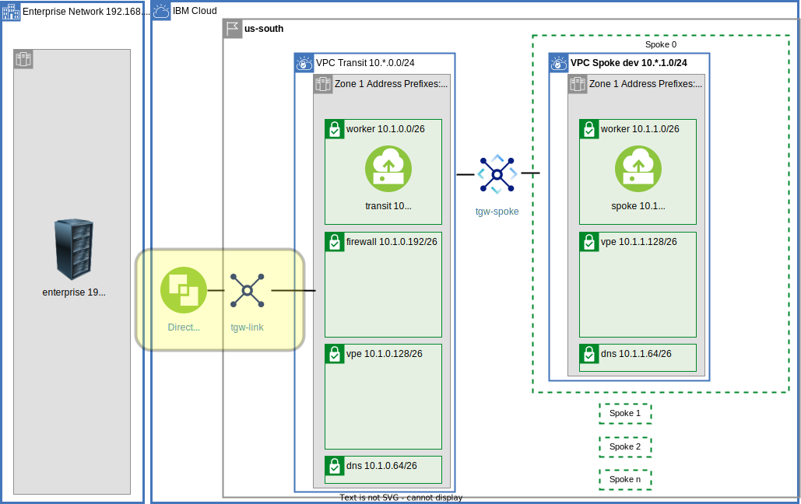
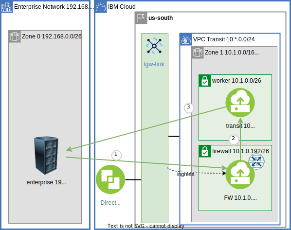
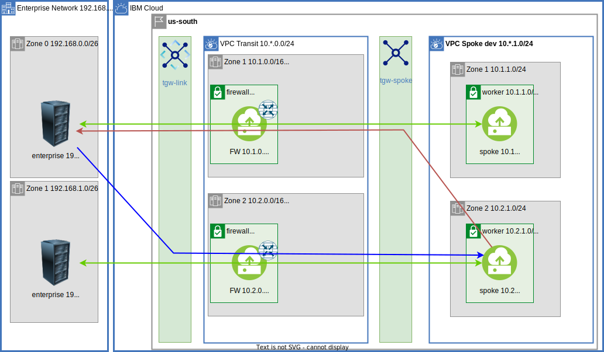

{:step: data-tutorial-type='step'}
{:shortdesc: .shortdesc}
{:new_window: target="_blank"}
{:codeblock: .codeblock}
{:screen: .screen}
{:tip: .tip}
{:pre: .pre}
{:important: .important}
{:note: .note}

# Centralize communication through a VPC Transit Hub and Spoke architecture Part 1
{: #vpc-transit}
{: toc-content-type="tutorial"}
{: toc-services="vpc, transit-gateway, direct-link, dns-svcs, cloud-databases, databases-for-redis"}
{: toc-completion-time="2h"}

This tutorial may incur costs. Use the [Cost Estimator](https://{DomainName}/estimator/review) to generate a cost estimate based on your projected usage.
{: tip}

This tutorial will walk through communication paths in a multi zone hub and spoke VPC model.

A {{site.data.keyword.vpc_full}} (VPC) is used to securely manage network traffic in the {{site.data.keyword.cloud_notm}}.  VPCs can also be used as a way to encapsulate functionality.  The VPCs can be connected to each other and to on premises.

A hub and spoke model connects multiple VPCs via {{site.data.keyword.tg_short}}.  The cloud VPCs can be connected to on premises using {{site.data.keyword.BluDirectLink}}.  Each spoke could be managed by a different team perhaps in a different account.  The isolation and connectivity support a number of scenarios:

- The hub can be the repository for shared micro services used by spokes.
- The hub can be the repository for shared cloud resources, like databases, accessed through [virtual private endpoint gateways](https://{DomainName}/docs/vpc?topic=vpc-about-vpe) controlled with VPC security groups and subnet access control lists, shared by spokes.
- The hub can be a central point of traffic routing between on premises and the cloud.
- Enterprise to cloud traffic can be routed, monitored, and logged through Network Function Virtualization (NFV) appliance in the hub.
- The hub can monitor all or some of the traffic - spoke <-> spoke, spoke <-> transit, or spoke <-> enterprise.
- The hub can hold the VPN resources that are shared by the spokes.

{: class="center"}
{: style="text-align: center;"}

This tutorial will walk through communication paths in a hub and spoke VPC model.  There is a companion [GitHub repository](https://github.com/IBM-Cloud/vpc-transit) that divides the connectivity into a number of incremental layers.  In the tutorial thin layers enable the introduction of bite size challenges and solutions.

 During the journey the following are explored:
- [{{site.data.keyword.tg_full_notm}}](https://www.ibm.com/cloud/transit-gateway).
- VPC egress and ingress routing.
- Virtual Network Functions with optional Network Load Balancers to support high availability.
- Virtual private endpoint gateways.
- DNS resolution.

A layered architecture will introduce resources and demonstrate connectivity. Each layer will add additional connectivity and resources. The layers are implemented in terraform. It will be possible to change parameters, like number of zones, by changing a terraform variable.

This tutorial walks you through a complete example demonstrating the network connectivity, VPC routing, DNS name resolution and other details to considered when stitching together a multi VPC architecture.  A layered approach allows the tutorial to introduce small problem and demonstrate a solution in the context of a complete architecture.
{: shortdesc}

## Objectives
{: #vpc-transit-objectives}

* Understand the concepts behind a VPC based hub and spoke model.
* Understand the applicability of a firewall-router and a transit VPC environment.
* Understand VPC ingress and egress routing.
* Identify and optionally resolve asymmetric routing issues.
* Connect VPCs via {{site.data.keyword.tg_short}}.
* Utilize the DNS service routing and forwarding rules to build architecturally sound name resolution system.

## Before you begin
{: #vpc-transit-prereqs}

This tutorial requires:
* `Terraform CLI` to run the Terraform commands.

<!--##istutorial#-->
You will find instructions to download and install these tools for your operating environment in the [Getting started with tutorials](https://{DomainName}/docs/solution-tutorials?topic=solution-tutorials-tutorials) guide.
<!--#/istutorial#-->

In addition:

- Check for user permissions. Be sure that your user account has sufficient permissions to create and manage all the resources in this tutorial.
- You need an SSH key to connect to the virtual servers. If you don't have an SSH key, see [the instructions](/docs/vpc?topic=vpc-ssh-keys) for creating a key for VPC. 

## Provision VPC network resources
{: #vpc-transit-provision-vpc-network-resources}
{: step}

In this step provision the VPC network resources.  It is important to carefully plan the network address space using non overlapping CIDR blocks.

It is tempting to divide up the CIDR space first by VPC but this complicates routing.  Instead think of a zone as a single CIDR block and each VPC as consuming a slice of each of the zones:

{: class="center"}
{: style="text-align: center;"}


This diagram shows a single zone:

{: class="center"}
{: style="text-align: center;"}

The diagram above shows the VPC layout in more detail. There is an enterprise on the left and the cloud-{{site.data.keyword.cloud_notm}} on the right.  In the {{site.data.keyword.cloud_notm}} a single zone for the transit VPC and Spoke 0.  Notice the details:
- The on premises CIDR is 192.168.0.0/16.
- The zones in this [multi zone region](https://{DomainName}/docs/overview?topic=overview-locations) are 10.\*.0.0/16.  The second digit: 0, 1, 2 is the zone number (shown for Dallas/us-south):
   - 10.0.0.0/16, zone 0, Dallas 1, us-south-1.
   - 10.1.0.0/16, zone 1, Dallas 2, us-south-2.
   - 10.2.0.0/16, zone 2, Dallas 3, us-south-3.
- The transit VPC consumes CIDRs 10.\*.0.0/24:
   - 10.0.0.0/24, zone 0.
   - 10.1.0.0/24, zone 1.
   - 10.2.0.0/24, zone 2.
- Spoke 0 consumes 10.\*.1.0/24 or CIDRs:
   - 10.0.1.0/24, zone 0.
   - 10.1.1.0/24, zone 1.
   - 10.2.1.0/24, zone 2.
- The subnet CIDRs further divide the /24 into /26.
- The zone box within a VPC shows the Address Prefix.  In the transit for zone 0 this is 10.0.0.0/16 which seems incorrect since it is not 10.0.0.0/24 (which is correct) and overlaps with the spokes.  This is a routing requirement that will be discussed in a later section.

The subnets in the transit and spoke are for the different resources:
- worker - network accessible compute resources VPC instances, load balancers, [{{site.data.keyword.redhat_openshift_notm}}](https://www.ibm.com/cloud/openshift), etc.  VPC instances are demonstrated in this tutorial.
- dns - {{site.data.keyword.dns_short}} location appliances.  See [working with custom resolvers](/docs/dns-svcs?topic=dns-svcs-custom-resolver&interface=ui).
- vpe - [{{site.data.keyword.vpe_short}}](/docs/vpc?topic=vpc-about-vpe) for private connectivity to cloud services.
- firewall - firewall-router VPC instances.

1. The companion [GitHub Repository](https://github.com/IBM-Cloud/vpc-transit) has the source files to implement the architecture.  In a desktop shell clone the repository:
   ```sh
   git clone https://github.com/IBM-Cloud/vpc-transit
   cd vpc-transit
   ```
   {: codeblock}

1. The config_tf directory contains configuration variables that you are required to configure.

   ```sh
   cp config_tf/template.terraform.tfvars config_tf/terraform.tfvars
   ```
   {: codeblock}

1. Edit **config_tf/terraform.tfvars**.

1. Since it is important that each layer is installed in the correct order and some steps in this tutorial will install multiple layers a shell command **./apply.sh** is provided.  The following will display help:

   ```sh
   ./apply.sh
   ```
   {: codeblock}

1. You could apply all of the layers configured by executing `./apply.sh : :`.  The colons are shorthand for first (or config_tf) and last (vpe_dns_forwarding_rules_tf).  The **-p** prints the layers:

   ```sh
   $ ./apply.sh : : -p
   ```
   {: codeblock}

   It will look something like:
   ```sh
   directories: config_tf enterprise_tf transit_tf spokes_tf test_instances_tf transit_spoke_tgw_tf enterprise_link_tf firewall_tf all_firewall_tf spokes_egress_tf all_firewall_asym_tf dns_tf vpe_transit_tf vpe_spokes_tf vpe_dns_forwarding_rules_tf
   ```

1. In this first step apply in config_tf, enterprise_tf, transit_tf and spokes_tf.  First use the -p to see what it will do:

   ```sh
   ./apply.sh -p : spokes_tf
   ```
   {: codeblock}

1. Now do it:

   ```sh
   ./apply.sh : spokes_tf
   ```
   {: codeblock}

## Create test instances
{: #vpc-transit-create-test-instances}
{: step}

VPC Virtual Server Instances, VSIs, are provisioned to test the network connectivity. A test instance will be added to each of the worker subnets (one per zone) in the enterprise, transit and each of the spokes.  If the default configuration of 2 zones and 2 spokes is used then 8 instances will be provisioned.

{: class="center"}
{: style="text-align: center;"}

Create the test instances

   ```sh
   ./apply.sh test_instances_tf
   ```
   {: codeblock}

It can be enlightening to explore the resources created at each step in the {{site.data.keyword.cloud_notm}} console.  Optionally open the [Virtual Private Clouds](https://{DomainName}/vpc-ext/network/vpcs).  On the left click on the **Virtual server instances** and notice the instances that were created.

## Testing
{: #vpc-transit-testing}
{: step}

This tutorial will add communication paths a layer at a time.  A pytest test suite exhaustively tests communication paths.  By the end of the tutorial all of the tests will pass.  The reader can follow along and test each layer using pytest.

The python test suite is in py/test_transit.py pytest.  Each test will ssh to one of the test instances and perform a type of connectivity test, like executing a `curl` command to one of the other instances.  The default ssh environment is used to log into the test instances.  Navigate to the test [instances](https:///{DomainName}/vpc-ext/compute/vs) and notice the **Floating IP** value.  If there are unexpected problems - verify it is possible to `ssh root@FloatingIP` from your workstation.

Validation was done with python 3.6.8.  You can use docker, the .ssh directory is needed for your `id_rsa` private key file allowing the python tests to ssh to the instances:

   ```sh
   docker run -it --rm -v ~/.ssh:/root/.ssh -v `pwd`:/usr/src/app  -w /usr/src/app python:3.11 bash
   ```
   {: codeblock}


Or use your desktop version. There are lots of ways to configure a python virtual environment.  The following steps are one example:

1. Verify python version 3.6.8 or later.  Your python may be **python3**.  After activated use python.

   ```sh
   python --version
   ```
   {: codeblock}

1. Install a python virtual environment with activation prompt of transit_vpc.

   ```sh
   python -m venv venv --prompt transit_vpc
   ```
   {: codeblock}

1. Activate the virtual environment.  This will need to be done each time a new terminal shell is initialized.  Mac or Linux:

   ```sh
   source venv/bin/activate
   ```
   {: codeblock}

   Windows:

   ```sh
   source venv/Scripts/activate
   ```
   {: codeblock}

1. Verify python version 3.6.8 or later.  No longer need to use python3:

   ```sh
   python --version
   ```
   {: codeblock}

1. Upgrade to the latest version of pip.
   ```sh
   pip install --upgrade pip
   ```
   {: codeblock}


Once python is ready:

1. Install pytest and the rest of the requirements.
   ```
   pip install -r requirements.txt
   ```
   {: codeblock}

1. Run the zone 0 curl tests in the suite my using the **-m** (markers) flag.  Choose the tests marked with **curl**, **lz0** (left zone 0) and **rz0** (right zone 0).

   **Expected:** Connectivity within a VPC, like enterprise -> enterprise pass.  Cross VPC, like enterprise -> transit, fail.

   ```sh
   pytest -v -m "curl and lz0 and rz0"
   ```
   {: codeblock}

   Below is example output that has been filtered for brevity:
   ```sh
   (transit_vpc) user@cloudshell:~/vpc-transit$    pytest -v -m "curl and lz0 and rz0"
   ===================================================================== test session starts ======================================================================
   platform linux -- Python 3.6.8, pytest-7.0.1, pluggy-1.0.0 -- /home/user/venv/bin/python3
   cachedir: .pytest_cache
   rootdir: /home/user/vpc-transit, configfile: pytest.ini
   collected 292 items / 276 deselected / 16 selected                                                                                                             
   
   py/test_transit.py::test_curl[l-enterprise-z0-s0 (52.118.150.249) 192.168.0.4    -> 192.168.0.4 (52.118.150.249) r-enterprise-z0-s0] PASSED              [  6%]
   py/test_transit.py::test_curl[l-enterprise-z0-s0 (52.118.150.249) 192.168.0.4    -> 10.0.0.4 (169.48.155.56) r-transit-z0-s0] FAILED                     [ 12%]
   =================================================================== short test summary info ====================================================================
   FAILED py/test_transit.py::test_curl[l-enterprise-z0-s0 (52.118.150.249) 192.168.0.4    -> 10.0.0.4 (169.48.155.56) r-transit-z0-s0] - assert False
   FAILED py/test_transit.py::test_curl[l-enterprise-z0-s0 (52.118.150.249) 192.168.0.4    -> 10.0.2.4 (52.116.132.255) r-spoke1-z0-s0] - assert False
   FAILED py/test_transit.py::test_curl[l-transit-z0-s0 (169.48.155.56) 10.0.0.4           -> 192.168.0.4 (52.118.150.249) r-enterprise-z0-s0] - assert False
   ============================================== 12 failed, 4 passed, 276 deselected, 1 warning in 72.32s (0:01:12) ==============================================
   ```
   {: codeblock}

A change to the network configuration can take a couple of test runs for the underlying VPC network system to become consistent.  If you do not see the expected results initially be prepared to run the test again a couple of times.
{: note}

## Connect Transit and Spokes via Transit Gateway
{: #vpc-transit-transit-to-spokes}
{: step}

Provision a {{site.data.keyword.tg_full_notm}} to connect the transit <-> spoke and spoke <-> spoke.

{: class="center"}
{: style="text-align: center;"}

1. Apply the layer:

   ```sh
   ./apply.sh transit_spoke_tgw_tf
   ```
   {: codeblock}

1. Run the zone 0 curl tests in the suite my using the **-m** (markers) flag.  Choose the tests marked with **curl**, **lz0** (left zone 0) and **rz0** (right zone 0).

   **Expected:** Connectivity within a VPC, transit <-> spoke, and spoke <-> spoke pass.  Connectivity to/from enterprise fails.

   ```sh
   pytest -v -m "curl and lz0 and rz0"
   ```
   {: codeblock}

## Connect Enterprise to Transit via Direct Link and Transit Gateway
{: #vpc-transit-enterprise-to-transit}
{: step}

Provision a {{site.data.keyword.BluDirectLink}} using {{site.data.keyword.tg_short}}.

{: class="center"}
{: style="text-align: center;"}


{{site.data.keyword.dl_full}} is a high speed secure data path for connecting an enterprise to the {{site.data.keyword.cloud_notm}}. In this tutorial {{site.data.keyword.tg_short}} is used for distribution.  The use of {{site.data.keyword.tg_short}} is optional for an on premises connection.

The enterprise in this simulation is a VPC.  Connecting via {{site.data.keyword.tg_short}} will ensure an experience very close to {{site.data.keyword.dl_short}}.

1. Apply the enterprise_link_tf layer:
   ```sh
   ./apply.sh enterprise_link_tf
   ```
   {: codeblock}

1. Run the zone 0 curl tests in the suite my using the **-m** (markers) flag.  Choose the tests marked with **curl**, **lz0** (left zone 0) and **rz0** (right zone 0).

   **Expected:** Connectivity within a VPC, transit <-> spoke, enterprise <-> transit, spoke <-> spoke pass but enterprise <-> spoke fail.

   ```sh
   pytest -v -m "curl and lz0 and rz0"
   ```
   {: codeblock}

## Connect Enterprise to Spoke via Transit NFV Firewall-Router
{: #vpc-transit-router}
{: step}

The incentive for a transit VPC for enterprise <-> cloud traffic is typically to route, inspect, monitor and log network traffic.  In this step a firewall-router appliance can be installed in each zone of the transit VPC.

### NFV Router
{: #vpc-transit-nfv-router}
Provision the firewall-router appliances.  An ingress route table for Transit Gateways has been added to the transit VPC as indicated by the dotted lines.  A subnet has been created in each of the zones of the transit VPC to hold the firewall-router. 

{: class="center"}
{: style="text-align: center;"}

Connectivity from the enterprise to a spoke is achieved through a Network Function Virtualization, [NFV](https://{DomainName}/docs/vpc?topic=vpc-about-vnf), firewall-router instance in the transit VPC.  In production you can choose one from the catalog or bring your own.  This demonstration will use an Ubuntu stock image with kernel iptables set up to forward all packets from the source to destination.  No firewall inspection is performed.

The terraform configuration will configure the firewall-router instance with [allow_ip_spoofing](https://{DomainName}/docs/vpc?topic=vpc-ip-spoofing-about).  You must [enable IP spoofing checks](https://{DomainName}/docs/vpc?topic=vpc-ip-spoofing-about#ip-spoofing-enable-check) before continuing.
{: note}

1. Apply the firewall_tf layer:
   ```sh
   ./apply.sh firewall_tf
   ```
   {: codeblock}

1. Run the test suite.
   **Expected:** Connectivity within a VPC, enterprise -> transit, enterprise <-> spoke same zone pass.  But transit -> spoke, transit -> enterprise and enterprise <--> spoke cross zone fail.

   ```sh
   pytest -v -m "curl and lz0 and (rz0 or rz1)"
   ```
   {: codeblock}

### Ingress Routing
{: #vpc-transit-ingress-routing}
Traffic reaches the firewall-router appliance through routing tables.
1. Visit the [VPCs](https://{DomainName}/vpc-ext/network/vpcs) in the {{site.data.keyword.cloud_notm}} console.
1. Select the transit VPC.
1. Click on **Manage routing tables**.
1. Click on the **tgw-ingress** routing table.

The zone is determined by the Transit Gateway which will examine the destination IP address of each packet and route it to the matching zone based on VPC Address Prefixes discussed in the next section.

Notice how wide the routes are in the transit's ingress routing table (shown for Dallas/us-south):

Zone|Destination|Next hop
--|--|--
Dallas 1|0.0.0.0/0|10.0.0.196
Dallas 2|0.0.0.0/0|10.1.0.196
Dallas 3|0.0.0.0/0|10.2.0.196

The next_hop identifies the firewall-router.  In the table above 10.0.0.196 zone Dallas 1 and 10.1.0.196 zone Dallas 2.  You can observe this using the {{site.data.keyword.cloud_notm}} console.

1. Open [Virtual server instances for VPC](https://{DomainName}/vpc-ext/compute/vs) to find the **fw** instances and associated **Reserved IP** (click the **Name** column header to sort).
1. Match them up with the table above to verify the next hop relationship.

### VPC Address Prefixes
{: #vpc-transit-vpc-address-prefixes}
Transit Gateways learn routes in the attached VPCs through the [VPC Address Prefixes](https://{DomainName}/docs/vpc?topic=vpc-vpc-addressing-plan-design).  But how does a spoke learn the route to the enterprise (192.168.0.0/16)?  And how does the enterprise learn the route to a spoke?  By adding phantom VPC address prefixes to the transit VPC.

The transit VPC zone in the diagram has the additional address prefixes:
- 192.168.0.0/24 Dallas 1.
- 192.168.1.0/24 Dallas 2.
- 192.168.2.0/24 Dallas 3.

To observe this:
1. Open the [VPCs](/vpc-ext/network/vpcs) in the {{site.data.keyword.cloud_notm}}.
1. Select the **transit VPC** and notice the Address prefixes displayed.
1. Find the additional address prefixes for the enterprise CIDR blocks and note the associated zones.

Also notice that the Address prefix for that transit VPC itself:
- 10.0.0.0/16 Dallas 1.
- 10.1.0.0/16 Dallas 2.
- 10.2.0.0/16 Dallas 3.

The transit VPC will only use a subset of each zone:
- 10.0.0.0/24 Dallas 1.
- 10.1.0.0/24 Dallas 2.
- 10.2.0.0/24 Dallas 3.
 
The address prefixes for the transit itself is expanded to include all of the spokes to allow the routes to flow to the enterprise.

With these additional address prefixes:
- Spoke VPCs learn that traffic spoke -> (192.168.0.0/24, 192.168.1.0/24, 192.168.2.0/24) should pass through transit gateway tgw-link. 
- Enterprise will learn that traffic enterprise -> (10.0.0.0/16, 10.1.0.0/16 10.2.0.0/16) should pass through transit gateway tgw-spoke.

## Removing the firewall for transit destination traffic
{: #vpc-transit-stateful-routing}
{: step}
The IBM VPC uses the industry standard state based routing for secure TCP connection tracking.  This requires that the TCP connections use the same path on the way in as the way out.  One exception to this is Direct Server Return used by routers like [{{site.data.keyword.loadbalancer_short}}](https://{DomainName}/docs/vpc?topic=vpc-network-load-balancers).  This allows incoming connections from the enterprise to pass through the firewall to the transit test instance and then return directly to the originator.


{: class="center"}
{: style="text-align: center;"}

This does not help with the traffic originating in the transit test instance passing through the transit gateway then back through ingress routing to the firewall-router.  This connection gets stuck at the firewall-router (3) and not get forwarded back to the worker as shown in red below.  Traffic transit -> enterprise and transit -> spoke are failing.

{: class="center"}
{: style="text-align: center;"}

One possible solution is to stop sending traffic destined to the transit VPC to the firewall-router.  The wide ingress routes for the transit are currently routing traffic to the firewall-router.  More specific routes can be added specifically for the transit to **Delegate** to the default behavior - send directly to the intended destination instead of the firewall-router.  Below are the required routes:

Zone|Destination|Next hop
--|--|--
Dallas 1|10.0.0.0/24|Delegate
Dallas 2|10.1.0.0/24|Delegate
Dallas 3|10.2.0.0/24|Delegate

1. To observe the current value of the ingress route table visit the [Routing tables for VPC](https://{DomainName}/vpc-ext/network/routingTables) in the {{site.data.keyword.cloud_notm}} console.  Select the **transit** VPC from the drop down and then select the **tgw-ingress** routing table.

1.  Make the changes to the routing table by applying the transit_ingress layer:
   ```sh
   ./apply.sh transit_ingress_tf
   ```
   {: codeblock}

1. Refresh the browser display of the routing table to observe the new routes.
1. Run the test suite.  
   **Expected:** All tests except enterprise <-> spoke cross zone

   ```sh
   pytest -v -m "curl and lz0 and (rz0 or rz1)"
   ```
   {: codeblock}

   This diagram shows the traffic flow.  Only the enterprise <-> spoke is passing through the firewall:

{: class="center"}
{: style="text-align: center;"}

## Add Spoke Egress routes to fix Asymmetric Routing
{: #vpc-transit-asymmetric}
{: step}

This step will identify and fix an asymmetric routing issues.  The diagram below shows the successful routes in green.  Notice the arrow in both directions.  One of the unsuccessful routes has an initial route in blue and an unsuccessful return route in red:

{: class="center"}
{: style="text-align: center;"}

### Asymmetric Routing Limitation
{: #vpc-transit-asymmetric-routing-limitation}
The remaining failures are cross zone failures enterprise <-> spoke.

Example failure:
   ```sh
   FAILED py/test_transit.py::test_curl[l-enterprise-z0-s0 (52.118.150.249) 192.168.0.4    -> 10.1.1.4 (52.116.203.217) r-spoke0-z1-s0] - assert False
   ```

The blue line represents a TCP connection request from enterprise through the transit gateway: 192.168.0.4 <--TCP--> 10.1.1.4.  The transit gateway will choose a transit VPC zone based on the matching address prefix.  The matching address prefix for 10.1.1.4 is 10.1.1.0/24 in the lower zone.

The red line represents the TCP connection response to 192.168.0.4.  The transit gateway delivers to the transit VPC using the matching address prefix 192.168.0.0/24 in the upper zone.  The IBM VPC uses the industry standard state based routing for secure TCP connection tracking.  This requires that the TCP connection pass through the same firewall-router in both directions.  The VPC does not support tcp "Asymmetric Routing".

It is interesting to note that an attempt to ping using the ICMP protocol would not suffer from this limitation.  ICMP does not require a stateful connection.  Connectivity from 192.168.0.4 <--ICMP--> 10.1.1.4 via ICMP is possible.  You can run the ping marked tests to verify via copy paste of the failed output  The **l-** is for left and **r-** is for right:

**Expect success:**
   ```sh
   pytest -v -m ping -k 'l-enterprise-z0-s0 and r-spoke0-z1-s0'
   ```
   {: codeblock}

**Expect failure:**
   ```sh
   pytest -v -m curl -k 'l-enterprise-z0-s0 and r-spoke0-z1-s0'
   ```
   {: codeblock}

If the goal is to create an architecture that is resilient across {{site.data.keyword.cloud_notm}} zonal failures then cross zone traffic should generally be avoided.  Routing on the enterprise could insure that all traffic destined to the cloud be organized and routed to avoid the cross zone traffic in the cloud.  The enterprise concept of zones will need to be understood.  In this tutorial the phantom VPC address prefixes will identify the cloud zone associated with an enterprise device.

### Spoke Egress routing
{: #vpc-transit-spoke-egress-routing}

To resolve this problem transit <-> spoke traffic will be routed to stay in the same zone.  The spoke -> transit traffic can be routed using an egress routing table in the spokes.

{: class="center"}
{: style="text-align: center;"}

In the diagram this is represented by the egress dashed line.

1. Apply the spoke_egress_tf layer:
   ```sh
   ./apply.sh spokes_egress_tf
   ```
   {: codeblock}

1. Run the test suite.
   **Expected:** All tests pass.

   ```sh
   pytest -v -m "curl and lz0 and (rz0 or rz1)"
   ```
   {: codeblock}

1. Visit the [VPCs](https://{DomainName}/vpc-ext/network/vpcs) in the {{site.data.keyword.cloud_notm}} console.  Select one of the spoke VPCs and then click on **Manage routing tables** click on the **Egress** routing table.  With this change spoke traffic originating in a spoke in Dallas 2 remains in Dallas 2 as it flows through the firewall-router in the transit VPC.

1. Notice these routes in the spoke's egress routing table:

Zone|Destination|Next hop
--|--|--
Dallas 1|192.168.0.0/16|10.0.0.196
Dallas 2|192.168.0.0/16|10.1.0.196
Dallas 3|192.168.0.0/16|10.2.0.196

## Routing Summary
{: #vpc-transit-routing-summary}
Basic routing is complete:
- enterprise <-> transit
- transit <-> spoke
- enterprise <--(transit firewall-router)--> spoke

All connectivity tests now pass.

## More Firewall Protection
{: #vpc-transit-firewall}
{: step}

Often an enterprise uses a transit VPC to monitor the traffic with the firewall-router.  Currently only enterprise <-> spoke traffic is flowing through the transit firewall-router.  This section is about routing all VPC to VPC traffic through firewall-router.  

{: class="center"}
{: style="text-align: center;"}

The flow lines show more traffic flowing through the firewall.  All traffic that flows through the transit gateway also flows through the firewall.  Notice in spoke 0 that traffic within the spoke (or transit) will not flow through the firewall.


### Route Spoke and Transit to the firewall-router
{: #vpc-transit-route-spoke-and-transit-to-firewall-router}
Routing all cloud traffic originating at the spokes through the transit VPC firewall-router in the same zone is accomplished by these routes in the spoke's default egress routing table (shown for Dallas/us-south):

Zone|Destination|Next hop
--|--|--
Dallas 1|10.0.0.0/8|10.0.0.196
Dallas 2|10.0.0.0/8|10.1.0.196
Dallas 3|10.0.0.0/8|10.2.0.196

Similarly in the transit VPC route all enterprise and cloud traffic through the firewall-router in the same zone as the originating transit instance.  For example a transit test instance 10.0.0.4 (Dallas 1) attempting contact with 10.1.1.4 (Dallas 2) will be sent through the firewall-router in Dallas 1: 10.0.0.196.  

Routes in transit's default egress routing table (shown for Dallas/us-south):

Zone|Destination|Next hop
--|--|--
Dallas 1|10.0.0.0/8|10.0.0.0.196
Dallas 2|10.0.0.0/8|10.1.0.0.196
Dallas 3|10.0.0.0/8|10.2.0.0.196
Dallas 1|192.168.0.0/16|10.0.0.0.196
Dallas 2|192.168.0.0/16|10.1.0.0.196
Dallas 3|192.168.0.0/16|10.2.0.0.196

This is going to introduce another cross zone asymmetric route transit <--> spoke.  For example a transit worker in an upper zone pictorially will choose the firewall in the upper zone.  On the return trip the spoke in the lower zone will choose the firewall in the lower zone.  In the spokes, traffic destined to the transit should be delegated to normal traffic routing, meaning the{{site.data.keyword.tg_short}} will route to the zone of the destination.,

Routes in each spoke's default egress routing table (shown for Dallas/us-south):

Zone|Destination|Next hop
--|--|--
Dallas 1|10.0.0.0/24|delegate
Dallas 2|10.0.0.0/24|delegate
Dallas 3|10.0.0.0/24|delegate
Dallas 1|10.1.0.0/24|delegate
Dallas 2|10.1.0.0/24|delegate
Dallas 3|10.1.0.0/24|delegate
Dallas 1|10.2.0.0/24|delegate
Dallas 2|10.2.0.0/24|delegate
Dallas 3|10.2.0.0/24|delegate


### Do not route Intra VPC traffic to the firewall-router
{: #vpc-transit-do-not-route-intra-zone-traffic-to-firewall-router}
In this example Intra-VPC traffic will not pass through the firewall-router. For example resources in spoke 0 can connect to other resources on spoke 0 directly.  To accomplish this additional more specific routes can be added to delegate internal traffic.  For example in spoke 0, which has the CIDR ranges: 10.0.1.0/24, 10.1.1.0/24, 10.2.1.0/24 the internal routes can be delegated.

Routes in spoke 0's default egress routing table (shown for Dallas/us-south):

Zone|Destination|Next hop
--|--|--
Dallas 1|10.0.1.0/24|delegate
Dallas 1|10.1.1.0/24|delegate
Dallas 1|10.2.1.0/24|delegate
Dallas 2|10.0.1.0/24|delegate
Dallas 2|10.1.1.0/24|delegate
Dallas 2|10.2.1.0/24|delegate
Dallas 3|10.0.1.0/24|delegate
Dallas 3|10.1.1.0/24|delegate
Dallas 3|10.2.1.0/24|delegate

Similar routes are added to the transit and other spokes.

### Firewall Subnets
{: #vpc-transit-firewall-subnets}
What about the firewall-router itself?  This was not mentioned earlier but in anticipation of this change there was a egress_delegate router created in the transit VPC that delegates routing to the default for all destinations.  It is only associated with the firewall-router subnets so the firewall-router is not effected by the changes to the default egress routing table used by the other subnets.  Check the routing tables for the transit VPC for more details. Visit the [VPCs](https://{DomainName}/vpc-ext/network/vpcs) in the {{site.data.keyword.cloud_notm}} console.  Select the transit VPC and then click on **Manage routing tables**, click on the **egress-delegate** routing table, click on the **Subnets** tab and note the -s3 subnets used for firewall-routers.

### Apply and Test More Firewall
{: #vpc-transit-apply-and-test-more-firewall}
An earlier step had added the transit_ingress_tf layer.  It added routes to the transit VPC ingress route table to **delegate** traffic instead of routing to the firewall-router.

1. Edit config_tf/terraform.tfvars and change the value of all_firewall to true.
1. Apply the config_tf layer and then the transit_ingress_tf layer.  This will remove the **delegate** routes in the ingress route table in the transit VPC:
   ```sh
   ./apply.sh config_tf
   ./apply.sh transit_ingress_tf
   ```

1. Apply the all_firewall layer:
   ```sh
   ./apply.sh all_firewall_tf
   ```
   {: codeblock}

4. Run the test suite.
   - Expected pass: all except:
   - Expected fail: cross zone transit <-> spoke and spoke <-> spoke.

   ```sh
   pytest -v -m "curl and lz0 and (rz0 or rz1)"
   ```
   {: codeblock}

### Fix cross zone routing
{: #vpc-transit-fix-cross-zone-routing}

As mentioned earlier for a system to be resilient across zonal failures it is best to eliminate cross zone traffic. If cross zone support is required additional egress routes can be added.  The problem for spoke to spoke traffic is shown in this diagram

{: class="center"}
{: style="text-align: center;"}

The green path is an example of the originator spoke 0 zone 1 10.1.1.4 routing to spoke 1 zone 0 10.0.2.4.  The matching egress route is:

Zone|Destination|Next hop
--|--|--
Dallas 2|10.0.0.0/8|10.1.0.196

Moving left to right the firewall-router in the middle zone, zone 1, of the diagram is selected.  On the return path zone 0 is selected.

To fix this a few more specific routes need to be added to force the higher number zones to route to the lower zone number firewalls when a lower zone number destination is specified.  When referencing an equal or higher numbered zone continue to route to the firewall in the same zone.


{: class="center"}
{: style="text-align: center;"}

Routes in each spoke's default egress routing table (shown for Dallas/us-south):

Zone|Destination|Next hop
--|--|--
Dallas 2|10.0.0.0/16|10.0.0.196
Dallas 3|10.0.0.0/16|10.0.0.196
Dallas 3|10.1.0.0/16|10.1.0.196

1. Apply the all_firewall_asym layer:
   ```sh
   ./apply.sh all_firewall_asym_tf
   ```
   {: codeblock}

1. Run the test suite.
   **Expected:** all tests pass

   ```sh
   pytest -v -m curl
   ```
   {: codeblock}

## High Performance High Availability (HA) Firewall-Router
{: #vpc-transit-high-performance-ha-firewall-router}
{: step}
To prevent a firewall-router from becoming the performance bottleneck or a single point of failure it is possible to add a VPC Network Load Balancer to distribute traffic to the zonal firewall-routers to create a Highly Available, HA, firewall-router.

{: class="center"}

This diagram shows a single zone with a Network Load Balancer (NLB) fronting two firewall-routers. To see this constructed it is required to change the configuration and apply again.

1. Change these two variables in config_tf/terraform.tfvars:
   ```sh
   firewall_nlb                 = true
   number_of_firewalls_per_zone = 2
   ```

   This change results in the IP address of the firewall-router changing from the firewall-router instance used earlier to the IP address of the NLB.  The optional HA firewall router will need to be applied to a number of VPC route table routes in the transit and spoke VPCs.  It is best to apply all of the layers to this point:


1. Apply all the layers through the all_firewall_asym_tf layer:
   ```sh
   ./apply.sh : all_firewall_asym_tf
   ```
   {: codeblock}

Observe the changes that were made:

1. Open the [Load balancers for VPC](https://{DomainName}/vpc-ext/network/loadBalancers).
1. Select the load balancer in zone 0 (Dallas 1/us-south-1) it has the suffix fw-z0-s3.
1. Note the **Private IPs**.

Compare the Private IPs with those in the transit VPC ingress route table:

1. Open the [Virtual Private Clouds](https://{DomainName}/vpc-ext/network/vpcs).
1. Select the transit VPC.
1. Click on **Manage routing tables**.
1. Click on the **tgw-ingress** routing table.  Notice the **Next hop** IP address matches one of the NLB **Private IPs**

Verify resiliency:

1. Run the spoke 0 zone 0 tests:
   ```sh
   pytest -k r-spoke0-z0-s0 -m curl
   ```
   {: codeblock}

1. Open the [Virtual server instances for VPC](https://{DomainName}/vpc-ext/compute/vs)
1. Locate the **BASENAME-fw-z0-s3-0** three vertical dots menu on the right and select **Stop**
1. Run the **pytest** again it may take a few minutes for the NLB to stop routing traffic to the stopped instance, at which point all tests will pass.
1. Locate the **BASENAME-fw-z0-s3-1** three vertical dots menu on the right and select **Stop**
1. Run the **pytest** again it may take a few minutes for the NLB to stop routing traffic to the stopped instance.
1. Run the **pytest** again and all tests fail.
1. Start one or both of the firewall-router instances and the tests will pass again.

Remove the NLB firewall:
1. Change these two variables in config_tf/terraform.tfvars:
   ```sh
   firewall_nlb                 = false
   number_of_firewalls_per_zone = 1
   ```

1. Apply all the layers through the all_firewall_asym_tf layer:
   ```sh
   ./apply.sh : all_firewall_asym_tf
   ```
   {: codeblock}

## DNS
{: #vpc-transit-dns}
{: step}
{: class="center"}
{: style="text-align: center;"}

The {{site.data.keyword.dns_full_notm}} service is used to provide names to IP addresses.  In this example a separate DNS service is created for the transit and each of the spokes.  This approach provides isolation between teams and allows the architecture to spread across different accounts.  If a single DNS service in a single account meets your isolation requirements it will be simpler to configure.

### DNS Resources
{: #vpc-transit-dns-resources}
Create the dns services and add a DNS zone for each VPC and an A record for each of the test instances:

Apply the dns_tf layer:
   ```sh
   ./apply.sh dns_tf
   ```
   {: codeblock}

Open the [Resources](https://{DomainName}/resources) in the {{site.data.keyword.cloud_notm}} console.  Open the **Networking** section and notice the **DNS Services**.  Open the **x-spoke0** instance.  Click the **x-spoke0.com** DNS zone.  Notice the A records associated with the test instances that are in the spoke instance.  Optionally explore the other DNS instances and find similarly named DNS zones and A records for the other test instances.

Click on the **Custom resolver** tab on the left and notice the forwarding rules.

### DNS Forwarding
{: #vpc-transit-dns-forwarding}
Separate DNS instances learn each other's DNS names with forwarding rules.  In the diagram there are arrows that indicate a forwarding rule.  The associated table indicates when the forwarding rule will be used.  Starting on the left notice that the enterprise DNS forwarding rule will look to the transit for the DNS zones: x-transit.com, x-spoke0.com, and x-spoke1.com.

The transit DNS instance can resolve x-transit.com and has forwarding rules to the spokes to resolve the rest.  Similarly the spokes rely on the transit DNS instance to resolve the enterprise, transit and the other spokes.

You can verify these forwarding rules in the {{site.data.keyword.cloud_notm}} console in the **Custom resolver** tab in each of the DNS instances.  After locating the custom resolve click to open then click **Forwarding rules** tab.  All DNS zones are forwarded to the DNS resolvers in the transit VPC.

### DNS Testing
{: #vpc-transit-dns-testing}

There are now a set of **curl DNS** tests that are available in the pytest script.  These tests will curl using the DNS name of the remote.

Test:
   ```sh
   pytest -v -m dns
   ```
   {: codeblock}

## Virtual Private Endpoint Gateways
{: #vpc-transit-VPE}
{: step}

{: class="center"}
{: style="text-align: center;"}

VPC allows private access to IBM Cloud Services through [{{site.data.keyword.vpe_full}}](https://{DomainName}/docs/vpc?topic=vpc-about-vpe). The VPEs allow fine grain network access control via standard {{site.data.keyword.vpc_short}} controls:
- [{{site.data.keyword.security-groups}}](https://{DomainName}/docs/vpc?topic=vpc-using-security-groups).
- [VPC Network Access Control Lists](https://{DomainName}/docs/vpc?topic=vpc-using-acls).
- [Routing tables and routes](https://{DomainName}/docs/vpc?topic=vpc-about-custom-routes).

1. Create the VPEs for the transit and the spokes, by applying the vpe layers:
   ```sh
   ./apply.sh vpe_transit_tf vpe_spokes_tf
   ```
   {: codeblock}

   There are now a set of **vpe**  and **vpedns** tests that are available in type pytest script.  These **vpedns** test will verify that the DNS name of a redis instance is within the private CIDR block of the enclosing VPC. The **vpe** test will execute a **redli** command to access redis remotely.

1. Test vpe and vpedns
   ```sh
   pytest -v -m 'vpe or vpedns'
   ```
   {: codeblock}

   Notice the failing vpedns tests like this one:

   ```sh
   FAILED py/test_transit.py::test_vpe_dns_resolution[redis tvpc-spoke0-z0-s0 (169.48.153.106)) 10.0.1.4 -> tvpc-transit (['10.0.0.128/26', '10.1.0.128/26']) 5c60b3e4-1920-48a3-8e7b-98d5edc6c38a.c7e0lq3d0hm8lbg600bg.private.databases.appdomain.cloud] - AssertionErro...
   ```

   These are failing because the DNS resolution.  In the example above the ID.private.databases.appdomain.cloud should resolve to a VPE that is in the CIDR block 10.0.0.128/26 or 10.1.0.128/26.  Looking at the stack trace notice it is resolving to an address like 166.9.14.12 which is a Cloud [Service Endpoint](https://{DomainName}/docs/vpc?topic=vpc-service-endpoints-for-vpc#cloud-service-endpoints).  The DNS names can not be resolved by the private DNS resolvers.  Adding additional DNS forwarding rules will resolve this issue.

   To make the DNS names for the VPE available outside the DNS owning service it is required to update the DNS forwarding rules.
   - For enterprise `appdomain.com` will forward to the transit.
   - For transit the fully qualified DNS name of the REDIS instance will be forwarded to the spoke instance that owns the REDIS instance.
   - For spoke_from -> spoke_to access to REDIS the spoke_from needs the DNS name for the REDIS instance.

   {: class="center"}
{: style="text-align: center;"}

   The diagram uses **transit-.databases.appdomain.cloud** to identify the database in the transit instead of the fully qualified name like **5c60b3e4-1920-48a3-8e7b-98d5edc6c38a.c7e0lq3d0hm8lbg600bg.private.databases.appdomain.cloud**.

1. Apply the vpe_dns_forwarding_rules_tf layer:
   ```sh
   ./apply.sh vpe_dns_forwarding_rules_tf
   ```
   {: codeblock}

1. Verify that all VPEs can be accessed from all test instances.
   ```sh
   pytest -v -m 'vpe or vpedns'
   ```
   {: codeblock}

1. It can take a few tries for the DNS names to be resolved accurately.  So try the test at least three times.  All tests should pass except the enterprise to spoke VPE tests:

   ```sh
   pytest -v
   ```
   {: codeblock}

It is not currently possible to access a spoke VPE through a transit VPC cross zone.  The VPE return traffic does use spoke egress route table.  The enterprise DNS resolution must resolve the fully qualified name to the IP address of the VPE in the same zone.  Configuring this is beyond the scope of this tutorial.

## Production Notes and Conclusions
{: #vpc-transit-production-notes}

The [VPC reference architecture for IBM Cloud for Financial Services](https://{DomainName}/docs/framework-financial-services?topic=framework-financial-services-vpc-architecture-about) has much more detail on securing workloads in the {{site.data.keyword.cloud_notm}}.

Some obvious changes to make:
- CIDR blocks were chosen for clarity and ease of explanation.  The Availability Zones in the Multi zone Region could be 10.0.0.0/10, 10.64.0.0/10, 10.128.0.0/10 to conserve address space.  Similarly the address space for Worker nodes could be expanded at the expense of firewall, DNS and VPE space.
- Security Groups for each of the network interfaces for worker VSIs, Virtual Private Endpoint Gateways, DNS Locations and firewalls should all be carefully considered.
- Network Access Control Lists for each subnet should be carefully considered.

Floating IPs were attached to all test instances to support connectivity tests via ssh.  This is not required or desirable in production.

[Create context-based restrictions](/docs/account?topic=account-context-restrictions-create&interface=ui) to further control access to all resources.

Place each team into their own account.  Organize with [IBM Cloud enterprise](/docs/account?topic=account-what-is-enterprise)

In this tutorial you created a hub VPC and a set of spoke VPCs.  You identified the required Availability Zones for the architecture and created a set of subnets in the VPCs.  You created a transit VPC firewall-router in each zone for centralized monitoring.  Test instances were used to verify connectivity and identify potential problems.  Routing table routes were used to identify the traffic paths required.

## Remove resources
{: #vpc-transit-remove-resources}

Execute `terraform destroy` in all directories in reverse order using the `./apply.sh` command:

   ```sh
   ./apply.sh -d : :
   ```
   {: codeblock}

## Expand the tutorial
{: #vpc-transit-expand-tutorial}

Your architecture will likely be different than the one presented but will likely be constructed from the fundamental components discussed here. Ideas to expand this tutorial:

- Integrate incoming public Internet access using [{{site.data.keyword.cis_full}}](https://{DomainName}/docs/cis?topic=cis-getting-started).
- Add [flow log capture](/docs/vpc?topic=vpc-flow-logs) in the transit.
- Put each of the spokes in a separate account in an [enterprise](https://{DomainName}/docs/account?topic=account-enterprise-tutorial#account_groups_tutorial).
- Force some of the spoke to spoke traffic through the firewall and some not through the firewall.
- Replace the worker VSIs with [{{site.data.keyword.openshiftlong_notm}} and VPC load balancer](https://{DomainName}/openshift?topic=openshift-vpc-lbaas).
- Force all out bound traffic through the firewall in the transit VPC and through [Public gateways](/docs/vpc?topic=vpc-public-gateways) .

## Related content
{: #vpc-transit-related}

* [IBM Cloud for Financial Services](https://{DomainName}/docs/framework-financial-services)
* Tutorial: [Best practices for organizing users, teams, applications](https://{DomainName}/docs/solution-tutorials?topic=solution-tutorials-users-teams-applications#users-teams-applications)
* [How to deploy isolated workloads across multiple locations and regions](https://{DomainName}/docs/solution-tutorials?topic=solution-tutorials-vpc-multi-region)
* [Public front end and private backend in a Virtual Private Cloud](https://{DomainName}/docs/solution-tutorials?topic=solution-tutorials-vpc-public-app-private-backend),
* [Network Function Virtualization](https://{DomainName}/docs/vpc?topic=vpc-about-vnf)
* [Private hub and spoke with transparent VNF and spoke-to-spoke traffic](https://{DomainName}/docs/vpc?topic=vpc-about-vnf-ha)
