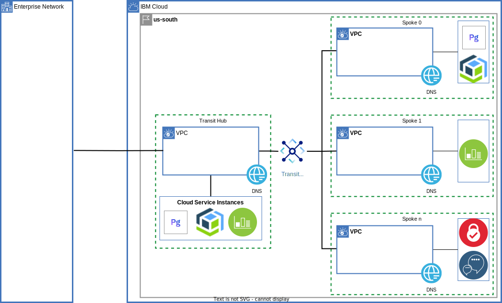
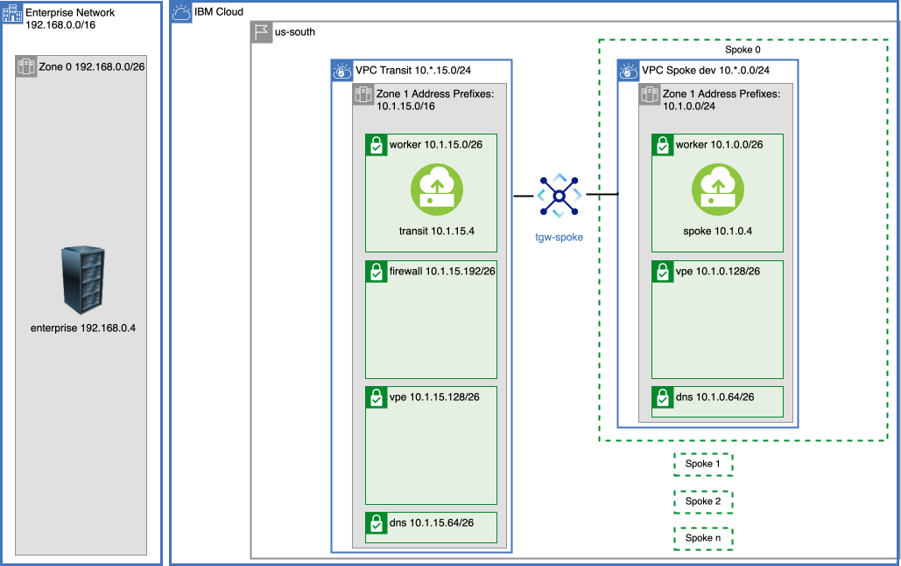
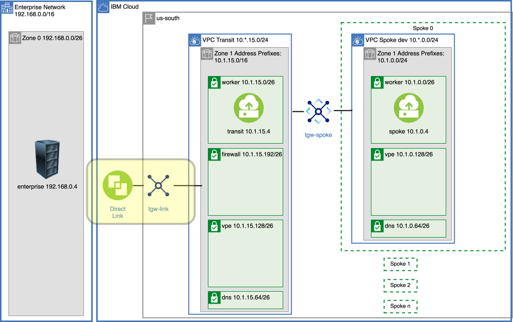
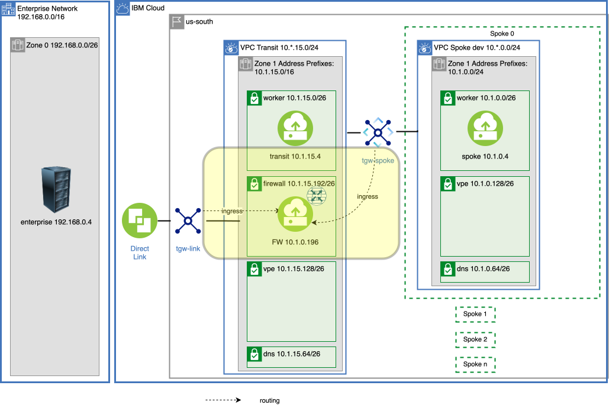
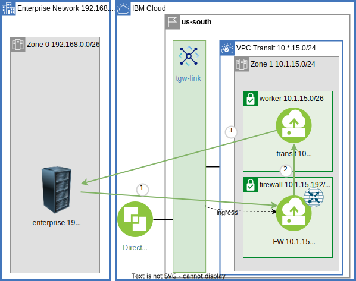
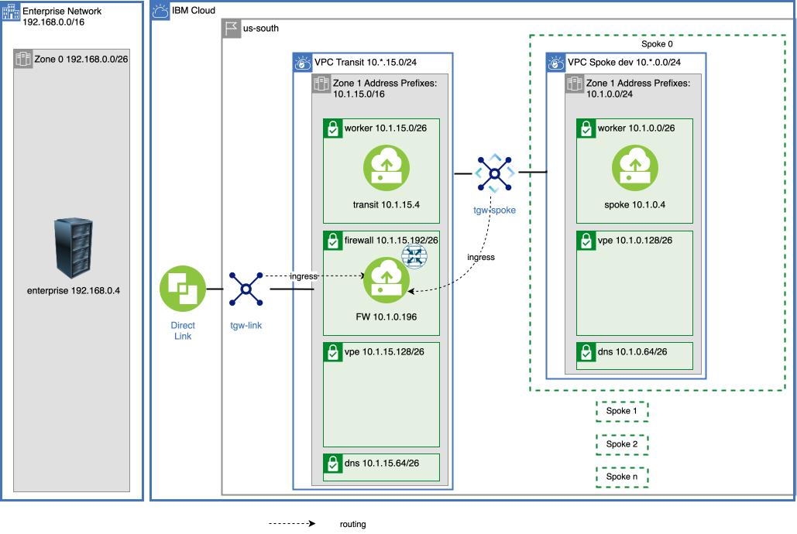

{{site.data.keyword.attribute-definition-list}}

# Centralize communication through a VPC Transit Hub and Spoke architecture - Part one
{: #vpc-transit1}
{: toc-content-type="tutorial"}
{: toc-services="vpc, transit-gateway, direct-link"}
{: toc-completion-time="2h"}
{: toc-use-case="ApplicationModernization, Cybersecurity, VirtualPrivateCloud"}

This tutorial may incur costs. Use the [Cost Estimator](/estimator) to generate a cost estimate based on your projected usage.
{: tip}

A Virtual Private Cloud (VPC) provides network isolation and security in the {{site.data.keyword.cloud_notm}}. A VPC can be a building block that encapsulates a corporate division (marketing, development, accounting, ...) or a collection of microservices owned by a DevSecOps team. VPCs can be connected to an on-premises enterprise and each other. This may create the need to route traffic through centralized firewall-gateway appliances. This tutorial will walk through the implementation of a hub and spoke architecture depicted in this high-level view:
{: shortdesc}

{: caption="Figure 1. Architecture diagram of the tutorial" caption-side="bottom"}
{: style="text-align: center;"}

This is part one of a two part tutorial. This part will introduce the VPC transit hub as the conduit to the enterprise. Enterprise to spoke VPC connectivity between microservices will be discussed and implemented. This architecture will support a number of scenarios:

- The hub is a central point of traffic routing between enterprise and the cloud.
- Enterprise to cloud traffic is routed through the hub, and can be monitored, and logged through a Network Function Virtualization (NFV) appliance running inside the hub.
- The hub can monitor all or some of the traffic: spoke <-> spoke, spoke <-> transit, or spoke <-> enterprise.
- The hub can hold shared microservices used by spokes.
- The hub can hold shared cloud resources, like databases, accessed through [virtual private endpoint gateways](/docs/vpc?topic=vpc-about-vpe) controlled with VPC security groups and subnet access control lists, shared by spokes.
- The hub can hold the VPN resources that are shared by the spokes.

([Part two](/docs/solution-tutorials?topic=solution-tutorials-vpc-transit2)) will extend this tutorial by routing all VPC to VPC traffic through the hub, implement a highly available firewall-router and route traffic to {{site.data.keyword.cloud_notm}} service instances with DNS resolution.

There is a companion [GitHub repository](https://github.com/IBM-Cloud/vpc-transit){: external} that provisions resources and configures routing in incremental layers. In the tutorial thin layers enable the introduction of bite size challenges and solutions.

 During the journey the following are explored:
- [VPC Network planning](/docs/vpc?topic=vpc-vpc-addressing-plan-design).
- [VPC egress and ingress routing](/docs/vpc?topic=vpc-about-custom-routes).
- Connectivity via [{{site.data.keyword.BluDirectLink}}](https://www.ibm.com/products/direct-link){: external}.
- Connectivity via [{{site.data.keyword.tg_full_notm}}](https://www.ibm.com/products/transit-gateway){: external}.
- [Virtual Network Functions](/docs/vpc?topic=vpc-about-vnf-ha).

A layered architecture will introduce resources and demonstrate connectivity. Each layer will add additional connectivity and resources. A layer may introduce small problems and demonstrate solutions in the context of a larger architecture. The layers are implemented using Infrastructure as Code in the form of Terraform configuration files. It will be possible to change parameters, like number of zones, by changing a Terraform variable.

## Objectives
{: #vpc-transit-objectives}

* Understand the concepts behind a VPC based hub and spoke model.
* Understand the implementation of a firewall-router and a transit VPC environment.
* Understand VPC ingress and egress routing.
* Identify and optionally resolve asymmetric routing issues.
* Connect VPCs via a {{site.data.keyword.tg_short}}.

## Before you begin
{: #vpc-transit-prereqs}

This tutorial requires:
* `terraform` to use Infrastructure as Code to provision resources,
* `python` to optionally run the pytest commands,
* Implementing a firewall-router will require that you [enable IP spoofing checks](/docs/vpc?topic=vpc-ip-spoofing-about#ip-spoofing-enable-check),
* An SSH key to connect to the virtual servers. If you don't have an SSH key, follow [the instructions](/docs/vpc?topic=vpc-ssh-keys) for creating a key for VPC. 

See the [prerequisites](https://github.com/IBM-Cloud/vpc-transit#prerequisites){: external} for a few options including a Dockerfile to easily create the prerequisite environment.

In addition:

- Check for user permissions. Be sure that your user account has sufficient permissions to create and manage all the resources in this tutorial. See the list of:
   - [required permissions for VPC](/docs/vpc?topic=vpc-managing-user-permissions-for-vpc-resources).
   - [required permissions for creating {{site.data.keyword.tg_short}}](/docs/transit-gateway?topic=transit-gateway-iam).
   - [required permissions for IP spoofing checks](/docs/vpc?topic=vpc-ip-spoofing-about).

## IP Address and Subnet Layout
{: #vpc-transit-ip-address-and-subnet-layout}

In this step you will provision the VPC network resources. Carefully plan by [designing an addressing plan for a VPC](/docs/vpc?topic=vpc-vpc-addressing-plan-design) and use non-overlapping CIDR blocks.

It is tempting to divide up the CIDR space first by VPC but this complicates routing. Instead think of an availability zone as a single CIDR block and each VPC as consuming a slice of it.

{: caption="Zones" caption-side="bottom"}
{: style="text-align: center;"}

This diagram shows just zone 1 in more detail. The subnet sizes and layout are identical in the other zones:

{: caption="VPC Layout" caption-side="bottom"}
{: style="text-align: center;"}

Above the enterprise is on the left and the {{site.data.keyword.cloud_notm}} on the right. In the {{site.data.keyword.cloud_notm}} for simplictiy a single zone is depicted for the transit VPC and Spoke 0. Notice the CIDR blocks do not overlap and VPCs all consume a CIDR block in each zone:
- The on-premises CIDR is 192.168.0.0/16.
- The zones in this [multi-zone region](/docs/overview?topic=overview-locations) are 10.\*.0.0/16. The second digit: 1, 2, 3 is the zone number (shown for Dallas/us-south):
   - 10.1.0.0/16, zone 1, Dallas 1, us-south-1.
   - 10.2.0.0/16, zone 2, Dallas 2, us-south-2.
   - 10.3.0.0/16, zone 3, Dallas 3, us-south-3.
- The transit VPC consumes CIDRs 10.\*.15.0/24:
   - 10.1.15.0/24, zone 1.
   - 10.2.15.0/24, zone 2.
   - 10.3.15.0/24, zone 3.
- Spoke 0 consumes 10.\*.0.0/24 or CIDRs:
   - 10.1.0.0/24, zone 1.
   - 10.2.0.0/24, zone 2.
   - 10.3.0.0/24, zone 3.
- The subnet CIDRs further divide the /24 into /26.

The subnets in the transit and spoke are for the different resource types:
- worker - network accessible compute resources VPC instances, load balancers, [{{site.data.keyword.redhat_openshift_notm}}](https://www.ibm.com/products/openshift){: external}, etc. VPC instances are demonstrated in this tutorial.
- dns - {{site.data.keyword.dns_short}} location appliances used in part two.
- vpe - [{{site.data.keyword.vpe_short}}](/docs/vpc?topic=vpc-about-vpe) used in part two.
- fw - firewall-router VPC instances (only in transit).

## Provision VPC network resources
{: #vpc-transit-provision-vpc-network-resources}
{: step}

1. The companion [GitHub Repository](https://github.com/IBM-Cloud/vpc-transit){: external} has the source files to implement the architecture. In a desktop shell clone the repository:
   ```sh
   git clone https://github.com/IBM-Cloud/vpc-transit
   cd vpc-transit
   ```
   {: codeblock}

1. The config_tf directory contains configuration variables that you are required to configure.

   ```sh
   cp config_tf/template.terraform.tfvars config_tf/terraform.tfvars
   ```
   {: codeblock}

1. Edit **config_tf/terraform.tfvars** and use the comments in that file as your guide.

1. Since it is important that each layer is installed in the correct order and some steps in this tutorial will install multiple layers a shell command **./apply.sh** is provided. The following will display help:

   ```sh
   ./apply.sh
   ```
   {: codeblock}

1. You could apply all of the layers configured by executing `./apply.sh : :`. The colons are shorthand for first (or config_tf) and last (power_tf). The **-p** prints the layers:

   ```sh
   ./apply.sh -p : :
   ```
   {: codeblock}

   It will look something like:
   ```sh
   directories: config_tf enterprise_tf transit_tf spokes_tf transit_spoke_tgw_tf test_instances_tf test_lbs_tf enterprise_link_tf firewall_tf transit_ingress_tf spokes_egress_tf all_firewall_tf all_firewall_asym_tf dns_tf vpe_transit_tf vpe_spokes_tf power_tf
   ```

1. If you don't already have one, obtain a [Platform API key](/iam/apikeys) and export the API key for use by Terraform:

   ```sh
   export IBMCLOUD_API_KEY=YourAPIKEy
   ```
   {: codeblock}

1. In this first step apply in config_tf, enterprise_tf, transit_tf, spokes_tf and transit_spoke_tgw_tf:

   ```sh
   ./apply.sh : transit_spoke_tgw_tf
   ```
   {: codeblock}

The VPCs and subnets have been created. The transit VPC and spoke VPCs have been connected through a provisioned {{site.data.keyword.tg_short}}.  Open the [Virtual Private Clouds](/vpc-ext/network/vpcs) in the browser. Open the transit VPC and note the CIDR blocks for address prefixes and subnets. Examine the enterprise and spoke VPCs as well. Open [{{site.data.keyword.tg_short}}](/interconnectivity/transit) and click the transit gateway to see the connection between the transit and spoke VPCs.

## Create test instances
{: #vpc-transit-create-test-instances}
{: step}

VPC Virtual Server Instances, VSIs, are provisioned to test the network connectivity. A test instance will be added to each of the worker subnets (one per zone) in the enterprise, transit and each of the spokes. If the default configuration of 3 zones and 2 spokes is used then 12 instances will be provisioned.

{: caption="Test Instances" caption-side="bottom"}
{: style="text-align: center;"}

1. Create the test instances

   ```sh
   ./apply.sh test_instances_tf
   ```
   {: codeblock}

It can be enlightening to explore the resources created at each step in the {{site.data.keyword.cloud_notm}} console. Optionally open the [Virtual Private Clouds](/vpc-ext/network/vpcs). On the left click on the **Virtual server instances** and notice the instances that were created.

## Testing
{: #vpc-transit-testing}
{: step}

This tutorial will add communication paths one layer at a time. A **pytest** test suite will be used to exhaustively tests communication paths. By the end of the tutorial all of the tests are expected to pass.

It is not required for the reader to use **pytest** to verify the results. Follow along in the tutorial, apply the layers, and trust the results described in the tutorial. The reader can still explore the VPC resources like VSIs, subnets and route tables after they are created.
{: note}

Each **pytest** test will SSH to one of the instances and perform a type of connectivity test, like executing a `curl` command to one of the other instances. The default SSH environment is used to log in to the instances. If you see unexpected test results try the [pytest troubleshooting](https://github.com/IBM-Cloud/vpc-transit#pytest-troubleshooting){: external} section.

1. Run the zone 1 `curl` tests in the suite by using the **-m** (markers) flag. Choose the tests marked with **curl**, **lz1** (left zone 1) and **rz1** (right zone 1).

   **Your expected results are:** Connectivity within a VPC, like enterprise <-> enterprise will be **PASSED**. Connectivity between transit and spokes will be **Passed**.  Cross VPC from enterprise -> transit or spokes will be **FAILED**.

   ```sh
   pytest -m "curl and lz1 and rz1"
   ```
   {: codeblock}

   Below is an example output:
   ```sh
   root@ea28970e0897:/usr/src/app# pytest -m "curl and lz1 and rz1"
   ===================================================== test session starts ======================================================
   platform linux -- Python 3.12.3, pytest-8.1.1, pluggy-1.4.0 -- /usr/local/bin/python
   cachedir: .pytest_cache
   rootdir: /usr/src/app
   configfile: pytest.ini
   testpaths: py
   plugins: xdist-3.5.0
   collected 36 items / 20 deselected / 16 selected
   
   py/test_transit.py::test_curl[l-enterprise-z1-worker -> r-enterprise-z1-worker] PASSED                                   [  6%]
   py/test_transit.py::test_curl[l-enterprise-z1-worker -> r-transit-z1-worker] FAILED                                      [ 12%]
   py/test_transit.py::test_curl[l-enterprise-z1-worker -> r-spoke0-z1-worker] FAILED                                       [ 18%]
   py/test_transit.py::test_curl[l-enterprise-z1-worker -> r-spoke1-z1-worker] FAILED                                       [ 25%]
   py/test_transit.py::test_curl[l-transit-z1-worker -> r-enterprise-z1-worker] FAILED                                      [ 31%]
   py/test_transit.py::test_curl[l-transit-z1-worker -> r-transit-z1-worker] PASSED                                         [ 37%]
   py/test_transit.py::test_curl[l-transit-z1-worker -> r-spoke0-z1-worker] PASSED                                          [ 43%]
   py/test_transit.py::test_curl[l-transit-z1-worker -> r-spoke1-z1-worker] PASSED                                          [ 50%]
   py/test_transit.py::test_curl[l-spoke0-z1-worker -> r-enterprise-z1-worker] FAILED                                       [ 56%]
   py/test_transit.py::test_curl[l-spoke0-z1-worker -> r-transit-z1-worker] PASSED                                          [ 62%]
   py/test_transit.py::test_curl[l-spoke0-z1-worker -> r-spoke0-z1-worker] PASSED                                           [ 68%]
   py/test_transit.py::test_curl[l-spoke0-z1-worker -> r-spoke1-z1-worker] PASSED                                           [ 75%]
   py/test_transit.py::test_curl[l-spoke1-z1-worker -> r-enterprise-z1-worker] FAILED                                       [ 81%]
   py/test_transit.py::test_curl[l-spoke1-z1-worker -> r-transit-z1-worker] PASSED                                          [ 87%]
   py/test_transit.py::test_curl[l-spoke1-z1-worker -> r-spoke0-z1-worker] PASSED                                           [ 93%]
   py/test_transit.py::test_curl[l-spoke1-z1-worker -> r-spoke1-z1-worker] PASSED                                           [100%]
   
   =================================================== short test summary info ====================================================
   FAILED py/test_transit.py::test_curl[l-enterprise-z1-worker -> r-transit-z1-worker] - assert False
   FAILED py/test_transit.py::test_curl[l-enterprise-z1-worker -> r-spoke0-z1-worker] - assert False
   FAILED py/test_transit.py::test_curl[l-enterprise-z1-worker -> r-spoke1-z1-worker] - assert False
   FAILED py/test_transit.py::test_curl[l-transit-z1-worker -> r-enterprise-z1-worker] - assert False
   FAILED py/test_transit.py::test_curl[l-spoke0-z1-worker -> r-enterprise-z1-worker] - assert False
   FAILED py/test_transit.py::test_curl[l-spoke1-z1-worker -> r-enterprise-z1-worker] - assert False
   ========================================= 6 failed, 10 passed, 20 deselected in 38.76s =========================================
   ```
   {: codeblock}

A change to the network configuration can take a couple of test runs for the underlying VPC network system to become consistent. If you do not see the expected results initially be prepared to run the test again a couple of times.
{: note}

The **r-** and **l-** stand for **r**ight and **l**eft. The middle part of the name identifies enterprise, transit, spoke0, spoke1, ... The z1, z2, ... identify the zone. The test will SSH to the left instance. On the left instance the connectivity to the right instance is attempted. The **test_curl** performs a curl connectivity on the left instance to the right instance.

In summary the test `test_curl[l-enterprise-z1 -> r-transit-z1]` will:
1. SSH to a test instance in enterprise zone 1.
2. Execute a curl to transit zone 1.
3. Assert the return string contains the ID of transit zone 1 to mark pass or fail.

The **README.md** in the companion [GitHub Repository](https://github.com/IBM-Cloud/vpc-transit){: external} has more details and the source code.

## Connect Enterprise to Transit via Direct Link and {{site.data.keyword.tg_short}}
{: #vpc-transit-enterprise-to-transit}
{: step}

Provision a {{site.data.keyword.BluDirectLink}} using {{site.data.keyword.tg_short}}.

{: caption="Enterprise link" caption-side="bottom"}
{: style="text-align: center;"}


{{site.data.keyword.dl_full}} is a high speed secure data path for connecting an enterprise to the {{site.data.keyword.cloud_notm}}. In this tutorial {{site.data.keyword.tg_short}} is used for distribution. The use of {{site.data.keyword.tg_short}} is optional for an on-premises connection.

The enterprise in this tutorial is simulated with another VPC. Connecting this simulated enterprise (actually another VPC) via the {{site.data.keyword.tg_short}} will ensure an experience very close to what you would experience with a {{site.data.keyword.dl_short}}.

1. Apply the enterprise_link_tf layer:
   ```sh
   ./apply.sh enterprise_link_tf
   ```
   {: codeblock}

1. Run the zone 1 curl tests in the suite my using the **-m** (markers) flag. Choose the tests marked with **curl**, **lz1** (left zone 1) and **rz1** (right zone 1).

   **Your expected results are:** Connectivity within a VPC, transit <-> spoke(s), enterprise <-> transit, spoke(s) <-> spoke(s) pass but enterprise <-> spoke(s) fail.

   ```sh
   pytest -m "curl and lz1 and rz1"
   ```
   {: codeblock}

## Connect Enterprise to Spoke(s) via Transit NFV Firewall-Router
{: #vpc-transit-router}
{: step}

The incentive for a transit VPC for enterprise <-> cloud traffic is typically to route, inspect, monitor and log network traffic. In this step a firewall-router appliance will be installed in each zone of the transit VPC.

### NFV Router
{: #vpc-transit-nfv-router}

Provision the firewall-router appliances. An ingress route table for {{site.data.keyword.tg_short}} has been added to the transit VPC as indicated by the dotted lines. A subnet has been created in each of the zones of the transit VPC to hold the firewall-router. 

{: caption="Firewall" caption-side="bottom"}
{: style="text-align: center;"}

Connectivity from the enterprise to a spoke is achieved through a Network Function Virtualization, [NFV](/docs/vpc?topic=vpc-about-vnf), firewall-router instance in the transit VPC. In production you can choose one from the catalog or bring your own. This demonstration will use an Ubuntu stock image with kernel iptables set up to forward all packets from the source to destination. In this tutorial, no firewall inspection is performed.

The Terraform configuration will configure the firewall-router instance with [allow_ip_spoofing](/docs/vpc?topic=vpc-ip-spoofing-about). You must [enable IP spoofing checks](/docs/vpc?topic=vpc-ip-spoofing-about#ip-spoofing-enable-check) before continuing.
{: note}

1. Apply the firewall_tf layer:
   ```sh
   ./apply.sh firewall_tf
   ```
   {: codeblock}

1. Run the test suite.

   **Your expected results are:** Connectivity within a VPC, enterprise -> transit, enterprise <-> spoke same zone pass. But all transit -> spoke, all transit -> enterprise fail due to asymmetric routing issues.
   

   ```sh
   pytest -m "curl and lz1 and (rz1 or rz2)"
   ```
   {: codeblock}

   [Part two](/docs/solution-tutorials?topic=solution-tutorials-vpc-transit2) of this tutorial will route all VPC <-> different VPC traffic through the firewall-router and resolve these issues. But first it is important to learn what is happening.

### Ingress Routing
{: #vpc-transit-ingress-routing}

Traffic reaches the firewall-router appliance through routing tables.
1. Visit the [VPCs](/vpc-ext/network/vpcs) in the {{site.data.keyword.cloud_notm}} console.
1. Select the transit VPC.
1. Click on **Manage routing tables**.
1. Click on the **tgw-ingress** routing table.

The zone is determined by the {{site.data.keyword.tg_short}} which will examine the destination IP address of each packet and route it to the matching zone based on the routes learned. The {{site.data.keyword.tg_short}} learns the routes advertised from the connections. Each VPC will advertise its address prefixes which allows VPCs to communicate with each other after connecting to a {{site.data.keyword.tg_short}}. But how would the spokes learn the routes to the enterprise?  How does the enterprise learn the routes to the spokes? The enterprise and spokes are not connected to the same {{site.data.keyword.tg_short}}.

Both sets of routes are in the transit's ingress routing table (shown for Dallas/us-south). And the **Advertise** flag is set to **ON** to pass those routes to all {{site.data.keyword.tg_short}}s.

Zone|Destination|Next hop|Advertise
--|--|--|--
Dallas 1|10.1.0.0/16|10.1.15.197|On
Dallas 2|10.2.0.0/16|10.2.15.197|On
Dallas 3|10.3.0.0/16|10.3.15.197|On
Dallas 1|192.168.0.0/16|10.1.15.197|On
Dallas 2|192.168.0.0/16|10.2.15.197|On
Dallas 3|192.168.0.0/16|10.3.15.197|On

The next_hop identifies the firewall-router. In the table above 10.1.15.196 zone Dallas 1 and 10.2.15.196 zone Dallas 2, etc. You can observe this using the {{site.data.keyword.cloud_notm}} console.

1. Open [Virtual server instances for VPC](/vpc-ext/compute/vs) to find the **fw** instances and associated **Reserved IP** (click the **Name** column header to sort).
1. Match them up with the table above to verify the next hop relationship.

## Removing the firewall for Transit destination traffic
{: #vpc-transit-stateful-routing}
{: step}

The {{site.data.keyword.vpc_short}} uses the industry standard state-based routing for secure TCP connection tracking. It requires that the TCP connections use the same path on the way in as the way out. One exception is Direct Server Return used by routers like [Network {{site.data.keyword.loadbalancer_short}}s](/docs/vpc?topic=vpc-network-load-balancers). It allows incoming connections from the enterprise to pass through the firewall to the transit test instance and then return directly to the originator.


{: caption="Incoming connections from the enterprise pass through the firewall" caption-side="bottom"}
{: style="text-align: center;"}

This does not help with the traffic originating in the transit test instance passing through the {{site.data.keyword.tg_short}} then back through ingress routing to the firewall-router. This connection gets stuck at the firewall-router (3) and will not get forwarded back to the worker as shown in red below. Traffic transit -> enterprise and transit -> spoke are failing.

{: caption="Traffic between transit to enterprise and transit to spoke is failing" caption-side="bottom"}
{: style="text-align: center;"}

One possible solution is to stop sending traffic destined to the transit VPC to the firewall-router. The wide ingress routes for the transit are currently routing traffic to the firewall-router. More specific routes can be added for the transit to **Delegate** to the default behavior - send directly to the intended destination instead of the firewall-router.

This diagram shows the traffic flow that is desired for this step. Only the enterprise <-> spoke is passing through the firewall:

{: caption="Only route enterprise to spoke through the firewall" caption-side="bottom"}
{: style="text-align: center;"}

1. enterprise <-> transit
2. spoke <-> transit
3. spoke <-> spoke
4. enterprise <--transit firewall-router--> spoke

This routing can be achieved by adding these routes to the transit ingress route table:

Zone|Destination|Next hop
--|--|--
Dallas 1|10.1.15.0/24|Delegate
Dallas 2|10.2.15.0/24|Delegate
Dallas 3|10.3.15.0/24|Delegate

1. To observe the current value of the ingress route table visit the [Routing tables for VPC](/vpc-ext/network/routingTables) in the {{site.data.keyword.cloud_notm}} console. Select the **transit** VPC from the drop down and then select the **tgw-ingress** routing table.

1.  Make the changes to the routing table by applying the transit_ingress layer:
   ```sh
   ./apply.sh transit_ingress_tf
   ```
   {: codeblock}

1. Refresh the browser display of the routing table to observe the new routes.
1. Run the test suite.

   **Your expected results are:** All tests will result in **PASSED**.

   ```sh
   pytest -m "curl and lz1 and (rz1 or rz2)"
   ```
   {: codeblock}

It is interesting to note how cross zone traffic flows between the enterprise and spokes in the configuration. Enterprise sends traffic to the correct zone and through the firewall-router via ingress routing in the transit VPC. The {{site.data.keyword.tg_short}} has learned that 192.168.0.0/16 is available in all zones and will route to the transit VPC using the advertised enterprise routes in the same zone as the spoke as shown in the diagram below:

{: caption="Routing traffic from spoke to transit with an egress routing table" caption-side="bottom"}

## Routing Summary
{: #vpc-transit-routing-summary}

Basic routing is complete:
- enterprise <-> transit
- transit <-> spoke(s)
- enterprise <--(transit firewall-router)--> spoke

{: caption="Final diagram for part one" caption-side="bottom"}
{: style="text-align: center;"}


## Production Notes and Conclusions
{: #vpc-transit-production-notes}

The [VPC reference architecture for IBM Cloud for Financial Services](/docs/framework-financial-services?topic=framework-financial-services-vpc-architecture-about) has much more detail on securing workloads in the {{site.data.keyword.cloud_notm}}.

Some obvious changes to make:
- CIDR blocks were chosen for clarity and ease of explanation. The Availability Zones in the Multi zone Region could be 10.0.0.0/10, 10.64.0.0/10, 10.128.0.0/10 to conserve address space. The address space for Worker nodes could be expanded at the expense of firewall, DNS and VPE space.
- Security Groups for each of the network interfaces for worker VSIs, Virtual Private Endpoint Gateways, DNS Locations and firewalls should all be carefully considered.
- Network Access Control Lists for each subnet should be carefully considered.

Floating IPs were attached to all test instances to support connectivity tests via SSH. This is not required or desirable in production.

[Implement context-based restrictions](/docs/account?topic=account-context-restrictions-create&interface=ui) rules to further control access to all resources.

In this tutorial you created a hub VPC and a set of spoke VPCs. You identified the required Availability Zones for the architecture and created a set of subnets in the VPCs. You created a transit VPC firewall-router in each zone to forwards traffic. Test instances were used to verify connectivity and identify potential problems. Routing table routes were used to identify the traffic paths required.

## Remove resources
{: #vpc-transit-remove-resources}

It is not required to remove the resources if you plan to continue with the second part of this tutorial.

Execute `terraform destroy` in all directories in reverse order using the `./apply.sh` command:

   ```sh
   ./apply.sh -d : spokes_egress_tf
   ```
   {: codeblock}

## Expand the tutorial
{: #vpc-transit-expand-tutorial}

You are encouraged to continue on to [part two](/docs/solution-tutorials?topic=solution-tutorials-vpc-transit2) of this tutorial where all cross VPC traffic is routed through the firewall-router, {{site.data.keyword.vpe_short}} and DNS are examined.

Your architecture will likely be different than the one presented but will likely be constructed from the fundamental components discussed here. Ideas to expand this tutorial:

- Integrate incoming public Internet access using [{{site.data.keyword.cis_full}}](/docs/cis?topic=cis-getting-started).
- Add [flow log capture](/docs/vpc?topic=vpc-flow-logs) in the transit.
- Put each of the spokes in a separate account in an [enterprise](/docs/secure-enterprise?topic=secure-enterprise-enterprise-tutorial#account_groups_tutorial).
- Force some of the spoke to spoke traffic through the firewall and some not through the firewall.
- Replace the worker VSIs with [{{site.data.keyword.openshiftlong_notm}} and VPC load balancer](/docs/openshift?topic=openshift-vpc-lbaas).
- Force all out bound traffic through the firewall in the transit VPC and through [Public gateways](/docs/vpc?topic=vpc-about-public-gateways) .

## Related content
{: #vpc-transit-related}

* [IBM Cloud for Financial Services](/docs/framework-financial-services)
* [How to deploy isolated workloads across multiple locations and regions](/docs/solution-tutorials?topic=solution-tutorials-vpc-multi-region)
* [Public front end and private backend in a Virtual Private Cloud](/docs/solution-tutorials?topic=solution-tutorials-vpc-public-app-private-backend),
* [Network Function Virtualization](/docs/vpc?topic=vpc-about-vnf)
* [Private hub and spoke with transparent VNF and spoke-to-spoke traffic](/docs/vpc?topic=vpc-about-vnf-ha)
