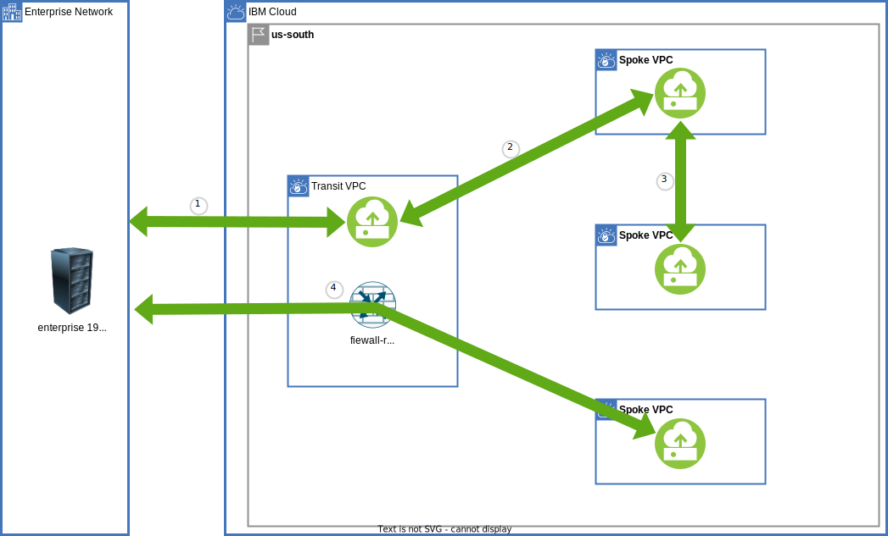
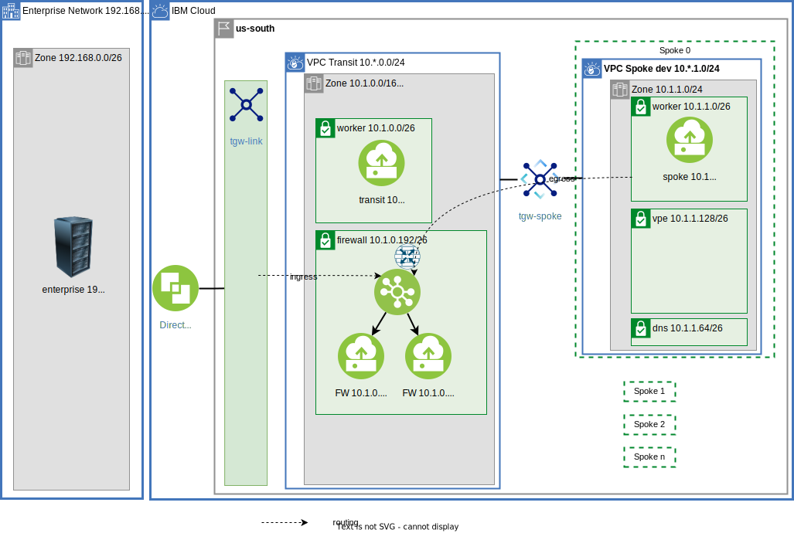

{:step: data-tutorial-type='step'}
{:shortdesc: .shortdesc}
{:new_window: target="_blank"}
{:codeblock: .codeblock}
{:screen: .screen}
{:tip: .tip}
{:pre: .pre}
{:important: .important}
{:note: .note}

# Centralize communication through a VPC Transit Hub and Spoke architecture - Part 2
{: #vpc-transit2}
{: toc-content-type="tutorial"}
{: toc-services="vpc, transit-gateway, direct-link, dns-svcs, cloud-databases, databases-for-redis"}
{: toc-completion-time="2h"}

This tutorial may incur costs. Use the [Cost Estimator](https://{DomainName}/estimator/review) to generate a cost estimate based on your projected usage.
{: tip}

This tutorial will walk through communication paths in a multi zone hub and spoke VPC model.  This is part two of a two part tutorial.  This tutorial is stand alone and it is not required to execute the steps in part one.

A {{site.data.keyword.vpc_full}} (VPC) is used to securely manage network traffic in the {{site.data.keyword.cloud_notm}}.  VPCs can also be used as a way to encapsulate functionality.  The VPCs can be connected to each other and to on premises.

A hub and spoke model connects multiple VPCs via {{site.data.keyword.tg_short}}.  The cloud VPCs can be connected to on premises using {{site.data.keyword.BluDirectLink}}.  Each spoke could be managed by a different team perhaps in a different account.  The isolation and connectivity support a number of scenarios:

- The hub can be the repository for shared micro services used by spokes.
- The hub can be the repository for shared cloud resources, like databases, accessed through [virtual private endpoint gateways](https://{DomainName}/docs/vpc?topic=vpc-about-vpe) controlled with VPC security groups and subnet access control lists, shared by spokes.
- The hub can be a central point of traffic routing between on premises and the cloud.
- Enterprise to cloud traffic can be routed, monitored, and logged through Network Function Virtualization (NFV) appliance in the hub.
- The hub can monitor all or some of the traffic - spoke <-> spoke, spoke <-> transit, or spoke <-> enterprise.
- The hub can hold the VPN resources that are shared by the spokes.

High level view:

{: class="center"}
{: style="text-align: center;"}

This tutorial will walk through communication paths in a hub and spoke VPC model.  There is a companion [GitHub repository](https://github.com/IBM-Cloud/vpc-transit) that divides the connectivity into a number of incremental layers.  In the tutorial thin layers enable the introduction of bite size challenges and solutions.

 During the journey the following are explored:
- [{{site.data.keyword.tg_full_notm}}](https://www.ibm.com/cloud/transit-gateway).
- VPC Network planning
- VPC egress and ingress routing.
- Connectivity via {{site.data.keyword.BluDirectLink}}
- Connectivity via {{site.data.keyword.tg_short}}
- [Virtual Network Functions with optional Network Load Balancers to support high availability](/docs/vpc?topic=vpc-about-vnf-ha)
- Virtual private endpoint gateways.
- DNS resolution.

A layered architecture will introduce resources and demonstrate connectivity. Each layer will add additional connectivity and resources. The layers are implemented in terraform. It will be possible to change parameters, like number of zones, by changing a terraform variable.

This tutorial walks you through a complete example demonstrating the network connectivity, VPC routing, DNS name resolution and other details to considered when stitching together a multi VPC architecture.  A layered approach allows the tutorial to introduce small problem and demonstrate a solution in the context of a complete architecture.
{: shortdesc}

## Objectives
{: #vpc-transit2-objectives}

* Understand the concepts behind a VPC based hub and spoke model.
* Understand the applicability of a firewall-router and a transit VPC environment.
* Understand VPC ingress and egress routing.
* Identify and optionally resolve asymmetric routing issues.
* Connect VPCs via {{site.data.keyword.tg_short}}.
* Utilize the DNS service routing and forwarding rules to build architecturally sound name resolution system.

## Before you begin
{: #vpc-transit2-prereqs}

This tutorial requires:
* `Terraform CLI` to run the Terraform commands.

<!--##istutorial#-->
You will find instructions to download and install these tools for your operating environment in the [Getting started with tutorials](https://{DomainName}/docs/solution-tutorials?topic=solution-tutorials-tutorials) guide.
<!--#/istutorial#-->

In addition:

- Check for user permissions. Be sure that your user account has sufficient permissions to create and manage all the resources in this tutorial.
- You need an SSH key to connect to the virtual servers. If you don't have an SSH key, see [the instructions](/docs/vpc?topic=vpc-ssh-keys) for creating a key for VPC. 

## Summary of Part one
{: #vpc-transit2-summary}

In the [first part](todo) of this tutorial we carefully planned the address space of the transit and spoke VPCs.  The zone based architecture is shown below:

{: class="center"}
{: style="text-align: center;"}

This diagram shows the traffic flow.  Only the enterprise <-> spoke is passing through the firewall:

{: class="center"}
{: style="text-align: center;"}

This was achieved with {{site.data.keyword.dl_short}}, {{site.data.keyword.tg_short}} and VPC routing.  All zones are configured similarly and the diagram below shows the details of zone 1:

{: class="center"}
{: style="text-align: center;"}

The phantom address prefixes in the transit are used to advertise routes.  The CIDR 10.1.0.0/16 covers transit and the spokes and is passed through {{site.data.keyword.dl_short}} to the enterprise as an advertised route.  Similarly the CIDR 192.168.0.0/24 is covers the enterprise and is passed through the {{site.data.keyword.tg_short}} to the spokes as an advertised route.

Egress routes in the spokes route traffic to the firewall-router.  Ingress routes in the transit route enterprise <-> spoke traffic through the firewall-router.

## Provision initial VPC resources routing all intra VPC traffic through the firewall-router
{: #vpc-transit2-provision-vpc-network-resources}
{: step}

Often an enterprise uses a transit VPC to monitor the traffic with the firewall-router.  In part one only enterprise <-> spoke traffic was flowing through the transit firewall-router.  This section is about routing all VPC to VPC traffic through firewall-router.

This diagram shows the traffic flow implemented in this step:

{: class="center"}
{: style="text-align: center;"}

All traffic between VPCs will flow through the firewall-router:
- enterprise <-> spoke
- enterprise <-> transit
- transit <-> spoke
- spoke <-> different spoke

Traffic within a VPC will not flow through the firewall.

If continuing from part one make special note of the configuration in the terraform.tfvars: `all_firewall = true`.
{: tip}

### Apply Layers
{: #vpc-transit2-apply-layers}
1. The companion [GitHub Repository](https://github.com/IBM-Cloud/vpc-transit) has the source files to implement the architecture.  In a desktop shell clone the repository:
   ```sh
   git clone https://github.com/IBM-Cloud/vpc-transit
   cd vpc-transit
   ```
   {: codeblock}

1. The config_tf directory contains configuration variables that you are required to configure.

   ```sh
   cp config_tf/template.terraform.tfvars config_tf/terraform.tfvars
   ```
   {: codeblock}

1. Edit **config_tf/terraform.tfvars**.
   - Make the required changes.
   - Change the value `all_firwewall = true`.

3. Since it is important that each layer is installed in the correct order and some steps in this tutorial will install multiple layers a shell command **./apply.sh** is provided.  The following will display help:

   ```sh
   ./apply.sh
   ```
   {: codeblock}

4. You could apply all of the layers configured by executing `./apply.sh : :`.  The colons are shorthand for first (or config_tf) and last (vpe_dns_forwarding_rules_tf).  The **-p** prints the layers:

   ```sh
   $ ./apply.sh : : -p
   ```
   {: codeblock}

   It will look something like:
   ```sh
   directories: config_tf enterprise_tf transit_tf spokes_tf test_instances_tf transit_spoke_tgw_tf enterprise_link_tf firewall_tf all_firewall_tf spokes_egress_tf all_firewall_asym_tf dns_tf vpe_transit_tf vpe_spokes_tf vpe_dns_forwarding_rules_tf
   ```

4. Apply all of the layers in part one and described above.
   ```sh
   $ ./apply.sh : spokes_egress_tf
   ```
   {: codeblock}


If you were following along in part one some additional ingress routes were added to the transit ingress route table to avoid routing through the firewall-router.  In this step these have been removed and the transit ingress route table has just these entries so that all incoming traffic for a zone is routed to the firewall-router in the same zone:

Zone|Destination|Next hop
--|--|--
Dallas 1|0.0.0.0/0|10.1.0.196
Dallas 2|0.0.0.0/0|10.2.0.196
Dallas 3|0.0.0.0/0|10.3.0.196

### Route Spoke and Transit to the firewall-router
{: #vpc-transit2-route-spoke-and-transit-to-firewall-router}
Routing all cloud traffic originating at the spokes through the transit VPC firewall-router in the same zone as the originating instance is accomplished by these routes in the spoke's default egress routing table (shown for Dallas/us-south):

Zone|Destination|Next hop
--|--|--
Dallas 1|10.0.0.0/8|10.1.0.196
Dallas 2|10.0.0.0/8|10.2.0.196
Dallas 3|10.0.0.0/8|10.3.0.196

Similarly in the transit VPC route all enterprise and cloud traffic through the firewall-router in the same zone as the originating instance.  For example a transit test instance 10.1.0.4 (Dallas 1) attempting contact with 10.2.1.4 (spoke 0, zone 2) will be sent through the firewall-router in zone 1: 10.1.0.196.  

Routes in transit's default egress routing table (shown for Dallas/us-south):

Zone|Destination|Next hop
--|--|--
Dallas 1|10.0.0.0/8|10.1.0.196
Dallas 2|10.0.0.0/8|10.2.0.196
Dallas 3|10.0.0.0/8|10.3.0.196
Dallas 1|192.168.0.0/16|10.1.0.196
Dallas 2|192.168.0.0/16|10.2.0.196
Dallas 3|192.168.0.0/16|10.3.0.196

Routes in each spoke's default egress routing table (shown for Dallas/us-south):

Zone|Destination|Next hop
--|--|--
Dallas 1|10.1.0.0/24|delegate
Dallas 2|10.1.0.0/24|delegate
Dallas 3|10.1.0.0/24|delegate
Dallas 1|10.2.0.0/24|delegate
Dallas 2|10.2.0.0/24|delegate
Dallas 3|10.2.0.0/24|delegate
Dallas 1|10.3.0.0/24|delegate
Dallas 2|10.3.0.0/24|delegate
Dallas 3|10.3.0.0/24|delegate

With these routes in place the return trip in the example in the spoke 10.2.1.4 -> 10.1.0.4 will be delegated to VPC routing.  In this case it will be the ingress routing of the transit in zone 1 and in turn onto the zone 1 firewall-router.


### Do not route Intra VPC traffic to the firewall-router
{: #vpc-transit2-do-not-route-intra-zone-traffic-to-firewall-router}
In this example Intra-VPC traffic will not pass through the firewall-router. For example resources in spoke 0 can connect to other resources on spoke 0 directly.  To accomplish this additional more specific routes can be added to delegate internal traffic.  For example in spoke 0, which has the CIDR ranges: 10.1.1.0/24, 10.2.1.0/24, 10.3.1.0/24 the internal routes can be delegated.

Routes in spoke 0's default egress routing table (shown for Dallas/us-south):

Zone|Destination|Next hop
--|--|--
Dallas 1|10.1.1.0/24|delegate
Dallas 1|10.2.1.0/24|delegate
Dallas 1|10.3.1.0/24|delegate
Dallas 2|10.1.1.0/24|delegate
Dallas 2|10.2.1.0/24|delegate
Dallas 2|10.3.1.0/24|delegate
Dallas 3|10.1.1.0/24|delegate
Dallas 3|10.2.1.0/24|delegate
Dallas 3|10.3.1.0/24|delegate

Similar routes are added to the transit and other spokes.

### Firewall Subnets
{: #vpc-transit2-firewall-subnets}
What about the firewall-router itself?  This was not mentioned earlier but in anticipation of this change there was a egress_delegate router created in the transit VPC that delegates routing to the default for all destinations.  It is only associated with the firewall-router subnets so the firewall-router is not effected by the changes to the default egress routing table used by the other subnets.  Check the routing tables for the transit VPC for more details. Visit the [VPCs](https://{DomainName}/vpc-ext/network/vpcs) in the {{site.data.keyword.cloud_notm}} console.  Select the transit VPC and then click on **Manage routing tables**, click on the **egress-delegate** routing table, click on the **Subnets** tab and note the -s3 subnets used for firewall-routers.

### Apply and Test More Firewall
{: #vpc-transit2-apply-and-test-more-firewall}
1. Edit config_tf/terraform.tfvars and ensure the value of **all_firewall** is **true**.
1. Apply all the layers through the all_firewall_tf:
   ```sh
   ./apply.sh : all_firewall_tf
   ```

3. Run the test suite.
   - Expected fail: cross zone transit <-> spoke and spoke <-> spoke.

   ```sh
   pytest -m "curl and lz1 and (rz1 or rz2)"
   ```
   {: codeblock}

### Fix cross zone routing
{: #vpc-transit2-fix-cross-zone-routing}

As mentioned earlier for a system to be resilient across zonal failures it is best to eliminate cross zone traffic. If cross zone support is required additional egress routes can be added.  The problem for spoke to spoke traffic is shown in this diagram

{: class="center"}
{: style="text-align: center;"}

The green path is an example of the originator spoke 0 zone 1 10.2.1.4 routing to spoke 1 zone 0 10.1.2.4.  The matching egress route is:

Zone|Destination|Next hop
--|--|--
Dallas 2|10.0.0.0/8|10.2.0.196

Moving left to right the firewall-router in the middle zone, zone 1, of the diagram is selected.  On the return path zone 0 is selected.

To fix this a few more specific routes need to be added to force the higher number zones to route to the lower zone number firewalls when a lower zone number destination is specified.  When referencing an equal or higher numbered zone continue to route to the firewall in the same zone.


{: class="center"}
{: style="text-align: center;"}

Routes in each spoke's default egress routing table (shown for Dallas/us-south):

Zone|Destination|Next hop
--|--|--
Dallas 2|10.1.0.0/16|10.1.0.196
Dallas 3|10.1.0.0/16|10.1.0.196
Dallas 3|10.2.0.0/16|10.2.0.196

These routes are also going to correct the transit <--> spoke cross zone asymmetric routing problem.  Consider transit worker 10.1.0.4 -> spoke worker 10.2.1.4.  Traffic from transit worker in zone 1 will choose the firewall-router in the zone 1 (same zone).  On the return trip instead of firewall-router in zone 2 (same zone) now firewall-router in zone 1 will be used.

1. Apply the all_firewall_asym layer:
   ```sh
   ./apply.sh all_firewall_asym_tf
   ```
   {: codeblock}

1. Run the test suite.
   **Expected:** all tests pass

   ```sh
   pytest -m curl
   ```
   {: codeblock}

All traffic between VPCs is now routed through the firewall-routers.

## High Performance High Availability (HA) Firewall-Router
{: #vpc-transit2-high-performance-ha-firewall-router}
{: step}
To prevent a firewall-router from becoming the performance bottleneck or a single point of failure it is possible to add a VPC Network Load Balancer to distribute traffic to the zonal firewall-routers to create a Highly Available, HA, firewall-router.

{: class="center"}

This diagram shows a single zone with a Network Load Balancer (NLB) fronting two firewall-routers. To see this constructed it is required to change the configuration and apply again.

1. Change these two variables in config_tf/terraform.tfvars:
   ```sh
   firewall_nlb                 = true
   number_of_firewalls_per_zone = 2
   ```

   This change results in the IP address of the firewall-router changing from the firewall-router instance used earlier to the IP address of the NLB.  The optional HA firewall router will need to be applied to a number of VPC route table routes in the transit and spoke VPCs.  It is best to apply all of the layers previously applied:

1. Apply all the layers through the all_firewall_asym_tf layer:
   ```sh
   ./apply.sh : all_firewall_asym_tf
   ```
   {: codeblock}

Observe the changes that were made:

1. Open the [Load balancers for VPC](https://{DomainName}/vpc-ext/network/loadBalancers).
1. Select the load balancer in zone 0 (Dallas 1/us-south-1) it has the suffix fw-z0-s3.
1. Note the **Private IPs**.

Compare the Private IPs with those in the transit VPC ingress route table:

1. Open the [Virtual Private Clouds](https://{DomainName}/vpc-ext/network/vpcs).
1. Select the transit VPC.
1. Click on **Manage routing tables**.
1. Click on the **tgw-ingress** routing table.  Notice the **Next hop** IP address matches one of the NLB **Private IPs**

Verify resiliency:

1. Run the spoke 0 zone 1 tests:
   ```sh
   pytest -k r-spoke0-z1-s0 -m curl
   ```
   {: codeblock}

1. Open the [Virtual server instances for VPC](https://{DomainName}/vpc-ext/compute/vs)
1. Locate the **BASENAME-fw-z1-s3-0** three vertical dots menu on the right and select **Stop**
1. Run the **pytest** again it may take a few minutes for the NLB to stop routing traffic to the stopped instance, at which point all tests will pass.
1. Locate the **BASENAME-fw-z1-s3-1** three vertical dots menu on the right and select **Stop**
1. Run the **pytest** again it may take a few minutes for the NLB to stop routing traffic to the stopped instance.
1. Run the **pytest** again and all tests fail.
1. Start one or both of the firewall-router instances and the tests will pass again.

Remove the NLB firewall:
1. Change these two variables in config_tf/terraform.tfvars:
   ```sh
   firewall_nlb                 = false
   number_of_firewalls_per_zone = 1
   ```

1. Apply all the layers through the all_firewall_asym_tf layer:
   ```sh
   ./apply.sh : all_firewall_asym_tf
   ```
   {: codeblock}

## DNS
{: #vpc-transit2-dns}
{: step}
The {{site.data.keyword.dns_full_notm}} service is used to convert names to IP addresses.  In this example a separate DNS service is created for the transit and each of the spokes.  This approach provides isolation between teams and allows the architecture to spread across different accounts.  If a single DNS service in a single account meets your isolation requirements it will be simpler to configure.  All zones are configured similarly and below is a diagram for a two zone architecture:

{: class="center"}
{: style="text-align: center;"}


### DNS Resources
{: #vpc-transit2-dns-resources}
Create the dns services and add a DNS zone for each VPC and an A record for each of the test instances:

Apply the dns_tf layer:
   ```sh
   ./apply.sh dns_tf
   ```
   {: codeblock}

Open the [Resources](https://{DomainName}/resources) in the {{site.data.keyword.cloud_notm}} console.  Open the **Networking** section and notice the **DNS Services**.  Open the **x-spoke0** instance.  Click the **x-spoke0.com** DNS zone.  Notice the A records associated with the test instances that are in the spoke instance.  Optionally explore the other DNS instances and find similarly named DNS zones and A records for the other test instances.

Click on the **Custom resolver** tab on the left and notice the forwarding rules.

### DNS Forwarding
{: #vpc-transit2-dns-forwarding}
Separate DNS instances learn each other's DNS names with forwarding rules.  In the diagram there are arrows that indicate a forwarding rule.  The associated table indicates when the forwarding rule will be used.  Starting on the left notice that the enterprise DNS forwarding rule will look to the transit for the DNS zones: x-transit.com, x-spoke0.com, and x-spoke1.com.

The transit DNS instance can resolve x-transit.com and has forwarding rules to the enterprise and spokes to resolve the rest.  Similarly the spokes rely on the transit DNS instance to resolve the enterprise, transit and the other spokes.

You can verify these forwarding rules in the {{site.data.keyword.cloud_notm}} console in the **Custom resolver** tab in each of the DNS instances.  After locating the custom resolve click to open then click **Forwarding rules** tab.  All DNS zones (except the transit) are forwarded to the DNS resolvers in the transit VPC.

### DNS Testing
{: #vpc-transit2-dns-testing}

There are now a set of **curl DNS** tests that are available in the pytest script.  These tests will curl using the DNS name of the remote.

Test:
   ```sh
   pytest -m dns
   ```
   {: codeblock}

## Virtual Private Endpoint Gateways
{: #vpc-transit2-VPE}
{: step}

VPC allows private access to IBM Cloud Services through [{{site.data.keyword.vpe_full}}](https://{DomainName}/docs/vpc?topic=vpc-about-vpe). The VPEs allow fine grain network access control via standard {{site.data.keyword.vpc_short}} controls:
- [{{site.data.keyword.security-groups}}](https://{DomainName}/docs/vpc?topic=vpc-using-security-groups).
- [VPC Network Access Control Lists](https://{DomainName}/docs/vpc?topic=vpc-using-acls).
- [Routing tables and routes](https://{DomainName}/docs/vpc?topic=vpc-about-custom-routes).

{: class="center"}
{: style="text-align: center;"}

1. Create the VPEs for the transit and the spokes, by applying the vpe layers:
   ```sh
   ./apply.sh vpe_transit_tf vpe_spokes_tf
   ```
   {: codeblock}

   There are now a set of **vpe**  and **vpedns** tests that are available in type pytest script.  These **vpedns** test will verify that the DNS name of a redis instance is within the private CIDR block of the enclosing VPC. The **vpe** test will execute a **redli** command to access redis remotely.

1. Test vpe and vpedns
   ```sh
   pytest -m 'vpe or vpedns'
   ```
   {: codeblock}

   Notice the failing vpedns tests like this one:

   ```sh
   FAILED py/test_transit.py::test_vpe_dns_resolution[redis spoke0-z1 -> transit 3bcc88e4-2a0a-4cc5-898c-4f7674205605.c9v38t1d0icro20vjc5g.private.databases.appdomain.cloud] - AssertionError: 166.9.48.220 not in ['10.1.0.128/26', '10.2.0.128/26', '10.3.0.128/26'] from 3bcc88e4-2a0a-4cc5-898c-4f7674205605.c9v38t1d0icro20vjc5g.private.databases.appdomain.cloud
   ```

   These are failing due to DNS resolution.  In the example above the REDIS name, ID.private.databases.appdomain.cloud, should resolve to a VPE that is in the CIDR block 10.1.0.128/26 or 10.2.0.128/26.  The error message asserts the REDIS name is resolving to the address 166.9.38.220 which is a Cloud [Service Endpoint](https://{DomainName}/docs/vpc?topic=vpc-service-endpoints-for-vpc#cloud-service-endpoints).  The DNS names can not be resolved by the private DNS resolvers.  Adding additional DNS forwarding rules will resolve this issue.

   To make the DNS names for the VPE available outside the DNS owning service it is required to update the DNS forwarding rules.
   - For enterprise `appdomain.com` will forward to the transit.
   - For transit the fully qualified DNS name of the REDIS instance will be forwarded to the spoke instance that owns the REDIS instance.
   - For spoke_from -> spoke_to access to REDIS the spoke_from needs the DNS name for the REDIS instance.  The fully qualified REDIS name in spoke_from DNS instance will be forwarded to the transit.
   - The transit forward fully qualified REDIS names to the corresponding spoke.

   {: class="center"}
{: style="text-align: center;"}

   The diagram uses **transit-.databases.appdomain.cloud** to identify the database in the transit instead of the fully qualified name like **5c60b3e4-1920-48a3-8e7b-98d5edc6c38a.c7e0lq3d0hm8lbg600bg.private.databases.appdomain.cloud**.

1. Apply the vpe_dns_forwarding_rules_tf layer:
   ```sh
   ./apply.sh vpe_dns_forwarding_rules_tf
   ```
   {: codeblock}

1. Verify that all VPEs can be accessed from all test instances.
   ```sh
   pytest -m 'vpe or vpedns'
   ```
   {: codeblock}

1. It can take a few tries for the DNS names to be resolved accurately.  So try the test at least three times.  All tests should pass except the enterprise to spoke VPE tests:

   ```sh
   pytest
   ```
   {: codeblock}

It is not currently possible to access a spoke VPE through a transit VPC cross zone.  The VPE return traffic does use spoke egress route table.  The enterprise DNS resolution must resolve the fully qualified name to the IP address of the VPE in the same zone.  Configuring this is beyond the scope of this tutorial.

## Production Notes and Conclusions
{: #vpc-transit2-production-notes}

The [VPC reference architecture for IBM Cloud for Financial Services](https://{DomainName}/docs/framework-financial-services?topic=framework-financial-services-vpc-architecture-about) has much more detail on securing workloads in the {{site.data.keyword.cloud_notm}}.

Some obvious changes to make:
- CIDR blocks were chosen for clarity and ease of explanation.  The Availability Zones in the Multi zone Region could be 10.1.0.0/10, 10.64.0.0/10, 10.128.0.0/10 to conserve address space.  Similarly the address space for Worker nodes could be expanded at the expense of firewall, DNS and VPE space.
- Security Groups for each of the network interfaces for worker VSIs, Virtual Private Endpoint Gateways, DNS Locations and firewalls should all be carefully considered.
- Network Access Control Lists for each subnet should be carefully considered.

Floating IPs were attached to all test instances to support connectivity tests via ssh.  This is not required or desirable in production.

[Create context-based restrictions](/docs/account?topic=account-context-restrictions-create&interface=ui) to further control access to all resources.

Place each team into their own account.  Organize with [IBM Cloud enterprise](/docs/account?topic=account-what-is-enterprise)

In this tutorial you created a hub VPC and a set of spoke VPCs.  You routed all cross VPC traffic through transit VPC firewall-router.  DNS services were created for each VPC and forwarding rules created between them for workoads and REDIS.

## Remove resources
{: #vpc-transit2-remove-resources}

Execute `terraform destroy` in all directories in reverse order using the `./apply.sh` command:

   ```sh
   ./apply.sh -d : :
   ```
   {: codeblock}

## Expand the tutorial
{: #vpc-transit2-expand-tutorial}

Your architecture will likely be different than the one presented but will likely be constructed from the fundamental components discussed here. Ideas to expand this tutorial:

- Integrate incoming public Internet access using [{{site.data.keyword.cis_full}}](https://{DomainName}/docs/cis?topic=cis-getting-started).
- Add [flow log capture](/docs/vpc?topic=vpc-flow-logs) in the transit.
- Put each of the spokes in a separate account in an [enterprise](https://{DomainName}/docs/account?topic=account-enterprise-tutorial#account_groups_tutorial).
- Force some of the spoke to spoke traffic through the firewall and some not through the firewall.
- Replace the worker VSIs with [{{site.data.keyword.openshiftlong_notm}} and VPC load balancer](https://{DomainName}/openshift?topic=openshift-vpc-lbaas).
- Force all out bound traffic through the firewall in the transit VPC and through [Public gateways](/docs/vpc?topic=vpc-public-gateways) .

## Related content
{: #vpc-transit2-related}

* [IBM Cloud for Financial Services](https://{DomainName}/docs/framework-financial-services)
* Tutorial: [Best practices for organizing users, teams, applications](https://{DomainName}/docs/solution-tutorials?topic=solution-tutorials-users-teams-applications#users-teams-applications)
* [How to deploy isolated workloads across multiple locations and regions](https://{DomainName}/docs/solution-tutorials?topic=solution-tutorials-vpc-multi-region)
* [Public front end and private backend in a Virtual Private Cloud](https://{DomainName}/docs/solution-tutorials?topic=solution-tutorials-vpc-public-app-private-backend),
* [Network Function Virtualization](https://{DomainName}/docs/vpc?topic=vpc-about-vnf)
* [Private hub and spoke with transparent VNF and spoke-to-spoke traffic](https://{DomainName}/docs/vpc?topic=vpc-about-vnf-ha)
