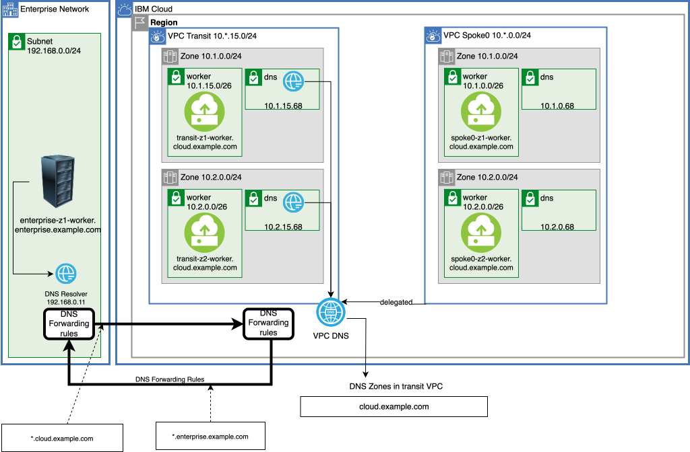
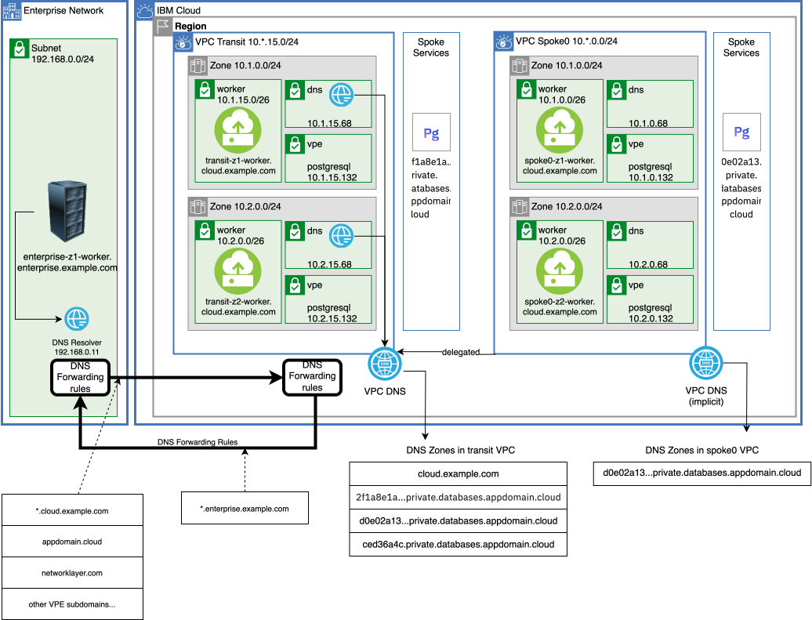

{{site.data.keyword.attribute-definition-list}}

# Centralize communication through a VPC Transit Hub and Spoke architecture - Part two
{: #vpc-transit2}
{: toc-content-type="tutorial"}
{: toc-services="vpc, transit-gateway, direct-link, dns-svcs, cloud-databases, databases-for-postgresql"}
{: toc-completion-time="2h"}

This tutorial may incur costs. Use the [Cost Estimator](/estimator) to generate a cost estimate based on your projected usage.
{: tip}

A Virtual Private Cloud (VPC) provides network isolation and security in the {{site.data.keyword.cloud_notm}}. A VPC can be a building block that encapsulates a corporate division (marketing, development, accounting, ...) or a collection of microservices owned by a DevSecOps team. VPCs can be connected to an on-premises enterprise and each other. This may create the need to route traffic through centralized firewall-gateway appliances. This tutorial will walk through the implementation of a hub and spoke architecture depicted in this high-level view:

{: caption="Figure 1. Architecture diagram of the tutorial" caption-side="bottom"}
{: style="text-align: center;"}

This is part two of a two part tutorial. This part will focus on routing all traffic between VPCs through a transit hub firewall-router. A scalable firewall-router using a Network Load Balancer is discussed and implemented. Private DNS is used for both for microservice identification and {{site.data.keyword.cloud_notm}} service instance identification using a Virtual Private Endpoint (VPE) gateway.

This tutorial is stand alone so it is not required to execute the steps in [part one](/docs/solution-tutorials?topic=solution-tutorials-vpc-transit1). If you are not familiar with VPC, network IP layout and planning in the {{site.data.keyword.cloud_notm}},
{{site.data.keyword.tg_short}}, {{site.data.keyword.BluDirectLink}} or asymmetric routing consider reading through part one.

The hub and spoke model supports a number of different scenarios:
- The hub can be the repository for shared micro services used by spokes and enterprise.
- The hub can be a central point of traffic firewall-router and routing between enterprise and the cloud.
- The hub can monitor all or some of the traffic - spoke <-> spoke, spoke <-> transit, or spoke <-> enterprise.
- The hub can hold the VPN resources that are shared by the spokes.
- The hub can be the repository for shared cloud resources, like databases, accessed through [virtual private endpoint (VPE) gateways](/docs/vpc?topic=vpc-about-vpe) controlled with VPC security groups and subnet access control lists, shared by spokes and enterprise

There is a companion [GitHub repository](https://github.com/IBM-Cloud/vpc-transit){: external} that divides the connectivity into a number of incremental layers. In the tutorial thin layers enable the introduction of bite size challenges and solutions.

The following will be explored:
- VPC egress and ingress routing.
- [Virtual Network Functions](/docs/vpc?topic=vpc-about-vnf-ha) in combination with a Network Load Balancers to support a high availability and scalability.
- VPE gateways.
- DNS resolution.

A layered architecture will introduce resources and demonstrate connectivity. Each layer will add additional connectivity and resources. The layers are implemented in Terraform. It will be possible to change parameters, like number of zones, by changing a Terraform variable. A layered approach allows the tutorial to introduce small problems and demonstrate a solution in the context of a complete architecture.
{: shortdesc}

## Objectives
{: #vpc-transit2-objectives}

* Understand the concepts behind a VPC based hub and spoke model for managing all VPC to VPC traffic.
* Understand VPC ingress and egress routing.
* Identify and optionally resolve asymmetric routing issues.
* Understand the use of a Network Load Balancer for a highly available and scalable firewall-router.
* Utilize the DNS service routing and forwarding rules to build an architecturally sound name resolution system.

## Before you begin
{: #vpc-transit2-prereqs}

This tutorial requires:
* `terraform` to use Infrastructure as Code to provision resources,
* `python` to optionally run the pytest commands,
* Implementing a firewall-router will require that you [enable IP spoofing checks](/docs/vpc?topic=vpc-ip-spoofing-about#ip-spoofing-enable-check),

See the [prerequisites](https://github.com/IBM-Cloud/vpc-transit#prerequisites){: external} for a few options including a Dockerfile to easily create the prerequisite environment.

In addition:

- Check for user permissions. Be sure that your user account has sufficient permissions to create and manage all the resources in this tutorial. See the list of:
   - [required permissions for VPC](/docs/vpc?topic=vpc-managing-user-permissions-for-vpc-resources).
   - [required permissions for creating {{site.data.keyword.tg_short}}](/docs/transit-gateway?topic=transit-gateway-iam).
   - [required permissions for IP spoofing checks](/docs/vpc?topic=vpc-ip-spoofing-about).
   - [required permissions to manage authorizations](/account?topic=account-serviceauth).

## Summary of Part one
{: #vpc-transit2-summary-of-part-one}

In [part one](/docs/solution-tutorials?topic=solution-tutorials-vpc-transit1) of this tutorial we carefully planned the address space of the transit and spoke VPCs. The zone based architecture is shown below:

{: caption="Zones" caption-side="bottom"}
{: style="text-align: center;"}

This diagram shows the traffic flow. Only the enterprise <-> spoke is passing through the firewall:

{: caption="Traffic flow" caption-side="bottom"}
{: style="text-align: center;"}

This was achieved with {{site.data.keyword.dl_short}}, {{site.data.keyword.tg_short}} and VPC routing. All zones are configured similarly and the diagram below shows the details of zone 1:

{: caption="VPC Layout" caption-side="bottom"}
{: style="text-align: center;"}

The CIDR 10.1.0.0/16 covers transit and the spokes and is passed through {{site.data.keyword.dl_short}} to the enterprise as an advertised route. Similarly the CIDR 192.168.0.0/24 covers the enterprise and is passed through the {{site.data.keyword.tg_short}} to the spokes as an advertised route.

Egress routes in the spokes route traffic to the firewall-router. Ingress routes in the transit route enterprise <-> spoke traffic through the firewall-router.

## Provision initial VPC resources routing all intra VPC traffic through the firewall-router
{: #vpc-transit2-provision-vpc-network-resources}
{: step}

Often an enterprise uses a transit VPC to monitor the traffic with the firewall-router. In part one only enterprise <-> spoke traffic was flowing through the transit firewall-router. This section is about routing all VPC to VPC traffic through firewall-router.

This diagram shows the traffic flow implemented in this step:

{: caption="Traffic flow" caption-side="bottom"}
{: style="text-align: center;"}

All traffic between VPCs will flow through the firewall-router:
- enterprise <-> spoke.
- enterprise <-> transit.
- transit <-> spoke.
- spoke <-> spoke in different VPC.

Traffic within a VPC will not flow through the firewall.

If continuing from part one make special note of the configuration in the terraform.tfvars: `all_firewall = true`.
{: tip}

### Apply Layers
{: #vpc-transit2-apply-layers}

1. The companion [GitHub Repository](https://github.com/IBM-Cloud/vpc-transit){: external} has the source files to implement the architecture. In a desktop shell clone the repository:
   ```sh
   git clone https://github.com/IBM-Cloud/vpc-transit
   cd vpc-transit
   ```
   {: codeblock}

1. The config_tf directory contains configuration variables that you are required to configure.

   ```sh
   cp config_tf/template.terraform.tfvars config_tf/terraform.tfvars
   ```
   {: codeblock}

1. Edit **config_tf/terraform.tfvars**.
   - Make the required changes.
   - Change the value `all_firwewall = true`.

2. If you don't already have one, obtain a [Platform API key](/iam/apikeys) and export the API key for use by Terraform:

   ```sh
   export IBMCLOUD_API_KEY=YourAPIKEy
   ```
   {: codeblock}

3. Since it is important that each layer is installed in the correct order and some steps in this tutorial will install multiple layers a shell command **./apply.sh** is provided. The following will display help:

   ```sh
   ./apply.sh
   ```
   {: codeblock}

4. You could apply all of the layers configured by executing `./apply.sh : :`. The colons are shorthand for first (or config_tf) and last (vpe_dns_forwarding_rules_tf). The **-p** prints the layers:

   ```sh
   ./apply.sh -p : :
   ```
   {: codeblock}

4. Apply all of the layers in part one and described above (even if continuing from part one use this command to re-apply the initial layers with the configuration change `all_firewall = true`).
   ```sh
   ./apply.sh : spokes_egress_tf
   ```
   {: codeblock}

If you were following along in part one some additional ingress routes were added to the transit ingress route table to avoid routing through the firewall-router. In this step these have been removed and the transit ingress route table has just these entries so that all incoming traffic for a zone is routed to the firewall-router in the same zone. Your **Next hop** addresses may be different but will be the IP address of the firewall-router instance:

Zone|Destination|Next hop
--|--|--
Dallas 1|10.1.0.0/16|10.1.15.196
Dallas 2|10.2.0.0/16|10.2.15.196
Dallas 3|10.3.0.0/16|10.3.15.196

To observe this:
1. Open the [VPCs](/vpc-ext/network/vpcs) in the {{site.data.keyword.cloud_notm}}.
1. Select the **transit VPC** and notice the Address prefixes displayed.
1. Click **Manage routing tables**
1. Click on the **tgw-ingress** transit gateway ingress route table

### Route Spoke and Transit to the firewall-router
{: #vpc-transit2-route-spoke-and-transit-to-firewall-router}

Routing all cloud traffic originating at the spokes through the transit VPC firewall-router in the same zone as the originating instance is accomplished by these routes in the spoke's default egress routing table (shown for Dallas/us-south):

Zone|Destination|Next hop
--|--|--
Dallas 1|10.0.0.0/8|10.1.15.196
Dallas 2|10.0.0.0/8|10.2.15.196
Dallas 3|10.0.0.0/8|10.3.15.196

Similarly in the transit VPC - route all enterprise and cloud traffic through the firewall-router in the same zone as the originating instance. For example a transit test instance 10.1.15.4 (transit zone 1) attempting to connect with 10.2.0.4 (spoke 0, zone 2) will be sent through the firewall-router in zone 1: 10.1.15.196.

Routes in transit's default egress routing table (shown for Dallas/us-south):

Zone|Destination|Next hop
--|--|--
Dallas 1|10.0.0.0/8|10.1.15.196
Dallas 2|10.0.0.0/8|10.2.15.196
Dallas 3|10.0.0.0/8|10.3.15.196
Dallas 1|192.168.0.0/16|10.1.15.196
Dallas 2|192.168.0.0/16|10.2.15.196
Dallas 3|192.168.0.0/16|10.3.15.196

### Do not route Intra VPC traffic to the firewall-router
{: #vpc-transit2-do-not-route-intra-zone-traffic-to-firewall-router}

In this example Intra-VPC traffic will not pass through the firewall-router. For example resources in spoke 0 can connect to other resources on spoke 0 directly. To accomplish this additional more specific routes can be added to delegate internal traffic. For example in spoke 0, which has the CIDR ranges: 10.1.0.0/24, 10.2.0.0/24, 10.3.0.0/24 the internal routes can be delegated.

Routes in spoke 0's default egress routing table (shown for Dallas/us-south):

Zone|Destination|Next hop
--|--|--
Dallas 1|10.1.0.0/24|delegate
Dallas 1|10.2.0.0/24|delegate
Dallas 1|10.3.0.0/24|delegate
Dallas 2|10.1.0.0/24|delegate
Dallas 2|10.2.0.0/24|delegate
Dallas 2|10.3.0.0/24|delegate
Dallas 3|10.1.0.0/24|delegate
Dallas 3|10.2.0.0/24|delegate
Dallas 3|10.3.0.0/24|delegate

Similar routes are added to the transit and other spokes.

### Firewall Subnets
{: #vpc-transit2-firewall-subnets}

What about the firewall-router itself? This was not mentioned earlier but in anticipation of this change there was a egress_delegate router created in the transit VPC that delegates routing to the default for all destinations. It is only associated with the firewall-router subnets so the firewall-router is not effected by the changes to the default egress routing table used by the other subnets. Check the routing tables for the transit VPC for more details. Visit the [VPCs](/vpc-ext/network/vpcs) in the {{site.data.keyword.cloud_notm}} console. Select the transit VPC and then click on **Manage routing tables**, click on the **egress-delegate** routing table, click on the **Subnets** tab and note the -fw subnets used for firewall-routers.

### Apply and Test More Firewall
{: #vpc-transit2-apply-and-test-more-firewall}

1. Apply the layer:
   ```sh
   ./apply.sh all_firewall_tf
   ```
   {: codeblock}

3. Run the test suite.

   **Your expected results are:** cross zone transit <-> spoke and spoke <-> spoke will be **FAILED**:

   ```sh
   pytest -m "curl and lz1 and (rz1 or rz2)"
   ```
   {: codeblock}

### Fix cross zone routing
{: #vpc-transit2-fix-cross-zone-routing}

As mentioned earlier for a system to be resilient across zonal failures it is best to eliminate cross zone traffic. If cross zone support is required additional egress routes can be added. The problem for spoke 0 to spoke 1 traffic is shown in this diagram:

{: caption="Fixing cross zone routing" caption-side="bottom"}
{: style="text-align: center;"}

The green path is an example of the originator spoke 0 zone 2 10.2.0.4 routing to spoke 1 zone 1 10.1.1.4. The matching egress route is:

Zone|Destination|Next hop
--|--|--
Dallas 2|10.0.0.0/8|10.2.15.196

Moving left to right the firewall-router in the middle zone, zone 2, of the diagram is selected. On the return path zone 1 is selected.

To fix this a few more specific routes need to be added to force the higher number zones to route to the lower zone number firewalls when a lower zone number destination is specified. When referencing an equal or higher numbered zone continue to route to the firewall in the same zone.

{: caption="Cross zone routing enabled" caption-side="bottom"}
{: style="text-align: center;"}

Routes in each spoke's default egress routing table (shown for Dallas/us-south):

Zone|Destination|Next hop
--|--|--
Dallas 2|10.1.0.0/16|10.1.15.196
Dallas 3|10.1.0.0/16|10.1.15.196
Dallas 3|10.2.0.0/16|10.2.15.196

These routes are also going to correct a similar transit <--> spoke cross zone asymmetric routing problem. Consider transit worker 10.1.15.4 -> spoke worker 10.2.0.4. Traffic from transit worker in zone 1 will choose the firewall-router in the zone 1 (same zone). On the return trip instead of firewall-router in zone 2 (same zone) now firewall-router in zone 1 will be used.

1. Apply the all_firewall_asym layer:
   ```sh
   ./apply.sh all_firewall_asym_tf
   ```
   {: codeblock}

1. Run the test suite.

   **Your expected results are:** all tests **PASSED**, run them in parallel (-n 10):

   ```sh
   pytest -n 10 -m curl
   ```
   {: codeblock}

All traffic between VPCs is now routed through the firewall-routers.

## High Performance High Availability (HA) Firewall-Router
{: #vpc-transit2-high-performance-ha-firewall-router}
{: step}

To prevent a firewall-router from becoming the performance bottleneck or a single point of failure it is possible to add a VPC Network Load Balancer to distribute traffic to the zonal firewall-routers to create a Highly Available, HA, firewall-router. Check your firewall-router documentation to verify it supports this architecture.

{: caption="High Availability Firewall" caption-side="bottom"}

This diagram shows a single zone with a Network Load Balancer (NLB) configured in **route mode** fronting two firewall-routers. To see this constructed it is required to change the configuration and apply again.

1. Change these two variables in config_tf/terraform.tfvars:
   ```sh
   firewall_nlb                 = true
   number_of_firewalls_per_zone = 2
   ```

   This change results in the IP address of the firewall-router changing from the firewall-router instance used earlier to the IP address of the NLB. The IP address change need to be applied to a number of VPC route table routes in the transit and spoke VPCs. It is best to apply all of the layers previously applied:

1. Apply all the layers through the all_firewall_asym_tf layer:
   ```sh
   ./apply.sh : all_firewall_asym_tf
   ```
   {: codeblock}

Observe the changes that were made:

1. Open the [Load balancers for VPC](/vpc-ext/network/loadBalancers).
1. Select the load balancer in zone 1 (Dallas 1/us-south-1) it has the suffix **fw-z1-s3**.
1. Note the **Private IPs**.

Compare the Private IPs with those in the transit VPC ingress route table:

1. Open the [Virtual Private Clouds](/vpc-ext/network/vpcs).
1. Select the transit VPC.
1. Click on **Manage routing tables**.
1. Click on the **tgw-ingress** routing table. Notice the **Next hop** IP address matches one of the NLB **Private IPs**

Verify resiliency:

1. Run the spoke 0 zone 1 tests:
   ```sh
   pytest -k r-spoke0-z1 -m curl
   ```
   {: codeblock}

1. Open the [Virtual server instances for VPC](/vpc-ext/compute/vs)
1. Stop traffic to the **0** firewall instance by specifying a security group that will not allow inbound port 80. Locate the instance with the suffix **fw-z1-s3-0** and open the details view:
   1. Scroll down and hit the pencil edit next to the **Network Interface**
   2. Uncheck the x-fw-inall-outall
   3. Check the x-fw-in22-outall
   4. Click **Save**
2. Run the **pytest** again. It will indicate failures. It will take a few minutes for the NLB to stop routing traffic to the unresponsive instance, at which point all tests will pass. Continue waiting and running **pytest** until all tests pass.

The NLB firewall is no longer required. Remove the NLB firewall:
1. Change these two variables in config_tf/terraform.tfvars:
   ```sh
   firewall_nlb                 = false
   number_of_firewalls_per_zone = 1
   ```

1. Apply all the layers through the all_firewall_asym_tf layer:
   ```sh
   ./apply.sh : all_firewall_asym_tf
   ```
   {: codeblock}

## Note about NLB configured in routing mode
{: #vpc-transit2-note-about-nlb-configured-in-routing-mode}
   
NLB route mode will rewrite route table entries - always keeping the active NLB appliance IP address in the route table during a fail over. But this is only done for routes in the transit VPC that contains the NLB.  The spoke has egress routes that were initialized with one of the NLB appliance IPs.  The spoke next hop will not be updated on NLB appliance fail over!

It will be required to maintain an ingress route in the transit VPC which will be rewritten by the NLB to reflect the active appliance.  The spoke egress route will deliver packets to the correct zone of the transit VPC. Routing within the transit VPC zone will find the matching ingress rule which will contain the active appliance.

Below is the transit VPC ingress route table discussed earlier.  The next hop will be kept up to date with the active NLB appliance.  Note that Dallas 3 has a change written by the NLB route mode service to reflect the active appliance.

Zone|Destination|Next hop
--|--|--
Dallas 1|10.0.0.0/8|10.1.15.196
Dallas 2|10.0.0.0/8|10.2.15.196
Dallas 3|10.0.0.0/8|10.3.15.197

The NLB requires that a IAM authorization be created that allows the NLB to write to the VPC. This authorization was created by the `apply.sh` script. See [creating a network load balancer with routing mode](/docs/vpc?topic=vpc-deploy-nlb) for more details on the configuration that was performed by the script.
{: note}

The route mode NLB pool must be configured with **Session persistence type** set to null.
{: note}


## DNS
{: #vpc-transit2-dns}
{: step}

The {{site.data.keyword.dns_full_notm}} service is used to convert names to IP addresses. In this example a DNS service is created in the cloud. The DNS zone `cloud.example.com` is created and added to the transit VPC. DNS records for the cloud instances are added to cloud.example.com. For example an A record is created for the spoke 0 worker in zone 1 that would have the full name spoke0-z1-worker.cloud.example.com.

Review [about DNS sharing for VPE gateways](/docs/vpc?topic=vpc-hub-spoke-model). The transit VPC is enabled as a DNS hub. Each spoke VPC is configured with DNS resolution binding to the transit VPC hub. This will configure the spoke VPC DHCP settings for DNS servers to be the transit VPC custom resolvers.

{: caption="DNS Layout" caption-side="bottom"}
{: style="text-align: center;"}


### DNS Resources
{: #vpc-transit2-dns-resources}

Apply the dns_tf layer to create add a cloud DNS zone and an A record for each of the test instances in the transit VPC and spoke VPCs. A DNS instance is also created for the enterprise simulation.
   ```sh
   ./apply.sh dns_tf
   ```
   {: codeblock}

Inspect the DNS service created:
1. Open the [Resource list](/resources) in the {{site.data.keyword.cloud_notm}} console. 
1. Expand the **Networking** section and notice the **DNS Services**. 
1. Locate and click to open the instance with the suffix **transit**. 
1. Click on the DNS zone **cloud.example.com**. Notice the A records associated with each test instance in the transit and spokes.
1. Click on the **Custom resolver** tab on the left and note that a resolver resides in each of the zones.
1. Click on the **Forwarding rules** tab and notice the forwarding rules. Notice that `enterprise.example.com` is forwarded to the on premises resolvers.

Inspect the transit and spoke VPCs and notice the DNS configuration:
1. Open the [VPCs](/vpc-ext/network/vpcs)
1. Notice the transit VPC has the `DNS-Hub` indicator set.
1. Notice each spoke VPC has the `DNS-Shared` indicator set.
1. Click one of the spoke VPCs.
   1. Scroll down to the **Optional DNS settings**
   1. Open the **DNS resolver settings** twisty and notice the DNS resolver type is `delegated` and the DNS resolver servers are in the transit VPC 10.1.15.x, 10.2.15.y, 10.2.15.z
   1. Open the **DNS resolution binding** twisty and notice DNS hub VPC is set to the transit VPC.

### DNS Testing
{: #vpc-transit2-dns-testing}

There is a set of **curl DNS** tests that are available in the pytest script. These tests will curl using the DNS name of the remote. There are quite a few so run the tests in parallel:

   ```sh
   pytest -n 10 -m dns
   ```
   {: codeblock}

## Virtual Private Endpoint Gateways
{: #vpc-transit2-VPE}
{: step}

VPC allows private access to IBM Cloud Services through [{{site.data.keyword.vpe_full}}](/docs/vpc?topic=vpc-about-vpe). The VPE gateways allow fine grain network access control via standard {{site.data.keyword.vpc_short}} controls:
- [{{site.data.keyword.security-groups}}](/docs/vpc?topic=vpc-using-security-groups).
- [VPC Network Access Control Lists](/docs/vpc?topic=vpc-using-acls).
- [Routing tables and routes](/docs/vpc?topic=vpc-about-custom-routes).

A DNS zone is created for each VPC VPE gateway. The DNS zone is automatically added to the private DNS service associated with the VPC. Each spoke VPC has a DNS configuration `bound` to the transit VPC. This enables the spoke VPE DNS zone to be shared to the transit VPC.

{: caption="Adding virtual private endpoint gateways" caption-side="bottom"}
{: style="text-align: center;"}

1. Create a {{site.data.keyword.databases-for-postgresql_full_notm}} instance and VPEs for the transit and each of the spoke VPCs, by applying the vpe_transit_tf and vpe_spokes_tf layers:
   ```sh
   ./apply.sh vpe_transit_tf vpe_spokes_tf
   ```
   {: codeblock}

1. There is a set of **vpe** and **vpedns** tests that are available in the pytest script. The **vpedns** test will verify that the DNS name of a {{site.data.keyword.databases-for-postgresql}} instance is within the private CIDR block of the enclosing VPC. The **vpe** test will execute a **psql** command to access the {{site.data.keyword.databases-for-postgresql}} instance remotely. Test vpe and vpedns from spoke 0 zone 1:
   - Expected results all tests pass

   ```sh
   pytest -m 'vpe or vpedns' -k spoke0-z1
   ```
   {: codeblock}

All tests in this tutorial should now pass.  There are quite a few. Run them in parallel:

```sh
pytest -n 10
```
{: codeblock}

## Production Notes and Conclusions
{: #vpc-transit2-production-notes}

The [VPC reference architecture for IBM Cloud for Financial Services](/docs/framework-financial-services?topic=framework-financial-services-vpc-architecture-about) has much more detail on securing workloads in the {{site.data.keyword.cloud_notm}}.

Some obvious changes to make:
- CIDR blocks were chosen for clarity and ease of explanation. The Availability Zones in the Multi zone Region could be 10.1.0.0/10, 10.64.0.0/10, 10.128.0.0/10 to conserve address space. Similarly the address space for Worker nodes could be expanded at the expense of firewall, DNS and VPE space.
- Security Groups for each of the network interfaces for worker VSIs, Virtual Private Endpoint Gateways, DNS Locations and firewalls should all be carefully considered.
- Network Access Control Lists for each subnet should be carefully considered.
- Floating IPs were attached to all test instances to support connectivity tests via SSH. This is not required or desirable in production.
- [Implement context-based restrictions](/docs/account?topic=account-context-restrictions-create&interface=ui) rules to further control access to all resources.

In this tutorial you created a hub VPC and a set of spoke VPCs. You routed all cross VPC traffic through a transit VPC firewall-router. A DNS service was created for the transit VPC hub and each spoke VPC was DNS bound to the transit VPC.

## Remove resources
{: #vpc-transit2-remove-resources}

Execute `terraform destroy` in all directories in reverse order using the `./apply.sh` command:

   ```sh
   ./apply.sh -d : :
   ```
   {: codeblock}

## Expand the tutorial
{: #vpc-transit2-expand-tutorial}

Your architecture may not be the same as the one presented, but will likely be constructed from the fundamental components discussed here. Ideas to expand this tutorial:

- Integrate incoming public Internet access using [{{site.data.keyword.cis_full}}](/docs/cis?topic=cis-getting-started).
- Add [{{site.data.keyword.fl_full}} capture](/docs/vpc?topic=vpc-flow-logs) in the transit.
- Put each of the spokes in a separate account in an [enterprise](/docs/secure-enterprise?topic=secure-enterprise-enterprise-tutorial#account_groups_tutorial).
- Force some of the spoke to spoke traffic through the firewall and some not through the firewall.
- Replace the worker VSIs with [{{site.data.keyword.openshiftlong_notm}} and VPC load balancer](/docs/openshift?topic=openshift-vpc-lbaas).
- Force all out bound traffic through the firewall in the transit VPC and through [Public gateways](/docs/vpc?topic=vpc-about-public-gateways) .

## Related content
{: #vpc-transit2-related}

* [IBM Cloud for Financial Services](/docs/framework-financial-services)
* [How to deploy isolated workloads across multiple locations and regions](/docs/solution-tutorials?topic=solution-tutorials-vpc-multi-region)
* [Public front end and private backend in a Virtual Private Cloud](/docs/solution-tutorials?topic=solution-tutorials-vpc-public-app-private-backend),
* [Network Function Virtualization](/docs/vpc?topic=vpc-about-vnf)
* [Private hub and spoke with transparent VNF and spoke-to-spoke traffic](/docs/vpc?topic=vpc-about-vnf-ha)
